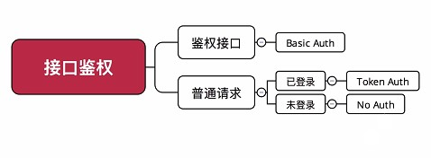
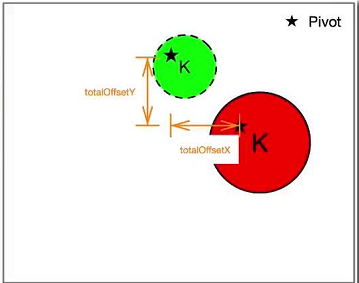

# [基于 GitHub 深度讲解 Kotlin 1.2 高级特性与框架设计](https://coding.imooc.com/class/232.html)

## Github 登录流程

- 申请 github app id
- 鉴权：
    - 获取 token
    - 删除 token，退出时
- github 登录流程
    - 登录，获取 token
    - 重复登录不会返回 token
    - 只能主动调用 api 删除 token
- 普通请求：带上 token
- github 分页 api，分页链接放在 header 中

## AppBarLayoutBehavior  计算图解

