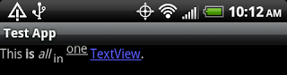

---
## 1 在xml中使用html标签

TextView默认支持一些html标签,可以直接在xml中使用

比如：空格

    &#160;&#160;&#160;&#160; 用于表示一个空格
    文本中的空格可通过 <string name=”blank_space”>&#160;&#160;&#160;&#160;</string>实现

换行`\n`，加粗`<b>装逼大全</b>`

如下图所示：



直接在xml中定义即可：

```
    <string name="html">This <b>is</b> <i>all</i> <sub>in</sub> <u><sup>one</sup></u> <a href="http://google.com">TextView</a>.</string>
```

相应xml中`<a>`标签的点击：

```
    TextView myTextView = (TextView) findViewById(R.id.my_textview);
    myTextView.setMovementMethod(LinkMovementMethod.getInstance());
```

静态的xml文本资源是由`android.content.res.StringBlock`类解析的，支持以下标签：

```
    <a> (supports attributes "href")
    <annotation>
    <b>
    <big>
    <font> (supports attributes "height", "size", "fgcolor" and "bicolor", as integers)
    <i>
    <li>
    <marquee>
    <small>
    <strike>
    <sub>
    <sup>
    <tt>
    <u>
```

Html.fromHtml()支持的标签：
```
<a href="...">  //定义链接内容
<b> //定义粗体文字   b 是blod的缩写
<big> //定义大字体的文字
<blockquote> //引用块标签
<br> //定义换行
<cite> //表示引用的URI
<dfn> //定义标签  dfn 是defining instance的缩写
<div align="...">
<em> //强调标签  em 是emphasis的缩写
<font color="..." face="...">  //不支持size属性
<h1>
<h2>
<h3>
<h4>
<h5>
<h6>
<i> //定义斜体文字
, (supports attribute "src". Note: you have to include an ImageGetter to handle retrieving a Drawable for this tag)
<p> // 段落标签,里面可以加入文字,列表,表格等
<small> //定义小字体的文字
<strike> // 定义删除线样式的文字   不符合标准网页设计的理念,不赞成使用.   strike是strikethrough的缩写
<strong> //重点强调标签
<sub> //下标标签   sub 是subscript的缩写
<sup> //上标标签   sup 是superscript的缩写
<tt> //定义monospaced字体的文字  不赞成使用.  此标签对中文没意义  tt是teletype or monospaced text style的意思
<u> //定义带有下划线的文字  u是underlined text style的意思
```

color支持的颜色的名称：

```
    具体的颜色值如：#FF00000
    aqua
    black
    blue
    fuchsia
    green
    grey
    lime
    maroon
    navy
    olive
    purple
    red
    silver
    teal
    white
    yellow
    Posted by Dani
```

[参考](http://daniel-codes.blogspot.jp/2011/04/html-in-textviews.html)

---
## 2 定义String注意

String.format占位符时需要注意：string.xml 定义更加严格

> 这是由于新的SDK(虽然从没用过老的)采用了新版本的aapt(Android项目编译器), 这个版本的aapt编译起来会比老版本更加的严格, 在Android最新的开发文档中描述String的部分，已经说明了如何去设置 %s 等符号, 可以[点击](http://developer.android.com/guide/topics/resources/string-resource.html#String)查看

简单解决方法就是:把**%s**之类的变量格式替换成%1s，其中</nobr>s表示为字符串类型

例如:

```xml
    <string name="redemption_tip_mask">您已购满%1$s元,最多可换购%2$d件,可选择如下：</string>
```

---
## 3 Resource的getString方法

Resource的多参数的getString方法用来格式化String，而不需要先获取String在调用String.format方法。

但是format字符串不支持html标签，所以需要对html字符串进行格式化时，应该对html标签进行转义：

```
    <b>Stop.</b>//没有转义
    &lt;b>Stop&lt;/b>.%1$s//转义，其中&lt;b>表示>,&lt;/b>表示>,%1$s表示需要格式化占位符。
```

---
## 4 getText方法

在String.xml中定义的html标签，通过调用Resource.getText()方法才会被渲染，getText()返回的CharSequence，而不是getString方法。

---
## 5 定义String时避免过度复用

如果项目需要做国际化，应该考虑到，可能你需要表述的两种情况在一种语言中应该使用相同的词汇，而在另外一种语言中可能却需要两个不同的词汇，所以**在定义字符串时，尽量字符的使用页面，对其加上千页面的前缀**。

---
## 6 Plurals复数的处理

尽量不要适应代码判断是否需要使用复数，同样时因为不同语言对于复数表述的文法可能不一样。

```xml
<plurals name="minutes">
   <item quantity ="one">minute</item>
   <item quantity ="other">minutes></item>
</plurals>

String text = getResource().getQuantityString(R.plruals.minutes,minutes);
```

---
## 7 从一个 theme 中获取属性

```java
  TypedValue typedValue = new TypedValue();
  activity.getTheme().resolveAttribute(android.R.attr.colorBackground, typedValue, true);
  int color = typedValue.data;
```