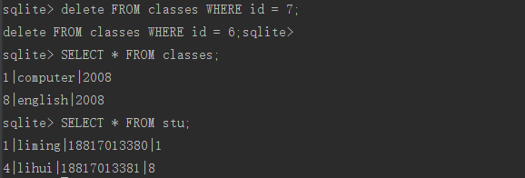
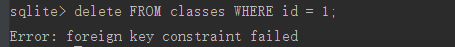

# 创建数据库与表

---
## 1 创建数据库与常用命令

创建库并非通过sql来实现的，创建数据库可以通过如下命令来实现：

```
//在命令行种，输入sqlite3 然后加上对于的数据库文件名，即可创建或打开数据了
sqlite3 database_name
```

常用命名，sqlite3的命令一般以`.`开头

```
//获取帮助
.help

//创建或打开一个数据库
sqlite3 database_name

//查看所有的表
.tables

//显示各种设置的当前值。
.show

//显示 CREATE 语句。如果指定了 TABLE 表，则只显示匹配 LIKE 模式的 TABLE 表。
.schema [table_name]

//格式化输出
.header on
.mode column
.timer on

//导出数据库
sqlite3 testDB.db .dump > testDB.sql
```

---
## 2 创建表

创建表的语法为：`create [temp|temporary] table db_name (字段1 数据库类型约束 , ... ,  字段n 数据库类型约束);`

- 每条 sql 语句以`;`结尾
- `temp|temporary` 表示临时表，会话介绍后自动销毁
- table 表示表名


---
## 3 存储类和数据类型

大多数的数据库引擎都使用静态的、刚性的类型，使用静态类型，数据的类型就由它的容器决定，这个容器是这个指被存放的特定列。SQLite在处理数据类型时与其它的数据库不同。区别在于它所支持的类型以及这些类型是如何存储、比较、强化(enforc)和指派(assign)。

SQLite使用一个更一般的动态类型系统，SQLite中，值的数据类型跟值本身相关，而不是与它的容器相关。Sqlite的动态类型系统和其他数据库的更为一般的静态类型系统相兼容，但同时，SQLite中的动态类型允许它能做到一些传统刚性类型数据库所不可能做到的事。

SQLite有**5个原始的数据类型**，被称为存储类。存储类这个词表明了一个值在磁盘上存储的格式，其实就是类型或数据类型的同义词。

数据类型|说明
---|---
Null|NULL表示没有值。SQLite具有对NULL的完全支持
INTEGER|整数值是全数字(包括正和负)。整数可以是1,2,3,4,6或8字节。整数的最大范围(8bytes)是{-9223372036854775808,0,+9223372036854775807}。SQLite根据数字的值自动控制整数所占的字节数。空注：参可变长整数的概念
REAL|实数是10进制的数值。SQLite使用8字节的浮点数来存储实数。
TEXT|字符类型，使用数控编码(UTF-8,UTF-16BE或者UTF-8LE)存放，没有大小限制
BLOB|二进制大对象(BLOB)是任意类型的数据。BLOB的大小没有限制。

可以看出SQLite的存储类比数据类型更一般化，比如Integer存储类，包括六种不同长度的整型数据类型(见下表)，这在磁盘上造成了差异，但是只要Integer被加载到内存进行处理，就会被转换成一般的数据类型(8字节的有符号整型)

SQLite3数据库中的任何列，除了整型主键列，可以用于存储任何一个存储列的值，SQL语句中所有值，不管它们是嵌入在SQL文本中还是作为参数绑定到一个预编译的SQL语句中，它们的存储类型都是未定的，在下面的描述情况中，SQLite数据库引擎会在查询执行过程中在数值(numeric)存储类型(Integer或者REAL)和TEXT之间转换值。

- SQLite3没有单独的布尔存储类型，可以使用Integer作为存储类型，0为false，1为true
- SQLite也没有代表日期和时间的数据类型，可以通过将日期或者时间转换为字符串或者整型进行存储，内置的SQLite日期和时间函数能够将日期和时间以TEXT，REAL或INTEGER形式存放
 - TEXT 作为IS08601字符串（`"YYYY-MM-DD HH:MM:SS.SSS"`）
 - REAL 从格林威治时间11月24日，4174 B.C中午以来的天数
 - INTEGER 从 1970-01-01 00:00:00 UTC以来的秒数
 - 程序可以任意选择这几个存储类型去存储日期和时间，并且能够使用内置的日期和时间函数在这些格式间自由转换

**SQLite通过值的表示法来判断其类型**，下面就是SQLite的推理方法：

- SQL语句中用单引号或双引号括起来的文字被指派为TEXT。
- 如果文字是未用引号括起来的数据，并且没有小数点和指数，被指派为INTEGER。
- 如果文字是未用引号括起来的数据，并且带有小数点或指数，被指派为REAL。
- 用NULL说明的值被指派为NULL存储类。
- 如果一个值的格式为X'ABCD'，其中ABCD为16进制数字，则该值被指派为BLOB。X前缀大小写皆可。

SQL函数 `typeof()` 根据值的表示法返回其存储类。

```
select typeof(3.14) real
select typeof('3.14'), text
select typeof(314), integer
select typeof(x'3142'), blob
select typeof(NULL), null
```

### 类型的比较顺序

SQLite单独的一个字段可能包含不同存储类的值，示例：

```sql
sqlite>CREATE TABLEd omain(x);

sqlite>INSERT INTO domain VALUES(3.142);
sqlite>INSERT INTO domain VALUES('3.142');
sqlite>INSERT INTO domain VALUES(3142);
sqlite>INSERT INTO domain VALUES(x'3142');
sqlite>INSERT INTO domain VALUES(NULL);

sqlite>SELECT ROWID,x,typeof(x) FROM domain;

结果：
rowid    x         typeof(x)
1        3.142     real
2        3.142     text
3        3142      integer
4        1B        blob
5        NULL      null
```

这带来一些问题。这种字段中的值如何存储和比较？如何对一个包含了INTEGER、REAL、TEXT、BLOB和NULL值的字段排序？一个整数和一个BLOB如何比较？哪个更大？它们能相等吗？答案是：具有不同存储类的值可以存储在同一个字段中。可以被排序，因为这些值可以相互比较。有完善定义的规则来做这件事。不同存储类的值可以通过它们各自类的“类值”进行排序，定义如下：

- NULL存储类具有最低的类值。一个具有NULL存储类的值比所有其它值都小(包括其它具有NULL存储类的值)。在NULL值之间，没有特别的可排序值。
- INTEGER或REAL存储类值高于NULL，它们的类值相等。INTEGER值和REAL值通过其数值进行比较。
- TEXT存储类的值比INTEGER和REAL高。数值永远比字符串的值低。当两个TEXT值进行比较时，其值大小由“排序法”决定。
- BLOB存储类具有最高的类值。具有BLOB类的值大于其它所有类的值。BLOB值之间在比较时使用C函数memcmp()。

示例：
```
SELECT 3<3.142, 3.142<'3.142', '3.142'<x'3000', x'3000'<x'3001';

3 < 3.142  3.142 < '3.142'  '3.142' < x'3000'  x'3000' < x'3001'
1          1                 1                 1
```

### 弱类型

SQLite使用弱类型。

```
//示例1：当SQLite创建这条记录时，x、y和z这3个字段中存储的是什么类型呢？答案是INTEGER,TEXT和REAL。
CREATETABLEfoo(x integer,y text,z real);
INSERT INTO foo VALUES('1','1','1');


//示例2：下表种，x、y和z中存储的是什么类型呢？答案如下
CREATETABLEfoo(x,y,z);
INSERT INTO foo VALUES('1','1','1');//TEXT、TEXT和TEXT。
INSERT INTO foo VALUES(1,1.0,x'10');//INTEGER、REAL和BLOB
```

如果你愿意，可以为SQLite的字段定义类型，这看起来跟其它数据库一样。但这不是必须的，你可以尽管违反类型定义。这是因为在任何情况下，SQLite都可以接受一个值并推断它的类型。总之，SQLite的弱类型可表示为：1字段可以有类型，2类型可以通过值来推断。**类型亲和性**介绍这两个规定如何相互关联。所谓类型亲和性就是在强类型(stricttyping)和动态类型(dynamictyping)之间的平衡艺术


---
## 4 类型亲和性(type affinity)

为了使SQLite和其他数据库间的兼容性最大化，SQLite支持**类型近似**的观点，列的类型近似是指存储在列上的数据的推荐类型，必须记住一点，这个类型是被推荐的，而不是必须的，任何列仍然可以存储任意类型的数据。只是一些列给予选择的话，将会相比其他类型优先选择一些存储类型，**这个列优先选择的储存类型就成为它的类型"近似"**

即在SQLite中，字段没有类型或域。当给一个字段声明了类型，该字段实际上仅仅具有了该类型的亲和性。声明类型和类型亲和性是两回事。类型亲和性预定SQLite用什么存储类在字段中存储值。在存储一个给定的值时到底SQLite会在该字段中用什么存储类决定于值的存储类和字段亲和性的结合。

每个被插入数据库中的列都被赋予下面5种内置近似类型的一种，例如具有TEXT近似类型的列可以用NULL、TEXT、或者BLOB类型存储数据，如果数值数据被插入到具有TEXT近似类型的列，会在存储前转换为文本形式。

- TEXT，文本类型
- NUMERIC(数字)，NUMERIC 数据类型是一种**精确数字数据类型**，其精度在算术运算后保留到最小有效位。
- INTEGER，整数值类型
- REAL(浮点类型)，REAL 数据类型是一种**近似数字数据类型**，且在算术运算后容易产生舍入误差。REAL 值的近似特性意味着在比较 REAL 值时通常应该避免使用相等运算符的查询。
- NONE


数据类型转换：由下表可知，当创建表时的某个列的数据类型和内置的5中类型相似时，会被转换为与之相似的内置类型。

数据类型 | Affinity类型
----|----
INT<br>INTEGER<br>TINYINT<br>SMALLINT<br>MEDIUMINT<br>BIGINT<br>UNSIGNED BIG INT<br>INT2<br>INT8 | INTEGER
CHARACTER(20)<br>VARCHAR(255)<br>VARYING CHARACTER(255)<br>NCHAR(55)<br>NATIVE CHARACTER(70)<br>NVARCHAR(100)<br>TEXT<br>CLOB | TEXT
BLOB <br>no datatype specified | NONE
REAL<br>DOUBLE<br>DOUBLE PRECISION<br>FLOAT | REAL
NUMERIC<br>DECIMAL(10,5)<br>BOOLEAN<br>DATE<br>DATETIME | NUMERIC

注意到声明类型为`FLOATING POINT`将被赋予INTEGER近似，而不是REAL近似，因为在`POINT`中的INT。声明类型为`STRING`的将被赋予NUMERIC，而不是TEXT（因为上述表中定义的类型中不存在STRING这一类型，它被归于到规则REAL中，属于其他情况）。sqlite3只是从声明类型字符串中去查找它知道的声明类型，比如”XINT”将被赋予INTEGER近似因为这个字符串里面有”INT”，所以这里并不需要一个单独的正确的声明类型，而是只要声明类型字符串里面包含了sqlite所知道的声明类型即可


<br><br>实例：
- 一个有NUMERIC近似的列可以使用上表中的所有5种存储类来存储数据。当文本数据被存放到NUMERIC近似的列中，这个文本的存储类被转换到INTEGER或REAL（根据优先级顺序），如果这个转换是无损的话。对于TEXT和REAL存储类间的转换，如果数据的前15位的被保留的话sqlite就认为这个转换是无损的、可反转的。如果TEXT到INTEGER或REAL的转换不可避免的会造成损失，那么数据将使用TEXT存储类存储。不会企图去转换NULL或BLOB值。
- 一个字符串可能看起来像浮点数据，有小数点或指数符号，但是只要这个数据可以使用整形存放，NUMERIC近似就会将它转换到整形。比如，字符串 '3.0e+5'存放到一个具有NUMERIC近似的列中，被存为300000，而不是浮点型值300000.0。
- 具有INTEGER近似的列和具有NUMERIC近似的列表现相同。它们之间的差别仅处于转换描述上。
- 具有REAL近似的列和具有NUMERIC近似的列一样，除了它将整形数据转换成浮点型形式。
- 具有NONE近似的列不会优先选择一个存储列，也不会强制将数据从一个存储类转换到另外一个类。

<br><br>**列近似的决定因素**，列的近似由这个列的声明类型所决定，根据下面的顺序的规则：

1. 如果声明类型包含”INT”字符串，那么这个列被赋予INTEGER近似
1. 如果这个列的声明类型包含”CHAR”，”CLOB”，或者”TEXT”中的任意一个，那么这个列就有了TEXT近似。注意类型VARCHAR包含了”CHAR”字符串，那么也就被赋予了TEXT近似
1. 如果列的声明类型中包含了字符串”BLOB”或者没有为其声明类型，这个列被赋予NONE近似
1. 其他的情况，列被赋予NUMERIC近似


关于近似类型，具体参考[sqlite3中的数据类型](http://www.cnblogs.com/kfqcome/archive/2011/06/27/2137000.html)

---
## 5 常见的条件约束

约束是对每一个数据条件的限制，常用的约束条件如下：

| 约束条件 | 作用 |
| --- | --- |
| NOT NULL | 非空 |
| UNIQUE | 唯一(可以为null) |
| PRIMARY KEY | 主键 |
| FOREIGN KEY | 外键 |
| CHECK | 条件检查 |
| DFAULT | 字段默认值 |

>在`SQLite 3.6.19`之前不支持外键，Android2.2开始使用`3.6.22`,因此Andoid2.2及其以后都支持外键

实例：

在School.db中创建一个班级表classes和学生表students：

```
    create table classes( 
       id INTEGER PRIMARY KEY AUTOINCREMENT , 
       major TEXT  NOT NULL , 
       year INTEGER NOT NULL 
    ) ;

    create table students( 
       id INTEGER PRIMARY KEY AUTOINCREMENT , 
       name varchar(20) CHECK(length(name) > 3) , 
       tel_no varchar(11) NOT NULL UNIQUE , 
       cls_id INTEGER NOT NULL , 
       FOREIGN KEY(cls_id) REFERENCES classes(id)
     );
```

上表中如果想多个字段联合唯一可以把unique放在最后：

```
    create table students( 
           id INTEGER PRIMARY KEY AUTOINCREMENT ,
           name varchar(20) CHECK(length(name) > 3) ,
           tel_no varchar(11) NOT NULL ,
           cls_id INTEGER NOT NULL ,
           unique(name,tel_no) ,
           FOREIGN KEY(cls_id) REFERENCES classes(id)
         );
```

### 主键约束


使用`PRIMARY KEY`可以把一个字段设置为一个主键，如果主键是整数型，那么还可以加上`AUTO_INCREMENT`属性使之自增长。

>主键，又称主码（英语：primary key或unique key）。 数据库表中对储存数据对象予以唯一和完整标识的数据列或属性的组合。

### 外键约束

外键能够确保表中的关键值必须从另一个表中引用，且该数据必须在另一个表中存在，否则操作会失败或引起其他连锁反应，这些连锁反应用户可以定制，其中外键引用的表称为父表，含有外键字段的表称之为子表。

在`SQLite 3.6.19`之前不支持外键，Android2.2开始使用`3.6.22`,因此Andoid2.2及其以后都支持外键,但是为了保持兼容性，Android默认没有启动外键，如果希望程序中支持外键，可以在`SQLHelper`的onOpen函数中开启外键，代码如下：

```
    public static final String OPEN_FOREIGN_KEY = "PRAGMA foreign_keys=ON;";

    @Override
        public void onOpen(SQLiteDatabase db) {
            super.onOpen(db);
            db.execSQL(SqlHolder.OPEN_FOREIGN_KEY);
        }
```

定义外键的格式如下：

```
    FOREIGN KEY (子表中的列) REFERENCES 父表(父表中的字段)
    [ON {DELETE|UPDATE} action
    [NOT] DEFERRABLE INITALLY {DEFERRED|IMMEDIATE}]
```

> DEFERRABLE 可以延期的 ， INITALLY 下去 ， DEFERRED 递延 ， IMMEDIATE 立即

- 第二行表示父表的记录删除或者更新时子表中对应的操作，默认为no action，外键行为在很多时候类似于触发器(trigger)
- 第三行表示父表的记录被删除或者更新时，子表对应操作的的执行时机，该语句控制的是立即强制执行还是等到整个事务结束，默认为立即执行。
- 注意，如果没有指定父表的记录删除或者更新时子表中对应的操作，那么直接删除的sql语句将会失败。

外键发生改变时，子表可配置的行为包括：

```
    NO ACTION: 当父键被修改或者删除时, 没有特别的行为发生，默认行为

    RESTRICT:  存在一个或者多个子键对应于相应的父键时,  应用程序禁止删除(ON DELETE RESTRICT)或者修改(ON UPDATE RESTRICT) 父键，RESTRICT与普通的外键约束的区别是,  当字段(field)更新时, RESTRICT行为立即发生

    SET NULL: 父键被删除(ON DELETE SET NULL) 或者修改 (ON UPDATE SET NULL)时将字段设置为null

    SET DEFAULT: 父键被删除(ON DELETE SET DEFAULT) 或者修改 (ON UPDATE SET DEFAULT)时将字段设置为默认值

    CASCADE: 将实施在父键上的删除或者更新操作，传播给与之关联的子键，例如设置students表的外键ON DELETE 行为为CALSCADE，那么当classes表中删除了id为2的记录后，students表中的cls_id为2的记录就会被自动删除，如果是更新操作，那么两个表中关联的字段的数据会一并更新。
```

对于 `ON DELETE CASCADE`, 同被删除的父表中的行 相关联的子表中的每1行，也会被删除。
对于 `ON UPDATE CASCADE`, 存储在子表中的每1行,对应的字段的值会被自动修改成同新的父键匹配。

常用语句如下：

```
     NOT DEFERRABLE INITIALLY DEFERRED  立即执行的约束
     NOT DEFERRABLE INITIALLY IMMEDIATE 立即执行的约束
     NOT DEFERRABLE                     立即执行的约束
     DEFERRABLE INITIALLY IMMEDIATE     立即执行的约束
     DEFERRABLE                         立即执行的约束
     DEFERRABLE INITIALLY DEFERRED      延期执行
```

外键约束的父表中的某行被删除, 或者存储在父键中的值 被修改时: 时间的逻辑顺序是:

1. 执行在 BEFORE 触发器程序
2. 检查本地(非外键)约束
3. 在父表中 更新或者删除行
4. 执行要求的外键行为
5. 执行 AFTER触发器 程序

在`ON UPDATE`外键行为和SQL**触发器**之间一个重要区别就是,` ON UPDATE `行为只有在父键的值被修改并且父键的值修改得跟原来不一样时,才执行.如果下UPDATE SET 语句修改的值,跟原来一样,` ON UPDATE`行为不会执行

SQL示例：

```
    create table student (
      id integer primary key autoincrement,
      cls_id integer not null ,
      foreign key(cls_id) references classes(id)
      on delete cascade
      on update cascade
    );
```

### 删除约束

SQLite 支持 ALTER TABLE 的有限子集。在 SQLite 中，ALTER TABLE 命令允许用户重命名表，或向现有表添加一个新的列。重命名列、删除一列、或从一个表中添加或删除约束都是不可能的。

**其他约束的具体语法可以查看相关文档**

---
## 6 实例

现在来练习一下上面所学的知识：

### 准备表

- classes(上面已经提供)
- students(上面已经提供)
- stu:

stu的创建sql语句如下：

```
    create table stu(
                   id integer primary key autoincrement ,
                   name varchar(20) check(length(name) > 3) ,
                   tel_no varchar(11) not null unique ,
                   cls_id integer not null ,
                   foreign key(cls_id) references classes(id)
                   on delete cascade
                   on update cascade NOT DEFERRABLE
        );
```

可以看出stu1与students的数据结构完全一致，只是在外键的定义上增加了对父键修改删除的行为，这里的行为是级联操作

在Android上我们创建一个`study.db`数据库，其他的操作我们都在命令行来演示

### 准备数据

首先是进入到我们的数据库目录:

```
    adb shell//进入目标设备的Linux Shell环境
    cd data/data
    cd com.ztiany.database
    cd database
    sqlite3 study.db //进入数据库
```

现在插入几条班级数据：

```
    insert into classes (major , year) values('computer', 2008);
    insert into classes (major , year) values('english', 2008);
    insert into classes (major , year) values('mathematics', 2008);
    insert into classes (major , year) values('tourism', 2008);
```


然后在stu插入几条学生数据

```sql
注意name的length>3

    insert into stu (name , tel_no , cls_id) values('liming','18817013380', 1);
    insert into stu (name , tel_no , cls_id) values('lihui','18817013381', 8);
    insert into stu (name , tel_no , cls_id) values('liusan','18817013382', 6);
    insert into stu (name , tel_no , cls_id) values('zhantian','18817013383', 7);
```

现在删除classes中的两台数据，看从表是否有变化：



可以看到stu表中的数据确实是一起被删除了

然后在students中插入几条数据测试

```sql
    insert into students (name , tel_no , cls_id) values('liming','18817013380', 1);
    insert into students (name , tel_no , cls_id) values('lihui','18817013381', 5);
    insert into students (name , tel_no , cls_id) values('liusan','18817013382', 6);
    insert into students (name , tel_no , cls_id) values('zhantian','18817013383', 7);
```

当试着删除classes表中的数据时发现删除失败了，因为有外键约束。




