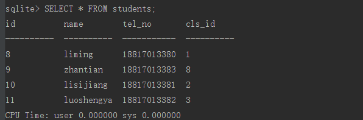
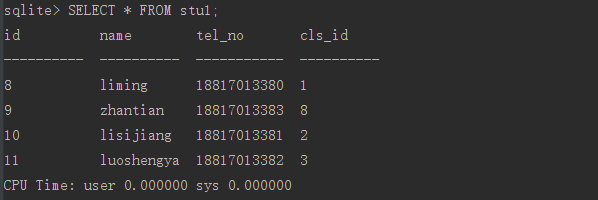
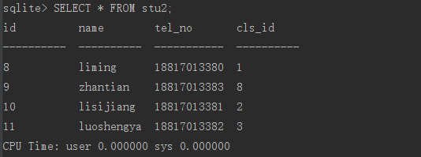
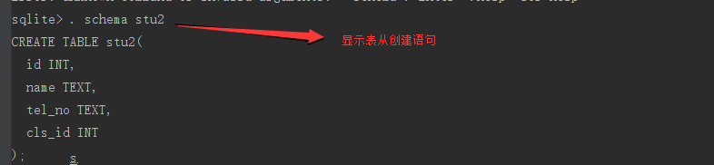

# 插入数据

---
## 1 SQLite插入数据

### 1.1 插入单条数据

创建好数据库和表后，我们就可以通过sql把数据插入到数据库中了，插入数据使用insert关键字，基本语法为：

```
    insert into table_name (列名1,列名2,....) values(值1，值2,...);
    insert into table_name values(值1，值2,...),(值1，值2,...);
```

当values中包含所有的字段值时字段列表可以省略，同时可以一次性插入多条values,如上面的第二行sql语句

根据前面创建的classes表，我们插入一条数据：

```
    insert into classes(major,year) values("markting",2008);
```

由于id是主键并且是自增长的，所以它会在原来的基础上自增1


### 1.2 批量插入

有时候一条一条的插入数据显得过于笨拙，可以通过一些方法经数据批量插入数据库中，insert语句是支持批量插入的，形式为：

    insert into 表名数据集

例如新建一个stu表，将students表中的数据都插入到stu表中，创建stu表的sql语句如下：

```
    create table stu(
       id integer primary key,
       name varchar(20),
       tel_no varchar(11) not null
       cls_id integer not null
    );
```

创建stu表后，将students表中的数据批量插入到stu中，实现如下：

```
    insert into stu select * from students;
```

通过stu创建的sql语句可以发现stu与students的字段是一样的，所以可以使用上述语法进行插入，如果字段不一样的情况下可以使用如下sql语句：

```
    insert into stu (name,tel,cls_id) select name,tel_no,cls_id from studtens;
```

其实就是指定需要插入的字段，一一对应即可。


### 1.3 更方便的方法

一种更方便的方法来导入数据是，在创建数据stu表时可以直接将students表中的数据作为数据源，这样就省略了建表的步骤了，如下所示：

```
    create table stu as select * from students
```

语法与普通的建表语法类似，只是多了一个as关键字，后面跟着数据输入，就这样的一条sql语句就可以把students中的所有数据插入到stu中，此时我们看到的stu的建表语句其实是：

```
    create table stu(
       id int ,
       name text，
       tel_no text,
       cls_id int
    );
```

可以看出，stu表只是简单的声明了数据类型，students表中的字段约束并没有被导入到stu表中，这也是需要注意的地方，因此此种方式并不是经常被使用，其比较常用的场景是做表的升级，首先通过这种发生备份原表的数据，然后删除原表后再新建原表(有了新的字段)，节奏吧备份的数据插入到新的表中，最后删除掉备份表，即完成了数据库的升级。


---
## 2 示例

在开始练习之间，先执行几个sqlite命令，优化一下输出：

- . header on 输入显示头部信息
- . mode column 左对齐
- . timer on 开启sql执行计时

准备students数据集如下：



### 演示`insert into stu1 select * from students;`

    创建一个与students结构一样的表stu1:

```
    create table stu1(
                   id integer primary key autoincrement ,
                   name varchar(20) check(length(name) > 3) ,
                   tel_no varchar(11) not null unique ,
                   cls_id integer not null ,
                   foreign key(cls_id) references classes(id)
        );
     执行insert into stu1 select * from students;
```




可以看到students的数据全部备份到stu1表中了。


### 演示`create table stu2 as select * from students；`

执行`create table stu2 as select * from students;`



可以看到students的数据全部备份到stu2表中了。但是我们查看一下stu2表的创建语句:



确实只是简单的声明了数据类型。


