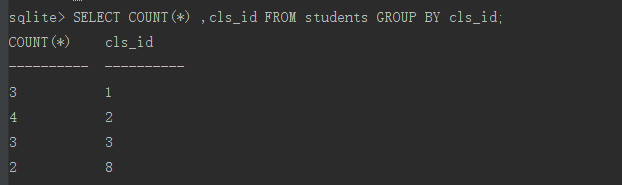
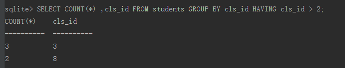
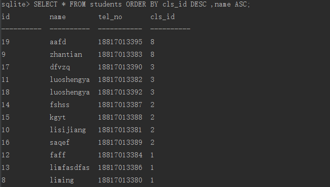

# SQLite查询

数据库的功能是存储数据，存储数据是为了数据的再使用，这时就需要使用select语句对数据库中的数据进行查询：

---
## 1 select语句的基本组成

SQLite语句组成

| 类型  |  功能 |
| ------------ | ------------ |
| 基本操作  |  Restrciction限制<br/>Projection投影<br/>Cartesian Product笛卡儿积<br/>Union联合<br/>Different差<br/>Rename重命名 |
| 附加操作  | Instersection交叉<br/>Natural Join自然连接<br/>Assign赋值|
| 扩展操作  | Generalized Projetion广义投影 <br/>Left Outer Join左外连接<br/>Right Outer Join右外连接<br/>Full Outer Join全外连接|

基本操作定义了基础关系的操作，附加操作提供了频繁执行操作的快捷方式，这些操作都由基本操作组成，例如；

- 交叉操作
 - 取两个集合的联合
 - 通过区分操作删除两个结果
 - 进一步联合有彼此差异的两个初始集合
- 扩展操作是对基本操作的扩展
 - 广义投影操作在基本的映射操作上添加算数表达，聚集和分组功能

SQLite支持除了**右外连接**和**全外联结**之外的所有操作。

一般使用select语法如下：

```
    select [distinct] column1,...,columnN from table_name
    where predictate
    group by columns
    having predictate
    order by columns [asc]
    limit count ,offset ;

    当使用复合查询的时，可以把一条sql的查询结果当作另外一条sql的查询条件：
    select name from (select name , tel_no from (select * from students));
```

理解sql语句的最好方式是将select语句当作处理关系的通道，根据指定的条件，规则来一层一层地过滤数据，最终都能得到一个输出。

最常用的sql语句通常有select ,from ,where 三个字句组成，如`select * from students where cls_id = 2`,select后面表示需要查询的字段， from后面表示要查询的表名，如果from后面跟着多个表，那么将会把从多个表查询的数据合成一个输出结果，例如`select classes.major,students.name from classes , students where classes.id = 2;`


---
## 2 Select 查询语句

### 2.1 字段与表的别名


在多表查询时我们的查询条件会相对复杂，表与表直接可能会产生相同的字段名称，那么可以通过字段别名的方式修改字段的显示名称，语法如下：

```
    origin_name [[as] new_name]
```

示例：

```
    SELECT classes.major , students.name FROM classes,students WHERE classes.id =2 AND classes.year > 2008
    SELECT classes.major  AS cmj, students.name  FROM classes AS cls ,students WHERE cls.id =2 AND cls.year > 2008
```

>as语句是可以省略的

as不仅可以给字段和表设置别名，还可以给表达是设定别名，如：

```
    select 9 * 9 as ADDITION
```


也可以给函数结果设置别名：


### 2.2 where过滤查询

在通过select过去数据时，我们往往会通过where语句设定查询条件，where语句的常用操作符有如下几个：

#### 算术运算符

| 运算符 | 描述 |
|---|---|----|
| + | 加法 - 把运算符两边的值相加 |
| - | 减法 - 左操作数减去右操作数 |
| * | 乘法 - 把运算符两边的值相乘 |
| / | 除法 - 左操作数除以右操作数 |
| % | 取模 - 左操作数除以右操作数后得到的余数 |

#### 比较运算符

| 运算符 | 描述 |
|---|---|
| == | 检查两个操作数的值是否相等，如果相等则条件为真。 |
| = | 检查两个操作数的值是否相等，如果相等则条件为真。 |
| != | 检查两个操作数的值是否相等，如果不相等则条件为真。 |
| <> | 检查两个操作数的值是否相等，如果不相等则条件为真。 |
| > | 检查左操作数的值是否大于右操作数的值，如果是则条件为真。 |
| < | 检查左操作数的值是否小于右操作数的值，如果是则条件为真。 |
| >= | 检查左操作数的值是否大于等于右操作数的值，如果是则条件为真。 |
| <= | 检查左操作数的值是否小于等于右操作数的值，如果是则条件为真。 |
| !< | 检查左操作数的值是否不小于右操作数的值，如果是则条件为真。 |
| !> | 检查左操作数的值是否不大于右操作数的值，如果是则条件为真。 |

#### SQLite 逻辑运算符

| 运算符 | 描述 |
|---|---|
| AND | AND 运算符允许在一个 SQL 语句的 WHERE 子句中的多个条件的存在。 |
| BETWEEN | BETWEEN 运算符用于在给定最小值和最大值范围内的一系列值中搜索值。 |
| EXISTS | EXISTS 运算符用于在满足一定条件的指定表中搜索行的存在。 |
| IN | IN 运算符用于把某个值与一系列指定列表的值进行比较。 |
| NOT IN | IN 运算符的对立面，用于把某个值与不在一系列指定列表的值进行比较。 |
| LIKE | LIKE 运算符用于把某个值与使用通配符运算符的相似值进行比较。 |
| GLOB | GLOB 运算符用于把某个值与使用通配符运算符的相似值进行比较。GLOB 与 LIKE 不同之处在于，它是大小写敏感的。 |
| NOT | NOT 运算符是所用的逻辑运算符的对立面。比如 NOT EXISTS、NOT BETWEEN、NOT IN，等等。**它是否定运算符。** |
| OR | OR 运算符用于结合一个 SQL 语句的 WHERE 子句中的多个条件。 |
| IS NULL | NULL 运算符用于把某个值与 NULL 值进行比较。 |
| IS | IS 运算符与 = 相似。 |
| IS NOT | IS NOT 运算符与 != 相似。 |
| &#124;&#124;  | 连接两个不同的字符串，得到一个新的字符串。 |
| UNIQUE | UNIQUE 运算符搜索指定表中的每一行，确保唯一性（无重复）。 |

- SQLite 的 **LIKE** 运算符是用来匹配通配符指定模式的文本值。如果搜索表达式与模式表达式匹配，LIKE 运算符将返回真（true），也就是 1。这里有两个通配符与 LIKE 运算符一起使用
 *   百分号 （%）代表零个、一个或多个数字或字符。
 *   下划线 （_）下划线代表一个单一的数字或字符
- SQLite 的 **GLOB** 运算符是用来匹配通配符指定模式的文本值。如果搜索表达式与模式表达式匹配，GLOB 运算符将返回真（true），也就是 1。与 LIKE 运算符不同的是，GLOB 是大小写敏感的，对于下面的通配符，它遵循 UNIX 的语法。：
 *   星号 （*）代表零个、一个或多个数字或字符。
 *   问号 （?）代表一个单一的数字或字符

#### 位运算符

| 运算符 | 描述 |
|---|---|
| & | 如果同时存在于两个操作数中，二进制 AND 运算符复制一位到结果中。 |
| &#124; | 如果存在于任一操作数中，二进制 OR 运算符复制一位到结果中。 |
| ~ | 二进制补码运算符是一元运算符，具有"翻转"位效应。 |
| << | 二进制左移运算符。左操作数的值向左移动右操作数指定的位数。 |
| >> | 二进制右移运算符。左操作数的值向右移动右操作数指定的位数。 |

```
    使用示例：
    SELECT * FROM COMPANY WHERE SALARY <> 20000;
    SELECT * FROM COMPANY WHERE AGE >= 25 AND SALARY >= 65000;
    SELECT * FROM COMPANY WHERE NAME LIKE 'Ki%';
    SELECT * FROM COMPANY WHERE NAME GLOB 'Ki*';
    SELECT * FROM COMPANY WHERE AGE > (SELECT AGE FROM COMPANY WHERE SALARY > 65000);
    SELECT AGE FROM COMPANY WHERE EXISTS (SELECT AGE FROM COMPANY WHERE SALARY > 65000);
```

### 2.3分组

---

>学习下面内容之前，准备如下数据：


---


#### group by

聚合中有一个重要的功能就是分组，分组就是将得到的结果集按照一定的规则划分为多个组，例如：
```

    SELECT COUNT(*) ,cls_id FROM students GROUP BY cls_id;
```


#### having

分组中有一个类似于where字句的条件语句，能够为分组设置一些条件，如果不满足条件，那么分组竟会被过滤掉

例如：




### 2.4 排序

使用order by可以对结果集进行排序，排序分为升序和降序，分别对应asc和desc，例如：


如果希望对多个字段进行排序，可以使用,分开多个字段。例如：



### 2.5 数量限制

在检索数据之后，可能会对数据再做一些操作，例如数量过大，只需要返回特定数量的记录，又或者我们希望结果集根据一定的规则排序，其中限制数量我们需要使用limit语句，它的形式为：

```
    limit 返回的数量 offset 偏移量
```

与上面`limit 3 offset 2`语句等效的是`limit 2，3`，**省略了offset关键字，则跟着limit后面的代表偏移值，逗号之后的表示返回的数量**。


### 2.6 distinct去重

distinct用于去掉结果集中重复的数据，其跟在select关键字后面，例如：


