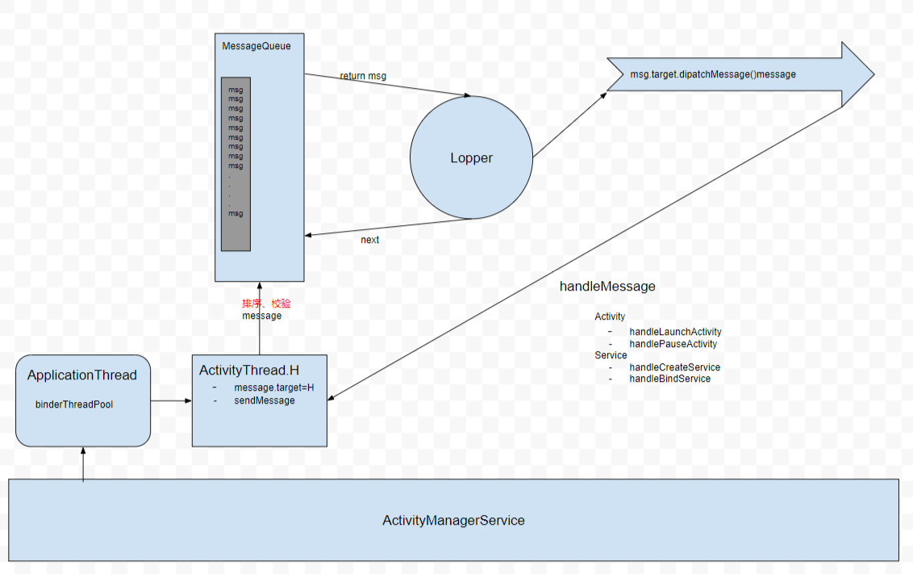

## IntentService

IntentService是一种特殊的服务，它继承了Service，但它是一个Service，**Intent可以用来执行耗时的后台任务，由于IntentService是一种Service，即使当前应用已经退出，由于它的优先级比单纯的线程要高得多，所以仍然能保证任务的顺利执行**。而且IntentService可以接收多个任务，并且保证任务是按顺序执行的，当全部任务退出后，IntentService自动停止。

下面来分析一下IntentService的工作原理,

首先看一下他的onCreate方法：

```java
     public void onCreate() {
               super.onCreate();
                HandlerThread thread = new HandlerThread("IntentService[" + mName + "]");
                thread.start();
        
                mServiceLooper = thread.getLooper();
                mServiceHandler = new ServiceHandler(mServiceLooper);
            }
```

我们知道，Service被多次启动，而它的onCreate方法只会被调用一次，在onCreate方法中，初始化了一个HandlerThread，并且以HandlerThread内置的Looper创建了一个Handler。

先不去看mServiceHandler的实现，当Service的onCreate方法被调用后，随后被调用的是onStartCommand：

```java
      @Override
            public int onStartCommand(Intent intent, int flags, int startId) {
                onStart(intent, startId);
                return mRedelivery ? START_REDELIVER_INTENT : START_NOT_STICKY;
            }
            

       @Override
        public void onStart(Intent intent, int startId) {
            Message msg = mServiceHandler.obtainMessage();
            msg.arg1 = startId;
            msg.obj = intent;
            mServiceHandler.sendMessage(msg);
        }
```

可以看到onStartCommand调用了onStart方法，根据mRedelivery返回了相应的参数，在onStart发中，使用在onCreate方法初始化的mServiceHandler发送了一个message，现在来看一下mServiceHandler的实现：

```java
    private final class ServiceHandler extends Handler {
                public ServiceHandler(Looper looper) {
                    super(looper);
                }
        
                @Override
                public void handleMessage(Message msg) {
                    onHandleIntent((Intent)msg.obj);
                    stopSelf(msg.arg1);
                }
            }
```
ServiceHandler的实现很简答，在handleMessage方法中调用了onHandleIntent，注意：ServiceHandler的looper是在onCreate方法中创建的子线程HandlerThread的内置Looper，所以这里的onHandleIntent也是运行在子线程中，而onHandleIntent是要给抽象的方法，也正是我们需要去实现的方法，随后在handleMessage中，调用了stopSelf(msg.arg1)方法，但是这个stopSelf(msg.arg1);与没有参数的stopSelf是不一样的，没有参数的stopSelf会立即停止服务，而stopSelf(msg.arg1)不会，它会ServiceHandler中的消息处理完毕才会停止Service。stopSelf会在尝试停止服务之前判断最近启动服务的次数是否和startId相等，如果相等就立即停止，不相等就不停止，这个策略可以在AMS的stopServiceToken方法中找到依据。


到此相关代码已经分析完毕了。分析到这里，我们可以联系到主线程的线程模型：

## 主线程线程模型

主线程的线程从ActivityThread的main方法开始，使用Looper.prepareMainLooper()创建了Looper，然后创建了H类，这个H是一个handler，当ApplicationThread接收来自AMS的消息后，通过H类切换到主线程，从而调用各种组件相关的方法，比如Application的onCreate，Activity的各个生命周期方法等，然后我们开发者在各个生命周期方法中实现各种功能逻辑，从Looper分发消息来看，只有一个消息被处理完毕，才能接着从消息队列中去除另一个消息继续处理。可以看出，这就是Android基于消息机制的线程模型。

这样来分析的话，其实IntentService的线程模型和主线程的线程模型是一样的。通过了解Android主线程线程模型，以前很多迷惑的地方都迎刃而解了。

比如：为什么在Activity的onCreate，onStart,onResume方法中我们无法获取到控件的宽高，因为这个时候View树并没有完成真正的遍历，而我们post一个Runnable中却可以得到控件的宽高信息，因为我们post的Runnable最终被以message的形式加入了到主线程的MessageQueue中，而只有当前消息被处理完毕(即View树已经完成了遍历，确定了控件的宽高与位置)，我们的消息才会被取出并消费，而这个时候View树已经完成遍历了。


那么整个流程应该如下图所示：




