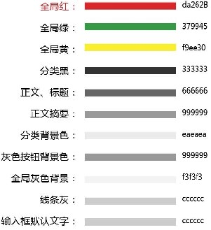

# 开发准备

---
## 1 项目启动

一个好的项目应该从一开始就规划好。

1. 程序员不只是敲代码的，在项目启动之初，在原型设计与UI设计中就应该参与进去，提供自己在平台角度上的建议，作为 Android 程序员做一个 App 长得却 IOS 的一模一样。个人感觉是比较痛苦的，由于产品或者设计可能不是特别了解平台差异性或一些其他原因，我们最好从一开始就参与进去，不好的设计(或者其他东西)应该商量是否可以修改或者去除掉。

2. 做了几个 app 后，感觉后台的数据规范化非常重要，定义必须字段，定义统一的格式，后台的接口开发人员字段命名要统一等等，这样可以在一定程度上减轻移动端 app 开发的困难。

一般都流程应该是：

*   确认需求
*   开会进行需求讲解与原型设计讲解原型设计
*   开会进行需求讲解与原型设计讲解(统一意见)
*   ui设计与切图（切几套？什么分辨率？）
*   ui问题反馈
*   定制开发计划与正式开发

---
## 2 项目开发

### 2.1 原型与UI方面

*   产品出原型、UI出设计、开会审核，避免不好的设计和不合理的需求。
*   app风格统一
     - 确认 app 主色调，以及 app 色调范围(不要各种颜色乱用)。
     - 规范一些通用的尺寸，如内容区域与屏幕边缘距离、行距等。
     - 确定颜色表、通用 size 表。
*   可点击的控件，标志各种状态颜色。等等各个细节问题
*   规范字体与字体大小
*   UI切图，切几套图，主要适配哪些分辨率。

app色调模板示例：




原型审核标准，审核哪些方面，粒度如何：

*   列表多类型 Item 的各种情况是否全覆盖。
*   业务流程是否完整清晰。
*   页面架构是否合理，复杂逻辑放在 Dialog 还是新的界面。Dialog 一般是不稳定的 UI 元素。
*   能不能实现是一个问题，实现的难度与用着舒不舒服是一个问题。

### 2.2 后台接口规范

*   接口的安全性，token 机制，与各种签名算法。
*   熟悉服务器后台通信流程与规范，反馈接口问题。
*   定义必要字段。
*   同一个接口在成功与失败时不要返回不同的数据模型。
*   数据类型必须按照约定返回，**如果后台是 PHP**，尤其需要规范，因为 PHP 之类的弱类型语言不注意规范的话会给 Java 数据解析造成麻烦。

比如如果使用json

```json
    {
     "resultCode": 0,//状态码，0表示成功，非0表示各种不同的错误
     "resultMessage": "成功",// 描述信息，成功时为"success"，错误时则是错误信息
     "data": {}//成功时返回的数据，类型为对象或数组
    }
```

- 定义`resultCode`和`resultMessage`为必须字段，无论什么情况都需要返回，其他数据放在`data`中根据各种业务定义。
- 非必需字段可以不返回，如果要返回就必须是正确的类型，比如某个 int 类型的数据在没有值时返回 `""` 空字符是不对的。

接口的数据类型规范：

```
    number
    string
    boolean
    object
    array
    map
    null
```

### 2.3 App开发

- 编码规范很重要，人员交流也很总要，不要等到某某模块开发完了才说这里不行，那里不行,先思考先商量再做事
- 根据项目业务等搭建app整体架构与确定第三方公共库
- 第三方账号准备(包括社会化分享，第三方登录，支付，消息推送，统计，上线、性能监控、内存监控等)
- 项目人员共同学习开发编码规范与项目架构
- 确认app兼容版本与UI适配范围
- 统一bug管理
- 同时测试平台

关于第三方平台，比如消息推送，需要说明一点，一定要对其做再封装，不要强依赖其类库和数据格式，以方便后面可能的框架替换工作。

---
## 3 一些体会

*   程序员不仅仅是编码实现功能，app是由程序员开发，包括原型设计，ui设计程序员都应该有自己的看法，需要开会的要通过开会确认。
*   项目leader不仅仅是对内负责协调安排各组成员，对外要学会砍掉各种不合理的要求，例如保证接口设计的合理，不合理的接口设计坚决要求修改。
*   项目开发虽然是快速迭代，但也是慢工出细活的，只知道一味的赶进度，压着上线时间，也许app是出来了，但是代码质量呢？上线了？bug一大堆？只想说，并没有什么卵用。时间与软件质量都需要考虑！
*   app后台的质量真心非常重要，不好设计不要老是说以后改，以后是多久，就算改了是不是app也全都要改，特别是代码耦合度高的app，这时估计很难跟上快速迭代的步伐，做了一大堆无用功。

