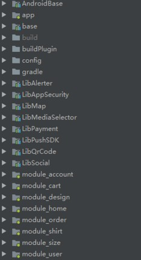

---
#  1 Presentation 层架构

---
## 1.1 UI 层

### 1.1.1 单 Activity + 多 Fragment

一个应用可以分为众多模块，模块间通过通过接口或者路径架构进行依赖。单独模块使用**Activity+ 多Fragment**架构，**Activity仅仅作为容器**，它管理多个Fragment之间的交互，Fragment作为具体的View实现，但是需要谨慎处理 Fragment 的生命周期。防止内存泄露、状态丢失等问题的发生。

### 1.1.2 为什么使用 Fragment

Activity的使用局限：不能将多个Activity活动界面放在屏幕上一并显示。因此创建了Fragment来弥补Activity的局限。Fragment可以像Activity一样响应Back键等类似Activity的功能。

- Activity 是重量级的，IPC级别的调度。
- Fragment 是轻量级的，并且 Fragment 支持回退栈。
- Fragment 更加灵活，Fragment 之间的交互更加方便和高效。
- 多个 Fragment 之间的交互都在同一个 Activity 中，从而避免 Activity 的内存回收引发的相关问题。
- Fragment 的可移植性更强，Activity 直接拿来用就可以。
- 全屏的 DialogFragment 可以用来实现浮动层级视图，而不需要注册 Activity，不需要定义容器 Id，仅仅 show 就可以。
- 如果针对 Fragment 做了封装，那么很大程序上没有必要对 Activity 做封装了，因为 Activity 中直接可以用封装好的 Fragment。
- Fragment 的特点是其生命周期跟随其宿主的生命周期，针对这一点可以使用没有 UI 的 Fragment 来分发宿主的声明周期事件到其他组件(比如MVP 中的 Presenter)。
- 随着 support 库不断的升级迭代，现在 Fragment 非常成熟。
- Android jetpack 架构组建推荐并完美支持多 Fragment 模块架构。

### 1.1.3 存在的问题与解决方案

#### Activity 与 Fragment如何通讯？

常见的做法是 Activity 与 Fragment 使用接口通讯，在 Activity 中可以直接调度具体的 Fragment，而 Fragment 不应该依赖具体的 Activity，所以 Fragment 中应该定义交互接口由 Activity 来提供实现。

#### 模块内的各个 Fragment 如何跳转？

其实这也是 Fragment 与 Activity 的通讯问题，比如从一个列表Fragment调整到详情Fragment，常用的做法是通过Fragment调用Activity来显示详情的Fragment，这就需要定义接口了，但是当一个模块内的Fragment非常多交互比较复杂时会造成接口泛滥的情况，这时可是定义模块内全局的Navigator类，Fragment可以被注入Navigator，然后通过调用Navigator跳转到具体的Fragment界面:

```java
public class NavigationController {
    private final int containerId;
    private final FragmentManager fragmentManager;

    @Inject
    public NavigationController(MainActivity mainActivity) {
    }

    public void navigateToSearch() {
    }

    public void navigateToRepo(String owner, String name) {
    }

    public void navigateToUser(String login) {
    }
}
```

另外，Android JectPack 架构库中提供了 [Navigation](https://developer.android.com/topic/libraries/architecture/navigation/) 类库，可以很方便的处理 Fragment 之间的跳转。

#### 单个模块内多个Fragment复杂的数据传递

1. 通过Activity传递对应数据的Id，然后通过M层获取具体数据，**弊端是需要定义各种借口**。
2. 如果模块内 Fragment 之间需要进行大量复杂数据的传递，可以在模块内定义全局 DataHolder，然后所有的 Fragment 都通过 DataHolder 来获取初始数据。
3. Android JectPack 架构库中提供了 ViewModel 类库，利用它可在通过单个 Activity 在多个 Fragment之间共享数据，这样就不需要传递数据了。

#### 避免错误操作导致 Fragment 的视图重叠

这其实是非常基础的问题，Fragment 是依附于 Activity 的，与此同时，在类似因为配置改变导致的 Activity 重启时，Activity 会自动帮助我们恢复 Fragment 实例。所以在 Fragment 的创建之前，有必要判断 Activity 是否已经帮助我们恢复了 Fragment。否则可以导致的问题是，创建了多余的 Fragment 对象，导致界面重叠，等等问题。Activity 自动恢复 Fragment 实例的场景

*   因为配置改变导致的 Activity 重启时
*   发生奔溃，导致当前界面重启
*   调用 Activity.recreate() 方法时
*   当因为内存不足被系统暂时回收的 Activity 重新回到栈顶时

### 1.1.4 灵活使用 DialogFragment 

DialogFragment 的使用可以非常灵活，它即可以作为 Dialog show 处理，也可以作为普通的 Fragment 使用，很多情况下使用全屏的 DialogFragment 完全可以展示一些简单界面的展示，而不必大动干戈的创建 Activity。

### 1.1.5 View 也可作为单独组件

开发过程中，发现某些 UI组件在各个模块中都是通用的，并且其还带有一定的业务性，可以考虑将其封装为完整的组件。其他模块直接拿来用即可。

### 1.1.6 BaseActivity 和 BaseFragment 的封装

- 基类中封装的是子类的公共行为，而不是为了方便而堆砌各种方法。所以不要什么功能都往积累中扔。
- 封装要遵循开闭原则，要有扩展性。
- 可以通过代理思想把 Activity 和 Fragment 的生命周期暴露出去，这样依赖于 Activity 和 Fragment 生命周期事件的功能可以以组件的方式抽离出去，而不是都写在基类之中。毕竟某些功能并不是所有子类都需要的，比如 Fragment 的懒加载。


---
## 1.2 MVX

MVC、MVP、MVVM 都是为了 **解决图形界面应用程序复杂性管理问** 题而产生的应用架构模式。它们都把对模块内不同的类根据职责进行了分层，为什么要划分层次呢？

*   因为 Activity/Fragment 太复杂了，什么逻辑都写在一个类中，久而久之自己都很难理清里面的逻辑，更不要说未来可能的接手人。
*   类越复杂，也难从整体上考虑类的设计，顾此失彼，容易产生 bug。
*   复杂的东西就应该分层(比如TCP/IP的五层模型)，层层调度，职责清晰，条理清晰，维护成本大大降低，减少 bug 隐患。

### 1.2.1 MVC

其实 Android 应用层本身就有 MVC 架构的体现，可以认为早期的 app 架构中，xml 是作为 view 的、Activity 作为 Controller、然后由开发者自己实现 Model 层，但是 xml 布局所用提供的 UI交互能力实在有限，Activity 中难免要处理各种 UI 交互，同时又要负责调用 Model，久而久之就造成了 Activity 的臃肿不堪。

### 1.2.2 MVP

由于 MVC 导致的 Activity 等 Android 组件的臃肿不堪，后面有人提出在 Android 上使用 MVP 模式。


然而在 Android 上使用 MVP 模式并没有一个严格的规范，可以说每个人都有自己的理解，还有一些人提出把 Activity/Fragment 等作为 Presenter 来实现。初期， MVP 模式的各种实现是比较混乱的。本人还是热衷于把 Activity/Fragment 作为 View 来实现，以下是在实践中总结出的一些规范。

#### 规范

- MVP 相互持有的都是对方的接口抽象，而不是具体实现。
- Presenter 与 View 的方法命名要 **规范统一**。
- View 和 Model 不存在相互的感知，也就是不直接交互，Presenter 作为 Model 和 View 交互的桥梁。
- View 负责视图渲染和 UI 逻辑处理。当 UI 事件触发时，调用 Presenter 来处理，Presenter 收到 View 的事件后调用 Model 获取（或提交）数据进行业务调度，并根据业务的调度状态来调用对应的 View 接口上的方法，以展示不同视图。
- 关于 View 与 Presenter 的参数传递，可以让 Presenter 调用 View 的方法来获取。也可以由 View 直接传递给 Presenter。
- 如果为 View 提供了专门的 VO，那么 Presenter 负责数据的转换 `DTO->VO`，业务数据的组装。
- Presenter 中不处理任何 UI 相关的逻辑，原则上 Presenter 的实现中不应该依赖 Android SDK 中的类，以便于 Presenter 可以直接在 JVM 上进行单元测试。
- Model 层不仅仅是数据模型，还包括数据获取、存储、业务调用等等。推荐 Model 层使用 Repository 模式，封装所有的业务数据操作，屏蔽数据获取的细节。

#### 实践

1. 一些情况下 UI 层并不适合直接使用 Moudle 层的数据模型，考虑使用 VO。
2. View 层与 Presenter 层的交互接口定义在合约(Contract)类中，除公用的 Presenter 外，View 与 Presenter没有必要分包放置。
3. 一个 View 对应一个 Presenter，一个复杂界面可以由多个 Fragment 和 多个 Presenter 组成。
4. 在单 Activity + 多 Fragment 的模块架构中，Activity 不作为 View ，而是统筹调度多个 Fragment 来完成模块功能。

#### MVP 存在的问题

- 接口数量暴增，接口粒度划分困难。
- 任何一个小的 UI 动作都可能需要在接口上定义一个方法，接口上的方法可能很多。
- P 要做的事太多，不仅要从下层获取数据，还要调度 View 来控制 UI 的展示。
- View 需要和 Presenter 相互绑定（让它们持有各自的引用），Presenter 需要处理处理好 View 的引用（比如 Fragment 是否已经销毁了），否则可能引起内存泄露。

### 1.2.3 MVVM


使用 MVVM 最好有框架的支持，由于数据与 UI 是双向绑定的，所以显然相互之间是相互订阅的模式，使用`RxJava`或者 Google官方的 `Databinding` 库都是可以的，需要说明的是 **所谓的某某框架(比如 DataBinding)** 只是用于实现 MVVM 的一个框架，其本身并不代表 MVVM。两者不能混为一谈。

#### 使用 Databinding

`Databinding`库已经趋于成熟，也比较完善，在简单的项目中使用 Databinding 是不错的选择。下面是实践中的一些总结：

- layout：现在 layout 不再是单纯的布局，而是添加了与 viewmodle 数据与行为绑定的逻辑。
- ViewModel 提供可以绑定的数据和相关操作数据的行为，并且还负责从 Repository 中获取数据。
- View 负责展示UI，View 需要持有 ViewModel 的引用，毕竟 layout 的能力有限，有些行为还是需要通过代码实现。
- BindingAdapter：通过 BindingAdapter，可以让View的各种属性或者行为直接在layout中与ViewModle进行绑定。
- 在实践中发现，当项目较为复杂（比如使用的APT插件较多、进行了组件化拆分），`databinding`在打包过程中总是有各种问题，**所以大型项目在使用之前要考虑清楚**。

#### MVVM 的优势

MVP 中的 Presenter 要做的事太多，不仅要从下层获取数据，还要调用 View 来控制 UI 的展示。何不让 View 自己做哪些事呢？

在 MVVM 中：

- View 和 ViewModel 不需要相互持有引用，只需要 View 持有 ViewModel 的引用即可。
- ViewModel 它只负责获取和向 View 提供数据，ViewModel 向 View 提供可观察的数据，View 通过观察数据的变化来进行处理自己的展示。
- 通过数据驱动来驱动 UI，数据的变化更自动反馈到 UI。简化编程模型（必须要获取View引用，不需要调用View的各个方法）。
- View 和 ViewModel 之间是松散耦合的，ViewModel 的复用性更好。

####  实践总结

- MVVM 的重点在于如何实现试图与数据的绑定，绑定可以是单向绑定或双向绑定。
  - 使用 DataBinding 框架可以在一定程度上实现双向绑定。
  - 使用 RxJava、LiveData 则只能实现单向绑定，但 View 可以通过调用 ViewModel 提供的方法来修改数据。
- View 中是持有 ViewModel 的引用的， ViewModel 提供对应方法由 View 来调用，所以 View 可以直接向 ViewModel 发送命令。
  - 使用 Kotlin 的 `Delegates.observable()` 代理属性可以方便地监听属性的修改。  
- ViewModel 用于调用 Model 获取数据，同时它还可以在一定程度上起到保存数据的作用，这在 Google 官方架构指南中有提到，多个 Fragment 子界面可以通过 Activity 共享同一个 ViewModel 实例，这样可以方便地实现多个子界面的数据共享，同时还避免了复杂的数据传递。
- ViewModel 如何将数据绑定到 View 呢？首先 ViewModel 并不持有 View 的应用，它只能修改数据，而数据被修改之后将自动触发 View 层响应，实现方式有：
  - 使用 DataBinding。
  - 使用 RxJava 由 VM 提供各种数据的 Observable(获取其他数据源)。
  - 使用 LiveData。
- 使用数据驱动设计总是一种不错的选择。
- **使用 Google 官方 JetPack 架构组件，可以大大简化架构设计，并且完美支持 MVVM架构设计**。


---
## 1.3 Model 层

1. Model 层是具体的业务逻辑实现，包括数据的存储和获取。
2. 有时候某个模块的 Model 层需要依赖其他模块的 Model 层。有两种方式：
  1. 在 Presenter/ViewModel 中引用多个 Model 层实现。
  2. 在 Model 中封装对其模块的 Model 层的调度，Presenter/ViewModel 对此无感知。

### 数据模型划分

`DTO = Data Transfer Object `，数据传输类，接口数据模型，`VO = Value Object` 服务于 UI，用于视图数据显示，Model 应该转换成 VO 在 UI 中展示，而 UI 层不应该直接使用 Model 层的数据模型，一个 VO 可以只是 PO 的一部分，也可以是多个 PO 的组合，同样也可以等同于一个 PO，VO 的实现方式：

 - 使用转换器
 - 在构造方法中转换
 - 实现接口成 VO

`PO = Persisent Object(持久对象))`，PO 是向数据库中添加新数据时创建，删除数据库中数据时削除的。并且它只能存活在一个数据库连接中，断开连接即被销毁。一张表对映一个 PO，但是在客户端中，数据都是来自网络，那么如果网络数据可以直接存储，那么 PO 就可以直接使用 Model 层的模型，否则就应该转换成合适存储的 PO。

真实开发过程中存在的几种数据模型与命名推荐：

- Model：DTO，服务器传递过来的数据
- Request：向服务器请求的数据
- Entity：数据库实体
- VO：视图对象，服务于UI
- Info：组件(Activity)间界面间传递信息

>具体参考[领域驱动设计系列文章（2）——浅析VO、DTO、DO、PO的概念、区别和用处](http://www.blogjava.net/johnnylzb/archive/2010/05/27/321968.html)

###  Model 层如何设计统一的异常机制

- RxJava 可以很优雅的处理异步交互与数据流的变换， Model 中的大部分操作都是异步的，使用 RxJava 是理想的选择。
- 在 RxJava 的设计中，订阅者总会收到成功或者失败的事件，这时候已经不再需要使用接口设置异步回调了。

在 RxJava 的规范中，对于一个事件流，订阅者始终会收到完成或者错误的通知，且这两个通知是互斥的，onCompleted 表示事件正常结束，onError 表示事件在传递的过程中发生了错误。可以说 **RxJava 统一了对各种异步操作的结果处理**。Mode 层可以把诸如网络错误、服务器错误、客户端错误等分类划分为各种异常，以统一的异常机制通知下游观察者业务调度发生的错误以及具体的错误信息。

在《EffectiveJava》中有关于对异常的处理的指导：异常只用于异常的情况，它们永远不应该用于正常的流程控制，异常是为了在异常的情况下使用而设计的。

异常应该告诉我们：

*   什么出了错?
*   在哪出的错?
*   为什么出错?

而在诸如网络错误、服务器错误、客户端错误等情况下定义异常是符合这种指导原则的，这些情况本来就是不正常的。那么应该如何定义异常呢？

- 网络异常：一般情况下业务操作都需要有网络访问，网络是不稳定的，网络异常情况可以归为一类。
- 服务器异常：服务器可能存在一些未知的bug，当调用某个api是就可能造成服务器异常，导致返回空数据等。
- 本地异常：如何网络权限，本地存储读写权限等异常。
- 业务异常：调用某一个API返回结果，但是业务流程上是失败的，比如密码错误、支付失败等，可以根据各模块业务定义业务相关异常和全局业务异常。

---
# 2 基础类库抽取

---
## 2.1 AndroidBase 基础库

每个项目应该都有一个最顶层的 Android 基类架构库，作为一个 Module 而独立存在，其不依赖于其他 Module。也不包含具体的业务，而是提供高可扩展低侵入性的功能：

- Activity基类：公共行为封装
- Fragment基类：公共行为封装
  - 显示通用的LoadingDialog和Message
  - 状态布局的切换(Content、Error、Loading、Empty)，同时支持个性化配置
  - List界面的行为封装：Refresh和LoadMore
- Adapter封装
- 通用的工具类集合
- 权限申请适配
- Log库(Timber，Hugo)
- 图片加载框架(Glide)
- 网络状态的监控
- App生命周期的监控
- 缓存方案：提供Key Value级别的基础缓存实现

如果 base 模块封装不完善，各个业务模块将没有直接可以拿来用的基础类库。

--
## 2.2 基础组件的抽取

对于通用的基础组建，应该进行抽取，提供统一的调用入口，方便其他各个业务模块(或是业务组件)的调用。

|组件库功能|组件库名称|
|---|---|
|常用的UI组件库(下拉刷新、加载更多、状态切换、**轮播图**、图片缩放功能(研究Photo源码))| LibWidget|
|**拍照功能**          | LibCamera|
|选择(图片、视屏文件)、裁剪图片、压缩图片 | LibMediaSelector
|**下载库**          | Downloader|
|第三方分享登录        |  LibSocial|
|**地图**         |  LibMap|
|二维码生成与扫描   |  LibQrCode|
|支付封装      | LibPayment|
|**视屏播放**     | LibPlayer|
|**App升级更新库**   | LibUpdate|

**各个独立的模块中的资源文件命名时，必须加上自己的前缀，以防止资源冲突**




---
# 3 使用第三方库

任何大型项目肯定都集成了许多优秀的轮子，如何利用好这些强大的框架搭建一个兼具稳定性、可扩展性的架构？首选需要对我们使用的框架有一定程度的理解。比如：

- RxJava
- OkHttp
- Retrofit
- Dagger2
- AspectJ

---
## 3.1 使用 Dagger2

我们可以这样理解：一个 Android 应用最基本的就是 Activity 和 Fragment 等组件，我们使用这些原生组件来常见不同的应用，但是如果没有云端数据，那么这个应用就是死的，所以  Activity 和 Fragment 等组件就需要 Presenter 或 ViewModel 对象了（同样 Presenter 或 ViewModel 还需要依赖其他具体功能），那么如何让 Activity 和 Fragment 等组件持有这些对象呢？最直接的方法就是直接在 Activity 和 Fragment 等组件中 new 出来，但是这样不仅使程序变得复杂，还产生了强耦合了，即 Activity 和 Fragment 等组件需要关心 Presenter 或 ViewModel 是怎么创建的，而且它们依赖的也是具体的  Presenter 或 ViewModel。

这样做扩展性不够好，程序不够灵活，所以我们需要把  Presenter 或 ViewModel 等扩展的创建抛出去， Activity 和 Fragment 等组件只关心怎么使用它们，而不需要关心怎么创建它们，于是就有了 Dagger2 了。容器，Dagger2 类似于 Spring 容器，Dagger2 提供项目级的依赖注入，可以说是解耦神器：


容器中的对象有什么样的功能，那么容器就具有什么样的功能。

---
## 3.2 RxJava

RxJava 与 Presenter

在Activity和Fragment中有RxLifecycle可以很好的管理RxJava的订阅与反订阅，那么如何在Presenter中也使用RxLifecycler呢？

- 利用registerActivityLifecycleCallbacks监听所有的Activity的生命周期回调、使用FragmentManager的registerFragmentLifecycleCallbacks监听所有Fragment生命周期回调(获取利用Fragment插桩)。这样连RxLifecycle都可以不用了。
- 考虑把Activity和Fragment的LifecycleProvider注入给Presenter层。但是这样就Presenter则持有了View层的引用
- 使用Delegate，使用一个代理把Activity和Fragment的生命周期事件传递给Presenter层。Presenter层利用这些实现一个LifecycleProvider

---
# 4 编程范式与规范

- 对象对象编程
- 数据驱动编程
- 函数式思维
- 响应式编程
- 使用编译时(APT)和运行时注解(Reflect)
- 面向切面编程(AOP)

---
#  5 总结

1. 对于Activity/Fragmeng等基类的封装不宜复杂，能组件化的就组件化，不要什么都往基类里面写，并不是所有的子类都用得到(抽象是对所有子类共同拥有的属性与行为的抽象)
2. 做好Adapter封装，很多代码都是重复的，对于复杂的列表，Adapter配合ViewHoder也是一个简单的分层，以Adapter作为逻辑控制层，而把ViewHoder作为UI控制层可以较好的解耦
3. 其次当一个Item过于复杂的时候，可以利用ListView或RecyclerView的MultiTypeItem的特性，对复杂的Item进行拆分，简单的Item组合成复杂的Item，定义好数据结构即可。
4. 出于内存和apk瘦身的考虑，应该禁用帧动画
5. 如果一个对象被经常用到，比如Android的Message，可以可以考虑实现它的回收与复用
6. model层不仅仅就是数据模型这么简单，它还负责业务逻辑的实现、数据的获取与存储等，model被上层依赖，不要把业务上的数据处理丢给上层处理，比如说展示层根本就不关心code和message，它只关心成功和失败，有没有数据。这样做的好处：防止业务延伸到上层，导致在业务更改的时候，也会影响到上层，比如一个model可能被多次用到，就没有必要再每个用到的地方处理一次code和message。
7. 数据模型定义，不要在展示层直接使用model层的数据模型，展示层应该有适合自己的数据模型，好处在于
  - 过滤不需要的数据
  - 组合多个接口的数据
  - 防止接口数据变更造成的大范围影响
  - 铺平数据
8. 关于工具类
  - 收集整理自己的工具类，不在重复的代码上花费过多的时间
  - 工具类应该分与业务无关的工具类和业务类型工具类，业务类型工具类只服务与特定的业务，所以不应该和基础工具类放在一起。
9. Sp存储不同模块的必须用不同的文件名称，所以SP工具类不应该写死文件名。在业务中尽量不要直接使用sp存储，最好每个模块抽取单独的sp业务赋值类去操作Sp工具类存储，便于代码阅读与清晰，不要什么东西都放在同一个sp文件中，一个是key-value多了读取效率不高，还有就是在删除缓存或者设置的时候更加方便。
10. 面多类似Setting界面的多类型多Item不建议使用xml显示，这样实现的布局难以维护，可以使用RecyclerView的多Item特性实现，以数据为驱动，这样灵活而且易于扩展。
11. Activity+多Fragment架构构件模块时，如果多个界面之间都需要频繁的传递大量的数据。且随着业务发展，这些数据的很可能变化，可以使用下面两种方式实现，以避免多个Fragment之间大量数据传递造成的接口泛滥：
  1.  单个模块内使用全局的数据容器(DataCenter)。适用于VO较多且复杂的情况
  2.  多个界面之间只需要传递Id。然后根据id想model层获取数据。
12. SupportLibrary种有很多的类库用于处理API版本的兼容处理
13. 选择合适的targetSDKVersion
14. 给DTO或者VO命名时，尽量保持根服务器返回的字段使用相同单词，比如服务器返回product，而你在本地使用Goods，虽然都有产品、商品的意思，久而久之就会变得混乱。
15. 简单的应用可能不需要使用数据库，不要为了数据库而使用数据库。
16. 最好定制一个中英文对照表，有时候一个中文可能有好几个单词可以解释，如果不同意的话，这个模块你用这个单词，那么又用了相近意思的单词，或者多人开发使用了相近意思的单词，久而久之，代码命名也会显得很不规范。
17. 在Splash中初始化App的状态，然后进入App，从而避免状态在主线程中加载
```java
    Observable obserInitSDK=Observable.create((context)->{initSDK(context)}).subscribeOn(Schedulers.newThread())

    Observable obserInitDB=Observable.create((context)->{initDatabase(context)}).subscribeOn(Schedulers.newThread())

    Observable obserLogin=Observable.create((context)->{login(getUserId(context))})
                                  .map((isLogin)->{returnContext()})
                                  .subscribeOn(Schedulers.newThread())

    Observable observable = Observable.merge(obserInitSDK,obserInitDB,obserLogin)

    observable.subscribe(()->{startActivity()})
```
18. 不要多度使用SharedPreference：
  - 不要存放大的key和value，会引起界面卡、频繁GC、占用内存等等。
  - 毫不相关的配置项不要存储在一起了！文件越大读取越慢。
  - 读取频繁的key和不易变动的key尽量不要放在一起，影响速度。
  - 尽量批量修改一次提交！
  - 不要使用SP来进行跨进程通信