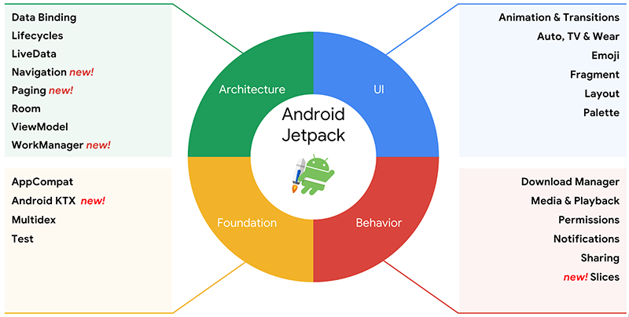

# Jetpack

Google IO 2018推出了全新的Android开发组件库：`今天，我们高兴地推出 Android Jetpack，这是我们的新一代组件、工具和架构指导，旨在加快您的 Android 应用开发速度。`Android Jetpack 完美兼容 Kotlin 语言，利用 Android KTX 大幅节省代码量。

Android Jetpack 是一套组件、工具、指导思想的集合，其件将现有的 **Support库** 与 **架构组件库** 联系起来，分成了四个类别：

注意，Android Jetpack 组件以“未捆绑的”库形式提供，这些库不是基础 Android 平台的一部分。未捆绑的 Android Jetpack 库已经全部转移到新的 `androidx.*` 命名空间中。

### 现有组件改进

- Data Binding更新了编译插件V2，使用V2版本可以配置LiveData一起工作

### 新组件介绍

*   WorkManager：为基于约束的后台作业（需要有保障的执行）提供一站式解决方案，即"**管理一些要在后台工作的任务, 即使你的应用没启动也能保证任务能被执行**"
*   Navigation：新的导航库
*   Paging：列表的分页加载库
*   Slices：切片是一种以搜索结果形式在 Google 智能助理内部显示应用界面的方式
*   Android KTX：Kotlin扩展

AndroidStudio3.2以上新增了编辑器和模板等，可以很好的配合Jetpack工作。相关介绍参考：

- [Android 架构组件](https://developer.android.com/jetpack/arch/?hl=zh-cn)
- [Google I/O 2018：Android 中的新功能](http://developers.googleblog.cn/2018/05/google-io-2018android.html "Google I/O 2018：Android 中的新功能")
- [使用 Android Jetpack 加快应用开发速度](http://developers.googleblog.cn/2018/05/android-jetpack.html "使用 Android Jetpack 加快应用开发速度")

