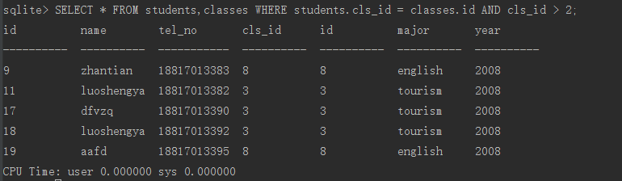
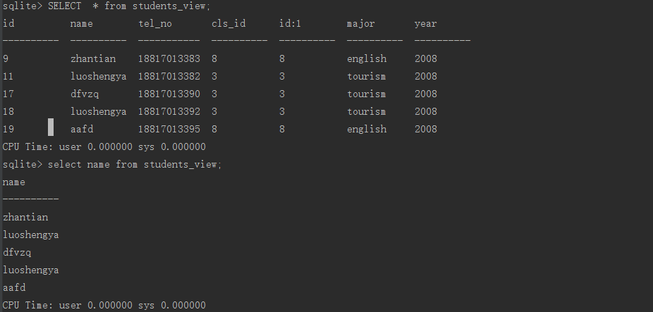

#  视图

---
## 1 什么是视图

视图是动态生成的虚拟表，它不会被存储到数据库中，它常用将某些查询结果简化为一个视图，以便下次运行时简化sql语句，创建视图的语法为：

```
        CREATE [TEMP | TEMPORARY] VIEW view_name AS
        SELECT column1, column2.....
        FROM table_name
        WHERE [condition];

view_name 视图名
AS 后面表示该视图表示的select语句
```

视图只不过是通过相关的名称存储在数据库中的一个 SQLite 语句。视图实际上是一个以预定义的 SQLite 查询形式存在的表的组合。视图可以包含一个表的所有行或从一个或多个表选定行。视图可以从一个或多个表创建，这取决于要创建视图的 SQLite 查询。

视图（View）是一种虚表，允许用户实现以下几点：

*   用户或用户组查找结构数据的方式更自然或直观。
*   限制数据访问，用户只能看到有限的数据，而不是完整的表。
*   汇总各种表中的数据，用于生成报告。

SQLite 视图是只读的，因此可能无法在视图上执行 DELETE、INSERT 或 UPDATE 语句。但是可以在视图上创建一个触发器，当尝试 DELETE、INSERT 或 UPDATE 视图时触发，需要做的动作在触发器内容中定义。

在上述创建视图的语句中，as 后面的 select 语句的结果集最终会动态的存储在 view_name 的虚拟表中，我们使用这个虚拟表是就相当于执行了这条 select 语句，录入我们经常使用如下 sql 语句。

---
## 2 示例

比如我们经常下面查询语句

```
SELECT * FROM students,classes WHERE students.cls_id = classes.id AND cls_id > 2;
```


那么我们可以为这条查询语句创建一个视图，sql语句为：

```
CREATE VIEW students_view as SELECT * FROM students,classes WHERE students.cls_id = classes.id AND cls_id > 2;
```

然后可用通过这个视图来查询数据，第一的SQL为：

```
select * fom studengs_view
```



得到的数据与执行查询一致，使用视图能能方便的执行复杂的SQL语句，因为它是动态生成的虚拟表，因此，在视图上执行除了select之外的语句都是无效的。

---
## 3 为什么使用视图

- 重用SQL语句。简化复杂的SQL操作。在编写查询后，可以方便地重用它而不必知道其基本查询细节。
- 使用表的一部分而不是整个表。
- 保护数据。可以授予用户访问表的特定部分的权限，而不是整个表的访问权限。
- 更改数据格式和表示。视图可返回与底层表的表示和格式不同的数据。

创建视图之后，可以用与表基本相同的方式使用它们。可以对视图执行 SELECT 操作，过滤和排序数据，将视图联结到其他视图或表，甚至添加和更新数据（SQLite不支持）。

### 性能问题

因为视图不包含数据，所以每次使用视图时，都必须处理查询执行时需要的所有检索。如果你用多个联结和过滤创建了复杂的视图或者嵌套了视图，性能可能会下降得很厉害。因此，在部署使用了大量视图的应用前，应该进行测试。——《SQL必知必会》

### 视图使用规则

- 创建视图，必须具有足够的访问权限。这些权限通常由数据库管理人员授予。
- 视图可以嵌套，即可以利用从其他视图中检索数据的查询来构造视图。所允许的嵌套层数在不同的DBMS中有所不同（嵌套视图可能会严 重降低查询的性能，因此在产品环境中使用之前，应该对其进行全面测试）。

---
## 4 视图与表的具体区别

1. 视图是已经编译好的sql语句。而表不是
2. 视图没有实际的物理记录。而表有。
3. 表是内容，视图是窗口
4. 表只用物理空间而视图不占用物理空间，视图只是逻辑概念的存在，表可以及时对它进行修改，但视图只能有创建的语句来修改
6. 视图是查看数据表的一种方法，可以查询数据表中某些字段构成的数据，只是一些SQL语句的集合。从安全的角度说，视图可以不给用户接触数据表，从而不知道表结构。
7. 视图的建立和删除只影响视图本身，不影响对应的基本表。
8. 视图适合于多表连接浏览时使用，不适合`增、删、改`，存储过程适合于使用较频繁的SQL语句，这样可以提高执行效率


---
## 引用

- 《SQL必知必会》


