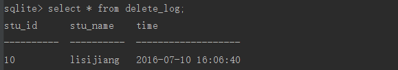

# 触发器

触发器是特殊的存储过程，它在特定的数据库活动发生时自动执行。触发器可以与特定表上的 `INSERT、UPDATE、DELETE`操作（或组合）相关联。触发器与单个的表相关联。比如与 Orders 表上的 INSERT 操作相关联的触发器只在Orders 表中插入行时执行。类似地，Customers 表上的 INSERT 和 UPDATE 操作的触发器只在表上出现这些操作时执行。

触发器内的代码具有以下数据的访问权：

- INSERT 操作中的所有新数据
- UPDATE 操作中的所有新数据和旧数据
- DELETE 操作中删除的数据

触发器的常见用途：

- 保证数据一致。例如，在 INSERT 或 UPDATE 操作中将特定列名转换为大写。
- 基于某个表的变动在其他表上执行活动。例如，每当更新或删除一行时将审计跟踪记录写入某个日志表。
- 进行额外的验证并根据需要回退数据。例如，保证某个顾客的可用资金不超限定，如果已经超出，则阻塞插入。
- 计算列的值或更新时间戳。

触发器创建的基本语法为：

```
     CREATE  [TEMP] TRIGGER trigger_name [BEFORE|AFTER] [insert|select|delete|update of columns]
        ON table_name
        BEGIN
         -- Trigger logic goes here....
        END;
```

**表名、列名、行为**是触发器的三大要素，发生特定的行为是要执行的操作定义在最后

示例：当删除一条学生记录时想 `delect_log` 中插入一条记录：

创建delect_log表：

```
    create table delete_log(
            stu_id int not null ,
            stu_name text not null,
            time text
    );
```

然后创建触发器：

```
     CREATE TRIGGER delete_trig AFTER DELETE
        ON students
        BEGIN
           INSERT INTO delete_log(stu_id , stu_name , time) VALUES (old.id,old.name,datetime('now'));
        END;

//old 表示引用被删除的行，同理插入时使用 new 可以引用被插入的行
```

现在从students中删除一条数据：

```
delete from students where id = 10;
```

然后查询delete_log中是否插入了记录：



可见触发器生效了

