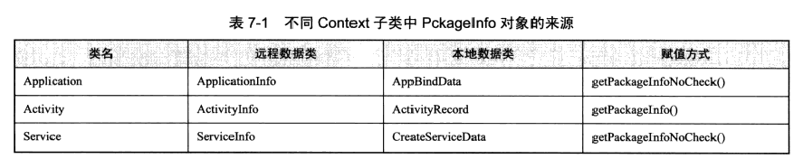

# Context

文档解释：

	Interface to global information about an application environment.  This is an abstract class whose implementation is provided by the Android system.  It allows access to application-specific resources and classes, as well as up-calls for application-level operations such as launching activities, broadcasting and receiving intents, etc.

由此可知 Context 是

- 应用程序的全局信息接口。
- 该类是一个抽象(abstract class)类，Android 提供了该抽象类的具体实现类。
- 通过 Context 可以访问系统规定的资源和类，还可以启动一个 Activity，发送一个广播等。

Context 即上下文，描述的是 app 的运行环境，提供一个 app 基本运行的功能与资源。

---
## Context的继承关系


Context的继承关系如上图，可以看到，Activity，Service，Application都间接的集成自Context，而ContextWrapper是对Context的一个包装，其内部的成员变量mBase才是真正实现了Context接口中所定义功能，也就是ContextImpl。由于Activity还涉及到界面风格，可以它直接继承于ContextThemeWrapper，而Service和Application并没有界面相关的东西，所以直接继承于ContextWrapper。

ContextWrapper：


> Proxying implementation of Context that simply delegates all of its calls to another Context.  Can be subclassed to modify behavior without changing
the original Context.

ContextWrapper 直接继承于 Context，但是它并没有实现 Context，只是对 Context 的简单包装，真正的功能由其内部的m Base 实现


其内部的mBase通过下面方法进行赋值，可以看到，只能赋值一次：

```
     protected void attachBaseContext(Context base) {
            if (mBase != null) {
                throw new IllegalStateException("Base context already set");
            }
            mBase = base;
        }
```

---
## 创建 Context 的地方

一个应用有多少个Context?
答案是：启动的Activity的数量 + 启动的Service数量 + Application数量


### 创建 Application

handleBindApplication方法中：

```
     // If the app is being launched for full backup or restore, bring it up in
            // a restricted environment with the base application class.
            Application app = data.info.makeApplication(data.restrictedBackupMode, null);
            mInitialApplication = app;
```
其中`data.info`就是`AppBindData.LoadedApk`,`data.info`初始化代码如下

```
     data.info = getPackageInfoNoCheck(data.appInfo);
```

getPackageInfoNoCheck 中会根据 AppBindData 中 ApplicationInfo 中的包名m PackageName 创建一个全局 LoadedApk 对象，而 ApplicationInfo 实现了 pracelable，它由 AMS 创建，通过 IPC 机制传递到客户端。

最后就是判断是否有开发者配置的 Application，然后创建：

```java
     public Application makeApplication(boolean forceDefaultAppClass,
                Instrumentation instrumentation) {
            if (mApplication != null) {
                return mApplication;
            }
    
            Application app = null;
    
            String appClass = mApplicationInfo.className;
            if (forceDefaultAppClass || (appClass == null)) {
                appClass = "android.app.Application";
            }
    
            try {
                java.lang.ClassLoader cl = getClassLoader();
                ContextImpl appContext = new ContextImpl();
                appContext.init(this, null, mActivityThread);
                app = mActivityThread.mInstrumentation.newApplication(
                        cl, appClass, appContext);
                appContext.setOuterContext(app);
            } catch (Exception e) {
                if (!mActivityThread.mInstrumentation.onException(app, e)) {
                    throw new RuntimeException(
                        "Unable to instantiate application " + appClass
                        + ": " + e.toString(), e);
                }
            }
            mActivityThread.mAllApplications.add(app);
            mApplication = app;
    
            if (instrumentation != null) {
                try {
                    instrumentation.callApplicationOnCreate(app);
                } catch (Exception e) {
                    if (!instrumentation.onException(app, e)) {
                        throw new RuntimeException(
                            "Unable to create application " + app.getClass().getName()
                            + ": " + e.toString(), e);
                    }
                }
            }
            
            return app;
        }
```


### Activity创建的地方

在 handleLaunchActivity中

```java
       r.packageInfo = getPackageInfo(aInfo.applicationInfo,
                    Context.CONTEXT_INCLUDE_CODE);

     java.lang.ClassLoader cl = r.packageInfo.getClassLoader();
                activity = mInstrumentation.newActivity(
                        cl, component.getClassName(), r.intent);
    
    if (activity != null) {
                    ContextImpl appContext = new ContextImpl();
                    appContext.init(r.packageInfo, r.token, this);
                    appContext.setOuterContext(activity);
    }
    ......
```

`getPackageInfo` 与 getPackageInfoNoCheked 方法都是一样的意思


### Service创建的地方

在 handleCreateService 中：

```
    .......
    LoadedApk packageInfo = getPackageInfoNoCheck(
                    data.info.applicationInfo);
            Service service = null;
            try {
                java.lang.ClassLoader cl = packageInfo.getClassLoader();
                service = (Service) cl.loadClass(data.info.name).newInstance();
            } catch (Exception e) {
                if (!mInstrumentation.onException(service, e)) {
                    throw new RuntimeException(
                        "Unable to instantiate service " + data.info.name
                        + ": " + e.toString(), e);
                }
            }
    
            try {
                if (localLOGV) Slog.v(TAG, "Creating service " + data.info.name);
    
                ContextImpl context = new ContextImpl();
                context.init(packageInfo, null, this);
    
                Application app = packageInfo.makeApplication(false, mInstrumentation);
                context.setOuterContext(service);
    ......
```

### 总结

逻辑基本类似，只是使用的数据对象不一样：



而 getPackageInfoCheck 内部调用还是 getPackageInfo，足以说明赋值方式使用的是用一个对象。所以ContextImpl 的 init 中传入的是全局 LoadedApk。

!

LoadedApk 是一个重量级类，ContextImpl 内部很多操作都是通过 LoadedApk 来完成的。


---
## 各种Context区别与应用场景

不同Context的应用场景如下图标

| 功能 | Application | Service | Activity |
| --- | --- | --- | --- |
| Start an Activity | NO1 | NO1 | YES |
| Show a Dialog | NO | NO | YES |
| Layout Inflation | YES | YES | YES |
| Start a Service | YES | YES | YES |
| Bind to a Service | YES | YES | YES |
| Send a Broadcast | YES | YES | YES |
| Register BroadcastReceiver | YES | YES | YES |
| Load Resource Values | YES | YES | YES |

>NO1 表示 Application 和 Service 可以启动一个 Activity，但是需要创建一个新的task。比如你在Application 中调用 startActivity(intent) 不开启新的 task 时系统会报如下错误：

```
java.lang.RuntimeException: Unable to create application 
com.xjp.toucheventdemo.MyApplication: android.util.AndroidRuntimeException: Calling 
startActivity() from outside of an Activity  context requires the FLAG_ACTIVITY_NEW_TASK 
flag. Is this really what you want?
```

具体原因可以分析窗口类型与 WMS 添加窗口的过程。

## 总结

- 防止Context的内存泄漏
- Dialog的创建一定要传入Activity的Context
