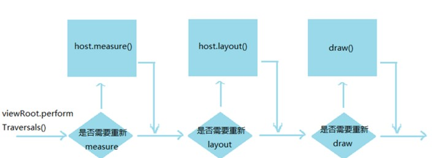

# View树的创建

---
## 1 View的绘制流程简单介绍

View是Android系统中很重要的一个部分，在Android的官方文档中是这样描述的：**表示了用户界面的基本构建模块。一个View占用了屏幕上的一个矩形区域并且负责界面绘制和事件处理。**

而 Activity 相当于视图层中的控制层，是用来控制和管理 View 的，真正用来显示和处理事件的实际上是 View，当我们在 Activity 中调用 `setContentView();`并传入一个 View 或者一个 LayoutId，界面上就会显示设置的 View 出来，setContentView()的过程稍后分析。

一个 view 要显示在界面上，需要经历一个 view 树的遍历过程，这个过程又可以分为三个过程，分别是：

- **测量** 确定一个View的大小
- **布局** 确定view在父节点上的位置
- **绘制** 绘制view的内容

这个过程的启动由一个叫`ViewRoot`(之后修改为ViewRootImpl)类中`performTraversals()`函数发起的，子view也可以通过一些方法来请求重绘view树，但是在重绘view树时并不是所有的view都需要重新绘制，所在在view树的遍历过程中，系统会问view是否需要重新绘制，如果需要才会真的去绘制view。


这个实现在 view 的 mPrivateFlag 中，

- View中有一个私有int变量mPrivateFlags，用于保存View的状态，int型32位，通过0/1可以保存32个状态的true或者false，采用这种方式可以有效的减少内存占用，提高运算效率，`应该可以把这种方式叫做二进制映射`。关于这个mPrivateFlags会在view的绘制流程中进行学习。
- 当某一个View发起了测量请求时，将会把mPrivateFlags中的某一位从0变为1，同时请求父View，父View也会把自身的该值从0变为1，同时也将会把其他子View的值从0变为1。这样一层一层传递，最终传到到DecorView，DecorView的parent是ViewRoot，所以最终都将由ViewRoot来进行处理。
- ViewRoot收到请求后，将会从上至下开始遍历，检查标记，只要有相对应的标记就执行测量/布局/绘制

流程图如下所示：



---
## 2 View树的构建流程，从setContentView说起

当我们在Activity中调用`setContentView()`;并传入一个View或者一个ViewId，界面上就会显示我们设置的View，那么这个setContentView()到底做了什么事呢？从源码中找答案。

进入Activity源码可以看到如下代码：

```java
        private Window mWindow;

        public void setContentView(@LayoutRes int layoutResID) {
            getWindow().setContentView(layoutResID);
            initWindowDecorActionBar();
        }
```
调用的是`getWindow().setContentView(layoutResID);`而getrWindow返回的是mWindow，在代码中可以看到mWindow是这样被初始化的：

```
    mWindow = new PhoneWindow(this);
```

PhoneWindow是 Window 的子类，从 Window 的注释我们也可以得到 PhoneWindow 是 Window 的实现，而 Window 是对安卓窗口概念的抽象：
```java
    /**
     * Abstract base class for a top-level window look and behavior policy.  An
     * instance of this class should be used as the top-level view added to the
     * window manager. It provides standard UI policies such as a background, title
     * area, default key processing, etc.
     *
     * <p>The only existing implementation of this abstract class is
     * android.policy.PhoneWindow, which you should instantiate when needing a
     * Window.  Eventually that class will be refactored and a factory method
     * added for creating Window instances without knowing about a particular
     * implementation.
     */
    public abstract class Window {......}
```

一个抽象的基础的顶级窗口类，定义的基本的行为和外观政策，这类的实例应该用作顶层视图添加到窗口管理器，它提供了标准UI政策背景等标题区域,默认键处理等。

继续跟踪PhoneWindow，下面是PhoneWindow的源码部分,可以看到其内部定义了平时开发中用到的各种元素。

```java
    /**
     * Android-specific Window.
     * <p>
     * todo: need to pull the generic functionality out into a base class
     * in android.widget.
     */
    public class PhoneWindow extends Window implements MenuBuilder.Callback {
          ......
          private boolean mIsFloating;

          private LayoutInflater mLayoutInflater;

          private TextView mTitleView;
    ......

    }
```
查看setContentView的源码实现：如果是view则会为其设置一个ViewGroup的LayoutParams，宽高都为匹配父元素，添加到mContentParent中，如果是布局id，先用布局填充器来解析布局id指定的xml文件，然后添加到mContentParent中，那mContentParent怎么初始化的呢？很明显是在installDecor()中被初始化的。

```java
      @Override
        public void setContentView(int layoutResID) {
            if (mContentParent == null) {
                installDecor();//安装decorView
            } else {
                mContentParent.removeAllViews();//如果已经安装过，就移除之前的conent，重新设置
            }
            mLayoutInflater.inflate(layoutResID, mContentParent);
            final Callback cb = getCallback();
            if (cb != null) {
                cb.onContentChanged();
            }
        }

        @Override
        public void setContentView(View view) {
            setContentView(view, new ViewGroup.LayoutParams(MATCH_PARENT, MATCH_PARENT));
        }

        @Override
        public void setContentView(View view, ViewGroup.LayoutParams params) {
        if (mContentParent == null) {
            installDecor();
        } else {
            mContentParent.removeAllViews();
        }
        mContentParent.addView(view, params);
        final Callback cb = getCallback();
        if (cb != null) {
            cb.onContentChanged();
        }
    }
```

接下来先看布局填充器如何解析xml布局

### 2.1 布局填充器LayoutInflate解析xml布局分析

首先mLayoutInflate是这样被初始化的

```java
    mLayoutInflater = LayoutInflater.from(context);
```

查看 LayoutInfater 源码：

```java
    /**
     * 这个类用来实例化xml中定义的view节点，
     * 使用Activity#getLayoutInflater()或者 Context#getSystemService}获取一个标准的LayoutInflater实例
    */
      public abstract class LayoutInflater {
    
        //...... 省略很多代码
    
        /**
         * 比如通过from方法获取一个LayoutInflater实例
         * Obtains the LayoutInflater from the given context.
         */
        public static LayoutInflater from(Context context) {
            LayoutInflater LayoutInflater =
                    (LayoutInflater) context.getSystemService(Context.LAYOUT_INFLATER_SERVICE);
            if (LayoutInflater == null) {
                throw new AssertionError("LayoutInflater not found.");
            }
            return LayoutInflater;
        }

        ......

    }
```
可以看到可以看到 LayoutInflater 是个抽象类，LayoutInflater使用pull解析的方式来解析xml，而它的继承者是PhoneLayoutInflater，可以在Policy类中找到相关构建过程。

#### 具体的解析xml 布局流程

其具体的解析xml布局实现为下面代码，下面贴出了所有相关的方法

```java
        public View inflate(int resource, ViewGroup root, boolean attachToRoot) {
            if (DEBUG) System.out.println("INFLATING from resource: " + resource);
                //xml构建一个xml解析器
                XmlResourceParser parser = getContext().getResources().getLayout(resource);
            try {
                return inflate(parser, root, attachToRoot);
            } finally {
                parser.close();
            }
        }

        /**
         * Inflate a new view hierarchy from the specified XML node. Throws
         * 从指定的节点inflate一个新的view层
         */
        public View inflate(XmlPullParser parser, ViewGroup root, boolean attachToRoot) {
            synchronized (mConstructorArgs) {//解析需要同步，(同步可能导致低效,代码构建view层优于xml解析)
                final AttributeSet attrs = Xml.asAttributeSet(parser);//解析属性
                /**
                 private final Object[] mConstructorArgs = new Object[2];
                */
                Context lastContext = (Context)mConstructorArgs[0];
                mConstructorArgs[0] = mContext;
                View result = root;//定义根节点view，首先指向root
                try {
                    // Look for the root node.
                    int type;
                    while ((type = parser.next()) != XmlPullParser.START_TAG &&
                            type != XmlPullParser.END_DOCUMENT) {
                        // Empty
                    }
    
                    if (type != XmlPullParser.START_TAG) {
                        throw new InflateException(parser.getPositionDescription()
                                + ": No start tag found!");
                    }
    
                    final String name = parser.getName();

                   //这里处理了merge节点
                    if (TAG_MERGE.equals(name)) {
                        if (root == null || !attachToRoot) {//可以看到merge的使用条件
                            throw new InflateException("<merge /> can be used only with a valid "
                                    + "ViewGroup root and attachToRoot=true");
                        }
                        //解析merge节点
                        rInflate(parser, root, attrs);
                    } else {
                        // Temp is the root view that was found in the xml
                        View temp = createViewFromTag(name, attrs);//从tag创建view
    
                        //构建LayoutParams
                        ViewGroup.LayoutParams params = null;
                        if (root != null) {
                            // Create layout params that match root, if supplied
                            params = root.generateLayoutParams(attrs);//从我们指定的root构建LayoutParams
                            if (!attachToRoot) {
                                // Set the layout params for temp if we are not
                                // attaching. (If we are, we use addView, below)
                                temp.setLayoutParams(params);
                            }
                        }
                        // Inflate all children under temp，解析子节点
                        rInflate(parser, temp, attrs);
                        //关于attach参数的处理
                        if (root != null && attachToRoot) {
                            root.addView(temp, params);
                        }
                        //关于返回值的处理
                        if (root == null || !attachToRoot) {
                            result = temp;
                        }
                    }
    
                } catch (XmlPullParserException e) {
                    InflateException ex = new InflateException(e.getMessage());
                    ex.initCause(e);
                    throw ex;
                } catch (IOException e) {
                    InflateException ex = new InflateException(
                            parser.getPositionDescription()
                            + ": " + e.getMessage());
                    ex.initCause(e);
                    throw ex;
                } finally {
                    // Don't retain static reference on context.
                    mConstructorArgs[0] = lastContext;
                    mConstructorArgs[1] = null;
                }
                return result;
            }
        }
    
        /**
         * 根据指定的名称，前缀，属性创建一个view
         * @return View The newly instantied view, or null.
         */
        public final View createView(String name, String prefix, AttributeSet attrs)
                throws ClassNotFoundException, InflateException {
            Constructor constructor = sConstructorMap.get(name);
            Class clazz = null;
            try {
                if (constructor == null) {//从构造器的缓存中获取构造器
                    clazz = mContext.getClassLoader().loadClass(
                            prefix != null ? (prefix + name) : name);
                    
                    if (mFilter != null && clazz != null) {
                        boolean allowed = mFilter.onLoadClass(clazz);
                        if (!allowed) {
                            failNotAllowed(name, prefix, attrs);
                        }
                    }
                    constructor = clazz.getConstructor(mConstructorSignature);
                    sConstructorMap.put(name, constructor);//添加到容器中
                } else {
                    // If we have a filter, apply it to cached constructor
                    if (mFilter != null) {
                        // Have we seen this name before?
                        Boolean allowedState = mFilterMap.get(name);
                        if (allowedState == null) {
                            // New class -- remember whether it is allowed
                            clazz = mContext.getClassLoader().loadClass(
                                    prefix != null ? (prefix + name) : name);
                            
                            boolean allowed = clazz != null && mFilter.onLoadClass(clazz);
                            mFilterMap.put(name, allowed);
                            if (!allowed) {
                                failNotAllowed(name, prefix, attrs);
                            }
                        } else if (allowedState.equals(Boolean.FALSE)) {
                            failNotAllowed(name, prefix, attrs);
                        }
                    }
                }
    
                Object[] args = mConstructorArgs;
                args[1] = attrs;
                return (View) constructor.newInstance(args);
    
            } catch (NoSuchMethodException e) {
                InflateException ie = new InflateException(attrs.getPositionDescription()
                        + ": Error inflating class "
                        + (prefix != null ? (prefix + name) : name));
                ie.initCause(e);
                throw ie;
    
            } catch (ClassNotFoundException e) {
                // If loadClass fails, we should propagate the exception.
                throw e;
            } catch (Exception e) {
                InflateException ie = new InflateException(attrs.getPositionDescription()
                        + ": Error inflating class "
                        + (clazz == null ? "<unknown>" : clazz.getName()));
                ie.initCause(e);
                throw ie;
            }
        }
    
      
    
        /**
         * This routine is responsible for creating the correct subclass of View
         * given the xml element name. Override it to handle custom view objects. If
         * you override this in your subclass be sure to call through to
         * super.onCreateView(name) for names you do not recognize.
         * 
         可以看到这里调用了createView，并传入"android.view."前缀，其实就是Android系统View的包名了，所以我们可能
         在xml中只写系统view的类名
         */
        protected View onCreateView(String name, AttributeSet attrs)
                throws ClassNotFoundException {
            return createView(name, "android.view.", attrs);
        }
    
        /*
         * 默认构建view的方法
         */
        View createViewFromTag(String name, AttributeSet attrs) {
            if (name.equals("view")) {
                name = attrs.getAttributeValue(null, "class");
            }
    
            try {
                View view = (mFactory == null) ? null : mFactory.onCreateView(name,
                        mContext, attrs);

                if (view == null) {//判断是否是系统级别view
                    if (-1 == name.indexOf('.')) {
                        view = onCreateView(name, attrs);
                    } else {//自定义view需要写全路径名
                        view = createView(name, null, attrs);
                    }
                }
    
                return view;
    
            } catch (InflateException e) {
                throw e;
    
            } catch (ClassNotFoundException e) {
                InflateException ie = new InflateException(attrs.getPositionDescription()
                        + ": Error inflating class " + name);
                ie.initCause(e);
                throw ie;
    
            } catch (Exception e) {
                InflateException ie = new InflateException(attrs.getPositionDescription()
                        + ": Error inflating class " + name);
                ie.initCause(e);
                throw ie;
            }
        }
    
        /**
         * 这里是用递归的方法构建view的所有层级。当view从xml中初始化它的所有子view之后，会调用onFinishInflate()方法
         */
        private void rInflate(XmlPullParser parser, View parent, final AttributeSet attrs)
                throws XmlPullParserException, IOException {
    
            final int depth = parser.getDepth();
            int type;
    
            while (((type = parser.next()) != XmlPullParser.END_TAG ||
                    parser.getDepth() > depth) && type != XmlPullParser.END_DOCUMENT) {
    
                if (type != XmlPullParser.START_TAG) {
                    continue;
                }
    
                final String name = parser.getName();
                
                if (TAG_REQUEST_FOCUS.equals(name)) {
                    parseRequestFocus(parser, parent);
                } else if (TAG_INCLUDE.equals(name)) {
                    if (parser.getDepth() == 0) {
                        throw new InflateException("<include /> cannot be the root element");
                    }
                    parseInclude(parser, parent, attrs);
                } else if (TAG_MERGE.equals(name)) {
                    throw new InflateException("<merge /> must be the root element");
                } else {
                    final View view = createViewFromTag(name, attrs);
                    final ViewGroup viewGroup = (ViewGroup) parent;
                    final ViewGroup.LayoutParams params = viewGroup.generateLayoutParams(attrs);
                    rInflate(parser, view, attrs);
                    viewGroup.addView(view, params);
                }
            }
    
            parent.onFinishInflate();
        }
    
        private void parseRequestFocus(XmlPullParser parser, View parent)
                throws XmlPullParserException, IOException {
            int type;
            parent.requestFocus();
            final int currentDepth = parser.getDepth();
            while (((type = parser.next()) != XmlPullParser.END_TAG ||
                    parser.getDepth() > currentDepth) && type != XmlPullParser.END_DOCUMENT) {
                // Empty
            }
        }
        
        //处理include节点
        private void parseInclude(XmlPullParser parser, View parent, AttributeSet attrs)
                throws XmlPullParserException, IOException {
    
            int type;
    
            if (parent instanceof ViewGroup) {
                final int layout = attrs.getAttributeResourceValue(null, "layout", 0);
                if (layout == 0) {
                    final String value = attrs.getAttributeValue(null, "layout");
                    if (value == null) {
                        throw new InflateException("You must specifiy a layout in the"
                                + " include tag: <include layout=\"@layout/layoutID\" />");
                    } else {
                        throw new InflateException("You must specifiy a valid layout "
                                + "reference. The layout ID " + value + " is not valid.");
                    }
                } else {
                    final XmlResourceParser childParser =
                            getContext().getResources().getLayout(layout);
    
                    try {
                        final AttributeSet childAttrs = Xml.asAttributeSet(childParser);
    
                        while ((type = childParser.next()) != XmlPullParser.START_TAG &&
                                type != XmlPullParser.END_DOCUMENT) {
                            // Empty.
                        }
    
                        if (type != XmlPullParser.START_TAG) {
                            throw new InflateException(childParser.getPositionDescription() +
                                    ": No start tag found!");
                        }
    
                        final String childName = childParser.getName();
    
                        if (TAG_MERGE.equals(childName)) {
                            // Inflate all children.
                            rInflate(childParser, parent, childAttrs);
                        } else {
                                                       ViewGroup.LayoutParams params = null;
                            try {
                                params = group.generateLayoutParams(attrs);
                            } catch (RuntimeException e) {
                                params = group.generateLayoutParams(childAttrs);
                            } finally {
                                if (params != null) {
                                    view.setLayoutParams(params);
                                }
                            }
    
                            // Inflate all children.
                            rInflate(childParser, view, childAttrs);
                            TypedArray a = mContext.obtainStyledAttributes(attrs,
                                com.android.internal.R.styleable.View, 0, 0);
                            int id = a.getResourceId(com.android.internal.R.styleable.View_id, View.NO_ID);
                            // While we're at it, let's try to override android:visibility.
                            int visibility = a.getInt(com.android.internal.R.styleable.View_visibility, -1);
                            a.recycle();
    
                            if (id != View.NO_ID) {
                                view.setId(id);
                            }
    
                            switch (visibility) {
                                case 0:
                                    view.setVisibility(View.VISIBLE);
                                    break;
                                case 1:
                                    view.setVisibility(View.INVISIBLE);
                                    break;
                                case 2:
                                    view.setVisibility(View.GONE);
                                    break;
                            }
    
                            group.addView(view);
                        }
                    } finally {
                        childParser.close();
                    }
                }
            } else {
                throw new InflateException("<include /> can only be used inside of a ViewGroup");
            }
    
            final int currentDepth = parser.getDepth();
            while (((type = parser.next()) != XmlPullParser.END_TAG ||
                    parser.getDepth() > currentDepth) && type != XmlPullParser.END_DOCUMENT) {
                // Empty
            }
        }  
```
首先其解析xml的方式是pull解析，inflate方法的三个参数都非常重要，稍后分析。

方法的开发是对xml规范的一些判断，不符合直接抛异常，如对merge的处理是父view必须非null而且必须添加到父view中去：
```java
                    if (TAG_MERGE.equals(name)) {
                        if (root == null || !attachToRoot) {
                            throw new InflateException("<merge /> can be used only with a valid "
                                    + "ViewGroup root and attachToRoot=true");
                        }
                    }
```

接下来看一个view的初始化，是通过` View temp = createViewFromTag(name, attrs);`
方法继续初始化的，关联方法是createView，从其内部逻辑看出，xml中的View都是通过反射进行实例化的

下面是关于inflate方法三个参数的逻辑：

```java
                        View temp = createViewFromTag(name, attrs);

                        ViewGroup.LayoutParams params = null;

                        if (root != null) {
                            params = root.generateLayoutParams(attrs);
                            if (!attachToRoot) {
                                temp.setLayoutParams(params);
                            }
                        }
```

- 第一步：如果 root 非 null，attachToRoot 为 false

ViewGroup.LayoutParams会被初始化，调用的是`root.generateLayoutParams(attrs)`。将创建的 LayoutParams 设置给被创建的 view。

- 第二步：如果 root 非 null 并且 attachToRoot 为 true

LayoutParams设置给被创建的view，并且被创建的view添加到root总作为子view

- 第三步：如果 root 为 null 并且 attachToRoot 为 false

则只是单纯的创建一个View了

**有一点需要注意的是LayoutInflater的返回值问题，如果 root 非 null 并且 attachToRoot 为 true 返回的 View 是 root，否则为 inflate 的根 View。**

**到这里应该可以明白为何有时候，在平时的 inflate 方法调用时，如果 root 传空的话，根布局的 layout_width 等属性都是无效的！！！**

当一个节点调用完毕，又会调用`rInflate(parser, temp, attrs);`进行递归解析

在rInflate函数中还可以看到 `parent.onFinishInflate();`函数的调用时机。

以上基本就是xml布局解析的过程，更多具体细节可以参考源码。

### 2.2 installDecor() 的源码实现分析

源码如下：
```java
    private void installDecor() {
            //初始化decorView
            if (mDecor == null) {
                mDecor = generateDecor();
                mDecor.setDescendantFocusability(ViewGroup.FOCUS_AFTER_DESCENDANTS);
                mDecor.setIsRootNamespace(true);
            }
            //初始化ContentParent
            if (mContentParent == null) {
                mContentParent = generateLayout(mDecor);
                //查找title
                mTitleView = (TextView)findViewById(com.android.internal.R.id.title);
                if (mTitleView != null) {
                    //FEATURE_NO_TITLE的处理
                    if ((getLocalFeatures() & (1 << FEATURE_NO_TITLE)) != 0) {
                        View titleContainer = findViewById(com.android.internal.R.id.title_container);
                        if (titleContainer != null) {
                            titleContainer.setVisibility(View.GONE);
                        } else {
                            mTitleView.setVisibility(View.GONE);
                        }
                        if (mContentParent instanceof FrameLayout) {
                            ((FrameLayout)mContentParent).setForeground(null);
                        }
                    } else {
                        mTitleView.setText(mTitle);
                    }
                }
            }
        }
```

可以看到如果mDecor为null的话会调用`generateDecor`初始化一个DecorView，代码如下：

```java
      protected DecorView generateDecor() {
            return new DecorView(getContext(), -1);
    }
```

代码很简单就是直接创建了一个DecorView，那么来看看DecorView的实现：

```java
     private final class DecorView extends FrameLayout implements RootViewSurfaceTaker{
          ......
    }
```

DecorView是PhoneWindow的内部类，并且是final的，集成自FrameLayout，其实DecorView是每一个View树的跟布局。

接下来还有一个重点：mContentView的初始化

`mContentParent = generateLayout(mDecor);`

根据一系列的风格判断，最终确定 ContentView 的布局id，比如 mIsFloating、Window_windowNoTitle 等等...

确定好id之后会进行解析，然后添加到 decorView 中，最后初始化mContentView
```java
     View in = mLayoutInflater.inflate(layoutResource, null);
     decor.addView(in, new ViewGroup.LayoutParams(MATCH_PARENT, MATCH_PARENT));
     ViewGroup contentParent = (ViewGroup)findViewById(ID_ANDROID_CONTENT);
```

ID_ANDROID_CONTENT的值为：`com.android.internal.R.id.content;`

上面说的根据一系列窗口特点和系统风格确定好布局id，style是在xml的theme中指定，那么怎么改变窗口的特征呢？其实就是requestFeature这个方法了，但是其内部有一段代码是这样的：
```java
    if (mContentParent != null) {
        throw new AndroidRuntimeException("requestFeature() must be called before adding content");
    }
```
也就是说，requestFeature必须在setContentView之前调用。


分析到这里也可以明白，有写时候不希望界面显示title，我们会调用：
```java
      getWindow().requestFeature(Window.FEATURE_NO_TITLE);
```

其实原理就是在构建view树的时候，根据设置的窗口特性，去解析不同的布局xml


比如一般解析的是：screen_title

```xml
<LinearLayout xmlns:android="http://schemas.android.com/apk/res/android"
    android:orientation="vertical"
    android:fitsSystemWindows="true">
    <FrameLayout
        android:layout_width="match_parent" 
        android:layout_height="?android:attr/windowTitleSize"
        style="?android:attr/windowTitleBackgroundStyle">
        <TextView android:id="@android:id/title" 
            style="?android:attr/windowTitleStyle"
            android:background="@null"
            android:fadingEdge="horizontal"
            android:gravity="center_vertical"
            android:layout_width="match_parent"
            android:layout_height="match_parent" />
    </FrameLayout>
    <FrameLayout android:id="@android:id/content"
        android:layout_width="match_parent" 
        android:layout_height="0dip"
        android:layout_weight="1"
        android:foregroundGravity="fill_horizontal|top"
        android:foreground="?android:attr/windowContentOverlay" />
</LinearLayout>
```


如果没有title则会解析screen_simple

```xml
<FrameLayout xmlns:android="http://schemas.android.com/apk/res/android"
    android:id="@android:id/content"
    android:fitsSystemWindows="true"
    android:foregroundInsidePadding="false"
    android:foregroundGravity="fill_horizontal|top"
    android:foreground="?android:attr/windowContentOverlay" />
```


**到此View树的创建分析完毕。**

### 2.3 总结

- Activity被创建后，会调用Activity的onCreate方法。我们通过设置setContentView就会调用到Window中的setContextView，从而初始化DecorView。

- 我们需要隐藏标题栏什么的，都需要在DecorView初始化之前进行设置。

---
## 3 View的mPrivaeFlag简要说明

刚刚说到，view的重新绘制过程中并不是需要绘制view树种的所有view，这由view的一些flag决定，


例如view的draw方法中：

```java
    public void draw(Canvas canvas) {
            final int privateFlags = mPrivateFlags;
            //判断是否需要绘制,View的是否绘制由mPrivateFlags中一位标识，
            final boolean dirtyOpaque = (privateFlags & PFLAG_DIRTY_MASK) == PFLAG_DIRTY_OPAQUE &&
                    (mAttachInfo == null || !mAttachInfo.mIgnoreDirtyState);
            //重置
            mPrivateFlags = (privateFlags & ~PFLAG_DIRTY_MASK) | PFLAG_DRAWN;
    
            int saveCount;
    
            if (!dirtyOpaque) {
                drawBackground(canvas);
            }
    
            // skip step 2 & 5 if possible (common case)
            final int viewFlags = mViewFlags;
            boolean horizontalEdges = (viewFlags & FADING_EDGE_HORIZONTAL) != 0;
            boolean verticalEdges = (viewFlags & FADING_EDGE_VERTICAL) != 0;
            if (!verticalEdges && !horizontalEdges) {
                // Step 3, draw the content
                if (!dirtyOpaque) onDraw(canvas);
    
                // Step 4, draw the children
                dispatchDraw(canvas);
    
                // Overlay is part of the content and draws beneath Foreground
                if (mOverlay != null && !mOverlay.isEmpty()) {
                    mOverlay.getOverlayView().dispatchDraw(canvas);
                }
    
                // Step 6, draw decorations (foreground, scrollbars)
                onDrawForeground(canvas);
    
                // we're done...
                return;
            }
            ......}
```
一般情况下viewGroup的ondraw方法是不会被调用，因为没有可以绘制的内容，这时它就是透明的状态，对于不透明的计算条件有一个方法computeOpaqueFlags：

```java
    protected void computeOpaqueFlags() {
            // Opaque if:不透明条件
            //   - Has a background 
            //   - Background is opaque 
            //   - Doesn't have scrollbars or scrollbars overlay
    
            if (mBackground != null && mBackground.getOpacity() == PixelFormat.OPAQUE) {
                mPrivateFlags |= PFLAG_OPAQUE_BACKGROUND;
            } else {
                mPrivateFlags &= ~PFLAG_OPAQUE_BACKGROUND;
            }
    
            final int flags = mViewFlags;
            if (((flags & SCROLLBARS_VERTICAL) == 0 && (flags & SCROLLBARS_HORIZONTAL) == 0) ||
                    (flags & SCROLLBARS_STYLE_MASK) == SCROLLBARS_INSIDE_OVERLAY ||
                    (flags & SCROLLBARS_STYLE_MASK) == SCROLLBARS_OUTSIDE_OVERLAY) {
                mPrivateFlags |= PFLAG_OPAQUE_SCROLLBARS;
            } else {
                mPrivateFlags &= ~PFLAG_OPAQUE_SCROLLBARS;
            }
        }
```

`setWillNotDraw`方法，其实也是对mPrivateFlat进行这种运算。

```java
        /**
         * If this view doesn't do any drawing on its own, set this flag to
         * allow further optimizations. By default, this flag is not set on
         * View, but could be set on some View subclasses such as ViewGroup.
         *
         * Typically, if you override {@link #onDraw(android.graphics.Canvas)}
         * you should clear this flag.
         *
         * @param willNotDraw whether or not this View draw on its own
         */
        public void setWillNotDraw(boolean willNotDraw) {
            setFlags(willNotDraw ? WILL_NOT_DRAW : 0, DRAW_MASK);
        }
```