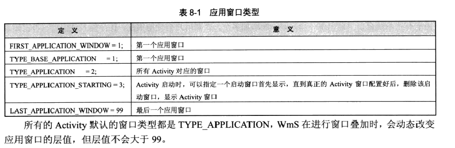
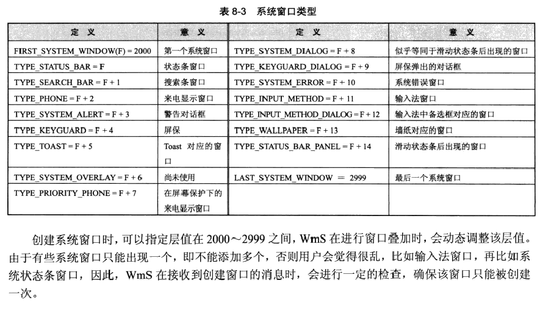
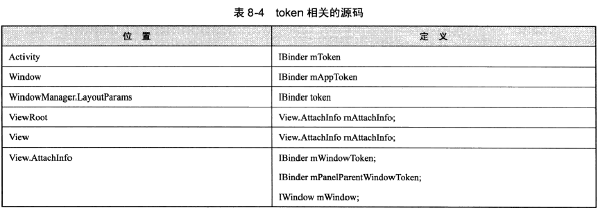

[TOC]
# 窗口的创建过程

从WMS来讲，一个窗口并不是Window类，而是一个View类，WMS收到消息后，需要把消息分发到窗口，View本身不能和WMS通信，而是通过ViewRoot的W，每个ViewRoot对象都有一个W，WMS并不在意窗口属于哪一个应用程序，WMS只是按照一定的规则判断哪个窗口处于活动状态，然后通过窗口对应的W类把事件传递给View，剩下的就是View自己怎么处理了

参考

- 《安卓内核剖析》
- [各种窗口添加过程]( http://blog.csdn.net/yanbober/article/details/46361191)  

---
## 窗口的类型


安卓系统定义了三种类型的窗口：

- 应用窗口`TYPE_APPLICATION`，所谓应用类窗口必须对应一个Activity，所以window必须在Activity中创建

- 子窗口`FIRST_SUB_WINDOW`，子窗口必须有一个父窗口，也可是应用窗口，也可以是其他窗口

- 系统窗口`FIRST_SYSTEM_WINDOW`，系统窗口的添加不需要Activity，可以直接添加，但是应用程序没有权限创建系统类型窗口，只有系统进程可以

查看WindowManager.LayoutParams可以看到其内部定义了所有的窗口类型：






---
## Android中Token的含义

在查看安卓源码时，会看到很多token，其定义都为IBinder，可以看出token作用之一就是为了进行IPC。

主要涉及到的token有：

- Activity内部的token，此token指向在执行启动一个新的Activity时由AMS被Activity创建的ActivityRecord，然后通过IPC将token的引用传递到客户端，Activity从而根据各种状态的变化通过token与AMS交互，
- ViewRoot中的W所表示的token，在View树被添加的WMS中前，需要创建ViewRoot对象与W对象，W是一个Binder，用于View和WMS进行通信




### Activity中的Token

Activity中的Token指向在执行启动一个新的Activity时，由AMS为将为将要启动的Activity创建的ActivityRecord，赋值的过程：

在PerformLaunchActivity中，Activity被创建，之后会调用Activity的attach方法，传入有AMS窗口的ActivityRecord引用：

```
    activity.attach(appContext, this, getInstrumentation(), r.token,
                            r.ident, app, r.intent, r.activityInfo, title, r.parent,
                            r.embeddedID, r.lastNonConfigurationInstance,
                            r.lastNonConfigurationChildInstances, config);
```

### Window中的mAppToken

每一个Window对象中都有一个mAppToken，这个Window不是抽象的窗口，Window更侧重于表单Activity所对应的窗口，所以mAppToken与Activity中mToken指向用一个对象。

在Activity的attach方法中，Window被实例化，并调用其setWindowManager方法赋值：

```
      mWindow.setWindowManager(
                    (WindowManager)context.getSystemService(Context.WINDOW_SERVICE),
                    mToken, mComponent.flattenToString(),
                    (info.flags & ActivityInfo.FLAG_HARDWARE_ACCELERATED) != 0);
```

Window中还有其他Binder对象，Window并不一定需要对应一个Activity，Dialog内部也有Window对象，当Window不对应Activity时，内部的mAppToken为null

### WindowManager.LayoutParams中的token

WindowManager.LayoutParams用于向WMS中添加窗口，其内部的token指向的是ViewRoot内部W类(?,此处存在疑问)，其赋值过程：

- 如果创建的窗口是应用窗口，token首先为window中的mAppToken，进行添加操作的时候会被修改为指向W对象(这个过程暂时没有找到)
- 如果窗口的类型是子窗口，那么token是父窗口的token对象
- 如果是系统窗口，那么token为null

### View中的token

客户端每个窗口对应一个ViewRoot，ViewRoot被创建时其内部的mAttachInfo也被创建，当View被做为ViewRoot中的mView时，在执行performTransact时，通过dispatchToWindow，把mAttachInfo传递给view树种的每一个View

mAttachInfo中的三个token

- mWindowToken 指向W类
- mPanelParentWindowToken 如果该窗口时子窗口，那么mPanelParentWindowToken指向父窗口的mWindowToken，mWindowToken与mPanelParentWindowToken是互斥的，mWindowToken不为null，那么该窗口不是子窗口
- mWindow mWindowToken = mWindow.asBinder();

赋值过程，在ViewRoot中：

```
    /mWindow为W类
    mAttachInfo = new View.AttachInfo(sWindowSession, mWindow, this, this);
    //addView中
    子窗口才有panelParentView
     if (panelParentView != null) {
         mAttachInfo.mPanelParentWindowToken = panelParentView.getApplicationWindowToken();
     }

    在performTransact中：
    if (!mAttached) {
         host.dispatchAttachedToWindow(attachInfo, 0);
         mAttached = true;
    }
```
---
## 窗口的创建过程

当需要启动一个Activity时，会先报告给AMS，当AMS决定启动一个Activity时，首先为将要启动的Activity构建一个ActivityREcord对象，然后通知客户端构建一个Activity对象，并把ActivityRecord的引用传递到客户端，客户端在handleLaunchActivity中构架Activity对象，然后调用其attach方法，对其内部变量赋值，attach方法内部得到了token引用，构建了window等对象，然后handleLaunchActivity中回调Activity的第一个生命周期方法，onCreate，这里开始构建View树。

attach方法中会为window设置WindowManager，并把自己设置为window的callback，这个WindowManager是其内部的LoaclWindowManager，LoaclWindowManager只是一个壳，主要功能都是WindowManagerImpl实现的。而WindowManagerImpl全局只有一次实例，

window设置windowmanager过程：

```
    public void setWindowManager(WindowManager wm,
                IBinder appToken, String appName) {
            mAppToken = appToken;
            mAppName = appName;
            if (wm == null) {
                wm = WindowManagerImpl.getDefault();
            }
            mWindowManager = new LocalWindowManager(wm);
        }
```

构建好Window后，回调onCreate方法，在onCreate方法我们都会调用setContentView，这一过程在已经分析过，现在稍微补充一下：

我们知道，在调用generateLayout方法为ContentView赋值时，会根据用户指定的的参数来选择不同的窗口修饰(xml布局文件)，不管选择怎样的窗口修饰，都会有一个FrameLayout的contentView，其id为android.R.id.content。最后会调用callback的onContentChanged方法。

**这里说明一下根据用户指定的的参数**，指定参数可以通过下面途径进行：

- 在Activity的onCreage的setContentView之前，通过getWindow.requestFeature;generateLayout方法会调用getLocalFeature获取feature参数来选择不同的窗口修饰

- 在AndroidManifest文件中设置theme，generateLayout中通过getWindowStyle来获取这些值：


然后在performResume方法中会通过windowManager添加新建的窗口(View),调用逻辑在这里：

```
        void makeVisible() {
            if (!mWindowAdded) {
                ViewManager wm = getWindowManager();
                wm.addView(mDecor, getWindow().getAttributes());
                mWindowAdded = true;
            }
            mDecor.setVisibility(View.VISIBLE);
        }
```

addView的参数为：decorView，WindowLayout.LayoutParams。

WindowLayout.LayoutParams 构造方法如下，可见默认的窗口类型都是应用窗口

```
    public LayoutParams() {
                super(LayoutParams.MATCH_PARENT, LayoutParams.MATCH_PARENT);
                type = TYPE_APPLICATION;
                format = PixelFormat.OPAQUE;
            }
```


这里说明为什么Activity的WindowManager需要构建一个LocalWindowMamnaer的壳呢，因为LocalWindowMamnaer会对addView的参数进行判断：

```
    public final void addView(View view, ViewGroup.LayoutParams params) {
                    // Let this throw an exception on a bad params.
                    WindowManager.LayoutParams wp = (WindowManager.LayoutParams)params;
                   ......
                     //如果是子窗口
                    if (wp.type >= WindowManager.LayoutParams.FIRST_SUB_WINDOW &&
                        wp.type <= WindowManager.LayoutParams.LAST_SUB_WINDOW) {
                        if (wp.token == null) {
                            View decor = peekDecorView();
                            if (decor != null) {
                                wp.token = decor.getWindowToken();
                            }
                        }
                        ......
                    } else {
                    //mContainer指过时的ActivityGroup，一般为null，所以这里是mAppToken
                        if (wp.token == null) {
                            wp.token = mContainer == null ? mAppToken : mContainer.mAppToken;
                        }
                       ......
                   }

```

通过个LocalWindowMamnaer的addView方法后就会真正调用WindowManagerImpl的addView了

WindowManagerImpl的addView方法，其内部维护着三个数组，分别存储着DecorView，LayoutParams，ViewRoot：
```
        private void addView(View view, ViewGroup.LayoutParams params, boolean nest){
           ......
         synchronized (this) {  
               //子窗口，先找到父窗口
               if (wparams.type >= WindowManager.LayoutParams.FIRST_SUB_WINDOW &&
                            wparams.type <= WindowManager.LayoutParams.LAST_SUB_WINDOW) {
                        final int count = mViews != null ? mViews.length : 0;
                        for (int i=0; i<count; i++) {
                            if (mRoots[i].mWindow.asBinder() == wparams.token) {
                                panelParentView = mViews[i];
                            }
                        }
                    }
                    ......
           root = new ViewRoot(view.getContext());
            root.mAddNesting = 1;

            view.setLayoutParams(wparams);
            
            if (mViews == null) {
                index = 1;
                mViews = new View[1];
                mRoots = new ViewRoot[1];
                mParams = new WindowManager.LayoutParams[1];
            } else {
                index = mViews.length + 1;
                Object[] old = mViews;
                mViews = new View[index];
                System.arraycopy(old, 0, mViews, 0, index-1);
                old = mRoots;
                mRoots = new ViewRoot[index];
                System.arraycopy(old, 0, mRoots, 0, index-1);
                old = mParams;
                mParams = new WindowManager.LayoutParams[index];
                System.arraycopy(old, 0, mParams, 0, index-1);
            }
            index--;

            mViews[index] = view;
            mRoots[index] = root;
            mParams[index] = wparams;
        }
        // do this last because it fires off messages to start doing things
        root.setView(view, wparams, panelParentView);
         ......
         }
          root.setView(view, wparams, panelParentView);
        }
```

在ViewRoot的setView方法参数;

- view：是从 WindowManagerImpl 在 mViews 数组的一个元素，也就是新建的窗口界面。
- attrs：添加窗口的参数，该参数描述该窗口的呈现风格、大小、位置等，尤其是其内部变量 token，指明了该窗口和相关 Activity 的关系。
- panelParentView：该对象也是 WindowManagerImpl 中 mViews 数组的一个元素，仅当该窗口有父窗口时，该值才有意义。


最后在setView方法中完成View窗口的添加。

```
     public void setView(View view, WindowManager.LayoutParams attrs,
                View panelParentView) {
       ......
    
        mView = view;
                    mWindowAttributes.copyFrom(attrs);
                    attrs = mWindowAttributes;
          ......
          if (panelParentView != null) {
                        mAttachInfo.mPanelParentWindowToken
                                = panelParentView.getApplicationWindowToken();
                    }
                    mAdded = true;
                    int res; /* = WindowManagerImpl.ADD_OKAY; */
    
                    // Schedule the first layout -before- adding to the window
                    // manager, to make sure we do the relayout before receiving
                    // any other events from the system.
                    requestLayout();
                    mInputChannel = new InputChannel();
                    try {
                        res = sWindowSession.add(mWindow, mWindowAttributes,
                                getHostVisibility(), mAttachInfo.mContentInsets,
                                mInputChannel);
                    } catch (RemoteException e) {
                        mAdded = false;
                        mView = null;
                        mAttachInfo.mRootView = null;
                        mInputChannel = null;
                        unscheduleTraversals();
                        throw new RuntimeException("Adding window failed", e);
                    } finally {
                        if (restore) {
                            attrs.restore();
                        }
                    }
    }
```

调用sWindowSession.add方法后获取res，后续会判断res返回值，如果是WindowManagerImpl.ADD_OKAY则说明添加成功

---
## 子窗口的创建过程
对于WMS来说，并不在意客户端创建什么样的窗口，它会一视同仁的进行创建工作，所不同的仅仅是WMS端会保存此刻的父子关系，并根据这些信息调整拥有相同父窗口的层值，因此，创建子窗口的过程和应用窗口差不多，

### 什么是子窗口

与“子”相关的三个变量，揭示了两个完全不同的“父子关系”的定义，分别如下。

- 第一个变量：View.AttachInfo类中的IBinder mPanelParentWindowToekn

每一个View中都有一个AttachInfo对象，而每个窗口实际上都对应一个View类，如果该变量不为空，则代表着它有一个父窗口，如果父窗口也是一个子窗口，则该变量在父窗口的同名变量，窗口对应的WindowToken对象，即VoewRoot中的W类

该变量的赋值过程：

第一步：应用程序在调用WindowManaer.addView方法中，提供的LayoutParams参数中的type必须为子窗口类型，token必须为父窗口对于的W对象，
第二步：在addView方法中，调用setView为子窗口设置相关的变量，其中就包括mPanelParentWindowToken的值：

      if (panelParentView != null) {
                        mAttachInfo.mPanelParentWindowToken
                                = panelParentView.getApplicationWindowToken();
                    }

mPanelParentWindowToken所揭示的父子关系本质是View对象的父子关系，更确切的讲师WMS理解的父子关系

- 第二三个变量：Window类中的boolean mHasChild和Window mContainer

mHasChild指明该窗口是否有子窗口，mContainer表示其父窗口对象，这两个变量所揭示的父子关系是window对象的父子关系，framework中只有一处用到次关系，那就是TabActivity，这里还涉及到一个LocalActivityManager的使用，

在Activity的attach方法中，如果会传入其mParent对象，一般mParent都为null，只有在ActivityThread的startActivityNow中设置了ActivityClientRecord对象的parent变量。

```
    public final Activity startActivityNow(Activity parent, String id,
            Intent intent, ActivityInfo activityInfo, IBinder token, Bundle state,
            Object lastNonConfigurationInstance) {
            ActivityClientRecord r = new ActivityClientRecord();
                r.token = token;
                r.ident = 0;
                r.intent = intent;
                r.state = state;
                r.parent = parent;
                r.embeddedID = id;
                r.activityInfo = activityInfo;
                r.lastNonConfigurationInstance = lastNonConfigurationInstance;
            if (localLOGV) {
                ComponentName compname = intent.getComponent();
                String name;
                if (compname != null) {
                    name = compname.toShortString();
                } else {
                    name = "(Intent " + intent + ").getComponent() returned null";
                }
                Slog.v(TAG, "Performing launch: action=" + intent.getAction()
                        + ", comp=" + name
                        + ", token=" + token);
            }
            return performLaunchActivity(r, null);
        }
```

startActivityNow在LocalActivityManager中被调用
因为现在已经过时，就不再赘述了

在Window中有如下代码说明：

```
    public void setContainer(Window container) {
            mContainer = container;
            if (container != null) {
                // Embedded screens never have a title.
                mFeatures |= 1<<FEATURE_NO_TITLE;
                mLocalFeatures |= 1<<FEATURE_NO_TITLE;
                container.mHasChildren = true;
            }
        }
```

关系图如下：


---
## Dialog的创建与现实过程

其实Dialog并不是子窗口，但是Dialog的很多子类会改变默认的参考类型，使之成为子窗口

构造方法如下：

```
     public Dialog(Context context, int theme) {
            mContext = new ContextThemeWrapper(
                context, theme == 0 ? com.android.internal.R.style.Theme_Dialog : theme);
            mWindowManager = (WindowManager)context.getSystemService(Context.WINDOW_SERVICE);
            Window w = PolicyManager.makeNewWindow(mContext);
            mWindow = w;
            w.setCallback(this);
            w.setWindowManager(mWindowManager, null, null);
            w.setGravity(Gravity.CENTER);
            mUiThread = Thread.currentThread();
            mListenersHandler = new ListenersHandler(this);
        }
```

构造方法所在事情如下：

- 构建Content对象，这里传入的context对象必须为activity
- 创建Window对象，为其设置WindowManager，这里调用的activity的getSystemService，内部会返回自己的WindowManager对象。这里传入的appToken为null
- set之callback为自己
- 创建mListenerHandler

Dialog对象要显示出来，必须要调用show方法：

```
    public void show() {
    //    窗口已存在直接显示
            if (mShowing) {
                if (mDecor != null) {
                    mDecor.setVisibility(View.VISIBLE);
                }
                return;
            }
    //如果没有创建，这里会调用到onCreate方法，需要在onCreate方法中
    //调用setContentView
            if (!mCreated) {
                dispatchOnCreate(null);
            }
    
            onStart();
            mDecor = mWindow.getDecorView();
            WindowManager.LayoutParams l = mWindow.getAttributes();
            //为该Dialog的mDecor赋值，并设置LayoutParams
            if ((l.softInputMode
                    & WindowManager.LayoutParams.SOFT_INPUT_IS_FORWARD_NAVIGATION) == 0) {
                WindowManager.LayoutParams nl = new WindowManager.LayoutParams();
                nl.copyFrom(l);
                nl.softInputMode |=
                        WindowManager.LayoutParams.SOFT_INPUT_IS_FORWARD_NAVIGATION;
                l = nl;
            }
    
            try {
            //然后调用mWindowManager的addView方法添加View
                mWindowManager.addView(mDecor, l);
                mShowing = true;
        //给应用程序一个机会，当窗口显示后做点什么
                sendShowMessage();
            } finally {
            }
        }
```

sendShowMessage()，是一个异步回调，此处是发送了一个消息。

因为Dialog中设置个window的windowManager是Activity的WindowManager，也就是LocalWindowManager，所以会先走它的addView方法：

```
 if (wp.token == null) {
    wp.token = mContainer == null ? mAppToken : mContainer.mAppToken;
 }
```

其实这里Window里面的mAppToken还是为null，最后到WMS的添加过程，WMS会检查创建当前的Dialog的Activity是否为在运行，这个判断依靠WMS的内部类AppWindowToken，每一个启动的Activity都会对应一个AppWindowToken，如果AppWindowToken不存在，WMS的添加过程不会返回ADD_OKEY,然偶ViewRoot会抛出异常，所以显示Dialog必须使用Activity作为Context

---
## PopupWindow的创建与现实过程

PopupWindow是一子窗口，没有创建Window之类的东西，首先看构造方法：

```
    public PopupWindow(Context context, AttributeSet attrs, int defStyleAttr, int defStyleRes) {
            mContext = context;
            mWindowManager = (WindowManager) context.getSystemService(Context.WINDOW_SERVICE);
    
            final TypedArray a = context.obtainStyledAttributes(
                    attrs, R.styleable.PopupWindow, defStyleAttr, defStyleRes);
            final Drawable bg = a.getDrawable(R.styleable.PopupWindow_popupBackground);
            mElevation = a.getDimension(R.styleable.PopupWindow_popupElevation, 0);
            mOverlapAnchor = a.getBoolean(R.styleable.PopupWindow_overlapAnchor, false);
    
            // Preserve default behavior from Gingerbread. If the animation is
            // undefined or explicitly specifies the Gingerbread animation style,
            // use a sentinel value.
            if (a.hasValueOrEmpty(R.styleable.PopupWindow_popupAnimationStyle)) {
                final int animStyle = a.getResourceId(R.styleable.PopupWindow_popupAnimationStyle, 0);
                if (animStyle == R.style.Animation_PopupWindow) {
                    mAnimationStyle = ANIMATION_STYLE_DEFAULT;
                } else {
                    mAnimationStyle = animStyle;
                }
            } else {
                mAnimationStyle = ANIMATION_STYLE_DEFAULT;
            }
    
            final Transition enterTransition = getTransition(a.getResourceId(
                    R.styleable.PopupWindow_popupEnterTransition, 0));
            final Transition exitTransition;
            if (a.hasValueOrEmpty(R.styleable.PopupWindow_popupExitTransition)) {
                exitTransition = getTransition(a.getResourceId(
                        R.styleable.PopupWindow_popupExitTransition, 0));
            } else {
                exitTransition = enterTransition == null ? null : enterTransition.clone();
            }
    
            a.recycle();
    
            setEnterTransition(enterTransition);
            setExitTransition(exitTransition);
            setBackgroundDrawable(bg);
        }
```

流程：

- 给context赋值
- 然后通过Context获取WindowManager，这里也肯定是Activity的WindowManager
- 获取一些属性

最后的显示出来：

```
     public void showAsDropDown(View anchor, int xoff, int yoff, int gravity) {
            if (isShowing() || mContentView == null) {
                return;
            }
    
            TransitionManager.endTransitions(mDecorView);
    
            registerForScrollChanged(anchor, xoff, yoff, gravity);
    
            mIsShowing = true;
            mIsDropdown = true;
    
            final WindowManager.LayoutParams p = createPopupLayoutParams(anchor.getWindowToken());
            preparePopup(p);
    
            final boolean aboveAnchor = findDropDownPosition(anchor, p, xoff, yoff, gravity);
            updateAboveAnchor(aboveAnchor);
    
            invokePopup(p);
        }
```

先看createPopupLayoutParams方法：

```
      private WindowManager.LayoutParams createPopupLayoutParams(IBinder token) {
            final WindowManager.LayoutParams p = new WindowManager.LayoutParams();
            ......
            p.type = mWindowLayoutType;
            p.token = token;
            ......
    }
```

- 第一个是 mWindowLayoutType，其值是 1000，也就是 FIRST_SUB_WINDOW 子窗口
- token 为 anchor 的 token

```
    public IBinder getWindowToken() {
            return mAttachInfo != null ? mAttachInfo.mWindowToken : null;
    }
```

然后是preparePopup，preparePopup 会创建 PopupDecorView，然后把内容View添加进去，findDropDownPosition确定位置，最后是invokePopup

```
       private void invokePopup(WindowManager.LayoutParams p) {
            ......
            mWindowManager.addView(decorView, p);
            ......
       }
```

调用WindowManager添加view，添加过程与Dialog类似，只是类型是子窗口，多了一些判断而已，这样PopupWindow就显示出来了


---
##  ContextMenu的创建与现实过程

略

---
## Toast的创建与现实过程

首先Toast是一个系统级别的窗口，系统界别的窗口由系统进程创建，应用程序没有此类权限，但是除了以下三个：

- TYPE_TOAST
- TYPE_INPUT_METHOD
- TYPE_WALLPAPER

其他的

- TYPE_PHONE
- TYPE_PRIORITY_PHONE
- TYPE_SYSTEM_ALERT
- TYPE_SYSTEM_ERROR
- TYPE_SYSTEM_OVERLAY

需要SYSTEM_ALERT_WINDOW权限，这个权限是可以申请的

这个可以在WMS的addWindow方法中的第一步权限检查看到：

```
    public int checkAddPermission(WindowManager.LayoutParams attrs) {
            int type = attrs.type;
            
            if (type < WindowManager.LayoutParams.FIRST_SYSTEM_WINDOW
                    || type > WindowManager.LayoutParams.LAST_SYSTEM_WINDOW) {
                return WindowManagerImpl.ADD_OKAY;
            }
            String permission = null;
            switch (type) {
                case TYPE_TOAST:
                    // XXX right now the app process has complete control over
                    // this...  should introduce a token to let the system
                    // monitor/control what they are doing.
                    break;
                case TYPE_INPUT_METHOD:
                case TYPE_WALLPAPER:
                    // The window manager will check these.
                    break;
                case TYPE_PHONE:
                case TYPE_PRIORITY_PHONE:
                case TYPE_SYSTEM_ALERT:
                case TYPE_SYSTEM_ERROR:
                case TYPE_SYSTEM_OVERLAY:
                    permission = android.Manifest.permission.SYSTEM_ALERT_WINDOW;
                    break;
                default:
                    permission = android.Manifest.permission.INTERNAL_SYSTEM_WINDOW;
            }
            if (permission != null) {
                if (mContext.checkCallingOrSelfPermission(permission)
                        != PackageManager.PERMISSION_GRANTED) {
                    return WindowManagerImpl.ADD_PERMISSION_DENIED;
                }
            }
            return WindowManagerImpl.ADD_OKAY;
        }
```
我们知道显示一个Toast的代码就一句：

```
            Toast.makeText(MainActivity.this, "show", Toast.LENGTH_SHORT).show();
```

看这句话做了什么：

```
     public static Toast makeText(Context context, CharSequence text, @Duration int duration) {
            Toast result = new Toast(context);
    
            LayoutInflater inflate = (LayoutInflater)
                    context.getSystemService(Context.LAYOUT_INFLATER_SERVICE);
            View v = inflate.inflate(com.android.internal.R.layout.transient_notification, null);
            TextView tv = (TextView)v.findViewById(com.android.internal.R.id.message);
            tv.setText(text);
            
            result.mNextView = v;
            result.mDuration = duration;
    
            return result;
        }

      //只是简单的加载了一个布局`R.layout.transient_notification`，然后设置Toast,然后再看show方法:

      public void show() {
            if (mNextView == null) {
                throw new RuntimeException("setView must have been called");
            }
    
            INotificationManager service = getService();
            String pkg = mContext.getOpPackageName();
            TN tn = mTN;
            tn.mNextView = mNextView;
    
            try {
                service.enqueueToast(pkg, tn, mDuration);
            } catch (RemoteException e) {
                // Empty
            }
        }
```
`INotificationManager service = getService();`是关键：

```
sService = INotificationManager.Stub.asInterface(ServiceManager.getService("notification"));
```

可以看出INotificationManager是一个AIDL结构，很明显是获取的NotificationManagerService，查看其enqueueToast方法，最终会调用到`showNextToastLocked`其内部就是掉用TN对象的show方法，这样又回到客户端了，最终也是调用WindowMnager的addView方法，添加窗口，因为Toast是系统类参考，所以不需要token，不要求必须掺入Activity作为context。
