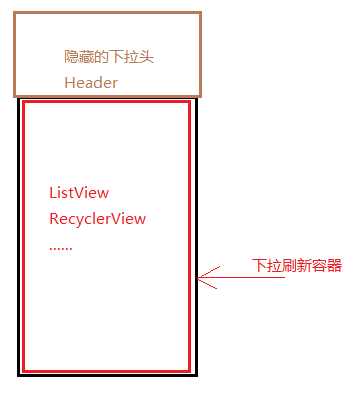

# 处理冲突的方式

----
## 1 外部拦截法

外部拦截法即事件都经过父容器处理，如果父容器需要事件就处理事件，不需要则不拦截，下面来看一下伪代码：

```java
        @Override
        public boolean onInterceptHoverEvent(MotionEvent event) {
            boolean intercept = false;
            int x = (int) event.getX();
            int y = (int) event.getY();
            int action = event.getActionMasked();
            switch (action) {
                case MotionEvent.ACTION_DOWN:
                    //如果希望子view能接收到事件，DOWN必然要返回false
                    intercept = false;
                    break;
    
                case MotionEvent.ACTION_MOVE:
                    //如果需要拦截事件，就返回true
                    if (needIntercept(event)) {
                        intercept = true;
                    } else {
                        intercept = false;
                    }
                    break;
    
                case MotionEvent.ACTION_UP:
                    //手指抬起，必须返回false，因为返回值对自己没有影响，而对子view可能有影响
                    intercept = false;
                    break;
            }
            //重新设置最后一次位置
            mLastEventX = x;
            mLastEventY = y;
            return intercept;
        }
    
        private boolean needIntercept(MotionEvent event) {
            return false;
        }
```

下面来分析一下这段伪代码的意思：

1. 首先ACTION_DOWN 必须返回false，否则子view无法接收到事件，事件都会由自己处理
2. 对应ACTION_MOVE 则对自己根据情况处理，需要就拦截，否则不拦截
3. 最后是ACTION_UP，必须返回false，原因有：
 - ACTION_UP的返回值对自身并没有影响，自身始终能接收到事件
 - 如果子一些列事件中，ViewGroup都始终没有拦截事件，却在ACTION_UP中返回true，这样导致子view无法接收到UP事件，那么就会影响子view的click事件，或者其他逻辑处理
4. 是否需要拦截事件都交给needIntercept方法处理，这个处理是根据业务来处理的，还可如果我们无法确定某些因素，还可以通过设置回调接口来处理，让其他对象通过接口来告知感兴趣的事。

如下面代码：
 
 ```java
         private boolean needIntercept(MotionEvent event) {
            if (mEventCallback != null) {
               return mEventCallback.isCanIntercept();
            }
            return false;
        }
    
        public EventCallback mEventCallback;
    
        public void setEventCallback(EventCallback eventCallback) {
            mEventCallback = eventCallback;
        }
        public interface EventCallback{
            boolean isCanIntercept();
        }
 ```

在外部拦截法中，子view最好不要使用 requestDisallowInterceptTouchEvent 来干预事件的处理

---
## 2 内部拦截法

内部拦截是指父容器不拦截任何事件，所有事件都传递给子view，如果子元素需要事件就直接消耗，否则交给父容器处理，这种拦截法需要配合 requestDisallowInterceptTouchEvent 方法来使用。我们需要重写子 view 的 dispatchTouchEvent 方法。

```java
      private int mLastX, mLastY;
        @Override
        public boolean dispatchTouchEvent(MotionEvent event) {
            int action = event.getActionMasked();
            int x = (int) event.getX();
            int y = (int) event.getY();
            switch (action) {
                case MotionEvent.ACTION_DOWN:
                    //不让父View拦截事件
                    mLastX = x;
                    mLastY = y;
                    getParent().requestDisallowInterceptTouchEvent(true);
                    break;
    
                case MotionEvent.ACTION_MOVE:
                    //如果需要拦截事件，就返回true
                    if (!needIntercept(event)) {
                        getParent().requestDisallowInterceptTouchEvent(false);
                    }
                    break;
    
                case MotionEvent.ACTION_UP:
                    //手指抬起，必须返回false，因为返回值对自己没有影响，而对子view可能有影响
                    break;
            }
            mLastX = x;
            mLastY = y;
            return super.dispatchTouchEvent(event);
        }
```

代码说明：

- 首先，必须假定父view不拦截DOWN事件而拦截其他事件，否则子view无法获取任何事件。在子view调用requestDisallowInterceptTouchEvent(false)后，父view才能继续拦截事件
- 其次在ACTION_DOWN时，调用requestDisallowInterceptTouchEvent(true)来不允许父View拦截事件
- ACTION_MOVE中如果needIntercept返回false，则调用requestDisallowInterceptTouchEvent(false)让父view重新拦截事件，需要注意的是，一点调用此方法，就表示放弃了同系列的事件的所有事件。
- 最后调用requestDisallowInterceptTouchEvent后触发我们的onTouchEvent方法，处理时间


所以父元素的拦截逻辑如下：

```java
        @Override
        public boolean onInterceptHoverEvent(MotionEvent event) {
            boolean intercept = false;
            int x = (int) event.getX();
            int y = (int) event.getY();
            int action = event.getActionMasked();
            if(action == MotionEvent.ACTION_DOWN){
                     return false;
            }else{
                     return true
            }
       }
```

---
## 3 重定义dispatchTouchEvent方法

上面两种方法基本还是尊重系统的事件分发机制，但是还是有一些情况无法满足，这时候，我们需要根据业务需求来重新定义事件分发了。

比如一个下拉刷新模式：



首先我们定义：

    - 下拉刷新容器为： A
    - 列表布局为ListView：B
    - 刷新头为：C

逻辑为：首先 A 获取到事件，如果手机方向被认定为垂直滑动，A 要判断 C 的位置和滑动方向，假设：

- 1：C 刚好隐藏，此时向下滑动，B这时无法向下滑动，A需要拦截事件，自己处理，让C显示出来，此时A需要拦截事件，自己处理，让C显示出来，如果手指又向上滑动，则A又要判断C是否隐藏，没有隐藏还是A拦截并处理事件，当C完全隐藏后，又要把事件交给B处理，B来实现自己列表View该有的特性。

就这个逻辑来讲上述方案1和方案2就无法满足，因为系统的事件分发有一个特点：**当一个ViewGroup开始拦截并处理事件后，这个事件只能由它来处理，不可能再把事件交给它的子view处理，要么它消费事件，要么最后交给Activity的onTouchEvent处理**，在代码中就是，只要ViewGroup拦截了事件，他的dispatchTouchEvent方法中接收事件的子view就会被置为null。

把此特点：

- 套用到方案1外部拦截法就是，在MOVE中，开始拦截事件，View收到一个Cancel事件后，之后都无法获取到同系列事件了。
- 套用到方案2就是在MOVE中调用 `requestDisallowInterceptTouchEvent(false)` 就表示完全放弃同系列事件的所有事件了。