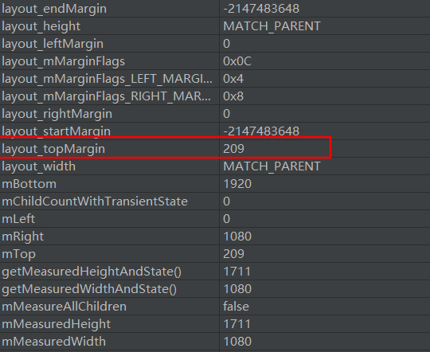

#  实现半透明状态栏的颜色

从Android4.4开始可以使用一些手段来改变状态栏的颜色，而在4.4之前状态栏一直都是黑色的，这样看起来真心的不好看，最近研究了一下如何更好的给状态栏着色，现记录如下：

---
## 1 Translucent特性

从android4.4的开始，引入了Translucent特性。
默认情况下，应用程序窗口在Status Bar下面(位置之下)，系统已经处理好了应用窗口的显示，我们不需要关心Inset(插入物)和fitSystemWindow(适应系统窗口)，当使用了`Translucent System UI`或`SYSTEM_UI_FLAG_FULLSCREEN`等属性时，Activity的UI可以显示到System UI下层(层次之下)。

使用Translucent特性有两种方法，一种是在theme中定义，还有一个种是在代码中设置。

```xml
    <style name="TranslucentTheme" parent="Theme.AppCompat.Light.DarkActionBar">
            <item name="android:windowTranslucentStatus">true</item>
            <item name="android:windowTranslucentNavigation">true</item>
    </style>
```
或者
```java
       public static void setTranslucent(Activity activity, boolean on) {
            if (Build.VERSION.SDK_INT < Build.VERSION_CODES.KITKAT) {
                return;
            }
            Window win = activity.getWindow();
            WindowManager.LayoutParams winParams = win.getAttributes();
            int bits = WindowManager.LayoutParams.FLAG_TRANSLUCENT_STATUS;
            if (on) {
                winParams.flags |= bits;
            } else {
                winParams.flags &= ~bits;
            }
            bits = WindowManager.LayoutParams.FLAG_TRANSLUCENT_NAVIGATION;
            if (on) {
                winParams.flags |= bits;
            } else {
                winParams.flags &= ~bits;
            }
            win.setAttributes(winParams);
        }
```
开启了TranslucentTheme视图就是这样的了：
```xml
    <LinearLayout
        android:id="@+id/root"
        xmlns:android="http://schemas.android.com/apk/res/android"
        xmlns:tools="http://schemas.android.com/tools"
        android:layout_width="match_parent"
        android:layout_height="match_parent"
        android:orientation="vertical"
        tools:context="com.ztiany.systembar.MainActivity">

        <TextView
            android:layout_width="match_parent"
            android:layout_height="25dp"
            android:text="你好啊"/>
    </LinearLayout>
```


我们的TextView显示到了状态栏下边了。

然而，Translucent特性在5.0之后又变化了，当我们添加了`FLAG_TRANSLUCENT_STATUS`标志位后，系统给状态栏加上了一条半透明的浅灰色。

布局文件如下：
```xml
    <LinearLayout
        android:id="@+id/root"
        xmlns:android="http://schemas.android.com/apk/res/android"
        xmlns:tools="http://schemas.android.com/tools"
        android:layout_width="match_parent"
        android:layout_height="match_parent"
        android:background="@color/colorAccent"  //这里加上了背景色
        android:orientation="vertical"
        tools:context="com.ztiany.systembar.MainActivity">

        <TextView
            android:layout_width="match_parent"
            android:layout_height="25dp"
            android:textColor="@android:color/white"
            android:text="你好啊"/>

    </LinearLayout>
```


但是5.0开始我们可以指定statusbar的颜色了，而且我们试着分析一下`FLAG_TRANSLUCENT_NAVIGATION`和`FLAG_TRANSLUCENT_STATUS`：

先单独添加`FLAG_TRANSLUCENT_NAVIGATION`属性，视图变成了这样(注意，我并没有移除掉TextView，TextView显示到了Statusbar下面)：


单独添加`FLAG_TRANSLUCENT_NAVIGATION`属性依然可以让UI显示到StatusBar下面。只是StatusBar没有变透明。TextView被StatusBar挡住了。

而**5.0**后我们可以把设置状态栏的颜色为透明色：
```xml
     <style name="ColorTranslucentTheme" parent="Theme.AppCompat.Light.DarkActionBar">
            <item name="android:windowTranslucentNavigation">true</item>
            <item name="android:windowTranslucentStatus">false</item>
            <item name="android:windowDrawsSystemBarBackgrounds">true</item>
            <item name="android:statusBarColor">@android:color/transparent</item>
        </style>
```
这时视图是这样的了：


>`windowDrawsSystemBarBackgrounds`，将它设置为true，系统将在你的window里面绘制status bar，默认为**TRUE**，之所以要写出来是因为你的theme有可能是继承过来的，确保为true。[参考链接](http://solo.farbox.com/blog/how-do-i-use-drawerlayout-to-display-over-the-actionbar-or-toolbar-and-under-the-status-bar)

---
## 2 setFitsSystemWindows

`setFitsSystemWindows`从API14引入，它的作用是：设置布局调整时是否考虑系统窗口（如状态栏）

先看一个示例，比如在4.4的系统版本上设置了开启半透明状态栏：

设置半透明状态属性：
```xml
     <item name="android:windowTranslucentStatus">true</item>//半透明状态栏
     <item name="android:windowTranslucentNavigation">true</item>//半透明导航栏
```
布局：
```xml
    <LinearLayout
        xmlns:android="http://schemas.android.com/apk/res/android"
        xmlns:tools="http://schemas.android.com/tools"
        android:layout_width="match_parent"
        android:layout_height="match_parent"
        android:fitsSystemWindows="false"
        android:orientation="vertical"
        tools:context="com.ztiany.systembar.MainActivity">

        <TextView
            android:layout_width="match_parent"
            android:layout_height="25dp"
            android:background="@color/colorPrimary"/>

    </LinearLayout>
```
当把TextView的fitsSystemWindows设置为true时是这样的：


而如果把TextView的fitsSystemWindows设置为false时又是这样的：


是不是从效果就可以很好的理解这个setFitsSystemWindows的作用了？但是需要注意的是，如果我给根布局`LinearLayout`设置一个背景色效果就是这样的了：

当把setFitsSystemWindows设置为true时是这样的


当把setFitsSystemWindows设置为false时是这样的


可见，当设置fitsSystemWindows为true时，系统默认的实现是给View加上一个Padding值，通过这个Padding值正好让View的内容不会系统UI挡住。

`View.setFitSystemWindows(boolean)`，用于设置是否使用系统默认的fitSystemWindows实现。系统布局的FitSystemWindows默认为false，不会消耗掉内容边衬区空间的占用，此时Views树会继续调用View Hierarchy中其他View的fitSystemWindows，直到某一个View中返回true，调用顺序是深度优先。如果我们决定自己处理System UI的空间占用，可以重写VIew的`fitSystemWindows(Rect insets)`并返回true，如果自己只是做些处理，仍想调用系统的默认实现，要记得调用super.fitSystemWindows并返回false。

关于相关fitSystemWindows的相关方法如下：

```java
View.java:

        /*
        API20之前：
        档调用View的setFitSystemWindows(boolean)方法并传入true时，标识由此View来处理边衬区域，此时fitSystemWindows(Rect insets)会算出StatusBar的高度，然后设置对应的padding,让子View不被SystemBar挡住。*/
        @Override
        protected boolean fitSystemWindows(Rect insets) {
            boolean fitSystemWindows = super.fitSystemWindows(insets);
            Log.d(TAG, "fitSystemWindows:" + fitSystemWindows);
            return fitSystemWindows;
        }

        /*API21：
        为了更方便的处理系统UI边衬，在 Lollipop 版本，fitSystemWindows() 函数被废弃了，同时增加了两个新的函数来简化该处理流程。使用新的 onApplyWindowInsets() 函数，该函数中你可以选择吃掉一部分insets，然后你还可以调用 dispatchApplyWindowInsets() 函数让该 View 的子View 来继续处理 insets。
        如果只想在 5.0 以上版本使用该功能，则无需继承一个 View， 只需要使用 ViewCompat.setOnApplyWindowInsetsListener() 函数即可。使用 ViewCompat 提供的函数可以方便你编写版本兼容的代码，不需要频繁的判断版本号。
        */
        public WindowInsets onApplyWindowInsets(WindowInsets insets) {
            ......
            return insets;
        }

        public WindowInsets dispatchApplyWindowInsets(WindowInsets insets) {
               ......
        }
```


### fitsSystemWindows的坑

1. `android:fitsSystemWindows`属性需要在布局文件中设置，虽然也可在theme中设置，但是这个懒不能偷，因为在theme中设置是针对window的，而在布局文件中设置才是针对view的

2. `windowSoftInputMode`与`windowFullscreen`，`fitsSystemWindows`冲突：如果你在 manifest 中把一个 activity 设置成 `android:windowSoftInputMode="adjustResize"`，那么 `ScrollView`（或者其它可伸缩的`ViewGroups`）会缩小，从而为软键盘腾出空间。但是，如果你在 activity 的主题中设置了 `android:windowFullscreen="true"`，那么`ScrollView` 不会缩小。这是因为该属性强制 `ScrollView` 全屏显示。然而在主题中设置 `android:fitsSystemWindows="false"` 也会导致 `adjustResize` 不起作用。

---
## 3 根据API版本实现状态栏的颜色

### Android 4.4

可以在Activity的theme中设置如下属性(或者在代码中设置)：
```xml
    <style name="ColorTranslucentTheme" parent="Theme.AppCompat.Light.DarkActionBar">
            <item name="android:windowTranslucentStatus">true</item>
            <item name="android:windowTranslucentNavigation">true</item> //不一定需要
    </style>
```
然后根据需求给我们视图跟布局设置`android:fitsSystemWindows="true"`，如果我们希望的是视图从SystemUI就开始显示我们的App内容，就是设置为false。否则设置为true。

然后再给statusbar着色，给statusbar着色有几种方案：

- 参考**[SystemBarTint](https://github.com/jgilfelt/SystemBarTint)**给DecorView添加一个与StatusBar一样高度的纯色View
- 给我们的视图根布局设置一个背景色。
- 不设置`android:fitsSystemWindows="true"`，修改Toolbar的PaddingTop值为：`toolbar.getPaddingTop()+getStatusBarHeight()`

第一种方案需要动态的获取statusBar的高度，根据这个高度创建一个纯色的`statusView`，然后把它添加到设置了`android:fitsSystemWindows="true"`的布局的父布局中去(framelayout或者relativeLayout)。如果我们需要实现`swipeback`特性，还要考虑要让被`swipeback`的那个布局作为`statusView`的容器。否则拖动的时候`statusView`就和内容断开了

注意，如果是使用theme设置translucent属性，需要根据系统版本新建对应的values文件夹：


### Android 5.x

可以在Activity的theme中设置如下属性(或者在代码中设置)：

```xml
        <style name="ColorTranslucentTheme" parent="Theme.AppCompat.Light.DarkActionBar">
            <item name="android:windowTranslucentNavigation">true</item>
            <item name="android:windowTranslucentStatus">false</item>
            <item name="android:windowDrawsSystemBarBackgrounds">true</item>
            <item name="android:statusBarColor">@android:color/transparent</item>
        </style>
```

同样根据需求给我们视图跟布局设置`android:fitsSystemWindows="true"`。给status设置颜色就更加简单了，可以随便的给使用`statusBarColor`或者在代码中设置`getWindow().setStatusBarColor(Color.YELLOW);`

---
## 4 原理

首先Activity与Dialog的View等都是以Window的概念添加的系统的WindowManager中去的，除了一般的应用窗口和子窗口，还有系统窗口，而系统窗口的优先级是最高的，所以会显示在一般应用窗口的上面，像StatusBar和NavigationBar都是系统级别的窗口，再加上我们Activity对于的窗口就合成了我们在屏幕上看到的视图。

Activity的PhoneWindow内部管理的是以DecorView为根布局的View树，而根据我们是否拥有控制权来分，姑且把View树分为内部布局和外部布局两部分，外部布局即我们调用setContentView设置添加的内容布局，而内容布局以上的层级可以称为内部布局。对于一个非Dialog形式的Activity来讲，DecorView的宽高始终是等于屏幕的宽高的，内部布局通过设置Margin让我们设置的布局默认显示在StatusBar等系统UI的下面，通过AndroidStudio提供的布局分析器可以查看：

布局层级分析


内部布局的属性，可以看到有一个topMargin值


当我们把Activity的Window设置为全屏时，内部布局的属性topMargin值将被设置为0，此时我们设置的外部布局就可以填充整个屏幕了。

同样通过布局分析器可以查看设置了`fitsSystemWindows="true"`属性的View会被加上padding，用于防止View的内容被系统窗口挡住。


---
## 引用

### 库

- [Glass：一个更改状态栏和组件背景色的库,带详细原理说明](https://github.com/Veaer/Glass)
- [SystemBarTint](https://github.com/jgilfelt/SystemBarTint)
- [FlycoSystemBar](https://github.com/H07000223/FlycoSystemBar)

### 博客

- [全屏、沉浸式、fitSystemWindow使用及原理分析：全方位控制“沉浸式”的实现](https://juejin.im/post/5948ff8fa0bb9f006bf5da29)
- [我们为什么要用fitsSystemWindows?](https://github.com/bboyfeiyu/android-tech-frontier/blob/master/issue-35/%E4%B8%BA%E4%BB%80%E4%B9%88%E6%88%91%E4%BB%AC%E8%A6%81%E7%94%A8fitsSystemWindows.md)
- [该使用 fitsSystemWindows 了](http://blog.chengyunfeng.com/?p=905#ixzz43Roc61no)
- [Keyboard don't resize the screen when android:windowTranslucentStatus=true]( https://code.google.com/p/android/issues/detail?id=63777 )
