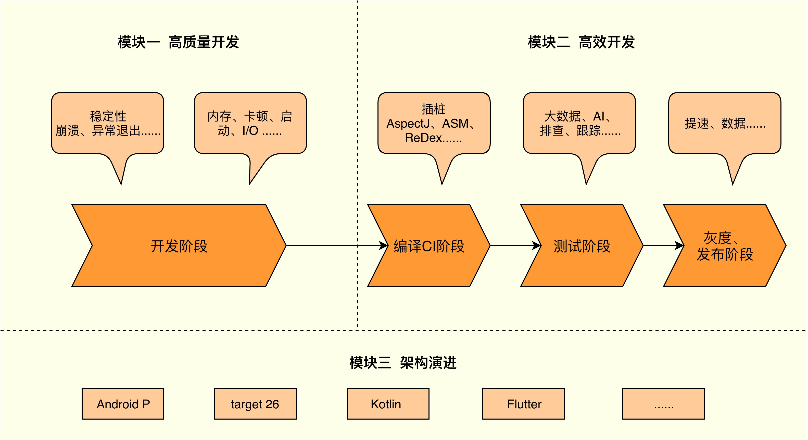
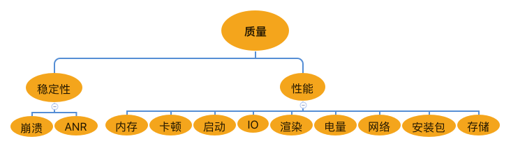

# 如何打造高质量的应用

高质量应用面临的挑战：

- Android 那多如繁星的机型、厂家和系统。如果你的应用也要出海，那么还要面对几十个国家不同的语言、环境。
- 大量“年久失修”的历史代码，越来越复杂的业务代码。
- 如何管理好几十上百个模块？
- 面对 React Native、Flutter、TensorFlow 等各种语言跟框架堆积在一起的情况。
- 复杂的环境和庞大的系统。

## 从应用交付的流程说起

一个应用至少会经过开发、编译 CI、测试、灰度和发布这几个阶段。每个阶段需要关注什么问题呢？

- **开发阶段**
  - 真正地熟练掌握各种开发工具。（比如 Traceview，它背后的实现原理是什么？能不能做一个完全没有性能损耗的 Traceview？或者怎么样将它移植到线上使用？）
- **编译CI阶段**（这部分可能需要一些编译原理的知识，你会发现移动开发也有很多值得深入研究的东西。）
  - 如何防止代码不断地恶化？
  - 怎样进一步优化性能？
  - d8 与 ReDex 有什么神奇的黑科技？
  - 如何利用好 Coverity、Infer 这些静态分析工具？
- **测试阶段**
  - 希望可以做到测试“左移”，尽可能早地发现问题。
  - 怎样提升实验室发现问题的能力呢？如何尽可能地模拟用户的操作路径？
  - 做好测试并不容易，自动化测试结合 AI 或许可以帮助我们解决一些痛点。
- **灰度和发布阶段**
  - 很多线上问题概率很低，基本很难复现，我们希望有一个远程的听诊器，而不需要把用户拉到我们的手术台上。

对照应用交付的流程，学习以下模块：

- “高质量开发”模块——对应的是开发阶段，你可以带着实践过程的困惑去深入学习开发需要的各种武器。
- “高效开发”模块——主要对应编译 CI、测试、灰度和发布阶段，你可以结合实际工作全面提升整个应用交付的效率。
- “架构演进”模块——一个好的架构可以减少甚至避免团队出错，也是打造一款高质量应用非常重要的一环，聊聊如何设计一个好的架构，以及架构该如何选型。

## 移动 APM 质量平台

一个公司有多套质量系统，这在大公司是非常普遍的现象。我们希望有一个统一的平台，整合应用的人员和开发流程，这就是我们常说 APM 质量平台。APM 的全称是“Application Performance Management”，即应用性能管理。国内像阿里、腾讯、美团点评、饿了么、爱奇艺这些公司都在大力投入。Google 今年也发力 Android Vitals 监控，新增了耗电、权限管理模块。

APM 质量平台究竟有着什么样的魅力呢？

1. 统一管理各种监控工具
2. 统一三端：一个应用也可能有 H5、iOS、Android 多个端。我们希望它们只是采集数据方式有所不同，上报、后台分析、展示、报警都是共用的。

这个质量平台需要关注哪些问题：

参考 Android 绿色联盟开发者大会上推出的应用体验标准：

在极致性能的同时，我们希望能更进一步地打造“绿色应用”。在这个过程中，**一个全面而强大的 APM 质量平台会是我们坚实的后盾**。

### 如果团队能力不足以开发自己的 APM 平台

可以选择成熟的第三方服务。但深入了解它们背后的原理，无论是对我们如何选择合适的服务，还是日常开发工作都会有很大的帮助。

### `人`才是关键

虽然移动 APM 质量平台可以帮助我们快速发现和定位问题，但是监控并不能保证实现高质量，这里最关键的永远是人，而不是系统。比如下面两个场景：

1. 你在工作中可能总能遇到这样的场景，我管它叫反馈问题三连击：“是我的问题吗？”“能复现吗？”“你的测试靠谱吗？”。虽然通过 APM 质量平台可以减少推卸责任，但有些人的做法通常还是发现空指针加一个判空，发现并发问题加一个锁。这里的空指针真正原因是什么？这里判空了后面的逻辑是否还会运行正常？有没有更加好的方法或架构可以避免这个问题？我们真正应该反问的是这三个问题，**把“质量观”深入骨髓，真正去想要得到个人成长，深挖背后的原因**。
2. 我发现许多人都在问题无法忍受，或者说是老板无法忍受的时候才去开启各种优化专项，但事后又不了了之。我们很多时候都在用战术的勤奋掩盖战略的懒惰，**性能优化的关键在于如何解决存量问题，同时快速发现增量问题**。APM 质量平台只可以协助我们，并不能解决组织内部的心态问题。

## 关键

纸上得来终觉浅，绝知此事要躬行”，只有通过实践，运用到自己的项目里面，才会对知识有更深入地理解。
