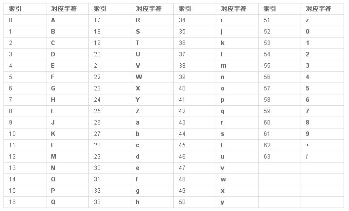

# Base64

Base64编码：可以把任何的字节变为可见字符串。算法：3字节---->4字节

```
//原始字节3个字节
1101 1100 0101 1010 1101 0101

//3*8/4 = 6，三个字节按6拆分，前面补0
//每个字节表示的范围：00 000000~00 111111   :0~63共64个整数
0011 0111 0000 0101 0010 1011 0001 0101
```
实际上Base64是一个基础码表：

```
public static String md5(String str){
        try {
            MessageDigest md = MessageDigest.getInstance("MD5");
            byte b[] = md.digest(str.getBytes());//不一定对应着字符串
            //Base64编码：可以把任何的字节变为可见字符串
            return new BASE64Encoder().encode(b);
        } catch (Exception e) {
            throw new RuntimeException(e);
        }
```

