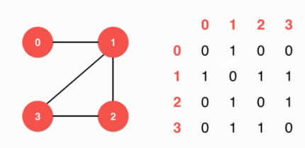

# 图论（Graph Theory）

---
## 1 图论简介

图论（英语：Graph theory）是组合数学的一个分支，和其他数学分支，如群论、矩阵论、拓扑学有着密切关系。图是图论的主要研究对象。图是由若干给定的顶点及连接两顶点的边所构成的图形，这种图形通常用来描述某些事物之间的某种特定关系。顶点用于代表事物，连接两顶点的边则用于表示两个事物间具有这种关系。——维基百科

应用场景：

### 图的分类

按方向划分：

- 无向图（Undirected Graph）
- 有向图（Directed Graph）
- 无向图是一种特殊的有向图

按边上是否有值划分

- 有权图（Unweighted Graph）
- 无权图（Weighted Graph）

### 图的连通性

下图可以认为是三个图，也可以认为是一个模型中的一个图，图中的节点不一定是完全联通的。

### 平行边和自环边

- 自环边：有一条边连接节点自身。
- 并行边：有多个边连接着两个节点

---
## 2 图的表示

### 邻接矩阵（Adjacency Matrix）

两个节点相连，则两个节点相交的位置的值为 1。

无向图表示：

有向图表示：

### 邻接表（Adjacency Lists）

第一列表示图中所有节点，每个元素后面跟随的其他元素表示与该节点相连的节点。

无向图表示：

有向图表示：

### 对比

- 邻接矩阵适合于表示稠密图（Sparse Graph），比如完全图。
- 邻接表适合于表示稀疏的图（Dense Graph）