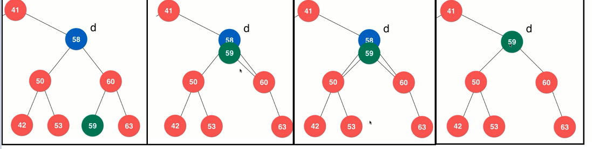

# 二分搜索树

维基百科：在计算机科学中，树（英语：tree）是一种抽象数据类型（ADT）或是实作这种抽象数据类型的数据结构，用来模拟具有树状结构性质的数据集合。它是由n（n>0）个有限节点组成一个具有层次关系的集合。把它叫做“树”是因为它看起来像一棵倒挂的树，也就是说它是根朝上，而叶朝下的。它具有以下的特点：

- 每个节点有零个或多个子节点；
- 没有父节点的节点称为根节点；
- 每一个非根节点有且只有一个父节点；
- 除了根节点外，每个子节点可以分为多个不相交的子树；

树的优点：

- 树结构本身是⼀种天然的组织结构，比如文件夹目录、图书馆书籍分类。
- 将数据使⽤树结构存储后，可能变得非常⾼效。
    - 二分搜索树
    - 平衡二叉树：AVL、红黑树
    - 堆、并查集
    - 线段树：Trie（字典树、前缀树）
- 和链表⼀样，属于动态数据结构。

---
## 1 二叉树

- 二叉树具有唯一的根节点。
- ⼆叉树每个节点最多有两个孩⼦，因此叫二叉树。
- ⼆叉树每个节点最多有⼀个⽗亲。
- ⼆叉树具有天然递归结构：
    - 每个节点的左⼦树也是⼆叉树。
    - 每个节点的右⼦树也是⼆叉树。
- ⼆叉树不⼀定是“满”的，满的二叉树叫做完全二叉树。

二叉树内部节点结构：

```java
class Node {
    E e;
    Node left;
    Node right;
}
```

图示：


二叉树的天然递归结构：


---
## 2 二分搜索树

- ⼆分搜索树是特殊的⼆叉树，即二分搜索树中存储的元素是 **有顺序的**。
- 二分搜索树要求存储的元素必须 **有可⽐较性**，二分搜索树中是没有重复元素的。
- 对于⼆分搜索树的每个节点的值：
    - ⼤于其左⼦树的所有节点的值
    - ⼩于其右⼦树的所有节点的值
- 树的每⼀棵⼦树也是⼆分搜索树


### 二分搜索树的遍历

- 遍历操作就是把所有节点都访问⼀遍

#### 深度优先遍历

在遍历树时，每个节点就将被访问三次，如果第一次访问该节点时就操作该节点，则为前序遍历，若在第二次访问该节点时才操作该节点，则为中序遍历，否则就是后序遍历。

- ⼆分搜索树的前序遍历：根->左->右
- ⼆分搜索树的中序遍历：左->根->右
- ⼆分搜索树的后序遍历：左->右->根

深度优先遍历的实现：

- 采用递归遍历树是非常简单的
- 如果要实现非递归的方式遍历树，则需要借助其他数据结构，比如栈

#### 广度优先遍历

广度优先遍历需要借助队列

### 二分搜索树的删除

- 删除二分搜索树的最⼩值
- 删除二分搜索树的最大值
- 删除二分搜索树的指定值

在删除二分搜索树的一个节点时，如果该树既有左子节点，也有右子节点，则可以采用 1962年 Hibbard 提出`Hibbard Deletion` 算法：

```
删除左右都有孩⼦的节点 d    
    1. 找到 s = min(d->right)    
    2. s 原本是 d 的后继 
    3. 让 s->right = delMin(d->right)    
    4. 让 s->left = d->left    
    5. 删除 d 后，s 代替了 d 的位置，成为新⼦树的根
```




## 3 二分搜索树实现

```java
/**
 * 二分搜索树，不支持插入空元素
 */
public class BST<E extends Comparable<E>> {

    private Node root;
    private int size;

    public void add(E e) {
        if (root == null) {
            root = new Node(e);
            size++;
        } else {
            add(root, e);
        }
    }

    private void add(Node root, E e) {
        if (e.compareTo(root.e) < 0 && root.left == null) {
            root.left = new Node(e);
            size++;
            return;
        }

        if (e.compareTo(root.e) > 0 && root.right == null) {
            root.right = new Node(e);
            size++;
            return;
        }

        if (e.compareTo(root.e) < 0 && root.left != null) {
            add(root.left, e);
        } else if (e.compareTo(root.e) > 0 && root.right != null) {
            add(root.right, e);
        }

    }

    public void addImproved(E e) {
        root = addImproved(root, e);
    }

    /**
     * 向以node为根的二分搜索树中插入元素e，递归算法，返回插入新节点后二分搜索树的根。
     * 对于二分搜索树，递归的每一次深度都把源树的层级减一，直到最后的null位就是需要添加新节点的位置。这个递归算法的精髓在于定义了返回值。
     */
    private Node addImproved(Node node, E e) {
        if (node == null) {
            size++;
            return new Node(e);
        }
        if (e.compareTo(node.e) < 0) {
            node.left = addImproved(node.left, e);
        } else if (e.compareTo(node.e) > 0) {
            node.right = addImproved(node.right, e);
        }

        // e.compareTo(node.e) == 0
        // no op

        return node;
    }

    public int getSize() {
        return size;
    }

    // 看二分搜索树中是否包含元素e
    public boolean contains(E e) {
        return contains(root, e);
    }

    //看以node为根的二分搜索树中是否包含元素e, 递归算法
    private boolean contains(Node node, E e) {
        if (node == null) {
            return false;
        }

        if (e.compareTo(node.e) == 0) {
            return true;
        } else if (node.e.compareTo(e) > 0) {
            return contains(node.right, e);
        } else {//e.compareTo(node.e) <0
            return contains(node.left, e);
        }
    }

    /**
     * 前序遍历
     */
    public void preOrder() {
        preOrder(root);
        System.out.println();
    }

    private void preOrder(Node node) {
        if (node == null) {
            return;
        }
        System.out.print(node.e + ", ");
        preOrder(node.left);
        preOrder(node.right);
    }

    /**
     * 中序遍历
     */
    public void inOrder() {
        inOrder(root);
        System.out.println();
    }

    private void inOrder(Node node) {
        if (node == null) {
            return;
        }
        inOrder(node.left);
        System.out.print(node.e + ", ");
        inOrder(node.right);
    }

    /**
     * 中序遍历
     */
    public void postOrder() {
        postOrder(root);
        System.out.println();
    }

    private void postOrder(Node node) {
        if (node == null) {
            return;
        }
        postOrder(node.left);
        postOrder(node.right);
        System.out.print(node.e + ", ");
    }

    // 二分搜索树的非递归前序遍历，使用栈实现
    public void preOrderNR() {
        if (root == null) {
            return;
        }
        //栈是先进先出的，这里先进先出符合前序遍历的深度优先场景，栈用于帮助我们记住需要遍历节点的顺序。
        Stack<Node> stack = new Stack<>();
        stack.push(root);
        while (!stack.isEmpty()) {
            Node node = stack.pop();
            System.out.print(node.e + ", ");
            if (node.right != null) {
                stack.push(node.right);
            }
            if (node.left != null) {
                stack.push(node.left);
            }
        }
        System.out.println();
    }

    //广度优先遍历，队列的先进先出特性满足广度优先遍历，使用队列记住遍历元素的顺序
    public void levelOrder() {
        if (root == null) {
            return;
        }
        Queue<Node> queue = new LinkedList<>();
        queue.add(root);
        while (!queue.isEmpty()) {
            Node node = queue.remove();
            System.out.print(node.e + ", ");
            if (node.left != null) {
                queue.add(node.left);
            }
            if (node.right != null) {
                queue.add(node.right);
            }
        }
        System.out.println();
    }

    @Override
    public String toString() {
        StringBuilder res = new StringBuilder();
        generateBSTString(root, 0, res);
        return res.toString();
    }

    // 生成以node为根节点，深度为depth的描述二叉树的字符串
    private void generateBSTString(Node node, int depth, StringBuilder res) {
        if (node == null) {
            res.append(generateDepthString(depth) + "null\n");
            return;
        }
        res.append(generateDepthString(depth) + node.e + "\n");
        generateBSTString(node.left, depth + 1, res);
        generateBSTString(node.right, depth + 1, res);
    }

    private String generateDepthString(int depth) {
        StringBuilder res = new StringBuilder();
        for (int i = 0; i < depth; i++)
            res.append("--");
        return res.toString();
    }

    //寻找树中的最小值
    public E minimum() {
        if (root == null) {
            throw new RuntimeException("tree is empty");
        }
        return minimum(root).e;
    }

    /* 递归算法，一直往左找，直到左子节点为null，就是该树的最小值*/
    private Node minimum(Node node) {
        if (node.left == null) {
            return node;
        }
        return minimum(node.left);
    }

    //寻找树中的最大值
    public E maximum() {
        if (root == null) {
            throw new RuntimeException("tree is empty");
        }
        return maximum(root).e;
    }

    /* 递归算法，一直往右找，直到左子节点为null，就是该树的最小值*/
    private Node maximum(Node node) {
        if (node.right == null) {
            return node;
        }
        return maximum(node.right);
    }


    // 从二分搜索树中删除最小值所在节点, 返回最小值
    public E removeMin() {
        E minimum = minimum();
        root = removeMin(root);
        return minimum;
    }

    private Node removeMin(Node node) {
        if (node.left == null) {
            Node rightNode = node.right;
            node.right = null;
            size--;
            return rightNode;
        }
        node.left = removeMin(node.left);
        return node;
    }

    // 从二分搜索树中删除最小值所在节点, 返回最大值
    public E removeMax() {
        E minimum = minimum();
        root = removeMax(root);
        return minimum;
    }

    private Node removeMax(Node node) {
        if (node.right == null) {
            Node leftNode = node.left;
            node.left = null;
            size--;
            return leftNode;
        }
        node.right = removeMax(node.right);
        return node;
    }

    /**
     * 删除tree中值为e的结点
     */
    public void remove(E e) {
        if (root == null) {
            throw new RuntimeException("tree is empty");
        }
        root = remove(root, e);
    }

    /*删除指定元素的节点*/
    private Node remove(Node node, E e) {
        if (node == null) {
            return null;
        }

        int compare = e.compareTo(node.e);

        if (compare < 0) {
            node.left = remove(node.left, e);
            return node;
        } else if (compare > 0) {
            node.right = remove(node.right, e);
            return node;
        } else {
            //compare == 0
            if (node.left == null) {/*要删除的节点只有右子树*/
                Node rightNode = node.right;
                node.right = null;
                size--;
                return rightNode;
            } else if (node.right == null) {/*要删除的节点只有左子树*/
                Node leftNode = node.left;
                node.left = null;
                size--;
                return leftNode;
            } else {/*要删除的节点既有左子树也有右子树*/
                //node.left != null && node.right != null
                //把node右子树中的最小值作为node 的替代
                Node successor = minimum(node.right);
                successor.right = removeMin(node.right);
                successor.left = node.left;
                node.left = node.right = null;
                return successor;
            }
        }
    }

    private class Node {

        private final E e;
        private Node left, right;

        private Node(E e) {
            this.e = e;
        }

    }

}
```


---
## 4 扩展

#### 二分搜索树的顺序性

- 获取：minimum、maximum
- 获取指定节点的：successor、predecessor
- floor 和 ceil
- rank 和 select


#### 维护 size 的二分搜索树


#### 维护 depth 的二分搜索树


#### 支持重复元素的二分搜索树

- 多个节点法
- 单个结点计数法

