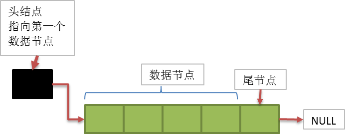
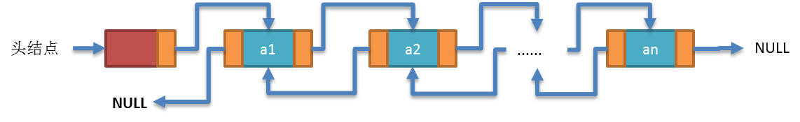
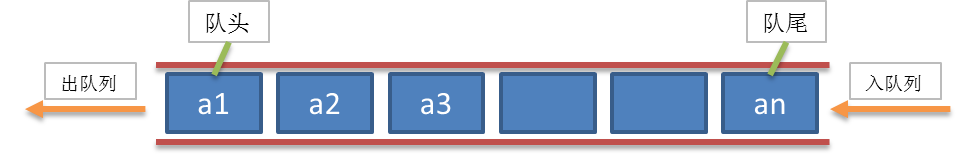
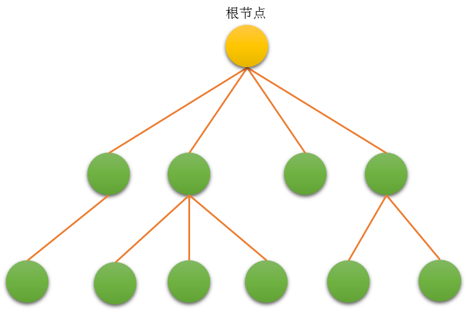
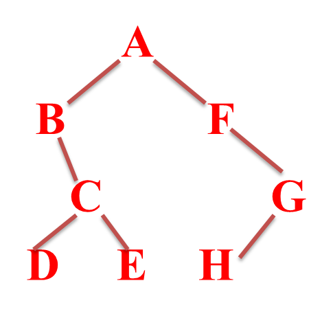

---
## 3 线性表

线性表是零个或者多个数据元素的有限序列。

特性：

- 数据元素之间是有顺序的
- 数据元素个数是有限的
- 数据元素的类型必须相同

线性表的操作：

- 创建线性表
- 销毁线性表
- 清空线性表
- 将元素插入线性表
- 将元素从线性表中删除
- 获取线性表中某个位置的元素
- 获取线性表的长度

### 3.1  数学定义

线性表是具有相同类型的 `n（≥0`）个数据元素的有限序列`（a0,a1,a2,...,an）`，ai 是表项，n是表长度。

- a0 为线性表的第一个元素，只有一个后继。
- an 为线性表的最后一个元素，只有一个前驱。
- 除 a0 和 an 外的其它元素 ai，既有前驱，又有后继。
- 线性表能够逐项访问和顺序存取。

---
### 3.2 线性表的顺序存储

指的是用一段地址连续的存储单元依次存储线性表的数据元素。数组就是这样的线性表。

优点：

- 无需为线性表中的逻辑关系增加额外的空间。
- 可以快速的获取表中合法位置的元素。

缺点：

- 插入和删除操作需要移动大量元素。
- 当线性表长度变化较大的时候，难以确定存储空间的容量。

---
### 3.3 线性表的链式存储

为了表示每个数据元素与其直接后继元素之间的逻辑关系，每个元素除了存储本身的信息外，还需要存储指示其直接后继的信息。

优点：

- 无需一次性定制链表的容量
- 插入和删除操作无需移动数据元素

缺点：

- 数据元素必须保存后继元素的位置信息
- 获取指定数据的元素操作需要顺序访问之前的元素

链表中概念：

- 头结点：链表中的第一个结点，包含指向第一个数据元素的指针以及链表自身的一些信息
    - 头节点中的数据域可以存储链表长度等额外的信息，也可以不存储任何信息
    - 头结点即链表中的第一个节点（注意头节点不同于第一个元素），而头指针则是指向头结点的指针（有头结点的情况下）。任何一个链表实现中，可以没有头结点，但是不能没有头指针。
    - 链表可以没有头节点，此时头指针直接指向链表中的第一个元素
- 数据结点：链表中代表数据元素的结点，包含指向下一个数据元素的指针和数据元素的信息
- 尾结点：链表中的最后一个数据结点，其下一元素指针为空，表示无后继

#### 单链表

- 线性表的链式存储结构中，每个节点中只包含一个指针域，这样的链表叫单链表
- 通过每个节点的指针域将线性表的数据元素按其逻辑次序链接在一起
- 单向链表有两个域：数据和执行下一个节点的指针



#### 链表技术的推演


- Linux内核链表：数据放在结点上面，指针引用放在结点下面。
- 企业链表：数据放在结点下面，指针引用防止结点上面，企业链表是 Linux 内核链表的改进版。节点存储在数据项上

```c
typedef struct CPERSON {
    CLinkNode node;//定义数据时，需要定义节点
    char name[64];
    int age;
} CPerson;
```

---
#### 循环链表

链表中最后一个结点的指针域指向头结点或者第一个元素结点，整个链表形成一个环。下面是最后一个结点的指针域指向第一个元素结点的是图示：


##### 环形链表：约瑟夫问题

约瑟夫问题（有时也称为约瑟夫斯置换），是一个出现在计算机科学和数学中的问题。在计算机编程的算法中，类似问题又称为约瑟夫环。有 n 个囚犯站成一个圆圈，准备处决。首先从一个人开始，越过 `k-2` 个人（因为第一个人已经被越过），并杀掉第 k 个人。接着，再越过 `k-1` 个人，并杀掉第 k 个人。这个过程沿着圆圈一直进行，直到最终只剩下一个人留下，这个人就可以继续活着。

---
#### 双向链表

在单链表的结点中增加一个指向其前驱的pre指针



为什么需要双向链表？

- 单链表的结点都只有一个指向下一个结点的指针
- 单链表的数据元素无法直接访问其前驱元素
- 逆序访问单链表中的元素是极其耗时的操作

---
## 4 受限线性表

### 4.1 栈

栈的基本概念：首先它是一个线性表，也就是说，栈元素具有线性关系，即前驱后继关系。只不过它是一种特殊的线性表而已。定义中说是在线性表的表尾进行插入和删除操作，这里表尾是指栈顶，而不是栈底。它的特殊之处在于限制了这个线性表的插入和删除的位置，它始终只在栈顶进行。这也就使得：栈底是固定的，最先进栈的只能在栈底。

- 栈的插入操作，叫做进栈，也成压栈。
- 栈的删除操作，叫做出栈，也有的叫做弾栈，退栈。

#### 栈的顺序存储

栈的顺序存储结构简称顺序栈，它是运算受限制的顺序表。顺序栈的存储结构是：利用一组地址连续的的存储单元依次存放自栈底到栈顶的数据元素，同时附设指针top只是栈顶元素在顺序表中的位置。

设计和实现：因为栈是一种特殊的线性表，所以栈的顺序存储可以通过顺序线性表来实现。

#### 栈的链式存储

栈的链式存储结构简称链栈，栈只是栈顶来做插入和删除操作，栈顶放在链表的头部还是尾部呢？——由于单链表有头指针，而栈顶指针也是必须的，那干嘛不让他俩合二为一呢，所以比较好的办法就是把栈顶放在单链表的头部。另外都已经有了栈顶在头部了，单链表中比较常用的头结点也就失去了意义，通常对于链栈来说，是不需要头结点的。

设计与实现：链栈是一种特殊的线性表，链栈可以通过链式线性表来实现。

#### 栈的应用

- 就近匹配
    - 当需要检测成对出现但又互不相邻的事物时可以使用栈“后进先出”的特性
    - 栈非常适合于需要“就近匹配”的场合
- 中缀表达式和后缀表达式
- 计算机如何基于后缀表达式计算

---
### 4.2 队列

队列是一种特殊的受限制的线性表，队列（queue）是只允许在一端进行插入操作，而在另一端进行删除操作的线性表。

队列是一种先进先出的（First In First Out）的线性表，简称 FIFO。允许插入的一端为队尾，允许删除的一端为队头。队列不允许在中间部位进行操作！假设队列是 `q=（a1，a2，……，an）`，那么 a1 就是队头元素，而 an 是队尾元素。这样我们就可以删除时，总是从 a1 开始，而插入时，总是在队列最后。这也比较符合我们通常生活中的习惯，排在第一个的优先出列，最后来的当然排在队伍最后:



- 队列的顺序存储：队列是一种特殊的线性表；可以用线性表顺序存储来模拟队列。
- 队列的链式存储：队列是一种特殊的线性表；可以用线性表链式存储来模拟队列的链式存储。

---
## 5 树

由一个或多个` (n≥0)` 结点组成的有限集合 T，有且仅有一个结点称为根（root），当n>1时，其余的结点分为 `m(m≥0)` 个互不相交的有限集合`T1,T2，…，Tm`。每个集合本身又是棵树，被称作这个根的子树 。



### 树的结构特点

- 非线性结构，有一个直接前驱，但可能有多个直接后继`（1:n）`
- 树的定义具有递归性，树中还有树。
- 树可以为空，即节点个数为0。

### 术语


- 根 ：即根结点(没有前驱)
- 叶子 ：即终端结点(没有后继)
- 森林 ：指m棵不相交的树的集合(例如删除A后的子树个数)
- 有序树 ：结点各子树从左至右有序，不能互换（左为第一）
- 无序树 ：结点各子树可互换位置。
- 双亲 ：即上层的那个结点(直接前驱) parent
- 孩子： 即下层结点的子树 (直接后继) child
- 兄弟 ：同一双亲下的同层结点（孩子之间互称兄弟）sibling
- 堂兄弟： 即双亲位于同一层的结点（但并非同一双亲）cousin
- 祖先 ：即从根到该结点所经分支的所有结点
- 子孙 ：即该结点下层子树中的任一结点
-    结点 ：即树的数据元素
-    结点的度 ：结点挂接的子树数（有几个直接后继就是几度）
-    结点的层次 ：从根到该结点的层数（根结点算第一层）
-    终端结点 ：即度为0的结点，即叶子
-    分支结点 ：除树根以外的结点（也称为内部结点）
-    树的度 ：所有结点度中的最大值（Max{各结点的度}）
-    树的深度(或高度) ：指所有结点中最大的层数（Max{各结点的层次}）

### 树的表示法

#### 双亲表示法

```
//顺序存储

typedef int TPosition; //结点的位置类型为整型

struct  NodeType
   ElemType  data ;    //该结点的数据
   TPosition Parent;   //该结点的父亲的数组下标,对于根结点该域为0
 }
 
 struct TreeType {
   int NodeCount;      //树的结点的总数目
   NodeType Node[MaxNodeCount];  //存储树的结点
 } 
```

由于树中每个结点的父亲是唯一的，所以上述的父亲数组表示法可以唯一地表示任何一棵树。在这种表示法下，寻找一个结点的父结点只需要`O(1)`时间。
在树中可以从一个结点出发找出一条向上延伸到达其祖先的道路，即从一个结点到其父亲，再到其祖父等等，这就可以求出根。
求这样的道路所需的时间正比于道路上结点的个数。在树的双亲表示法中，对于涉及查询儿子和兄弟信息的树操作，可能要遍历整个数组。
为了节省查询时间，可以规定指示儿子的数组下标值大于父亲的数组下标值，而指示兄弟结点的数组下标值随着兄弟的从左到右是递增的。

#### 孩子表示法

```
//链式存储
struct  Node
   int  data ;    //该结点的数据
   Node *children;   //所有孩子
 }
```

####   左孩子右兄弟表示法


左孩子右兄弟表示法可以将一颗多叉树转化为一颗二叉树：


节点的结构：


节点有两个指针域，其中一个指针指向子节点，另一个指针指向其兄弟节点。

### 树的结构

树的逻辑结构：一对多`（1:n）`，有多个直接后继（如家谱树、目录树等等），但只有一个根结点，且子树之间互不相交。

树的存储结构：

- 顺序存储
 - 可规定为：从上至下、从左至右将树的结点依次存入内存。
 - 重大缺陷：复原困难（不能唯一复原就没有实用价值）。
- 链式存储
 - 可用多重链表：一个前趋指针，n个后继指针。
 - 细节问题：树中结点的结构类型样式该如何设计？即应该设计成“等长”还是“不等长”？
 - 缺点：等长结构太浪费（每个结点的度不一定相同）；不等长结构太复杂（要定义好多种结构类型）

以上两种存储方式都存在重大缺陷，应该如何解决呢？计算机实现各种不同进制的运算是通过先研究最简单、最有规律的二进制运算规律，
然后设法把各种不同进制的运算转化二进制运算。树的存储也可以通过先研究最简单、最有规律的树，然后设法把一般的树转化为这种简单的树，这种树就是二叉树。


---
## 6 二叉树

### 二叉树概念

`n（n≥0）`个结点的有限集合，由一个根结点以及两棵互不相交的、分别称为左子树和右子树的二叉树组成。逻辑结构为 1 对 2。

基本特征:

- 每个结点最多只有两棵子树（不存在度大于2的结点）；
- 左子树和右子树次序不能颠倒（有序树）。

满二叉树：一棵深度为k 且有2k -1个结点的二叉树。每层都“充满”了结点

完全二叉树：除最后一层外，每一层上的节点数均达到最大值；在最后一层上只缺少右边的若干结点。

二叉树性质：

- 性质1: 在二叉树的第i层上至多有`2^(i-1)`个结点（i>0）
- 性质2: 深度为k的二叉树至多有`(2^k)-1`个结点（k>0）
- 性质3: 对于任何一棵二叉树，若度为2的结点数有n2个，则叶子数(n0)必定为n2＋1 （即n0=n2+1）
- 性质4: 具有n个结点的完全二叉树的深度必为`log2n+1`
- 性质5: 对完全二叉树，若从上至下、从左至右编号，则编号为i 的结点，其左孩子编号必为2i，其右孩子编号必为2i＋1；其双亲的编号必为i/2(i＝1 时为根除外)


如果不是完全二叉树可将其转换成完全二叉树再进行处理。

### 二叉树的表示

- 二叉链表示法：一般从根结点开始存储。相应地，访问树中结点时也只能从根开始。

```
typedef struct BiTNode{
    int        data;
    struct BiTNode *lchild, *rchild;
}BiTNode, *BiTree;
```


- 三叉链表表示法：每个节点有三个指针域，其中两个分别指向子节点（左孩子，右孩子），还有一共指针指向该节点的父节点。

```
//三叉链表
typedef struct TriTNode {
    int data;
    //左右孩子指针
    struct TriTNode *lchild, *rchild;
    struct TriTNode *parent;
}TriTNode, *TriTree;
```


### 二叉树的遍历

二叉树的遍历是按某条搜索路线遍访每个结点且不重复（又称周游）。它是树结构插入、删除、修改、查找和排序运算的前提，是二叉树一切运算的基础和核心。  

### 遍历方法

牢记一种约定，对每个结点的查看都是“先左后右” 。限定先左后右，树的遍历有三种实现方案：

- DLR：先 (根)序遍历，即先根再左再右
- LDR：中 (根)序遍历，即先左再根再右
- LRD：后(根)序遍历，即先左再右再根

先、中、后的意思是指访问的结点D是先于子树出现还是后于子树出现。从递归的角度看，这三种算法是完全相同的，或者说这三种遍历算法的访问路径是相同的，只是访问结点的时机不同。



上图中各种遍历方法的顺序为：

- DLR：ABCDEFGH
- LDR：BDCEAFHG
- LRD：DECBHGFA

编程实践：

- 递归遍历
- 非递归遍历，利用栈结构

### 二叉树的创建

#### 中序和先序创建树

- 通过中序遍历和先序遍历可以确定一个树
- 通过中序遍历和后续遍历可以确定一个树
- 通过先序遍历和后序遍历确定不了一个树。
- 单独先序遍历：能求解根，但不能求解左子树什么时候结束、右子树什么时候开始。

#### 括号法创建树

让树的每一个节点都变成度数为2的树

### 哈夫曼树

给定n个权值作为n个叶子结点，构造一棵二叉树，若该树的带权路径长度达到最小，称这样的二叉树为最优二叉树，也称为哈夫曼树(Huffman Tree)。哈夫曼树是带权路径长度最短的树，权值较大的结点离根较近。
