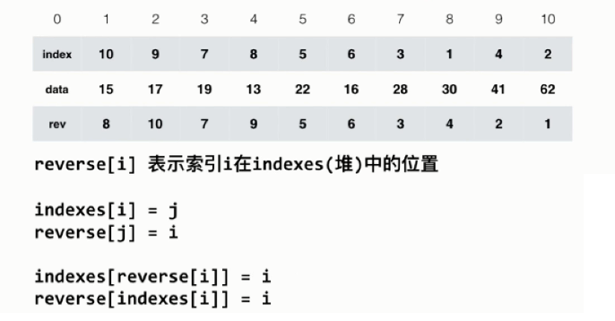

# 堆排序

---
## 1 什么是堆

堆的相关内容可以参考：[玩转数据结构08-优先队列与堆](../PlayWithDataStructures/玩转数据结构08-优先队列与堆.md)。

堆的 c++ 实现：

```cpp
#include <algorithm>
#include <stdexcept>
#include <iostream>
#include <cstdlib>

/**
 * 最大堆实现，根节点索引从 1 开始：
 * 从父节点索引求子节点索引，left = (parent*2)；right = (parent*2)+1
 * 从子节点索引求父节点索引，parent = child/2
 */
template<typename Item>
class MaxHeap {

private:
    Item *data;
    int capacity{};
    int count{};

    void shiftUP(int index) {
        while (index > 1) {
            int p = parent(index);
            if (data[p] > data[index]) {
                break;
            }
            std::swap(data[index], data[p]);
            index = p;
        }
    }

    void shiftDown(int index) {
        while (leftChild(index) <= count) {
            int target = leftChild(index);
            if (target + 1 <= count && data[target + 1] > data[target]) {
                target++;
            }
            //target 是左右两个子节点中大的那个。
            if (data[index] < data[target]) {
                std::swap(data[index], data[target]);
                index = target;
            } else {
                break;
            }
        }
    }

    int parent(int index) {
        return index / 2;
    }

    int leftChild(int index) {
        return index * 2;
    }

    int rightChild(int index) {
        return index * 2 + 2;
    }

    void resize(int newCapacity) {
        Item *temp = new Item[newCapacity + 1];
        for (int i = 1; i <= count; ++i) {
            temp[i] = data[i];
        }
        delete[] data;
        this->data = temp;
        this->capacity = newCapacity;
    }

public:
    /*explicit 表示我不是拷贝构造函数*/
    explicit MaxHeap(int capacity) {
        data = new Item[capacity + 1];
        this->capacity = capacity;
        count = 0;
    }

    MaxHeap() : MaxHeap{15} {
    }

    /*直接将数组转化为最大堆*/
    explicit MaxHeap(Item *arr, int size) {
        data = new Item[size + 1];
        for (int j = 0; j < size; ++j) {
            data[j + 1] = arr[j];
        }
        this->capacity = size;
        count = size;

        /*heapify 从最后一个非叶子节点开始*/
        for (int i = parent(count); i >= 1; --i) {
            shiftDown(i);
        }
    }

    ~MaxHeap() {
        delete[] data;
    }

    void insert(Item item) {

        if (count >= capacity) {
            resize(capacity * 2);
        }
        data[count + 1] = item;
        count++;
        shiftUP(count);
    }

    bool isEmpty() {
        return count <= 0;
    }

    int getSize() {
        return count;
    }

    /*如果返回引用，那么返回的将会是局部变量的引用，所以还是返回拷贝吧*/
    Item extractMax() {
        if (isEmpty()) {
            throw std::out_of_range("heap is empty");
        }
        Item item = data[1];
        std::swap(data[1], data[count]);
        count--;
        shiftDown(1);
        if (count <= capacity / 4 && capacity / 2 > 0) {
            resize(capacity / 2);
        }
        return item;
    }

    Item &getMax() {
        if (isEmpty()) {
            throw std::out_of_range("heap is empty");
        }
        return data[1];
    }

};
```

---
## 2 使用堆进行排序

下列列举了三种堆排序算法，其实都是利用了堆的特性：

```cpp
template<typename Item>
void heapSortV1(Item *item, int size) {
    MaxHeap<Item> maxHeap(size);
    for (int i = 0; i < size; ++i) {
        maxHeap.insert(item[i]);
    }
    for (int j = size - 1; j >= 0; --j) {
        /*把值赋值给指针，不会存在拷贝*/
        item[j] = maxHeap.extractMax();
    }
}

/**优化：拷贝 + heapify*/
template<typename Item>
void heapSortV2(Item *item, int size) {
    MaxHeap<Item> maxHeap(item, size);
    for (int j = size - 1; j >= 0; --j) {
        /*把值赋值给指针，不会存在拷贝*/
        item[j] = maxHeap.extractMax();
    }
}

template<typename Item>
static void shiftDown(Item *item, int size, int index) {
    while ((index * 2 + 1) < size) {
        /*找到最大的那个自己点比较*/
        int target = (index * 2 + 1);//默认找左边子节点
        if (target + 1 < size && item[target + 1] > item[target]) {
            target++;
        }
        /*下沉*/
        if (item[target] > item[index]) {
            std::swap(item[index], item[target]);
            index = target;
        } else {
            break;
        }
    }
}

/**优化：原地  heapify，不需要额外的空间*/
template<typename Item>
void heapSortV3(Item *item, int size) {
    //第一步 heapify 操作，堆根节点索引从 0 开始。
    for (int i = (size - 1) / 2; i >= 0; --i) {
        shiftDown(item, size, i);
    }
    //第二步，不断从堆中获取最大元素放在末尾，再使用 shiftDown 维护堆的特性
    for (int j = size - 1; j > 0; --j) {
        std::swap(item[j], item[0]);//每次都把最大值放到之后，把最后那个元素放到最前面
        //除掉之后部分的以排序的最大值，把前面未排序的部分看做一个堆，堆根节点做 heapify 操作。
        shiftDown(item, j, 0);
    }
}
```

---
## 3 排序算法比较

排序算法|平均复杂度|是否原地排序|额外空间|稳定排序
---|---|---|---|---
插入排序 | `O(n^2)` | 是 | `O(1)` | 稳定
归并排序 | `O(nlogn)` | 否 | 遍历发：`O(1)`<br>递归法：`O(logn)` | 稳定
快速排序 | `O(nlogn)` | 是 | `O(logn)` | 不稳定
堆排序 | `O(nlogn)` | 是 | `O(1)` | 不稳定

**递归空间损耗**：使用递归时，每一次递归调用都是需要额外空间的，所以可以认为使用递归的算法，虽然不需要开辟额外的空间，但是也是有空间损耗的。

**排序算法的稳定性**：对于相等的元素，在排序后，原来靠前的元素依然靠前。相等元素的相对位置没有发生变化。可以通过自定义比较函数，让排序算法不存在稳定性问题。

---
## 4 索引堆

上面实现的堆中有两个缺点：

- 每次维护堆的性质都有数据的拷贝操作，如果是复杂的类型则会影响性能。
- 对数组进行 heapify 后，数组中的顺序就无法被索引到，即堆破坏了原来数组的索引顺序。

针对以上问题，引入索引堆可以解决，索引堆中使用额外的 index 数组来维护堆的特性，而不改变原来数组的存储顺序。


以最大堆为例：比如 index 中第 1 个位置的值是 10，则表示原数组中第 10 个元素是堆的根节点。

具体实现：

```cpp
#include <algorithm>
#include <stdexcept>
#include <iostream>
#include <cstdlib>

/**
 * 最大堆实现，根节点索引从 1 开始：
 * 从父节点索引求子节点索引，left = (parent*2)；right = (parent*2)+1
 * 从子节点索引求父节点索引，parent = child/2
 */
template<typename Item>
class IndexMaxHeapV1 {

private:
    Item *data;
    int capacity{};
    int count{};
    //indexes 用来维持 data 中元素在堆中的索引
    int *indexes{};

    void shiftUP(int index) {
        while (index > 1) {
            int p = parent(index);
            //indexes 中维护的才是堆，需要从 indexes 取元素的索引
            if (data[indexes[p]] > data[indexes[index]]) {
                break;
            }
            std::swap(indexes[index], indexes[p]);
            index = p;
        }
    }

    void shiftDown(int index) {
        while (leftChild(index) <= count) {
            int target = leftChild(index);
            if (target + 1 <= count && data[indexes[target + 1]] > data[indexes[target]]) {
                target++;
            }
            //target 是左右两个子节点中大的那个。
            if (data[indexes[index]] < data[indexes[target]]) {
                std::swap(indexes[index], indexes[target]);
                index = target;
            } else {
                break;
            }
        }
    }

    int parent(int index) {
        return index / 2;
    }

    int leftChild(int index) {
        return index * 2;
    }

    int rightChild(int index) {
        return index * 2 + 2;
    }

    void resize(int newCapacity) {
        Item *temp = new Item[newCapacity + 1];
        int *tempIndexes = new int[newCapacity + 1];
        for (int i = 1; i <= count; ++i) {
            temp[i] = data[i];
            tempIndexes[i] = indexes[i];
        }
        delete[] data;
        delete[] indexes;
        this->data = temp;
        this->indexes = tempIndexes;
        this->capacity = newCapacity;
    }

public:
    /*explicit 表示我不是拷贝构造函数*/
    explicit IndexMaxHeapV1(int capacity) {
        data = new Item[capacity + 1];
        indexes = new int[capacity + 1];
        this->capacity = capacity;
        count = 0;
    }

    IndexMaxHeapV1() : IndexMaxHeapV1{15} {
    }

    ~IndexMaxHeapV1() {
        delete[] data;
        delete[] indexes;
    }

    void insert(Item item) {
        /*index+=1 的原因是，对于用户而言，索引从 0 开始，而内部实现是从 1 开始*/
        if (count >= capacity) {
            resize(capacity * 2);
        }
        count++;
        data[count] = item;
        indexes[count] = count;
        shiftUP(count);
    }

    bool isEmpty() {
        return count <= 0;
    }

    int getSize() {
        return count;
    }

    /*如果返回引用，那么返回的将会是局部变量的引用，所以还是返回拷贝吧*/
    Item extractMax() {
        if (isEmpty()) {
            throw std::out_of_range("heap is empty");
        }
        Item item = data[indexes[1]];
        std::swap(indexes[1], indexes[count]);
        count--;
        shiftDown(1);
        /*索引堆是不能缩容的，因为 extractMax 的不是数组中最后的元素*/
        return item;
    }

    Item getMax() {
        if (isEmpty()) {
            throw std::out_of_range("heap is empty");
        }
        return data[indexes[1]];
    }

    // 获取最大索引堆中索引为 index 的元素
    Item getItem(int index) {
        /*index+1 的原因是，对于用户而言，索引从 0 开始，而内部实现是从 1 开始*/
        assert(index + 1 >= 1 && index + 1 <= count);
        return data[index + 1];
    }

    // 将最大索引堆中索引为i的元素修改为newItem
    void change(int index, Item newItem) {
        assert(index + 1 >= 1 && index + 1 <= count);
        /*index+=1 的原因是，对于用户而言，索引从 0 开始，而内部实现是从 1 开始*/
        index += 1;
        data[index] = newItem;
        // 找到indexes[j] = i, j表示data[i]在堆中的位置
        // 之后shiftUp(j), 再shiftDown(j)，这是为了维护堆的性质，因为change的这个数是无法确定的，所以两个操作都要试一下。
        for (int j = 1; j <= count; j++) {
            if (indexes[j] == index) {
                shiftUP(j);
                shiftDown(j);
                return;
            }
        }
    }

};
```

现在实现的 IndexMaxHeap 既保持了原时数组的存储顺序，又有了堆的特性，使用方式就是创建一个新的索引数组来维护数组元素在堆中应该存储的顺序。但是还存在一个问题，发现 `change(int, Item)` 方法的时间复杂度是 `O(n)` 级别的，因为需要找到调用 `change(index,newItem)` 方法时参数 index 在 indexes 的索引。这是一个 `O(n)` 的遍历操作，如果把这个操作简化为 `O(1)` 的复杂度，那么 change 方法的复杂度将会简化为 `O(logn)`的。

**反向查找**：优化的方案是再引入一个数组 reverse，这个数组的作用是用于反向查找，`reverse[i]` 表示 `data[i]` 在 `indexes` 中的索引。即 `data[indexes[reverse[i]]] == data[i]`



具体实现：

```cpp
#include <algorithm>
#include <stdexcept>
#include <iostream>
#include <cstdlib>

/**
 * 最大堆实现，根节点索引从 1 开始：
 * 从父节点索引求子节点索引，left = (parent*2)；right = (parent*2)+1
 * 从子节点索引求父节点索引，parent = child/2
 */
template<typename Item>
class IndexMaxHeapV2 {

private:
    Item *data;
    int capacity{};
    int count{};
    //indexes 用来维持 data 中元素在堆中的索引
    int *indexes;//  最大索引堆中的索引, indexes[x] = i 表示索引 i 指向的数组中的值在堆中的位置是 x
    int *reverse; // 最大索引堆中的反向索引, reverse[i] = x 表示数组中索引 i 指向的值，在 indexes 中的索引是 x

    void shiftUP(int index) {
        while (index > 1) {
            int p = parent(index);
            //indexes 中维护的才是堆，需要从 indexes 取元素的索引
            if (data[indexes[p]] > data[indexes[index]]) {
                break;
            }
            std::swap(indexes[index], indexes[p]);
            //维护 reverse
            //假设现在 indexes[index] = 3，那么 data[3] 的值在 indexes 中的索引就是 3，那么 reverse[3] = index。
            reverse[indexes[index]] = index;
            reverse[indexes[p]] = p;
            index = p;
        }
    }

    void shiftDown(int index) {
        while (leftChild(index) <= count) {
            int target = leftChild(index);
            if (target + 1 <= count && data[indexes[target + 1]] > data[indexes[target]]) {
                target++;
            }
            //target 是左右两个子节点中大的那个。
            if (data[indexes[index]] < data[indexes[target]]) {
                std::swap(indexes[index], indexes[target]);
                //假设现在 indexes[index] = 3，那么 data[3] 的值在 indexes 中的索引就是 3，那么 reverse[3] = index。
                reverse[indexes[index]] = index;
                reverse[indexes[target]] = target;
                index = target;
            } else {
                break;
            }
        }
    }

    int parent(int index) {
        return index / 2;
    }

    int leftChild(int index) {
        return index * 2;
    }

    int rightChild(int index) {
        return index * 2 + 2;
    }

    void resize(int newCapacity) {
        Item *temp = new Item[newCapacity + 1];
        int *tempIndexes = new int[newCapacity + 1];
        int *tempReverse = new int[newCapacity + 1];

        for (int i = 1; i <= count; ++i) {
            temp[i] = data[i];
            tempIndexes[i] = indexes[i];
            tempReverse[i] = reverse[i];
        }

        delete[] data;
        this->data = temp;

        delete[] indexes;
        this->indexes = tempIndexes;

        delete[] reverse;
        this->reverse = tempReverse;

        this->capacity = newCapacity;
    }

public:
    /*explicit 表示我不是拷贝构造函数*/
    explicit IndexMaxHeapV2(int capacity) {
        data = new Item[capacity + 1];
        indexes = new int[capacity + 1];
        reverse = new int[capacity + 1];
        this->capacity = capacity;
        count = 0;
    }

    IndexMaxHeapV2() : IndexMaxHeapV2{15} {
    }

    ~IndexMaxHeapV2() {
        delete[] data;
        delete[] indexes;
        delete[] reverse;
    }

    void insert(Item item) {
        /*index+=1 的原因是，对于用户而言，索引从 0 开始，而内部实现是从 1 开始*/
        if (count >= capacity) {
            resize(capacity * 2);
        }
        count++;
        data[count] = item;//加入到最后的位置
        // 维护 reverse
        indexes[count] = count;//先放入count位置，稍后会进行shiftUP操作
        reverse[count] = count;//data[indexes[reverse[count]]] == data[count]
        shiftUP(count);
    }

    bool isEmpty() {
        return count <= 0;
    }

    int getSize() {
        return count;
    }

    /*如果返回引用，那么返回的将会是局部变量的引用，所以还是返回拷贝吧*/
    Item extractMax() {
        if (isEmpty()) {
            throw std::out_of_range("heap is empty");
        }
        Item item = data[indexes[1]];
        std::swap(indexes[1], indexes[count]);

        reverse[indexes[count]] = 0;//count被移除了
        count--;

        if (count) {//count != 0
            reverse[indexes[1]] = 1;
            shiftDown(1);
        }
        /*索引堆是不能缩容的，因为 extractMax 的不是数组中最后的元素*/
        return item;
    }

    Item getMax() {
        if (isEmpty()) {
            throw std::out_of_range("heap is empty");
        }
        return data[indexes[1]];
    }

    // 获取最大索引堆中索引为 index 的元素
    Item getItem(int index) {
        assert(contain(index));
        return data[index + 1];
    }

    // 将最大索引堆中索引为i的元素修改为newItem
    void change(int index, Item newItem) {
        assert(contain(index));
        /*index+=1 的原因是，对于用户而言，索引从 0 开始，而内部实现是从 1 开始*/
        index += 1;
        data[index] = newItem;
        // 因为 data[index] = newItem = data[indexes[reverse[index]]]，所以 index = indexes[reverse[index]]，则 index 在 indexes 中的位置就是 reverse[index]
        // 之后shiftUp(j), 再shiftDown(j)，这是为了维护堆的性质，因为change的这个数是无法确定的，所以两个操作都要试一下。
        shiftUP(reverse[index]);
        shiftDown(reverse[index]);
    }

    // 看索引i所在的位置是否存在元素
    bool contain(int index) {
        /*index+1 的原因是，对于用户而言，索引从 0 开始，而内部实现是从 1 开始*/
        assert(index + 1 >= 1 && index + 1 <= count);
        return reverse[index + 1] != 0;
    }

};
```