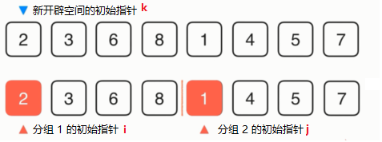
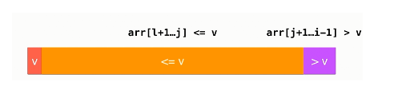
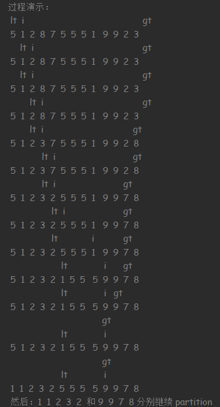

这里介绍的排序算法的时间复杂度为 `O(nlogn)` 的，那么 `O(nlogn)` 比 `O(n^2)` 快多少？

n  | `O(n^2)`| `O(nlogn)` | faster
---|---|---|---
10      |100    |33 | 3
100     |10000  |664 | 15
1000    |10^6   |9966 | 100
10000   |10^8   |132877 | 753
100000  |10^10  |1660974 | 6020

# 排序高级

---
## 1 归并排序

### 什么是归并排序

归并排序（英语：Merge sort，或mergesort），是创建在归并操作上的一种有效的排序算法，效率为 O(nlogn)。1945年由约翰·冯·诺伊曼首次提出。该算法是采用分治法（Divide and Conquer）的一个非常典型的应用，且各层分治递归可以同时进行。**归并操作**（merge），也叫归并算法，指的是将两个已经排序的序列合并成一个序列的操作。归并排序算法依赖归并操作。——维基百科

归并排序的思路，把一个待排序的数组分为两部分，分别让各组进行排序，而划分好的组也是按照这种方式再把自己划分为两部分，分别让各组进行排序，这样直到每组没有一个元素的时候就不用再排序了（单个元素本身就是有序的），然后再对各个两两相对的组进行归并操作（归并是按照顺序进行归并的），直到所有的数组归并为一个数组，排序就完成了。

过程演示：
```java
8 6 2 3 1 5 7 4 //初始化
//分为两组
8 6 2 3 | 1 5 7 4
//再分
8 6 | 2 3 | 1 5 | 7 4
//再分，最后每组只剩下一个元素
8 | 6 | 2 | 3 | 1 | 5 | 7 | 4

//核心过程为归并，两个数组归并后，它们之间是有序的

//归并
6 8 | 2 3 | 1 5 | 4 7
//再归并
2 3 6 8 | 1 4 5  7
//完成排序
1 2 3 4 5 6 7 8
```

把一个 n 个元素的数组不断地进行两两分组，最终可以分为 `log(n)` 个组，完成分组后，再进行归并，如果归并的复杂度可以以 `O(n)` 的复杂度进行，加上每进行一次归并，数组的分组就减少一倍，整个过程就是 `O(nlogn)` 的复杂度。

归并有两种方式：递归法和迭代法。

### 递归法（Top-down，自顶向下）

递归法（Top-down）步骤为：

1. 申请空间，使其大小为两个已经排序序列之和，该空间用来存放合并后的序列
1. 设定两个指针，最初位置分别为两个已经排序序列的起始位置
1. 比较两个指针所指向的元素，选择相对小的元素放入到合并空间，并移动指针到下一位置
1. 重复步骤 3 直到某一指针到达序列尾
1. 将另一序列剩下的所有元素直接复制到合并序列尾



总得说来，一共有三个指种 i j k，分组的两个指针 i 和 j 所指向的值进行对比，因为 j 指向的值小，所以元素 1 放入 k 指针所指向的位置，然后 j 和 k 都往后移动一位。

初步实现：

```cpp
//将arr[l,middle] 和 arr[middle+1,r]两部分进行归并
template<typename T>
static void merge(T *arr, int l, int middle, int r) {
    //为什么是r - l + 1，因为都是闭区间
    T aux[r - l + 1];
    //复制原始区间的数据
    for (int i = l; i <= r; ++i) {
        aux[i - l] = arr[i];
    }

    //开始归并
    int i = l, j = middle + 1;
    for (int k = l; k <= r; ++k) {
        if (i > middle) { // 如果左半部分元素已经全部处理完毕
            arr[k] = aux[j - l];
            j++;
        } else if (j > r) { // 如果右半部分元素已经全部处理完毕
            arr[k] = aux[i - l];
            i++;
        } else if (aux[i - l] < aux[j - l]) { // 左半部分所指元素 < 右半部分所指元素
            arr[k] = aux[i - l];
            i++;
        } else { // 左半部分所指元素 >= 右半部分所指元素
            arr[k] = aux[j - l];
            j++;
        }
    }

}

template<typename T>
static void recursionMerge(T *arr, int l, int r) {

    //递归结束条件，分组的元素个数为 1
    if (l >= r) {
        return;
    }

    //还可以再继续分组就继续分
    int middle = l + ((r - l) / 2);
    //分组后，各组在进行归并排序
    recursionMerge(arr, l, middle);
    recursionMerge(arr, middle + 1, r);
    //两组排序之后，就要进行归并操作了
    merge(arr, l, middle, r);
}

template<typename T>
void mergeSort(T *arr, int size) {
    //递归归并
    recursionMerge(arr, 0, size - 1);
}
```

经过测试发现，在排序随机数组时，归并排序要比插入排序快，但是在排序一个近乎有序的数组时，插入排序却更快了，那么对于这个实现有能有什么优化呢？答案是有的：

1. 减少不必要的归并操作，即当两个数组不进行归并时也是有序的，则可以省去这次归并操作。
2. 递归优化，当递归到一定程度时，比如每组元素少于 15 时，对这个区间的元素转而使用插入排序。因为当数组元素很少时，可以认为它们更可能是近乎有序的，而插入排序对这种近乎有序的数组是有优势的。**这个优化对其他高级排序算法也是通用的，即高级排序算法在递归的最后阶段都可以使用插入排序代替**。

优化后的代码：

```cpp
/** 对arr[l...r]范围的数组进行插入排序 */
template<typename T>
void insertionSort(T arr[], int l, int r) {
    for (int i = l + 1; i <= r; i++) {
        T e = arr[i];
        int j;
        for (j = i; j > l && arr[j - 1] > e; j--) {
            arr[j] = arr[j - 1];
        }
        arr[j] = e;
    }
    return;
}

template<typename T>
static void recursionMergeV2(T *arr, int l, int r) {
    if (r - l <= 15/*递归到一定程度后，使用插入排序*/) {
        insertionSort(arr, l, r);
        return;
    }
    //还可以再继续分组就继续分
    int middle = l + ((r - l) / 2);
    //分组后，各组在进行归并排序
    recursionMergeV2(arr, l, middle);
    recursionMergeV2(arr, middle + 1, r);
    //两组排序之后，就要进行归并操作了
    if (arr[middle] > arr[middle + 1]) {
        merge(arr, l, middle, r);
    }
}
```


### 迭代法(down-up，自底向上）

思路是，先把 n 个元素数组分为 n 组，然后每组进行归并，逐步减少分组数，直到之后变为 1 组。


```cpp
template<typename T>
void mergeSortBU(T *arr, int size) {
    /*sz 表示每组元素的个数，初始个数为 1*/
    for (int sz = 1; sz < size; sz += sz) {/*对每组进行归并*/
        /* i += sz + sz 意思是每次跳过两组
            5 3 6 4 7 1 8 2
            5 3 6 4//第一个两组，0 - 3
            7 1 8 2//第二个两组，4 - 7
         */
        for (int i = 0; i + sz < n; i += sz + sz) {
            /* i += sz + sz 意思是每次跳过两组，
                假设size = 2
                    5 3 6 4 7 1 8 2
                    5 3 6 4//第一个两组，0 - 1 - 3
                    7 1 8 2//第二个两组，4 - 5 - 7
            */
            merge(arr, i, i + sz - 1, min(i + sz + sz - 1, n - 1));
        }
    }
}
```

过程演示：
```java
5 3 6 4 7 1 8 2//初始化

//每组 1 个元素，每相邻的两组进行归并
5-3 | 6-4 | 7-1 | 8-2
3 5 | 4 6 | 1 7 | 2 8

//每组 2 个元素，每相邻的两组进行归并
3-5-4-6 | 1-6-2-8 //3-5 4-6 两组与 1-6-2-8 之间的索引关系
3 4 5 6 | 1 2 7 8

//每组 4 个元素，每相邻的两组进行归并
3 4 5 6 | 1 2 7 8
```

### 自底向上

从上面实现可以看出，这种方式没有使用数组的特性，即通过索引去访问元素，这就非常适用于对链表进行排序了，这个结论是很重要：**自底向上的归并设计适用于对链表进行排序**。

---
## 2 快速排序

快速排序（英语：Quicksort），又称划分交换排序（partition-exchange sort），简称快排，一种排序算法，最早由东尼·霍尔提出。在平均状况下，排序 n 个项目要 O(nlogn)次比较。在最坏状况下则需要 O(n^2) 次比较，但这种状况并不常见。事实上，快速排序通常明显比其他算法更快，因为它的内部循环（inner loop）可以在大部分的架构上很有效率地达成。——维基百科

快速排序使用分治法策略来把一个序列分为两个子序列。步骤为：

1. 从数列中挑出一个元素，称为“基准”（pivot），
2. 重新排序数列，所有比基准值小的元素摆放在基准前面，所有比基准值大的元素摆在基准后面（相同的数可以到任何一边）。在这个分割结束之后，该基准就处于数列的中间位置。这个称为分割（partition）操作。
3. 递归地（recursively）把小于基准值元素的子数列和大于基准值元素的子数列排序。

partition的过程：


三个指针，l 指向基准，j 指向小于 v 部分的右边界，i 指向大于 v 的右边界，每次 i++，去检测新的元素 e 是否小于 v，如果小于就要把新元素移动到 j+1 的位置，j+1 指向的元素移动到 i 的位置，j++ 一次，然后就是反复的 i ++ 试探。最终 j 的左边全都是小于 v的，j 的右边全都是大于 v 的。

初始实现:
```cpp
/**
对arr[left, right]部分进行 partition 操作，返回值 p，使得：
 arr[left , p -1] < arr[p] < arr[p+1, right]
 */
template<typename T>
static int partition(T *arr, int left, int right) {
    T benchmark = arr[left];/*左边为基准*/
    int k = left;
    int j = k;//j前面的都比 benchmark 小
    int i = j + 1;//i后面的都比 benchmark 大
    for (; i <= right; i++) {
        if (arr[i] < benchmark) {
            std::swap(arr[j + 1], arr[i]);
            j++;
        }
    }
    //最后把基准和 j 调换位置
    std::swap(arr[k], arr[j]);
    return j;
}

template<typename T>
static void recursionQuickSort(T *arr, int left, int right) {
    //递归结束条件
    if (left >= right) {
        return;
    }
    int middle = partition(arr, left, right);
    recursionQuickSort(arr, left, middle);
    recursionQuickSort(arr, middle + 1, right);
}

template<typename T>
void quickSort(T *arr, int size) {
    recursionQuickSort(arr, 0, size - 1);
}
```

过程演示：

```java
//选定 4 为基准，设 l=0; j=l=0; i=l+1=1;最后使得 arr[l+1, j] < 4 < arr[j+1,i]

//arr[i] = 2 < 4，交换 arr[j+1]和arr[i]
4 2 1 5 8 7 3 6
//j++=1,i++=2，arr[i] = 1 < 4，交换 arr[j+1]和arr[i]
4 2 1 5 8 7 3 6
//j++=2,i++=3，arr[i] = 5 > 4，不交换
4 1 2 5 8 7 3 6
//j=2,i++=4，arr[i] = 8 > 4，不交换
4 1 2 5 8 7 3 6
//j=2,i++=5，arr[i] = 7 > 4，不交换
4 1 2 5 8 7 3 6
//j=2,i++=6，arr[i] = 3 > 4，交换 arr[j+1]和arr[i]
4 1 2 3 8 7 5 6
//j++=3,i++7，完毕，最后交换 a[l] 和 a[j]
3 1 2 4 8 7 5 6
```

快速排序算法是先整体再局部的思想，先对整个序列进行 partition 操作，让其整体上变得有序，然后不断地对序列进行拆分和对各部分进行 partition 操作，直到最后无法再拆分为止，排序就完成了。

以上只是快速排序最基本的实现，对于这种实现，出来通用的 **递归优化**(递归末端，使用插入排序代替递归) 其实还有很多优化的空间。

### 快排优化-随机基准

快速排序对近乎有序的序列的排序表现得比较慢，而归并排序却恰恰相反。它们的思想都是不断地对序列进行拆分，但是查封的方式却是不同的：

- 快速排序所拆分的两个子序列的大小很可能是不对称的，即一大一小。
- 归并排序每次拆分的两个子序列大小都是基本一致的。


这就导致了快速排序所分出来的子序列的平衡度较差，很难保证树的高度就是 logn，当整个数组完全有序的时候，所拆分的子序列的高度就是 n（n 为元素的个数，参考下图），这时快速排序的时间复杂度将退化为 `O(n^2)`（即链表的形式）。


问题的关键就在于每次进行 partition 操作时所选的基准点是固定的（总是序列的第一个位置），这就造成了算法性能的不稳定，最优的基准点应该是序列中大小恰好处于中间位置的元素，然后我们又没有办法快速找到这个大小恰好的元素，一种优化方式是随机的在这个序列中的某个位置选择一个元素作为基准点，当我们随机的选择基准点时，快排退化为`O(n^2)`的机率是很小的。

```cpp
template<typename T>
static int partitionV2(T *arr, int left, int right) {
    //随机选择基准，把随机选择的基准换到第一位
    std::swap(arr[left], arr[((rand() % (right - left + 1)) + left)]);

    T benchmark = arr[left];
    int j = left;//j前面的都比 benchmark 小
    int i = j + 1;//i后面的都比 benchmark 大

    for (; i <= right; i++) {
        if (arr[i] < benchmark) {
            j++;
            std::swap(arr[j], arr[i]);
        }
    }
    //最后把基准和 j 调换位置
    std::swap(arr[left], arr[j]);
    return j;
}
```


<br/><br/> **依然存在问题**：这个优化在一定程度上减少了快排的时间复杂度退化成`O(n^2)`的机率，但是当面对有大量重复元素的序列当面对有大量重复元素的序列是，快排的时间复杂度还是会退化成`O(n^2)`



参考上图，原因在于在一个序列中有大量重复的元素，而选择的基准恰好是大量重复元素中的一个，序列还是会被分为两个极度不平衡的两个子序列。

### 快排优化-partition的另一种思路

当面对有大量重复元素的序列时，希望也能较为平衡的划分两个序列，方案是将 i 和 j 分别放在数组的两端，对比基准两个指种不断往中间移动。


```cpp
template<typename T>
static int partitionV3(T *arr, int left, int right) {
    //随机选择基准，把随机选择的基准换到第一位
    std::swap(arr[left], arr[((rand() % (right - left + 1)) + left)]);

    T benchmark = arr[left];
    //arr[left+1, i] <= benchmark <= arr[j, right]
    int j = right;
    int i = left + 1;

    while (true) {
        /*没有碰到比自己大的，就一直往右移动*/
        while (i <= right && arr[i] < benchmark) i++;
        /*没有碰到比自己小的，就一直往左移动*/
        while (j >= left + 1 && arr[j] > benchmark) j--;
        /*
            这里必须是i>j，而不能是 i >= j，比如：
                5 3 4 8 9 2 1 10 11 序列，5 为基准，最终 i 和 j 都会指向 10，这时跳出循环就会导致序列
                没有按照预期的顺序进行排列
         */
        if (i > j) {
            break;
        }
        //都不到了屏障就交换位置
        std::swap(arr[i], arr[j]);
        j--;
        i++;
    }
    //最后把基准和 j 调换位置
    std::swap(arr[left], arr[j]);
    return j;
}
```

### 快排优化-Quick Sort 3 Ways

快排的 Quick Sort 3 Ways 方式适用于给含有大量重复元素的序列进行排序。Quick Sort 3 Ways 把序列分为了三部分：

- 大于基准的部分
- 等于基准的部分
- 小于基准的部分

实现这个算法，需要三个指针：

- lt，`arr[l+1, lt] < v`
- gt，`arr[gt, r] > v`
- i，`arr[lt+1, i) == v`


每一次 partition 操作完后，希望数组左边界到 lt 的元素都是小于基准的，lt + 1 到 i 部分的元素都是等于基准的，然后 gt 到 数组右边界的元素都是大于基准的，然后再下一次 partition 操作时，中间部分等于基准的元素都不需要再参与分组了。

最终实现：

```cpp
template<typename T>
static void partition3Ways(T *arr, int left, int right) {

    // 对于小规模数组, 使用插入排序进行优化
    if (right - left <= 15) {
        insertionSort(arr, left, right);
        return;
    }

    swap(arr[left], arr[rand() % (right - left + 1) + left]);

    T v = arr[left];

    int lt = left;     // arr[l+1, lt] < v
    int gt = right + 1; // arr[gt, r] > v
    int i = left + 1;    // arr[lt+1, i) == v

    /*判断基准的arr[i]，i是分界点*/
    while (i < gt) {
        if (arr[i] < v) {
            std::swap(arr[i], arr[lt + 1]);
            lt++;
            i++;
        } else if (arr[i] > v) {
            std::swap(arr[i], arr[gt - 1]);
            gt--;
        } else {//arr[i] == v
            i++;
        }
    }

    std::swap(arr[left], arr[lt]);

    partition3Ways(arr, left, lt - 1);
    partition3Ways(arr, gt, right);
}

template<typename T>
void quickSort3Ways(T *arr, int size) {
    std::srand(NULL);//随机种子
    partition3Ways(arr, 0, size - 1);
}
```

过程演示：



---
## 3 归并排序和快速排序所衍生出的问题

- 归并排序和快速排序都采用了分治算法。
- 使用归并排序求数组的逆数对。
- 取数组中第 n 大的元素，使用快速排序的思路求数组中第 n 大元素，可以将复杂度降低到 `O(n)` 。