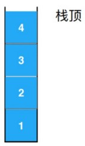
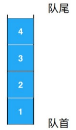
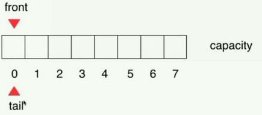
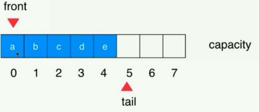
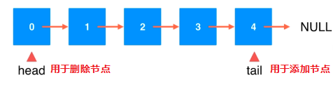
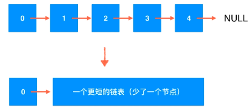
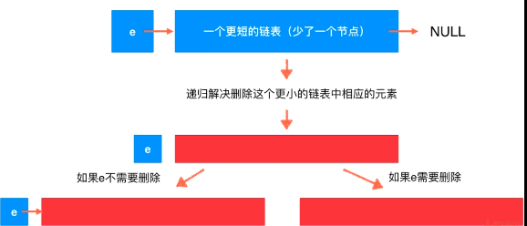
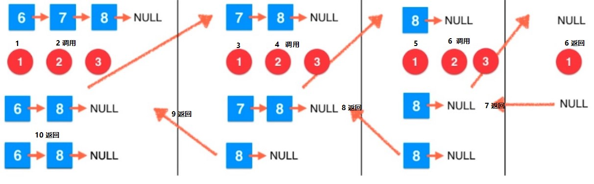
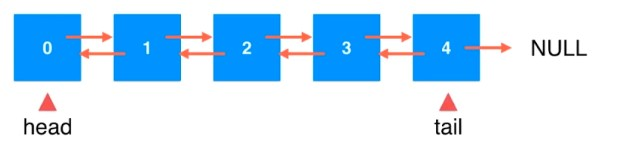
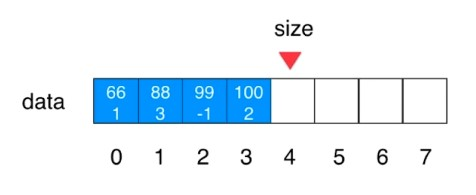

# 线性结构

---
## 1 数组

---
### 1.1 数组简介

在计算机科学中，数组数据结构（英语：array data structure），简称数组（英语：Array），是由相同类型的元素（element）的集合所组成的数据结构，分配一块连续的内存来存储。利用元素的索引（index）可以计算出该元素对应的存储地址。——维基百科

默认数组是静态的，在分配数组是必须指定长度，且之后不允许再修改，数组最⼤的优点是**快速查询**，根据索引对数组中元素进行获取的操作的复杂度是常量级别的。

---
### 1.2 动态数组

默认数组是静态的，不具备动态扩容能力，对底层的静态数组进行封装可以实现动态数组，主要体现在数组的扩容与缩容。

- 添加元素时，如果容量不足则自动扩容，其实就是创建新的数据来代替旧的数组，然后赋值数据到新的数组
- 删除元素时，如果 size 减少到一定值，则缩容
- 实现 resize 方法对数据进行扩容和缩容

---
### 1.3 数组复杂度分析

#### 大 O 表示法

`O(n)` 描述的是算法的运⾏时间和输⼊数据之间的关系：`O(1) , O(n) , O(lgn) , O(nlogn) , O(n^2)`，参考下面代码：

```
public static int sum(int[] nums){
     int sum = 0;
     for(int num: nums)//循环nums.length次
         sum += num;
     return sum;
}
```

上面代码的复杂度是 `O(n)`，数组 nums 的长度觉得循环的次数，该算法的复杂度和 n 呈线性关系。

大 O 表示法研究渐进时间复杂度，描述 n 趋近于⽆穷的情况：

```
T = 2*n + 2 #复杂度：O(n)
T = 2000*n + 10000 #复杂度：O(n)
T = 1*n*n + 0 #复杂度：O(n^2)
```

#### 均摊复杂度(amortized time complexity)

以 Array 的 resize 复杂度为例，整体的 add(包括add、addFirst、addLast) 操作复杂度是 `O(N)` 的，因为大 O 考虑的是最坏的情况。

```
addLast(e) -> O(1)，不需要移动元素
addFirst(e) -> O(n)，每次都要 n 个移动元素
add(index, e) -> O(n/2) = O(n)，这里时间复杂度取决于index，这时假设 index 的取值 0-size 的概率都是一样的。所以每次需要移动的元素为 n/2，而大O标识符是忽略常量的，所以最终改操作的复杂度还是O(n)
```

那么单独的 addLast 的复杂度呢? resize 的复杂度是 `O(n)`，但是 addLast 不会每次都会触发 resize。

- 假设当前 `capacity = 8`，并且每⼀次添加操作都使⽤ addLast
- 9次 addLast 操作，触发 resize，总共进⾏了 17 次基本操作，平均，每次 addLast 操作，进⾏ 2 次基本操作
- 假设 `capacity = n`，n+1 次 addLast，触发 resize，总共进⾏ `2n+1` 次基本操作，平均，每次 addLast 操作，进⾏ 2 次基本操作

这样均摊计算，时间复杂度是 `O(1)`，⽐计算最坏情况有意义。

#### 防止复杂度震荡

复杂度震荡：出现问题的原因：remove 时 resize 过于着急（Eager）

Array 的 add 操作和 remove 操作都有可能造成 resize 操作，如果一个算法在 add 之后立即 remove，则可能造成频繁的 resize 操作，从而时间复杂度直线上升，所以解决的方案是错开 add 和 remove 时造成 resize 的时机，比如 remove 时，size = 容量的 1/4 时才缩容。

---
## 2 栈

### 简介

栈也是⼀种线性结构，相⽐数组，栈对应的操作是数组的⼦集，只能从⼀端添加元素，也只能从⼀端取出元素，这⼀端称为栈顶，栈是⼀种后进先出的数据结构，`Last In First Out (LIFO)`，在计算机的世界⾥，栈拥有着不可思议的作⽤。



---
### 栈的应⽤

- ⽆处不在的 Undo 操作（撤销）
- 程序调⽤的系统栈
- [LeetCode 第20题](https://leetcode-cn.com/problems/valid-parentheses/description/)

---
### 栈的实现

抽象栈的基础操作

```java
public interface Stack<E> {
    void push(E e);
    E pop();
    E peek();
    boolean isEmpty();
    int size();
}
```

可以使用数组或者链表实现栈

---
## 3 队列

### 简介

- 队列也是⼀种线性结构
- 相⽐数组，队列对应的操作是数组的⼦集
- 只能从⼀端（队尾）添加元素，只能从另⼀端（队⾸）取出元素
- 队列是⼀种先进先出的数据结构（先到先得），First In First Out (FIFO)



### 队列的实现

抽象队列的操作

```java
public interface Queue<E> {
    int getSize();
    boolean isEmpty();
    void enqueue(E e);
    E dequeue();
    E getFront();
}
```

队列可使用数组或者链表实现。

### 数组队列的性能问题

数组队列的 `dequeue` 操作的复杂度是 `O(n)` 的，因为每一次操作都需要移动数组中的元素

### 环形队列

使用环形队列，可以将 `dequeue` 操作的复杂度优化为 `O(1)` 级别的。环形队列实现：

- 环形队列的底层也是一个数组
- 有 front 和 tail 两个指针，front 指向第一个元素，tail 最后一个元素的下一个位置
- 队列为空时：`front == tail`
- 队列满时：`(tail + 1) % array.length == front`
- 环形队列的优点在于出队列时不需要移动元素，只需要将 front 向前移动
- 环形队列的底层数组会多两个一个空间，用于帮助判断队列是否已满

初始情况：



添加元素



出队列后


队列已满


---
## 4 单向链表：最简单的动态数据结构

### 简介

数组是静态的数据结构，动态数组也只是对静态数组的封装，内部隐含了 resize 操作，而链表是真正的动态数据结构，

单向链表的特点：

- 有点：真正的动态，不需要处理固定容量的问题
- 缺点：丧失了随机访问的能⼒

### 单向链表实现

数据存储在“节点”（Node）中

```
class Node {
    E e;
    Node next;
} 
```

为链表设⽴虚拟头结点（dummyHead），虚拟头结点本身不存储任何数据，只作为头节点存在，添加了虚拟头结点后可以统一对节点操作逻辑，否则在添加元素时需要针对头节点进行额外的判断，因为头节点自身没有头节点。


### 链表的时间复杂度分析

添加操作：整体`O(n)`
- addLast(e) `O(n)` 
- addFirst(e) `O(1)` 
- add(index, e) `O(n)` 

删除操作：整体`O(n)`
- removeLast(e) `O(n)` 
- removeFirst(e) `O(1)` 
- remove(index, e) `O(n/2) = O(n)` 推导过程与数据数组相同

### 链表的应用

- 使⽤链表实现**栈**
- 使⽤链表实现**队列**：定义两个节点分别是 head 和 tail，head 用于删除元素，当作队列头，tail 用于添加元素，当作队尾部，性能与数组实现的环形链表差距不大。



---
## 5 链表与递归

### LeetCode 第203题

[删除链表中的节点](https://leetcode-cn.com/problems/remove-linked-list-elements/description/)

在链表中删除值为val的所有节点：

```
如 1->2->6->3->4->5->6->NULL，要求删除值为6的节点
返回 1->2->3->4->5->NULL
```

解决方案：

- 不使⽤虚拟头结点
    1. 针对头节点进行特殊判断，把所有头节点为 6 的节点移除，第一次循环
    2. 第二次循环，移除剩余链表中所有的值为 6 的节点
- 使用虚拟头节点
    1. 构建一个虚拟的头节点
    2. 一次循环移除链表中所有的值为 6 的节点

那么还有没有其他方法呢？答案是使用递归。

### 递归：递归的宏观语意

递归本质上，将原来的问题，转化为更⼩的同⼀问题。用同样的算法，解决返回更小的数据。

举例，用递归的方式来进行数组求和：

```
public static int sum(int[] arr, int l){ 
    if(l == arr.length) 
        return 0; 
    return arr[l] + sum(arr, l + 1); 
}
```

递归流程分析：

```
Sum( arr[0…n-1] ) = arr[0] + Sum( arr[1…n-1] ) <--更小的同一问题
Sum( arr[1…n-1] ) = arr[1] + Sum( arr[2…n-1] ) <--更小的同一问题
        .....
Sum( arr[n-1…n-1] ) = arr[n-1] + Sum( [] )     <--更小的同一问题
```

递归的宏观语意分为两部分

- 求解最基本的问题，也就是递归的结束条件
- 把原问题转化成 更⼩的问题

```
public static int sum(int[] arr, int l){ 
    if(l == arr.length) //求解最基本的问题
        return 0; 
    return arr[l] + sum(arr, l + 1); //把原问题转化成 更小的问题
}
```

### 链表天然的递归性

链表可以理解为一个头节点后面挂接这一个更短的链表，而后面那个更短的链表也可以通用这样看待。直到最后的 null 也可以看着一个节点，就是那个最基础的链表。




### 理解递归：递归的微观语义

针对 LeetCode 第203题 采用递归算法，将会变得非常简单：



每一次递归都将链表的头节点和之后的链表分开，在返回的时候，如果头节点的值等于需要删除的值，则返回头节点的下一个节点，否则直接返回头节点。

假设针对链表 `6->7->8->null`，需要删除值为 7 的节点，具体的过程（递归的微观语义）如下：



### 递归的调用栈

递归的调用与函数调用另外一个子函数并没有本质区别，只是它调用的子函数是自己而已，对于每一个函数，都会为该函数创建独立的栈帧，对不同的数据应用不同的算法。


### 递归的调试

为递归方法添加一个新的参数，`int deep`，打印出不同深度是的参数和返回值可以帮助自己更好的理解递归。


---
### 链表拓展

#### 斯坦福大学 18 个链表相关问题

[Linked List Problems](http://cslibrary.stanford.edu/105/LinkedListProblems.pdf)

#### 双向链表

```
class Node{
    E e;
    Node next, prev;
}
```



#### 循环列表


#### 数组链表

```
class Node{
    E e;
    int next;
}
```




