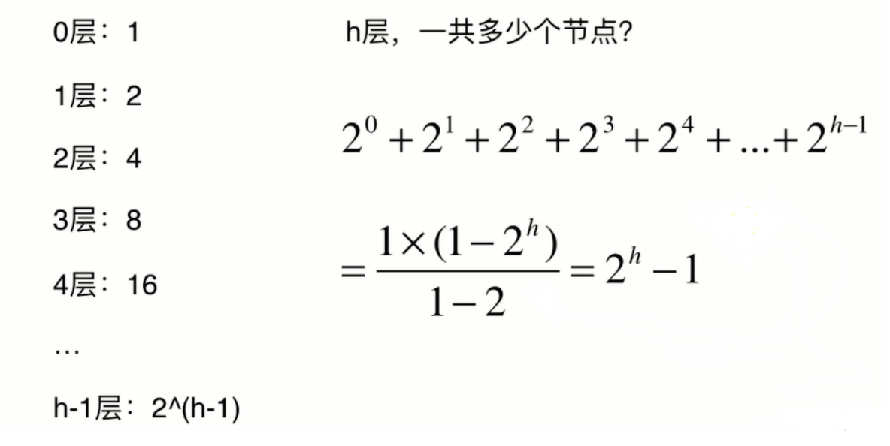
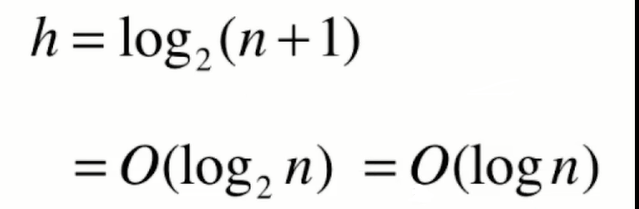
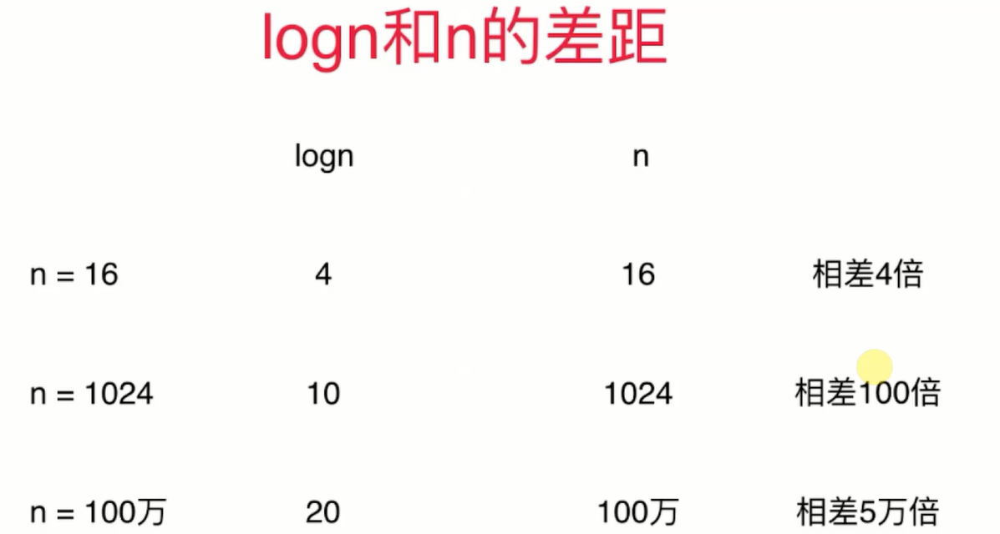

# 集合（set）

---
## 1 集合实现

集合中不能存储重复元素。

应用场景：

- 客户访问统计。
- 词汇量统计。

集合的实现方式：

- 二分搜索树天然支持 set 所有的操作。
- 使用链表实现。

```java
public class BSTSet<E extends Comparable<E>> implements Set<E> {

    private BST<E> mBST;

    public BSTSet() {
        mBST = new BST<>();
    }

    @Override
    public boolean isEmpty() {
        return mBST.getSize() == 0;
    }

    @Override
    public int size() {
        return mBST.getSize();
    }

    @Override
    public boolean contains(E e) {
        return mBST.contains(e);
    }

    @Override
    public void add(E e) {
        mBST.add(e);
    }

    @Override
    public void remove(E e) {
        mBST.remove(e);
    }

}

public class LinkedListSet<E> implements Set<E> {

    private LinkedList<E> mLinkedList;

    public LinkedListSet() {
        mLinkedList = new LinkedList<>();
    }

    @Override
    public boolean isEmpty() {
        return mLinkedList.isEmpty();
    }

    @Override
    public int size() {
        return mLinkedList.getSize();
    }

    @Override
    public boolean contains(E e) {
        return mLinkedList.contains(e);
    }

    @Override
    public void add(E e) {
        if (!contains(e)) {
            mLinkedList.addFirst(e);
        }
    }

    @Override
    public void remove(E e) {
        mLinkedList.removeElement(e);
    }
}
```

---
## 2 性能对比

```java
 public static void main(String... args) {
        System.out.println("bst---------------------------------------------------------------");
        printWords("files/a-tale-of-two-cities.txt", "双城记", new BSTSet<>());
        printWords("files/pride-and-prejudice.txt", "傲慢与偏见", new BSTSet<>());
        System.out.println("linked---------------------------------------------------------------");
        printWords("files/a-tale-of-two-cities.txt", "双城记", new LinkedSet<>());
        printWords("files/pride-and-prejudice.txt", "傲慢与偏见", new LinkedSet<>());
    }

    private static void printWords(String path, String name, Set<String> stringBST) {
        long start = System.nanoTime();
        ArrayList<String> words = new ArrayList<>();
        FileOperation.readFile(path, words);
        System.out.println(name + "单词数：" + words.size());
        for (String word : words) {
            stringBST.add(word);
        }
        System.out.println(name + "词汇量：" + stringBST.size());
        long  used = System.nanoTime() -start;
        System.out.println("用时" + (used / 1000000000.0) + "s");
    }
```

结果：

        bst---------------------------------------------------------------
        双城计单词数：141489
        双城计词汇量：9944
        用时0.10852926s
        傲慢与偏见单词数：125901
        傲慢与偏见词汇量：6530
        用时0.056738372s
        linked---------------------------------------------------------------
        双城计单词数：141489
        双城计词汇量：9944
        用时3.914412906s
        傲慢与偏见单词数：125901
        傲慢与偏见词汇量：6530
        用时2.347496207s

### 链表复杂度

复杂度

- 查：O(n)
- 增（本身是常数级的，但需要先查）：O(n)
- 删：O(n)

### BST 复杂度

- 查：O(h)，h 是树的高度
- 增：O(h)，h 是树的高度
- 删：O(h)，h 是树的高度

对于满二叉树来说：



```
    h-1 层有 2^(h -1) 个节点
    h 层的树有 2^1 + 2^2 + ... + 2^(h-1) = (2^h) -1
```

由此推测复杂度是（n是节点数）：



### log(n) 和 O(n) 复杂度对比



### BST 有局限性

但是 BST 有局限性，BST 中的数据如果是按照大小顺序依次添加的，那么其将退化成链表，复杂度明显提高，变为 O(n)。而平衡二叉树没有这个问题。

### 集合的复杂度对比


---
## 3 [LeetCode804](https://leetcode-cn.com/problems/unique-morse-code-words/description/)

唯一摩尔斯密码词

```java
class Solution {
    
    private String[] codes = {".-", "-...", "-.-.", "-..", ".", "..-.", "--.", "....", "..", ".---", "-.-", ".-..", "--", "-.", "---", ".--.", "--.-", ".-.", "...", "-", "..-", "...-", ".--", "-..-", "-.--", "--.."};

    public int uniqueMorseRepresentations(String[] words) {
        //这里使用java的TreeSet，TreeSet底层是平衡二叉树。
        TreeSet<String> treeSet = new TreeSet<>();
        for (String word : words) {
            StringBuilder stringBuilder = new StringBuilder();
            for (int i = 0; i < word.length(); i++) {
                stringBuilder.append(codes[word.charAt(i) - 'a']);
            }
            treeSet.add(stringBuilder.toString());
        }
        int size = treeSet.size();
        System.out.println(size);
        return size;
    }
}
```

---
## 4 集合的有序性

- 使用二分搜索树实现的集合是有序的。
- 使用哈希表实现的集合是无序的。