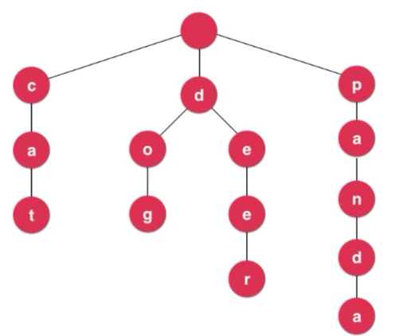
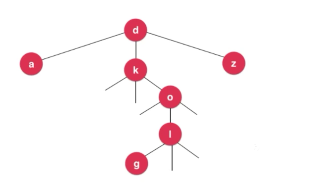

# Trie（字典树）

---
## 1 什么是 Trie

在计算机科学中，trie，又称前缀树或字典树，是一种有序树，用于保存关联数组，其中的键通常是字符串。与二叉查找树不同，键不是直接保存在节点中，而是由节点在树中的位置决定。一个节点的所有子孙都有相同的前缀，也就是这个节点对应的字符串，而根节点对应空字符串。一般情况下，不是所有的节点都有对应的值，只有叶子节点和部分内部节点所对应的键才有相关的值。——维基百科

Trie 可以说是为处理字符串设计的数据结构。

场景：根据字符串的查询对于的值

- 使用树实现：查询的复杂度是 O(logn)，如果有 100万(2<sup>20</sup>)个条目，那么需要 20 词操作。
- 使用 Trie 实现：查询的复杂度与保存的据数据量无关，而与查询字符串的长度有关，如果查询的 "hello" 对于的值，则只需要五次操作，而大部分常用单词的长度是小于 10 的。



如果处理的是英文的话，那么每个节点有 26 个指向下一个节点的指种，Node 可以设计为：

```java
class Node{
    private Node next[26];
    private char c;
}
```

考虑到不同语言和不同环境，需要更灵活的设计：

- 让每个节点可以指向若干个 next 节点，我们可以使用 Map。
- 节点的键不是直接保存在节点中，**而是由节点在树中的位置决定** 。所以节点不需要一个字段来保存它对应的 char。这一点需要理解。
- 在 Trip 存储的单词中，某个单词的前缀本身可能也是一个单词，如果在 Trip 中搜索这个前缀单词，不应该认为 Trip 中存储了这个单词，所以每个节点上需要一个标记，来标识这个节点是不是单词的结尾。

```java
class Node{
    private boolean isWord;
    private Map<Chaacacter,Node> next;
}
```


图中包含的单词有：cat、dog、deer、pan、panda。

---
## 2 编程实现 Trip

```java
public class Trip {

    private Node root;
    private int size;

    public Trip() {
        root = new Node();
        size = 0;
    }

    private class Node {
        private Map<Character, Node> next;
        private boolean isWord;

        private Node(boolean isWord) {
            this.isWord = isWord;
            next = new TreeMap<>();
        }

        private Node() {
            this(false);
        }

        @Override
        public String toString() {
            return "Node{" +
                    "next=" + next +
                    ", isWord=" + isWord +
                    '}';
        }
    }

    public void add(String word) {
        if (word == null) {
            return;
        }
        int length = word.length();
        Node cur = root;
        for (int i = 0; i < length; i++) {
            char key = word.charAt(i);
            if (cur.next.get(key) == null) {
                cur.next.put(key, new Node());
            }
            cur = cur.next.get(key);
        }
        //最后一个节点了，现在标识它是一个单词的结尾
        if (!cur.isWord) {
            cur.isWord = true;
            size++;
        }
    }

    @SuppressWarnings("all")
    public boolean contains(String word) {
        if (word == null) {
            return false;
        }
        int length = word.length();
        Node cur = root;
        for (int i = 0; i < length; i++) {
            char key = word.charAt(i);
            if (cur.next.get(key) == null) {
                return false;
            }
            cur = cur.next.get(key);
        }
        return cur.isWord;
    }

    /*判断Trip是否有以 prefix 为前缀的单词*/
    @SuppressWarnings("all")
    public boolean isPrefix(String prefix) {
        if (prefix == null) {
            return false;
        }
        int length = prefix.length();
        Node cur = root;
        for (int i = 0; i < length; i++) {
            char key = prefix.charAt(i);
            if (cur.next.get(key) == null) {
                return false;
            }
            cur = cur.next.get(key);
        }
        return true;
    }

    public int getSize() {
        return size;
    }

    //递归的方式删除单词
    public void removeOptimize(String word) {
        if (word == null) {
            return;
        }
        removeOptimize(root, word, 0);
    }

    private boolean removeOptimize(Node node, String word, int index) {
        /*到达最后的位置*/
        /*最后一个节点的删除条件，它没有节点了*/
        if (index == word.length() - 1) {
            size--;
            boolean nextIsEmpty = node.next.get(word.charAt(index)).next.isEmpty();
            if (nextIsEmpty) {
                return true;
            } else {
                node.isWord = false;
                return false;
            }
        }

        /*链路上的节点的删除条件：不是单词结尾并且没有子节点了*/
        char c = word.charAt(index);
        Node next = node.next.get(c);
        if (next != null) {
            boolean ret = removeOptimize(next, word, index + 1);
            if (ret) {
                node.next.remove(c);
            }
            return ret && node.next.isEmpty() && !node.isWord;
        } else {
            return false;
        }
    }

    //遍历的方式删除单词
    public void remove(String word) {
        if (word == null) {
            return;
        }
        int length = word.length();
        List<Node> parents = new ArrayList<>();
        Node cur = root;
        parents.add(cur);
        for (int i = 0; i < length; i++) {
            Node node = cur.next.get(word.charAt(i));
            if (node == null) {
                return;
            } else {
                parents.add(node);
                cur = node;
            }
        }
        size--;

        /*最后一个节点的删除条件，它没有节点了*/
        if (cur.next.isEmpty()) {
            int index = parents.indexOf(cur) - 1;
            parents.get(index).next.remove(word.charAt(index));
            parents.remove(cur);
        } else {
            /*否则改变标记*/
            cur.isWord = false;
            return;
        }

        /*链路上的节点的删除条件：不是单词结尾并且没有子节点了*/
        int size = parents.size();
        for (int i = size - 1; i > 0; i--) {
            Node node = parents.get(i);
            if (node.next.isEmpty() && !node.isWord) {
                parents.get(i - 1).next.remove(word.charAt(i - 1));
            } else {
                break;
            }
        }
    }

    @Override
    public String toString() {
        return "Trip{" +
                "root=" + root +
                ", size=" + size +
                '}';
    }
    
}
```

---
## [LeetCode 208](https://leetcode-cn.com/problems/implement-trie-prefix-tree/description/)

LeetCode 208要求实现一个 Trip，使用上面结构即可。

---
## [LeetCode 211](https://leetcode-cn.com/problems/add-and-search-word-data-structure-design/description/)

带模式匹配的 Trip 查询

```java
public class LeetCode_211 {

    private Node root;

    public LeetCode_211() {
        root = new Node();
    }

    private class Node {
        private Map<Character, Node> next;
        private boolean isWord;

        private Node(boolean isWord) {
            this.isWord = isWord;
            next = new TreeMap<>();
        }

        private Node() {
            this(false);
        }
    }

    @SuppressWarnings("all")
    public void addWord(String word) {
        if (word == null) {
            return;
        }
        int length = word.length();
        Node cur = root;
        for (int i = 0; i < length; i++) {
            char key = word.charAt(i);
            if (cur.next.get(key) == null) {
                cur.next.put(key, new Node());
            }
            cur = cur.next.get(key);
        }
        if (!cur.isWord) {
            cur.isWord = true;
        }
    }

    /*判断node为根节点的Trip中是否包含wold，wold可以带有模式匹配，字符 . 可以匹配任意单词*/
    @SuppressWarnings("all")
    public boolean search(String word) {
        return match(root, word, 0);
    }

    private boolean match(Node node, String word, int index) {
        int length = word.length();
        if (index == length) {
            return node.isWord;
        }
        char c = word.charAt(index);
        if (c == '.') {//. 可以匹配任何字符
            for (Character character : node.next.keySet()) {
                if (match(node.next.get(character), word, index + 1)) {
                    return true;
                }
            }
            return false;
        } else {
            Node next = node.next.get(c);
            return next != null && match(next, word, index + 1);
        }
    }
    
}
```

---
## [LeetCode 677](https://leetcode-cn.com/problems/map-sum-pairs/description/)

思路：找到匹配前缀的最后一个节点，然后累加该节点以及后面所有节点的值。

```java
public class LeetCode_677 {

    private Node root;

    public LeetCode_677() {
        root = new Node();
    }

    private class Node {
        private Map<Character, Node> next;
        private int value;

        private Node(int value) {
            this.value = value;
            next = new TreeMap<>();
        }

        private Node() {
            this(0);
        }

    }

    @SuppressWarnings("all")
    public void insert(String key, int val) {
        if (key == null) {
            return;
        }
        int length = key.length();
        Node cur = root;
        for (int i = 0; i < length; i++) {
            char c = key.charAt(i);
            if (cur.next.get(c) == null) {
                cur.next.put(c, new Node());
            }
            cur = cur.next.get(c);
        }
        cur.value = val;
    }

    public int sum(String prefix) {
        if (prefix == null) {
            return 0;
        }
        int length = prefix.length();
        Node cur = root;
        //找到最后节点匹配前缀的那个节点
        for (int i = 0; i < length; i++) {
            Node node = cur.next.get(prefix.charAt(i));
            if (node == null) {
                return 0;
            }
            cur = node;
        }
        return sum(cur);
    }

    private int sum(Node cur) {
        if (cur.next.isEmpty()) {
            return cur.value;
        }

        int sum = cur.value;
        for (Character character : cur.next.keySet()) {
            sum += sum(cur.next.get(character));
        }
        return sum;
    }
    
}
```

---
## 6 拓展

### Trip 的空间局限性与压缩字典树

压缩字典树 CompressedTrip：


### Ternary Search Tree（三分搜索字典树）

三叉树的结构实现字典树



### 后缀树

略

### 更多字符串相关问题

- KMP
- Boyer-Moore
- Rabin-Karp

### 文件压缩

- 哈夫曼树
- 其他压缩算法

### 模式匹配

- 编译原理
- DNA