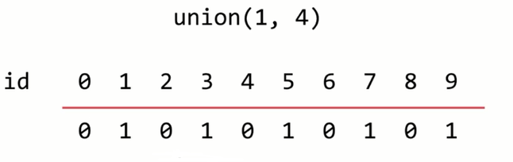
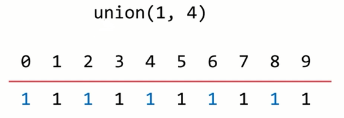
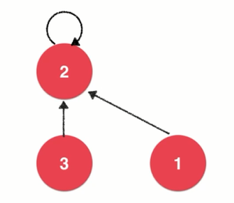
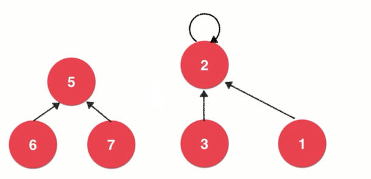
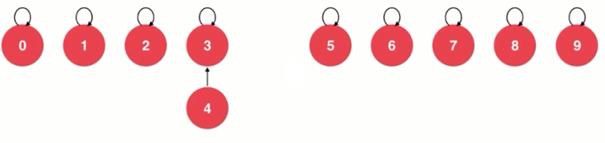
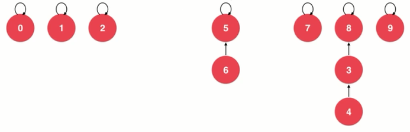
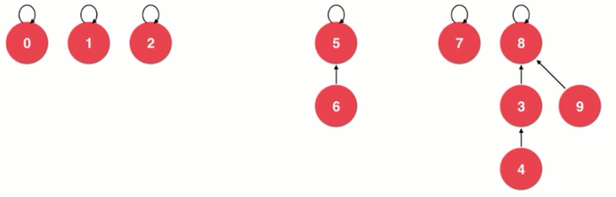
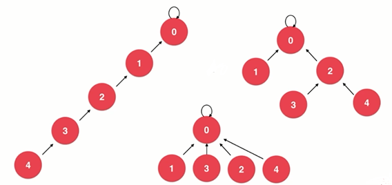
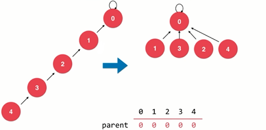

# 并查集

---
## 1 什么是并查集

在计算机科学中，并查集是一种 **树型** 的数据结构，用于处理一些不交集（Disjoint Sets）的合并及查询问题。——维基百科

并查集解决的问题：网络中节点间的连接状态（抽象的网络）。比如下图中，判断任意两点是否可以连接：


有一个联合-查找算法（union-find algorithm）定义了两个用于此数据结构的操作：

- union(p, q)：将两个子集合并成同一个集合。
- isConnected(p, q)：确定两个元素是否属于同一子集。

并查集不考虑向集合中添加或删除元素的操作。

### 并查集的书籍表示


- 给元素进编码。
- 对于元素，并查集存储的是元素所属集合的 id。
- 元素的所属集合的 id 相同，则它们就是连接的。

并查集的接口：

```java
public interface UnionFind {

    boolean isConnected(int p, int q);

    void unionElements(int p, int q);

    int getSize();

}
```


---
## 2  使用数组实现 QuickFind 版

使用数组来模拟并查集。数组记录每个元素所属集合。

### 合并操作

将两个元素合并，其实是将与它们连接的所有元素都进行合并。





### 复杂度

- isConnected：`O(1)`
- unionElements：`O(n)`

### 代码实现

```java
public class UnionFind_V1 implements UnionFind {

    //记录所有元素所属组
    private int[] ids;

    /**
     * @param size 该并查集需要处理多少个元素
     */
    public UnionFind_V1(int size) {
        ids = new int[size];
        //默认所有元素都不是连接的
        for (int i = 0; i < ids.length; i++) {
            ids[i] = i;
        }
    }

    /**
     * p 和 q 是否属于同一个集合。
     */
    @Override
    public boolean isConnected(int p, int q) {
        return find(p) == find(q);
    }

    private int find(int index) {
        if (index < 0 || index >= ids.length) {
            throw new IndexOutOfBoundsException();
        }
        return ids[index];
    }

    @Override
    public void unionElements(int p, int q) {
        int qId = find(q);
        int pId = find(p);
        if (pId == qId) {
            return;
        }
        // 合并过程需要遍历一遍所有元素, 将两个元素的所属集合编号合并
        for (int i = 0; i < ids.length; i++) {
            if (ids[i] == qId) {
                ids[i] = pId;
            }
        }
    }

    @Override
    public int getSize() {
        return ids.length;
    }
    
}
```

---
## 3 QuickUnion 版，使用树实现

### 树的结构

将每个元素看作一个节点，子节点指向自己的父节点，根节点指向自己：


### 合并操作

如果一个节点 1 要与节点 3 合并，就只需要让 3 指向 1 的父节点：



如果并查集中有另一棵树，节点 7 想和节点 3 合并：



只需要让节点 7 的父节点 5 指向 节点 3 的父节点 2 即可：

可以看出，并查集中树的节点只有一个指针。

### 默认状态

默认状态下，并查集中所有的节点都指向自己，此时并查集是一个森林，里面有非常多的树。

 

如果希望节点 4 和节点 3 合并，即`union(4, 3)`，只需要改变 4 指向 3 即可。

 

`union(3, 8)`，让节点 3 指向 节点 8：

 

`union(6, 5)`，让节点 6 指向 节点 5：

 

`union(9, 4)`，让节点 9 指向 节点 4 的根节点，这里有一个查询操作，即查询节点 4 的根节点，过程非常简单，不断向上遍历，直到找到那个指向自己的节点就是根节点，这里为什么不让节点 9 直接指向节点 4 呢，因为要防止照成过长的查询链：

 

以上合并操作的复杂度是 `O(h)`，h 是树的高度。

### 代码实现

```java
public class UnionFind_V2 implements UnionFind {

    //记录所有元素所属组
    private int[] parent;

    /**
     * @param size 该并查集需要处理多少个元素
     */
    public UnionFind_V2(int size) {
        parent = new int[size];
        //默认所有元素都不是连接的
        for (int i = 0; i < parent.length; i++) {
            parent[i] = i;
        }
    }

    /**
     * p 和 q 是否属于同一个集合。
     */
    @Override
    public boolean isConnected(int p, int q) {
        return find(p) == find(q);
    }

    //查找元素p所对应的集合编号
    private int find(int p) {
        if (p < 0 || p >= parent.length) {
            throw new IndexOutOfBoundsException();
        }
        while (p != parent[p]) {
            p = parent[p];//往上移动
        }
        return p;
    }

    // 合并元素p和元素q所属的集合，O(h) 的复杂度, h为树的高度
    @Override
    public void unionElements(int p, int q) {
        int pRoot = find(p);
        int qRoot = find(q);
        if (qRoot == pRoot) {
            return;
        }
        //让 p 的根节点的编号指向 q 的根节点
        parent[pRoot] = qRoot;
    }

    @Override
    public int getSize() {
        return parent.length;
    }

}
```

### V1 和 V2 性能对比

```java
public class Main {

    public static void main(String... args) {
        testUFPerformance();
    }

    private static void testUFPerformance() {
        int size = 100000;
        int m = 100000;
        //int m = 10000;
        UnionFind unionFind1 = new UnionFind_V1(size);
        UnionFind unionFind2 = new UnionFind_V2(size);
        System.out.println("unionFind1 time " + testUF(unionFind1, m));
        System.out.println("unionFind2 time " + testUF(unionFind2, m));
    }

    private static double testUF(UnionFind unionFind, int m) {
        int size = unionFind.getSize();
        Random random = new Random();
        long start = System.nanoTime();

        for (int i = 0; i < m; i++) {
            int a = random.nextInt(size);
            int b = random.nextInt(size);
            unionFind.unionElements(a, b);
        }

        for (int i = 0; i < m; i++) {
            int a = random.nextInt(size);
            int b = random.nextInt(size);
            unionFind.isConnected(a, b);
        }

        long end = System.nanoTime();

        return (end - start) / Math.pow(10, 9);
    }

}
```

不同情况下的测试结果：

```
//int size = 100000; int m = 10000;
unionFind1 time 0.295450245
unionFind2 time 0.001867133

//int size = 100000;int m = 100000;
unionFind1 time 5.13548859
unionFind2 time 9.729137372
```

经过多次测试发现，当操作数 m 在 10000 时，unionFind2 稍稍优于 unionFind1 。但是当操作数 m 在 100000 时，unionFind1 比 unionFind2 要快很多，有以下两点原因：

- unionFind1 的 unionElements 虽然是 `O(n)` 的复杂度，但是这个操作是对一片连续的内存空间进行遍历， JVM 对其有特别的优化。
- unionFind2 虽然是用树实现的并查集，但是在合并的时候并没有使用一定的方法对树的合并操作进行优化，比如如果 A 树的深度是 3，B 树的深度是 1，那么如果以是 A 树的根节点指向 B 树的方式合并，就会生成一颗深度为 4 的树，再进一步考虑最坏的情况就是，如果一直以这种方式进行两棵树的合并，树就会退化成链表。而链表的遍历速度是很慢的。

---
## 4 基于 size 的优化

对于上面性能对比分析后，在两棵树进行合并的时候，先判断两棵树所包含 **节点的数量** ，让数量小的树的根节点指向数量大的树的根节点，以此最大化避免构建深度很深的树。实现方式就再使用一个数组记录每棵树的节点数：

```java
public class UnionFind_V3 implements UnionFind {

    private int[] parent;//记录所有元素所属组
    private int[] sz;//sz[i] 表示以i为根节点的集合所表示树的节点数

    /**
     * @param size 该并查集需要处理多少个元素
     */
    public UnionFind_V3(int size) {
        parent = new int[size];
        sz = new int[size];
        //默认所有元素都不是连接的
        for (int i = 0; i < parent.length; i++) {
            parent[i] = i;
            sz[i] = 1;//默认每棵树的数量都是1
        }
    }

    /**
     * p 和 q 是否属于同一个集合。
     */
    @Override
    public boolean isConnected(int p, int q) {
        return find(p) == find(q);
    }

    //查找元素 p 所对应的集合编号
    private int find(int p) {
        if (p < 0 || p >= parent.length) {
            throw new IndexOutOfBoundsException();
        }
        /*p的身份是值也是索引，可以认为索引值就是元素值*/
        while (p != parent[p]/*获取数据p的父节点索引，如果节点没有指向它自身，就不是根节点*/) {
            p = parent[p];//往上移动
        }
        return p;
    }

    // 合并元素p和元素q所属的集合，O(h) 的复杂度, h为树的高度
    @Override
    public void unionElements(int p, int q) {
        int pRoot = find(p);
        int qRoot = find(q);
        if (qRoot == pRoot) {
            return;
        }
        // 根据两个元素所在树的元素个数不同判断合并方向
        // 将元素个数少的集合合并到元素个数多的集合上
        if (sz[pRoot] > sz[qRoot]) {
            //让 p 的根节点的编号指向 q 的根节点
            parent[qRoot] = pRoot;
            sz[pRoot] += sz[qRoot];
        } else {
            //让 p 的根节点的编号指向 q 的根节点
            parent[pRoot] = qRoot;
            sz[qRoot] += sz[pRoot];
        }
    }

    @Override
    public int getSize() {
        return parent.length;
    }

}
```

### V1 和 V2、V3 性能对比

```java
    private static void testUFPerformance() {
        int size = 100000;
        int m =     100000;
        UnionFind unionFind1 = new UnionFind_V1(size);
        UnionFind unionFind2 = new UnionFind_V2(size);
        UnionFind unionFind3 = new UnionFind_V3(size);
        System.out.println("unionFind1 time " + testUF(unionFind1, m));
        System.out.println("unionFind2 time " + testUF(unionFind2, m));
        System.out.println("unionFind3 time " + testUF(unionFind3, m));
    }
```

结果：

    unionFind1 time 5.093343623
    unionFind2 time 9.989284627
    unionFind3 time 0.01409068

---
## 5 基于 Rank 的优化

基于方案 3，回归到问题的本质是避免两棵树在合并时尽量不要使树的深度增加，而方案 3 使用的判断量两棵树的节点数，让节点数量小的树的根节点指向节点数量大的树的根节点，这并不是最佳方案，比如以下场景，`union(4,2)`：


- 如果时基于 size 的判断，那么应该让跟跟根节点 8 指向根节点 7，从而生成了深度为 4 的树。
- 如果时基于树的深度的判断，那么应该让跟跟根节点 7 指向根节点 8，从而生成树的深度为还是 3。

```java
public class UnionFind_V4 implements UnionFind {

    private int[] parent;//记录所有元素所属组
    private int[] rank;//rank[i] 表示以i为根节点的集合所表示树的层数。

    /**
     * @param size 该并查集需要处理多少个元素
     */
    public UnionFind_V4(int size) {
        parent = new int[size];
        rank = new int[size];
        //默认所有元素都不是连接的
        for (int i = 0; i < parent.length; i++) {
            parent[i] = i;
            rank[i] = 1;//默认每棵树的数量都是1
        }
    }

    /**
     * p 和 q 是否属于同一个集合。
     */
    @Override
    public boolean isConnected(int p, int q) {
        return find(p) == find(q);
    }

    //查找元素 p 所对应的集合编号
    private int find(int p) {
        if (p < 0 || p >= parent.length) {
            throw new IndexOutOfBoundsException();
        }
        /*p的身份是值也是索引，可以认为索引值就是元素值*/
        while (p != parent[p]/*获取数据p的父节点索引，如果节点没有指向它自身，就不是根节点*/) {
            p = parent[p];//往上移动
        }
        return p;
    }

    // 合并元素p和元素q所属的集合，O(h) 的复杂度, h为树的高度
    @Override
    public void unionElements(int p, int q) {
        int pRoot = find(p);
        int qRoot = find(q);
        if (qRoot == pRoot) {
            return;
        }
        // 根据两个元素所在树的层级数不同判断合并方向
        // 将层级数少的集合合并到层级数多的集合上
        if (rank[pRoot] < rank[qRoot]) {
            //让 p 的根节点的编号指向 q 的根节点
            parent[pRoot] = qRoot;
            //rank[qRoot]不需要增加，因为深度少的树合并到它上面，它自身的深度时不会郑家的
        } else if (rank[qRoot] < rank[pRoot]) {
            //让 p 的根节点的编号指向 q 的根节点
            parent[qRoot] = pRoot;
            //同理，不需要改变树的高度
        } else {//rank[qRoot] == rank[pRoot]
            parent[pRoot] = qRoot;
            rank[qRoot] += 1;
        }
    }

    @Override
    public int getSize() {
        return parent.length;
    }

}
```

### v3、v4 性能对比

```java
    private static void testUFPerformance() {
        //千万级
        int size = 1000000;
        int m =     1000000;
        //UnionFind unionFind1 = new UnionFind_V1(size);
        //UnionFind unionFind2 = new UnionFind_V2(size);
        UnionFind unionFind3 = new UnionFind_V3(size);
        UnionFind unionFind4 = new UnionFind_V4(size);
        //System.out.println("unionFind1 time " + testUF(unionFind1, m));
        //System.out.println("unionFind2 time " + testUF(unionFind2, m));
        System.out.println("unionFind3 time " + testUF(unionFind3, m));
        System.out.println("unionFind4 time " + testUF(unionFind4, m));
    }
```

结果：

    unionFind3 time 0.190861626
    unionFind4 time 0.186772115

发现基于千万级上的操作，基于 rank 的优化比 基于 size 的优化稍微快一些，它们之间的差价非常小，但是基于 rank 的优化在逻辑上更加合理，所以实际开发中一般选择的是基于 rank 的优化。

---
## 6 路径压缩

下面三棵树在并查集中所表示的意义是完全一直的，即 0、1、2、3、4 五个元素属于同一个集合，但是中间的树的深度是最优的，不管是基于 size 还是基于 rank 的优化，都无法避免创建层级较多的树，而如果能使用某种方式，把类似左边的树优化成中间的树，就可以更大的提升并查集的性能了。那么如果进行优化呢？



这个优化的操作就是在 find 中进行的，比如在进行 `find(4)` 操作时，我们只关心节点 4 的根节点是谁，而不一定要将树中所有的节点都遍历一遍，如果在向上遍历的时候，同时执行 `parent[p] = parent[parent[p]]`，意思就是将 p 节点执行 p 节点父节点的父节点，这样就减少了树的层级了。具体过程如下图：


编码实现与 v4 版相同，只需要添加上 `parent[p] = parent[parent[p]];` 即可，这里不需要维护 rank 中各树的层级树，rank 本意就是排名、等级，只是作为两棵树合并时的参考值，并不需要非常准备，而且 `parent[p] = parent[parent[p]];` 对于任何树的压缩都是公平的，所以 rank 中的数据一般也是正确的。

```java
 //查找元素 p 所对应的集合编号
    private int find(int p) {
        if (p < 0 || p >= parent.length) {
            throw new IndexOutOfBoundsException();
        }
        /*p的身份是值也是索引，可以认为索引值就是元素值*/
        while (p != parent[p]/*获取数据p的父节点索引，如果节点没有指向它自身，就不是根节点*/) {
            parent[p] = parent[parent[p]];//路径压缩
            p = parent[p];//往上移动
        }
        return p;
    }
```

---
## 7 使用递归实现最大化路径压缩

对于每一棵树，在 find 过程中都压缩成最优的状态，使用的是递归的算法：



编码实现与 v4 版相同，只需要改变一下 find 的逻辑：

```java
 //查找元素 p 所对应的集合编号
    private int find(int p) {
        if (p < 0 || p >= parent.length) {
            throw new IndexOutOfBoundsException();
        }
        /*p的身份是值也是索引，可以认为索引值就是元素值*/
        if (p != parent[p]/*获取数据p的父节点索引，如果节点没有指向它自身，就不是根节点*/) {
            parent[p] = find(parent[p]);
        }
        return parent[p];
    }
```