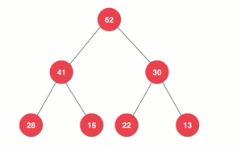
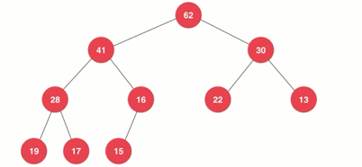
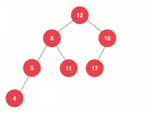
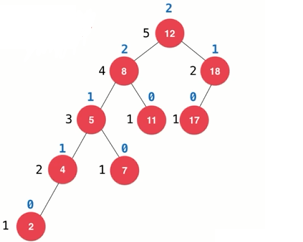
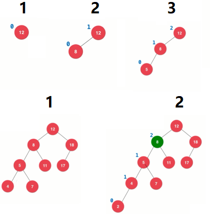
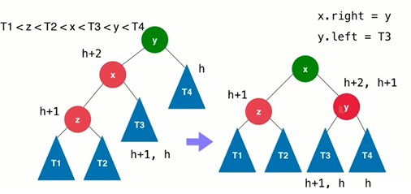
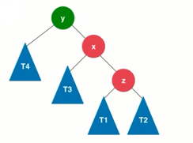
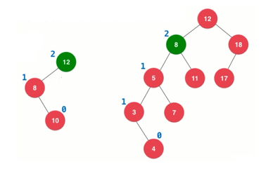
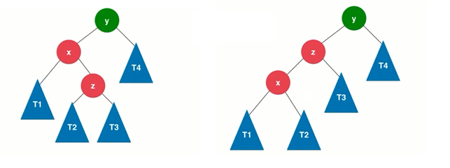
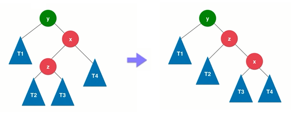

# AVL 树

## 1 什么是 AVL 树

在计算机科学中，AVL树是最早被发明的自平衡二叉查找树。在AVL树中，任一节点对应的两棵子树的最大高度差为1，因此它也被称为高度平衡树。查找、插入和删除在平均和最坏情况下的时间复杂度都是 `O(logn)`。增加和删除元素的操作则可能需要借由一次或多次树旋转，以实现树的重新平衡。AVL树得名于它的发明者G. M. Adelson-Velsky和Evgenii Landis——维基百科。

### 满二叉树、完全二叉树、平衡二叉树

- 满二叉树：一棵高深度为 h，且有 2<sup>h-1</sup> 个节点的二叉树，特点：每一层上的结点数都是最大结点数。



- 完全二叉树：设二叉树的高度为 h，除第 h 层外，其它各层 (1～h-1) 的结点数都达到最大个数，第 h 层从右向左连续缺若干结点，这就是完全二叉树。



- 线段树中的平衡二叉树：线段树是一个平衡的二元树，所有叶子到根的距离最多只差1

---
## 2 AVL 树实现分析

AVL 树中定义的平衡二叉树条件宽松一些：任一节点对应的两棵子树的最大高度差为 1。如下图所示的树满足这个定义：



- AVL 树的高度和节点数的关系也是 O(logn)的。
- 树种的每个节点需要维护自己的高度，父节点的高度是两个子节点中高度最大的那个 +1。
- 向树中添加节点时，需要根据树的高度调整树。这需要一个 **平衡因子** 来帮助判断是否需要调整，平衡因子的计算很简单，对任意一个节点而言，就是它左子树和右子树的高度差。

使用平衡因子可以看出树的任意节点是否破坏了 AVL 树的条件：



节点 12 的平衡因子超过了 1，节点 12 打破了平衡。

### 记录数的高度和打印平衡因子

>以下代码源自对之前二分搜索树的优化。

AVL 树是对之前的二分搜索树的优化，由于需要维护节点的高度，所以 Node 需要添加一个新的字段 height：

```java
    private class Node {

        Key key;
        Value value;
        Node left;
        Node right;
        int height;

        Node(Key key, Value value) {
            this.key = key;
            this.value = value;
            this.height = 1;//默认高度是 1
        }
    }
```

然后在添加节点的过程中维护节点树的高度和打印一下各个节点的平衡因子：

```java
private Node addImproved(Node node, Key key, Value value) {
        if (node == null) {
            size++;
            return new Node(key, value);
        }
        if (key.compareTo(node.key) < 0) {
            node.left = addImproved(node.left, key, value);
        } else if (key.compareTo(node.key) > 0) {
            node.right = addImproved(node.right, key, value);
        } else {// e.compareTo(node.e) == 0
            node.value = value;
        }

        //维护高度
        node.height = 1 + Math.max(getHeight(node.left), getHeight(node.right));
        //打印平衡因子
        System.out.println(getBalanceFactor(node));

        return node;
    }

    private int getHeight(Node node) {
        return node == null ? 0 : node.height;
    }

    private int getBalanceFactor(Node node) {
        return node == null ? 0 : getHeight(node.left) - getHeight(node.right);
    }
```

添加一些辅助方法来帮助我们判断当前树是否满足二分搜索树和AVL树的条件：

```java
    // 判断该二叉树是否是一棵二分搜索树
    public boolean isBTS() {
        List<Key> list = new ArrayList<>();
        inOrder(root, list);
        for (int i = 1; i < list.size(); i++) {
            if (list.get(i - 1).compareTo(list.get(i)) > 0) {
                return false;
            }
        }
        return true;
    }

    private void inOrder(Node node, List<Key> list) {
        if (node == null) {
            return;
        }
        inOrder(node.left, list);
        list.add(node.key);
        inOrder(node.right, list);
    }

    // 判断该二叉树是否是一棵平衡二叉树
    public boolean isBalanced(){
        return isBalanced(root);
    }

    // 判断该二叉树是否是一棵平衡二叉树
    private boolean isBalanced(Node node) {
        if (node == null) {
            return true;
        }
        if (Math.abs(getBalanceFactor(node)) > 1) {
            return false;
        }
        return isBalanced(node.left) && isBalanced(node.right);
    }
```

使用相同的方式测试之前的二分搜索树：

```java
public static void main(String... args) {
        System.out.println("AVLTree---------------------------------------------------------------");
        printWords("files/pride-and-prejudice.txt", "傲慢与偏见");
    }

   private static void printWords(String path, String name) {
        ArrayList<String> words = new ArrayList<>();
        FileOperation.readFile(path, words);
        AVLTree<String, Integer> avlTree = new AVLTree<>();

        long start = System.nanoTime();

        for (String word : words) {
            if (avlTree.contains(word)) {
                avlTree.set(word, avlTree.get(word) + 1);
            } else {
                avlTree.add(word, 1);
            }
        }

        System.out.println(name + " 单词量：" + avlTree.size());
        System.out.println("pride 出现 " + avlTree.get("pride") + "次");
        System.out.println("prejudice 出现 " + avlTree.get("prejudice") + "次");
        System.out.println("isBTS  " + avlTree.isBTS());
        System.out.println("isBalanced " + avlTree.isBalanced());

        long used = System.nanoTime() - start;
        System.out.println("用时 " + (used / 1000000000.0) + "s");
    }
```

打印结果为：

```
AVLTree---------------------------------------------------------------
1
1
12
7
10
12
......省略几万条
11
3
18
4
7
傲慢与偏见 单词量：6530
pride 出现 53次
prejudice 出现 11次
isBTS  true
isBalanced true
用时 0.063447248s
```

虽然用时很短，但有些节点的平衡因子非常大，说明我们的二分搜索树还有很大的优化空间。

### 旋转操作的基本原理

- 旋转操作是用来把已经打破了平衡的二叉树重新调整为平衡二叉树的操作。
- 维护平衡的时机：在加入节点后，沿着节点向上维护平衡性。

#### 右旋转（LL）

参考下图，在左侧添加元素后破坏了平衡性的节点。左子树的高度大于了右子树的高度，插入的元素在不平衡的节点的左侧的左侧。



右旋转图示:



过程：

- 在 x 节点的左侧添加节点之后，破了平衡二叉树树的性质。y 的旋转因子变成了 2。
- 此时对 y 节点进行右旋转，让 `x.right = y`，如果 x 已经存在右子树，则让它的原来的右子树作为 y 的左子树。

>怎么理解旋转，y 围着 x 做顺时针旋转，到了x 的下面。

旋转后，新形成的树满足二分搜搜索树的性质也满足平衡二叉树的性质。

旋转前：

1. 假设 T1、T2、T3、T4 是可能的子节点。从二分搜搜索树性质可以推出 `T1 < z < T2 < T3 < T4`。
2. 假设 T1 T2 中最大高度为 h。那么 z 的高度的高度为 `h +1`。
3. 以 x 为根节点的树是是满足平衡二叉树的性质的（不是 x 打破了平衡），所以 T3 的高度可以是 `h+1` 或者 h。
5. 根据 z 节点和 T3 节点的高度可以推出 x 的高度为 `h+2`。
4. 是因为插入了一个节点后才破坏了平衡二叉树的性质，所以任一节点对应的两棵子树的最大高度差为 2，而此处是 y 节点打破了平衡，因为 x 的高度是 `h+2`，所以可以推出其右节点 T4 的高度为 h。

旋转后：

1. 从旋转之后的树的节点排列看，依然满足 `T1 < z < T2 < T3 < T4`。
2. z + T1 + T2 所构成的树排列没有变化啊，肯定满足平衡二叉树树的性质。
3. T4 的高度是 h，而 T3 的高度是 `h+1` 或者 `h`，所以 y 现在的高度是`h+2` 或者 `h + 1`。
4. z 节点与 y 节点的高度差没有超过 2。


#### 左旋转（RR）

与右旋转相对，左旋转解决的是在右侧插入节点后破坏平衡性的情况。参考下图，插入 T2 后，Y 的右子树的高度大于了其左子树的高度，插入的元素在不平衡的节点的右侧的右侧。



左旋转图示:


过程：

- 在 x 节点的右侧插入节点后，造成 y 节点破坏了平衡二叉树的性质。
- 此时对 y 节点进行左旋转，让 `x.left = y`，如果 x 已经存在左子树，则让它的原来的左子树作为 y 的右子树。

#### LR 和 RL

在插入节点的过程中，还有 LR 和 RL 情况，比如插入的元素在不平衡的节点的左侧的右侧。比如下图中，新插入的节点 10 和 4 就插入到了右端，也破坏了平衡，这种情况就称之为 LR：



LR 情况的旋转方式：



过程：

- 插入节点 z 后，导致了 y 节点打破了平衡。
- 假设 T1、T2、T3、T4 是可能的子节点。
- 对 x 节点进行左旋转，让 `z.left =x`，如果 z 存在左节点，就让 z 原来的左节点指向 x。
- 旋转之后把问题转换为了 LL 的问题，再按照 LL 问题的方式处理即可。

RL 情况的旋转方式：



过程：

- 插入节点 T2 后，导致了 y 节点打破了平衡。
- 假设 T1、T2、T3、T4 是可能的子节点。
- 对 x 节点进行右旋转，让 `z.right =x`，如果 z 存在右节点，就让 z 原来的右节点指向 x。
- 旋转之后把问题转换为了 RR 的问题，再按照 RR 问题的方式处理即可。


### 删除节点操作也需要维护平衡

原理同插入操作

### 代码实现

```java
public class AVLTree<Key extends Comparable<Key>, Value> {

    private class Node {

        Key key;
        Value value;
        Node left;
        Node right;
        int height;

        Node(Key key, Value value) {
            this.key = key;
            this.value = value;
            this.height = 1;//默认高度是 1
        }
    }

    private Node root;
    private int size;

    public void add(Key key, Value value) {
        root = addImproved(root, key, value);
    }

    /**
     * 向以node为根的二分搜索树中插入元素e，递归算法，返回插入新节点后二分搜索树的根。
     * 对于二分搜索树，递归的每一次深度都把源树的层级减一，直到最后的null位就是需要添加新节点的位置。这个递归算法的精髓在于定义了返回值。
     */
    private Node addImproved(Node node, Key key, Value value) {
        if (node == null) {
            size++;
            return new Node(key, value);
        }
        if (key.compareTo(node.key) < 0) {
            node.left = addImproved(node.left, key, value);
        } else if (key.compareTo(node.key) > 0) {
            node.right = addImproved(node.right, key, value);
        } else {// e.compareTo(node.e) == 0
            node.value = value;
        }

        //维护高度
        node.height = 1 + Math.max(getHeight(node.left), getHeight(node.right));
        //平衡因子
        int balanceFactor = getBalanceFactor(node);

        //维护平衡

        //LL 向左侧子节点的左侧插入了新节点，破坏了平衡性，进行右旋转
        if (balanceFactor > 1 /*左边高*/ && getBalanceFactor(node.left) >= 0/*左节点的左子树高了*/) {
            return rightRotate(node);
        }

        //RR 向右侧子节点的右侧插入了新节点，破坏了平衡性，进行左旋转
        if (balanceFactor < -1 /*右边高*/ && getBalanceFactor(node.right) <= 0/*右节点的右子树高了*/) {
            return leftRotate(node);
        }

        //LR
        if (balanceFactor > 1 /*左边高*/ && getBalanceFactor(node.left) < 0 /*左子节点的右子树高了*/) {
            node.left = leftRotate(node.left);
            return rightRotate(node);
        }

        //RL
        if (balanceFactor < -1 /*右边高*/ && getBalanceFactor(node.right) > 0/*右节点的左子树高了*/) {
            node.right = rightRotate(node.right);
            return leftRotate(node);
        }

        return node;
    }

    // 对节点y进行向左旋转操作，返回旋转后新的根节点x
    //         y                                           x
    //       /  \                                        /   \
    //      T1   x          向左旋转 (y)                y       z
    //           / \        - - - - - - - ->          / \      / \
    //        T2    z                               T1   T2   T3  T4
    //        /      \
    //      T3       T4
    private Node leftRotate(Node y) {
        Node x = y.right;
        Node t2 = x.left;

        //向左旋转
        x.left = y;
        y.right = t2;

        //更新高度
        y.height = Math.max(getHeight(y.left), getHeight(y.right)) + 1;
        x.height = Math.max(getHeight(x.left), getHeight(x.right)) + 1;

        return x;
    }

    // 对节点y进行向右旋转操作，返回旋转后新的根节点x
    //          y                                        x
    //         / \                                     /   \
    //        x   T4       向右旋转 (y)               z      y
    //       / \           - - - - - - - ->         / \     / \
    //      z   T3                                 T1  T2  T3  T4
    //     / \
    //   T1   T2
    private Node rightRotate(Node y) {
        Node x = y.left;
        Node t3 = x.right;

        //向右旋转
        x.right = y;
        y.left = t3;

        //更新高度
        y.height = Math.max(getHeight(y.left), getHeight(y.right)) + 1;
        x.height = Math.max(getHeight(x.left), getHeight(x.right)) + 1;

        return x;
    }

    private int getHeight(Node node) {
        return node == null ? 0 : node.height;
    }

    private int getBalanceFactor(Node node) {
        return node == null ? 0 : getHeight(node.left) - getHeight(node.right);
    }

    // 判断该二叉树是否是一棵二分搜索树
    public boolean isBTS() {
        List<Key> list = new ArrayList<>();
        inOrder(root, list);
        for (int i = 1; i < list.size(); i++) {
            if (list.get(i - 1).compareTo(list.get(i)) > 0) {
                return false;
            }
        }
        return true;
    }

    private void inOrder(Node node, List<Key> list) {
        if (node == null) {
            return;
        }
        inOrder(node.left, list);
        list.add(node.key);
        inOrder(node.right, list);
    }

    // 判断该二叉树是否是一棵平衡二叉树
    public boolean isBalanced() {
        return isBalanced(root);
    }

    // 判断该二叉树是否是一棵平衡二叉树
    private boolean isBalanced(Node node) {
        if (node == null) {
            return true;
        }
        if (Math.abs(getBalanceFactor(node)) > 1) {
            return false;
        }
        return isBalanced(node.left) && isBalanced(node.right);
    }

    public Value remove(Key key) {
        Node node = getNode(root, key);
        if(node != null){
            root = remove(root, key);
            return node.value;
        }
        return null;
    }

    /*删除指定元素的节点*/
    @SuppressWarnings("all")
    private Node remove(Node node, Key key) {
        if (node == null) {
            return null;
        }

        int compare = key.compareTo(node.key);

        Node preReturn = null;

        if (compare < 0) {
            node.left = remove(node.left, key);
            preReturn = node;
        } else if (compare > 0) {
            node.right = remove(node.right, key);
            preReturn = node;
        } else {
            //compare == 0
            if (node.left == null) {/*要删除的节点只有右子树*/
                Node rightNode = node.right;
                node.right = null;
                size--;
                preReturn = rightNode;
            } else if (node.right == null) {/*要删除的节点只有左子树*/
                Node leftNode = node.left;
                node.left = null;
                size--;
                preReturn = leftNode;
            } else {/*要删除的节点既有左子树也有右子树*/
                //node.left != null && node.right != null
                //把node右子树中的最小值作为node 的替代
                Node successor = minimum(node.right);
                successor.right = remove(node.right, successor.key);/*这里采用递归方式，是为了在这次删除操作中因为维护好树的平衡性*/
                successor.left = node.left;
                node.left = node.right = null;
                preReturn = successor;
            }
        }

        if (preReturn == null) {
            return null;
        }

        //维护高度
        preReturn.height = 1 + Math.max(getHeight(preReturn.left), getHeight(preReturn.right));
        //平衡因子
        int balanceFactor = getBalanceFactor(preReturn);

        //维护平衡

        //LL 向左侧子节点的左侧插入了新节点，破坏了平衡性，进行右旋转
        if (balanceFactor > 1 /*左边高*/ && getBalanceFactor(preReturn.left) >= 0/*左节点的左子树高了*/) {
            return rightRotate(preReturn);
        }

        //RR 向右侧子节点的右侧插入了新节点，破坏了平衡性，进行左旋转
        if (balanceFactor < -1 /*右边高*/ && getBalanceFactor(preReturn.right) <= 0/*右节点的右子树高了*/) {
            return leftRotate(preReturn);
        }

        //LR
        if (balanceFactor > 1 /*左边高*/ && getBalanceFactor(preReturn.left) < 0 /*左子节点的右子树高了*/) {
            preReturn.left = leftRotate(preReturn.left);
            return rightRotate(preReturn);
        }

        //RL
        if (balanceFactor < -1 /*右边高*/ && getBalanceFactor(preReturn.right) > 0/*右节点的左子树高了*/) {
            preReturn.right = rightRotate(preReturn.right);
            return leftRotate(preReturn);
        }
        return preReturn;
    }

    /* 递归算法，一直往左找，直到左子节点为null，就是该树的最小值*/
    private Node minimum(Node node) {
        if (node.left == null) {
            return node;
        }
        return minimum(node.left);
    }


    public Value get(Key key) {
        Node node = getNode(root, key);
        return node == null ? null : node.value;
    }

    public boolean contains(Key key) {
        return getNode(root, key) != null;
    }

    public int size() {
        return size;
    }

    public void set(Key key, Value value) {
        Node node = getNode(root, key);
        if (node == null) {
            throw new NullPointerException("no this key");
        }
        node.value = value;
    }

    public boolean isEmpty() {
        return size == 0;
    }

    private Node getNode(Node node, Key key) {
        if (node == null) {
            return null;
        }
        if (key.compareTo(node.key) < 0) {
            return getNode(node.left, key);
        } else if (key.compareTo(node.key) > 0) {
            return getNode(node.right, key);
        } else {// e.compareTo(node.e) == 0
            return node;
        }
    }

}
```

### 性能测试


```java
 private static void testAVL_BST(String path, String name) {
        ArrayList<String> words = new ArrayList<>();
        FileOperation.readFile(path, words);
        //刻意制造最坏的情况
        Collections.sort(words);

        //------------------------------------------------------------------------avl
        long start = System.nanoTime();
        AVLTree<String, Integer> avlTree = new AVLTree<>();

        for (String word : words) {
            if (avlTree.contains(word)) {
                avlTree.set(word, avlTree.get(word) + 1);
            } else {
                avlTree.add(word, 1);
            }
        }

        for (String word : words) {
            avlTree.contains(word);
        }

        long used = System.nanoTime() - start;
        System.out.println("avl 用时 " + (used / 1000000000.0) + "s");

        //------------------------------------------------------------------------bst
        BSTMap<String, Integer> bstMap = new BSTMap<>();

        start = System.nanoTime();

        for (String word : words) {
            if (bstMap.contains(word)) {
                bstMap.set(word, bstMap.get(word) + 1);
            } else {
                bstMap.add(word, 1);
            }
        }

        for (String word : words) {
            bstMap.contains(word);
        }

        used = System.nanoTime() - start;
        System.out.println("bst 用时 " + (used / 1000000000.0) + "s");
    }
```

打印结果：

    avl 用时 0.055297906s
    bst 用时 14.670241549s

从结果可以看出，AVL 可以实现自平衡，无论怎么样的插入顺序，可以保持在 `O(logn)` 的复杂度。

---
## 3 扩展

- 使用 AVL 实现 Set 和 Map。
- AVL 的优化：对于节点维护的操作，如果维护前后的高度没有改变，则节点的祖先节点就不需要进行平衡维护了。
- AVL 的局限性：平均情况下，红黑色的性能比 AVL 要高。