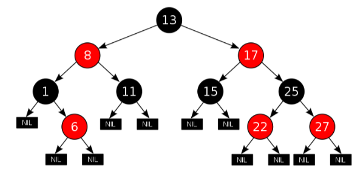
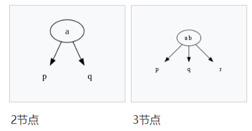
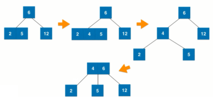
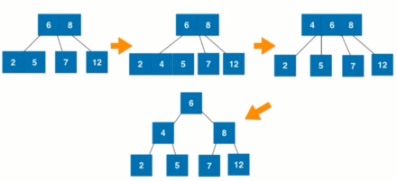
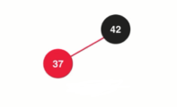
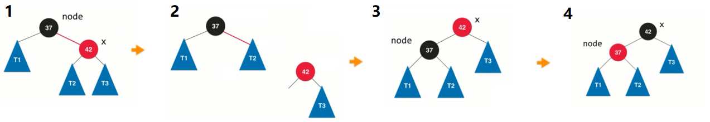
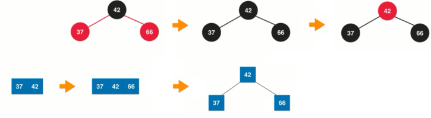
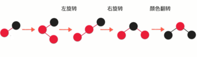

# 红黑树

---
## 1 什么是红黑树

红黑树（英语：Red–black tree）是一种自平衡二叉查找树，是在计算机科学中用到的一种数据结构，典型的用途是实现关联数组。它是在1972年由鲁道夫·贝尔发明的，他称之为"对称二叉B树"，它现代的名字是在Leo J. Guibas和Robert Sedgewick于1978年写的一篇论文中获得的。它是复杂的，但它的操作有着良好的最坏情况运行时间，并且在实践中是高效的：它可以在 `O(logn)` 时间内做查找，插入和删除，这里的  n是树中元素的数目。红黑树相对于AVL树来说，牺牲了部分平衡性以换取插入/删除操作时少量的旋转操作，整体来说性能要优于AVL树。——维基百科。



### 算法导论中的红黑树定义

- 每个节点要么是红色的，要么是黑色的。
- 根节点是黑色的。
- 每个叶子节点（最后的空节点）是黑色的。
- 如果一个节点是红色的，那么它的两个孩子都是黑色的。
- 从任意一个节点到叶子节点，经过的黑色节点是一样的。

>叶子节点不是指树中左右子节点都为空的节点，而是再向下递归一层后到达的那些空节点

一开始，这五点比较难以理解，我们可以先从 `2-3树`开始理解，`2-3树`是与红黑树等价的。

---
## 2 `2-3树`

计算机科学中，`2–3树`是一种树型数据结构，内部节点（存在子节点的节点）要么有2个孩子和1个数据元素，要么有3个孩子和2个数据元素，叶子节点没有孩子，并且有1个或2个数据元素。——维基百科



- 如果一个内部节点拥有一个数据元素、两个子节点，则此节点为`2-节点`。
- 如果一个内部节点拥有两个数据元素、三个子节点，则此节点为`3-节点`。

`2-3 树`满足二分搜索树的性质。


`2-3 树`是一颗绝对平衡的树：从根节点到任意一个叶子节点所经过的节点数量是绝对相同的。

###` 2-3树`的如何维持绝对平衡

`2-3 树`添加节点将永远不会添加到一个空节点的位置。它一定是添加到我们最后搜索到的叶子节点的位置，合它进行 **融合**。

具体过程如下：

- 如果需要融合的节点本身是一个 `2-节点`，那很简单，直接进行融合即可。

- 如果需要融合的节点本身是一个 `3-节点`，则先进行临时融合形成 `4-节点`，最后再将 `4-节点`进行拆分。

- 如果插入 `3-节点`，且其父节点为 `2-节点`，则插入后需要进行向上融合。

- 如果插入 `3-节点`，且其父节点也为 `3-节点`，则插入后需要行向拆分和进上融合。


### `2-3树`与红黑树的等价性

参考下图，再红黑树中使用两个节点来模拟 `2-3 树`中的 `3-节点`，使用红色来表示 b 与 c 是并列的关系，如果来表示这条红色的边呢，其实就是让 b 这个节点变为红色，而 b 只有一个父节点，所以其与父节点的连线也就是红色，本质上就是把并列关系存储在子节点中。


- 黑色节点，对应 `2-3树`中的 `2-节点`。
- 红色节点和它的父节点一起表示 `2-3 树`中的 `3-节点`。
- 红黑树中所有的红色节点都是左倾斜的。

用红黑树来表示对等的 `2-3 树`：


再来回顾以下上面关于红黑树的 5 条定义：

- 每个节点要么是红色的，要么是黑色的：这是显然的。
- 根节点是黑色的：在 `2-3 树`中，根节点要么是 `2-节点`、要么是 `3-节点`，参考上图，转换成红黑树的的表示形式，根节点确实是黑色的。
- 每个叶子节点（最后的空节点）是黑色的：与其说这是性质，不如说是定义。红黑树中空节点是黑色的。
- 如果一个节点是红色的，那么它的两个孩子都是黑色的：红色节点对应 `2-3 树`中的 `3-节点`的左侧，而 `3-节点`的孩子要么是 `2-节点`，要么是 `3-节点`，它们确实都是黑色的。
- 从任意一个节点到叶子节点，经过的黑色节点是一样的：`2-3 树`是绝对平衡的，绝对平衡的树同层的节点到底叶子节点所经历的节点数必然是一致的，而`2-3 树`中的节点要么是 `2-节点`、要么是 `3-节点`，不管是 `2-节点`还是是 `3-节点`，用红黑树中的节点与转换后，都对应一个黑色节点，所以这条也是成立的。

红黑树是保持 **黑平衡** 的二叉树。严格定义来讲，不是平衡二叉树，最大高度为（最坏的情况） 2(logn)。

- 查找来讲：虽然 AVL 和红黑树都是 O(logn)级别的，但是 AVL 要快。
- 添加和删除来讲，红黑树要比 AVL 快。


---
## 3 红黑树实现

>以下代码基于之前的 BST 修改。

### 保持根节点为黑色和左旋转

红黑树节点设计，节点多了一个颜色标记，可以看出，默认节点被定义为红色。

```java
private static final boolean RED = true;
private static final boolean BLACK = false;

 private class Node {

        Key key;
        Value value;
        Node left;
        Node right;
        boolean color;

        public Node(Key key, Value value) {
            this.key = key;
            this.value = value;
            left = null;
            right = null;
            color = RED;
        }

    }
```

每次添加一个节点，都要保证根节点为黑色：
```java
    public void add(Key key, Value value) {
        root = addImproved(root, key, value);
        root.color = BLACK;//保持根节点为黑色
    }
```

插入新节点过程：

- 情况1：当插入第一个节点时，设置其颜色为黑色。


- 情况2：当插入第二个节点 37 时，需要插入到根节点的左侧，则直接插入即可，形式等同于 `2-3树` 的 `3-节点`，保持了红黑树的性质。



- 情况3：当根节点是 37，需要插入第二个节点 42 时，需要插入到根节点的右侧，红色节点就出现在黑节点的右侧了，需要进行 **左旋转** 以维护红黑树的性质，除此之外，我们还需要对节点的颜色进行维护：

颜色维护过程：
```java
node.right = x.left;
x.left = node;
x.color = node.color;//旋转之前，node是根节点，旋转之后，x是根节点，所以x的颜色应该与node相同，保持根节点颜色一致。
node.color = RED;//旋转之后，node 和 x 组成 3-节点，所以 node 在左侧，需要改为红色。
```
最后，上面情况，node 是黑色的，如果当前树的没有这么简单，则在插入前 node 也可能是红色，情况就变成了在一个红色节点的右侧插入节点，则 `x.color` 也是红色了，左旋转导致了两个连续的红色节点，但在这种情况下，此时左旋转是一个子过程，会继续把 x 递归回去进行旋转。最终还是能满足红黑树的性质。

情况 2 和 3 就类似在`2-3树`中，向`2-节点`插入一个新的元素，形`3-节点`。

### 颜色翻转和右旋转

向红黑树中的 `3-节点` 中添加节点：

- 情况1：在黑色节点的右侧插入节点，相当于在 `2-3树`中的 `3-节点`的右侧插入节点，会形成临时的 `4-节点`，之后需要节点进行拆分，拆分成两个独立的 `2-节点`，这相当于要把红黑树中两个红色节点改为黑色，最后，拆分形成的根节点需要继续向上与它的父亲节点融合，红黑树中只有红色节点才表示它要与它的父节点进行融合，这意味着新形成的根节点需要变为红色。这个过程看似三个节点的颜色都变了，称为 **颜色翻转**。

```java
    node.color = RED;
    node.left.color = BLACK;
    node.right.color = BLACK;
```

- 情况2：在一个红色节点和黑色节点组成的 `3-节点` 的左侧插入元素，这就形成了黑节点的左孩子和其左孩子的左孩子都是红色的，可以看成是临时的`4-节点`，此时需要对其进行右旋转，之后在对其进行颜色翻转，以维持红黑树的性质，具体过程如下：

```java
//旋转
node.left = x.right;
x.right = node;
//颜色维护
x.color = node.color;//旋转后新形成的根节点与原来的根节点颜色保持一致
node.color = RED;//本质上还是 12 42 37 三个节点组成的临时的 4-节点。所以 node 要变为红色。
```

- 情况3：在一个红色节点和黑色节点组成的 `3-节点` 的中间插入元素，即在黑色节点的左侧孩子的右侧插入节点，这个过程的需要进行的变换过程是：先基于 37 几点进行左旋转：

变成情况2，再按情况2 的方式处理。即再右旋转+颜色翻转，整个过程如下：


### 维护红黑树的时机

先把节点按照 BST 的逻辑添加到树种，再回溯向上维护，与 AVL 一致。插入节点后，红黑树的性质维护是一个叠加的过程，而且有些情况属于另一些情况的子过程，参考下面箭头方向：


1. 最复杂的是在红色节点的右侧插入红色节点，需要进行三次变换。
2. 第一个箭头表示，在红色节点的左侧插入就等价于第一种情况进行左旋转之后的情况。

上面过程，使用代码表示如下：

```java
//递归插入节点后，三个过程不是互斥的，而是补充的。

        private boolean isRed(Node node) {
            if (node == null) {
                return BLACK;
            }
            return node.color;
        }

        /*是否需要左旋转，右边的孩子是红色，左边的孩子不是红色*/
        /*node 对应上图第二个情况，中间的红色节点*/
        if (isRed(node.right) && !isRed(node.left)) {
            node = leftRotate(node);
        }

        /*是否需要右旋转，右边的孩子是红色，左边孩子的左孩子也是红色*/
        /*node 对应上图第三个情况，顶部黑色节点*/
        if (isRed(node.left) && isRed(node.left.left)) {
            node = rightRorate(node);
        }

        //是否需要进行颜色翻转
        /*node 对应上图第四个情况，顶部黑色节点*/
        if(isRed(node.right) && isRed(node.left)){
            flipColor(node);
        }
```

### 代码实现

>只是先了 add 操作后的平衡维护逻辑。

```java
public class RBTree<Key extends Comparable<Key>, Value> {

    private static final boolean RED = true;
    private static final boolean BLACK = false;

    private class Node {

        Key key;
        Value value;
        Node left;
        Node right;
        boolean color;

        public Node(Key key, Value value) {
            this.key = key;
            this.value = value;
            left = null;
            right = null;
            color = RED;
        }

    }

    private Node root;
    private int size;

    private boolean isRed(Node node) {
        if (node == null) {
            return BLACK;
        }
        return node.color;
    }

    public void add(Key key, Value value) {
        root = addImproved(root, key, value);
        root.color = BLACK;//保持根节点为黑色
    }

    /**
     * 向以node为根的二分搜索树中插入元素e，递归算法，返回插入新节点后二分搜索树的根。
     * 对于二分搜索树，递归的每一次深度都把源树的层级减一，直到最后的null位就是需要添加新节点的位置。这个递归算法的精髓在于定义了返回值。
     */
    private Node addImproved(Node node, Key key, Value value) {
        if (node == null) {
            size++;
            return new Node(key, value);//默认插入红色节点
        }
        if (key.compareTo(node.key) < 0) {
            node.left = addImproved(node.left, key, value);
        } else if (key.compareTo(node.key) > 0) {
            node.right = addImproved(node.right, key, value);
        } else {// e.compareTo(node.e) == 0
            node.value = value;
        }

        /*是否需要左旋转，右边的孩子是红色，左边的孩子不是红色*/
        if (isRed(node.right) && !isRed(node.left)) {
            node = leftRotate(node);
        }

        /*是否需要右旋转，右边的孩子是红色，左边孩子的左孩子也是红色*/
        if (isRed(node.left) && isRed(node.left.left)) {
            node = rightRotate(node);
        }

        //是否需要进行颜色翻转
        if(isRed(node.right) && isRed(node.left)){
            flipColor(node);
        }

        return node;
    }

    //        node                           x
    //       /   \     左旋转               /  \
    //      T1   x   --------->         node   T3
    //          / \                           /   \
    //         T2  T3                        T1   T2
    private Node leftRotate(Node node) {
        Node x = node.right;
        //左旋转
        node.right = x.left;
        x.left = node;
        //维护颜色
        x.color = node.color;
        node.color = RED;
        return x;
    }

    //          node                       x
    //         /   \       右旋转         /  \
    //        x    T2   ------->         y   node
    //       / \                        /       \
    //     y   T1                      T1        T2
    private Node rightRotate(Node node) {
        Node x = node.left;
        //右旋转
        node.left = x.right;
        x.right = node;
        //颜色维护
        x.color = node.color;
        node.color = RED;
        return x;
    }

    /*颜色翻转*/
    private void flipColor(Node node) {
        node.color = RED;
        node.left.color = BLACK;
        node.right.color = BLACK;
    }

    public Value remove(Key key) {
        Node node = getNode(root, key);
        if (node != null) {
            root = remove(root, key);
            return node.value;
        }
        return null;
    }

    /*删除指定元素的节点*/
    @SuppressWarnings("all")
    private Node remove(Node node, Key key) {
        if (node == null) {
            return null;
        }

        int compare = key.compareTo(node.key);

        if (compare < 0) {
            node.left = remove(node.left, key);
            return node;
        } else if (compare > 0) {
            node.right = remove(node.right, key);
            return node;
        } else {
            //compare == 0
            if (node.left == null) {/*要删除的节点只有右子树*/
                Node rightNode = node.right;
                node.right = null;
                size--;
                return rightNode;
            } else if (node.right == null) {/*要删除的节点只有左子树*/
                Node leftNode = node.left;
                node.left = null;
                size--;
                return leftNode;
            } else {/*要删除的节点既有左子树也有右子树*/
                //node.left != null && node.right != null
                //把node右子树中的最小值作为node 的替代
                Node successor = minimum(node.right);
                successor.right = removeMin(node.right);
                successor.left = node.left;
                node.left = node.right = null;
                return successor;
            }
        }

    }

    /* 递归算法，一直往左找，直到左子节点为null，就是该树的最小值*/
    private Node minimum(Node node) {
        if (node.left == null) {
            return node;
        }
        return minimum(node.left);
    }

    @SuppressWarnings("all")
    private Node removeMin(Node node) {
        if (node.left == null) {
            Node rightNode = node.right;
            node.right = null;
            size--;
            return rightNode;
        }
        node.left = removeMin(node.left);
        return node;
    }


    public Value get(Key key) {
        Node node = getNode(root, key);
        return node == null ? null : node.value;
    }


    public boolean contains(Key key) {
        return getNode(root, key) != null;
    }


    public int size() {
        return size;
    }


    public void set(Key key, Value value) {
        Node node = getNode(root, key);
        if (node == null) {
            throw new NullPointerException("no this key");
        }
        node.value = value;
    }


    public boolean isEmpty() {
        return size == 0;
    }

    private Node getNode(Node node, Key key) {
        if (node == null) {
            return null;
        }
        if (key.compareTo(node.key) < 0) {
            return getNode(node.left, key);
        } else if (key.compareTo(node.key) > 0) {
            return getNode(node.right, key);
        } else {// e.compareTo(node.e) == 0
            return node;
        }
    }

}
```

### 性能测试

统计词频对比 AVL、RBT、BST。

```java
    private static void testRBT_BST() {
        ArrayList<String> words = new ArrayList<>();
        FileOperation.readFile("files/pride-and-prejudice.txt", words);

        //------------------------------------------------------------------------avl
        long start = System.nanoTime();
        AVLTree<String, Integer> avlTree = new AVLTree<>();

        for (String word : words) {
            if (avlTree.contains(word)) {
                avlTree.set(word, avlTree.get(word) + 1);
            } else {
                avlTree.add(word, 1);
            }
        }

        for (String word : words) {
            avlTree.contains(word);
        }

        long used = System.nanoTime() - start;
        System.out.println("avl 用时 " + (used / 1000000000.0) + "s");

        //------------------------------------------------------------------------rbt
        RBTree<String, Integer> rbTree = new RBTree<>();

        start = System.nanoTime();

        for (String word : words) {
            if (rbTree.contains(word)) {
                rbTree.set(word, rbTree.get(word) + 1);
            } else {
                rbTree.add(word, 1);
            }
        }

        for (String word : words) {
            rbTree.contains(word);
        }

        used = System.nanoTime() - start;
        System.out.println("rbt 用时 " + (used / 1000000000.0) + "s");

        //------------------------------------------------------------------------bst
        BSTMap<String, Integer> bstMap = new BSTMap<>();

        start = System.nanoTime();

        for (String word : words) {
            if (bstMap.contains(word)) {
                bstMap.set(word, bstMap.get(word) + 1);
            } else {
                bstMap.add(word, 1);
            }
        }

        for (String word : words) {
            bstMap.contains(word);
        }

        used = System.nanoTime() - start;
        System.out.println("bst 用时 " + (used / 1000000000.0) + "s");
    }

}
```

打印结果：

    //第一次
    avl 用时 0.072353459s
    rbt 用时 0.070164007s
    bst 用时 0.064389162s
    //第二次
    avl 用时 0.076717056s
    rbt 用时 0.0695036s
    bst 用时 0.061639013s
    //第三次
    avl 用时 0.076223607s
    rbt 用时 0.069802731s
    bst 用时 0.062404695s

从打印结果来看，发现三个实现并没有太大的性能差距，甚至 BST 更快，这是因为：

1. 测试使用的数据量相对较小，体现不错复杂算法的优势，数据量小的测试往往简单的操作更快。这也告诉我们并不是在任何情况下越复杂高级的算法就更快，而是要看具体的测试场景。
2. 大多数操作都是在查询，RBT 的优势在于添加和删除节点，而不是查询。

性能总结：

- 对于完全随机的数据，普通的二分搜索树更好用，但是极端情况下会退化成链表。
- 对于查询过多的情况，AVL 的性能较好。
- 红黑树牺牲了平衡性，最大高度可达 2logn，擅长添加和删除操作，而且红黑树的统计性能较优，即增删改查的平均性能较优。所以很多语言的容器都是用了红黑树，比如说 Java 的 TreeSet、TreeMap。

---
## 4 拓展

- 红黑树如何删除节点。
- 左倾红黑树、右倾红黑树。
- 另一种统计性能更优的树 SplayTree，刚被访问的元素在接下来的操作中被访问的机率更高。