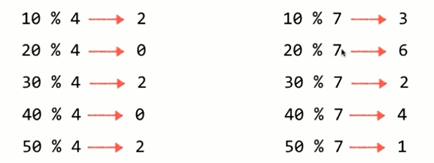
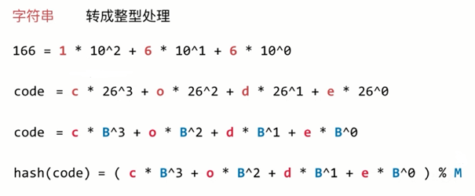

# 哈希表

---
## 1 什么是哈希表

### [LeetCode 387](https://leetcode-cn.com/problems/first-unique-character-in-a-string/description/)

给定一个字符串（可以假定该字符串只包含小写字母），找到它的第一个不重复的字符，并返回它的索引。如果不存在，则返回 -1。比如：

```
s = "leetcode"
返回 0.

s = "loveleetcode",
返回 2.
```

Solution：

```java
class Solution {
    public int firstUniqChar(String s) {
        int[] table = new int[26];
        int length = s.length();

        for (int i = 0; i < length; i++) {
            table[s.charAt(i) - 'a']++;
        }
        for (int i = 0; i < length; i++) {
            if (table[s.charAt(i) - 'a'] == 1) {
                return i;
            }
        }
        return -1;
    }
}
```

### 哈希表

散列表（Hash table，也叫哈希表），是根据键（Key）而直接访问在内存存储位置的数据结构。也就是说，它通过计算一个关于键值的函数，将所需查询的数据映射到表中一个位置来访问记录，这加快了查找速度。这个映射函数称做散列函数，存放记录的数组称做散列表。——维基百科。

上面题目的解决方案中，可以认为 `int[] table = new int[26];`就是一个哈希表，这个问题中，我们关心的是每一个字符和一个数字之间的映射关系，这里使用的是索引和字符做对应，它们之间的关系是 `table[s.charAt(i) - 'a']`（可以认为就是哈希函数），一旦这种对应关系形成，我们在这种数据结构中，对数据的增删改查的时间复杂度都是 `O(1)` 级别的。

这里有两个关键：

- 哈希函数设计：哈希函数的是希望将 key 转换为索引，而在真实的情况下，很难保证每个 key 通过哈希函数转换为不同的索引，然后就是转换后的索引也无法直接当作数组索引使用。
- 在哈希表上的操作：从不同的 key 哈希得到了相同的索引就称为 **哈希冲突**，在哈希表上的操作最复杂的部分就是解决哈希冲突。


### 空间换时间算法

哈希表充分体现了设计领域的经典思想：空间换时间。

- 如果空间是无限的，那么哈希表的每个元素的存储都是 `O(1)` 的复杂度。
- 如果只有一个空间，那么哈希表将退化成链表，此时的复杂度都是 `O(n)` 的了。

哈希表就是时间和空间上的平衡。

---
## 2 哈希函数的设计

哈希函数的设计很重要。键通过哈希得到的索引应该也均匀分布越好。对于一些特殊的领域，有特殊领域的哈希函数设计方式，甚至有专门的论文。这里我们关注最简单、最基本、最通用、最一般的哈希哈希函数设计。

### 对于不同数据类型的处理

#### 整型

对于小范围正整型，直接使用即可。对于小范围负整形，对负数进行偏移后使用。

对于大整形整形，使用的方法是对其进行取模，模数的选择很重要，需要防止防止分布不均匀、最好利用元素的完全信息以尽量避免哈希冲突，一般选择 mod 一个素数可以得到较好的结果，这是一个数学理论（数论）。取值可以参考网站 https://planetmath.org/goodhashtableprimes



####  浮点型

基本数据类型计算机中都是 32 位或者 64 位的二进制表示，只不过计算机解析成了浮点数。可以把浮点型对于的内存区域解析成整形再处理。


####  字符串

对于字符串的处理是，把字符串对应的字符转换成对应的整形处理。



>图中，B 是根据特定情况定制的数字进制，M 是一个素数。

上面公式在遇到较长的字符串时，需要大量的幂计算，比如长度位 100 的字符串，第一位计算就是 B 的 99 次方，所以一般把公式简化为：`(((( c * B) + o ) * B + d) * B + e) % M`，然后为了防止计算整形时的整形溢出，可以优化为对每部分计算各自取模：`(((( c % M ) * B + o ) % M * B + d) % M * B + e) % M`。

于是字符串 hash 函数可以实现为：

```java
int hashCode(String s){
    int hash = 0;
    for(int i =0; i < s.length(); i ++){
        hash +=(hash * B + s.charAt(i)) % M;
    }
    return hash;
}
```

#### 复合类型

复合类型也是由基本类型和字符串组成的，可以先将其转换为整形再计算 hash。

### hash函数设计原则

1. 一致性，如果 `a == b`，则 `hash(a) == hash(b)`。
2. 高效性，计算高效简便。
3. 均匀性，哈希值分布均匀。

### Java 中的 hashCode

按照一定原则，实现 hashCode 和 equals 方法。

---
## 3 哈希冲突的处理：SeperateChaining（链地址法）

hash 表本质是一个数组，当向哈希表中添加元素时，处理流程大概如下：

当添加一个新元素 k1 时，先对其进行 hash 再取模，因为最终计算所得值是需要作为数据索引的，所以取模之前还需要去掉哈希值的符号（正负号），一般采用的方式是 `(hashcode(k1) & 0x7FFFFFFF) % M`，0x7FFFFFFF 其实就是 32 位二进制，后面 31 位全都是 1，与它进行与运算，就是去掉首位的符号位。最后将计算得到的哈希值作为数组索引将 k1 存入到数组对应的位置上。

当添加一个新元素 k2 时，按照相同的方法计算哈希值作为索引，将 k2 存储到数组中对应的位置即可。

当添加一个新元素 k3 时，按照相同的方法计算哈希值作为索引，如果计算的哈希值与元素 k2 相同怎么处理？按照 SeperateChaining 的方式，将 k3 以链表的方式添加到 k2 的后面。

![index_files/snipaste_20181020_175308.png]

当然，本质上相同哈希值元素的存储需要的是一个查找表，底层可以用链表实现，也可以用树实现。

![index_files/snipaste_20181020_175541.png]

对应 Java 中的实现，Java8 之前是使用的链表来存储哈希值相同的元素，Java8 对其做了优化，在哈希冲突达到一定程度后并且如果 key 支持顺序比较，会将链表转化为红黑树。这也说明了只有数据量达到一定量时，才能体现红黑树的性能。

---
## 4 时间复杂度分析与 resize

假设总共有 M 个地址（M为数组长度），如果放入哈希表的元素的个数为 N，则：

- 如果对于 hash 冲突的元素使用链表来存储，则复杂度为 `O(N/M)`，最坏的情况即所有元素都哈希冲突时，复杂度为 `O(N)`
- 如果对于 hash 冲突的元素使用平衡树表来存储，则复杂度为 `O(log(N/M))`，最坏的情况即所有元素都哈希冲突时，复杂度为 `O(logN)`。

那么怎么才能实现哈希表理论上的 `O(1)` 呢？其实关键在于 M 应该是动态的，就像之前的动态数组一样，哈希表也应该存在扩容的过程，M 应该随着元素的个数自适应，即 resize。

如何实现自适应呢？与数组不同的是，哈希表不能像数组那样根据存入元素的个数来决定是否需要 resize，因为哈希表中的数组对应的是元素的哈希值，这在数组创建后就是已经确定的，所以哈希表的 resize 时机是由平均每个地址承载的元素多过一定程度时。这个程度我们可以自行设定，比如：
```java
N / M >= upperTol; //upperTol 是上界，超出 upperTol 是就该扩容。
N / M <= lowerTol; //lowerTol 是下界，低于 lowerTol 是就该缩容。
```
另外需要注意的是，resize 的逻辑需要保证 M 依然是一个素数。

添加了 resize 的逻辑后，时间 **均摊复杂度** 为 `O(1)`，每个操作在 `O(lowerTol)~O(upperTol)` 之间。

### 哈希表与树对比

- 哈希表的 **均摊复杂度** 为 `O(1)`。
- 哈希表牺牲了顺序性。

---
## 5 简陋实现

>bug：TreeMap 要求的元素是支持可比较的。而 HashTable 上没有定义这样的泛型。

```java
public class HashTable<Key, Value> {

    private TreeMap<Key, Value>[] hashTable;
    private int M;//素数
    private int size;

    private static final int UPPER_TOL = 10;
    private static final int LOWER_TOL = 2;
    private int capacity_index = 0;

    /**
     * 素数表
     */
    private static final int[] CAPACITY
            = {53, 97, 193, 389, 769, 1543, 3079, 6151, 12289, 24593,
            49157, 98317, 196613, 393241, 786433, 1572869, 3145739, 6291469,
            12582917, 25165843, 50331653, 100663319, 201326611, 402653189, 805306457, 1610612741};

    @SuppressWarnings("unchecked")
    public HashTable() {
        this.M = CAPACITY[capacity_index];
        size = 0;
        hashTable = new TreeMap[M];
        for (int i = 0; i < M; i++) {
            hashTable[i] = new TreeMap<>();
        }
    }

    private int hash(Key key) {
        return (key.hashCode() & 0x7FFFFFFF) % M;
    }

    public int getSize() {
        return size;
    }

    public void add(Key key, Value value) {
        int hash = hash(key);
        TreeMap<Key, Value> map = hashTable[hash];
        if (map.containsKey(key)) {
            map.put(key, value);
        } else {
            map.put(key, value);
            size++;
            if (size >= UPPER_TOL * M && (capacity_index + 1 < CAPACITY.length)) {
                resize(CAPACITY[++capacity_index]);
            }
        }
    }

    @SuppressWarnings("unchecked")
    private void resize(int newM) {
        TreeMap<Key, Value>[] newTable = new TreeMap[newM];
        for (int i = 0; i < newM; i++) {
            newTable[i] = new TreeMap<>();
        }
        int oldM = M;
        this.M = newM;

        for (int i = 0; i < oldM; i++) {
            TreeMap<Key, Value> map = this.hashTable[i];
            for (Key key : map.keySet()) {
                newTable[hash(key)].put(key, map.get(key));
            }
        }

        this.hashTable = newTable;
    }

    public Value remove(Key key) {
        int hash = hash(key);
        TreeMap<Key, Value> map = hashTable[hash];
        if (map.containsKey(key)) {
            Value remove = map.remove(key);
            size--;
            if (size < LOWER_TOL * M && (capacity_index - 1 >= 0)) {
                resize(CAPACITY[--capacity_index]);
            }
            return remove;
        }
        return null;
    }

    public void set(Key key, Value value) {
        int hash = hash(key);
        TreeMap<Key, Value> map = hashTable[hash];
        if (map.containsKey(key)) {
            map.put(key, value);
        } else {
            throw new IllegalArgumentException("can not find value by key");
        }
    }

    public boolean contains(Key key) {
        int hash = hash(key);
        TreeMap<Key, Value> map = hashTable[hash];
        return map.containsKey(key);
    }

    public Value get(Key key) {
        int hash = hash(key);
        TreeMap<Key, Value> map = hashTable[hash];
        return map.get(key);
    }

}
```

---
## 6 扩展

- 解决哈希冲突：开发地址法，开发地址法具体又有线性探索法、平方探索法、二次哈希法。
- Rehashing 方法。
- Coalesced Hashing。