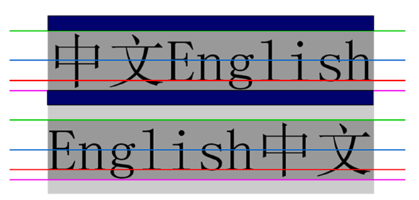

# CSS 2.1

>[谷粒学院 css2.1](http://www.gulixueyuan.com/course/223/tasks)学习笔记

## 1 定位与盒模型

### 定位参照于谁块来定位

- 没有定位：包含块
- 相对：元素本来的位置
- 绝对：包含块，如果最近的祖先元素中存在定位元素，则这个定位元素就是包含块，如果没有，包含块为初始包含块
- 固定：视口
			
### 什么是包含块

- 浮动元素的包含块。对于浮动元索，其包含块定义为最近的块级祖先元泰，对干定位，悄况则没有这么简单，CSS2.1 定义了以下行为： 
- “根元紊”的包含块（也称为初始包含块）由用户代理建立，在 HTML 中，根元素就是 html 元紊，不过有些浏览器会使用 body 作为根疋素，在大多数浏览器中， 初始包含块是一个视窗大小的矩形。 
- 对于一个非根元素，如果其 position 是 relative 或 static，包含块则由最近的块级框、表单元格或行内块祖先框的内容边界构成。 
- 对于一个非根元素，如果其 position 是 absolute，包含块为设置的最近的 position 值不是 static 的祖先元素（可以是任何类型）这个过程如下：
    - 如果这个祖先是块级元素，包含块则设为该元素的内边矩边界，换句话说，就是由边框界定的区域。 
    - 如果这个祖先是行内元素，包含块则设为该祖先元素的内容边界，在从左向右读的语言中，包含块的上边界和左边界是该祖先元素中笫一个框内容区的上 
边界和左边界，包含块的下边界和右边界是最后一个框内容区的下边界和右边界，在从右向左读的语言中，包含块的右边界对应于笫一个框的右内容边界，包含块的左边界则取自最后一个框的左内容边界，上下边界也是一样。 
    - 如果没有祖先，元素的包含块定义为初始包含块。

什么是初始包含块，是一个视窗大小的矩形，不等于视窗。

### 定位

- left top right bottom 默认值为 auto，不可继承。
- width height 默认值为 auto，不可继承。
- margin padding 默认值 0。
- boder-width 默认值为 medium，必须设置 border-style(比如 solid)。

### 百分比参照于谁

- width margin padding 参照包含块的 width
- height 参照包含块的 height
- left 参照包含块的 width
- top 参照包含块的 height
- `translate(-50%,-50%)` 百分比参照于自身的宽高
- `background-position` 百分比参照于（图片区域-图片的位图像素值）

### html 与 body

参考 [对html与body的一些研究与理解](https://www.zhangxinxu.com/wordpress/2009/09/%E5%AF%B9html%E4%B8%8Ebody%E7%9A%84%E4%B8%80%E4%BA%9B%E7%A0%94%E7%A9%B6%E4%B8%8E%E7%90%86%E8%A7%A3/)

### 总结

面对一个 CSS 属性，如何学习：

- MDN 参考，最精准。
- 默认值是啥
- 是否可继承

## 2 浮动

- 一个元素分两层：文字与盒模型。
- 浮动是否提升层级：提升半层，文字会被浮动元素卡住，进不去。

## 3 三列布局

#### 三列布局要求

- 两边固定，当中自适应
- 中间列要完整的显示
- 中间列要优先加载
		
#### 实现方式

- 定位：不建议使用定位，使用定位必须要一个容器，这个容器必须的相对定位，因为定位会提升层级，对编写整个网页的滑动会带来问题。
- 浮动：使用浮动可以实现三列布局，但是没有满足中间列要优先加载的要求。
- 圣杯布局
- 双飞翼布局
		
#### margin 为负值

- **margin 不影响元素的位置**。
- **margin 调整的是布局的边界**。
- 负值将元素的边界往里收。
- 正值将元素的边界往外扩。

具体参考

- [负margin用法权威指南](https://www.w3cplus.com/css/the-definitive-guide-to-using-negative-margins.html)
- [深入理解css中的margin负值](https://www.jianshu.com/p/ebad84969baa)
- [浅谈margin负值](https://zhuanlan.zhihu.com/p/25892372)
- [深入理解CSS中的margin负值](https://www.cnblogs.com/xiaohuochai/p/5314289.html)
		
#### 伪等高布局

- 原理：margin 为负值
- 盒模型考虑：margin、padding、border
- padding 让盒子变长了，-margin 又让盒子变短了
- 但 margin 只是调整盒子的边界，padding 不会被收回来。

#### 圣杯布局

- 浮动：搭建完整的布局框架
- margin 为赋值：调整旁边两列的位置(使三列布局到一行上)
- 使用相对定位：调整旁边两列的位置（使两列位置调整到两头）

#### 双飞翼布局

1. 俩种布局方式都是把主列放在文档流最前面，使主列优先加载。
2. 两种布局方式在实现上也有相同之处，都是让三列浮动，然后通过负外边距形成三列布局。
3. 两种布局方式的不同之处在于如何处理中间主列的位置：
    - 圣杯布局是利用父容器的左、右内边距 + 两个从列相对定位。
    - 双飞翼布局是把主列嵌套在一个新的父级块中利用主列的左、右外边距进行布局调整。

#### ie6 fixed 失效问题

fixed 定位参考视口。

- 元素高度必须一层一层继承。比如只有 html 的 height = 100% ，body 的 height = 100% 才有效。
- 滚动条默认在文档上。
- 只有 html 的 height = 100% ，body 的 height = 100% 才有效，这样才能让 body 的尺寸变为视口的尺寸。

怎么使用绝对定位来模拟固定定位：

- 只有拖动系统滚动条的时候，初始包含块才会移动
- 视口是永远不会动的
- 所以禁止系统滚动条，将滚动条加给 body，让 body 的尺寸变为视口的尺寸

### 粘连布局（Sticky footer布局）

使用 margin 负值实现。

## 4 BFC

### Box、Formatting Context 概念

- Box：Box 是CSS 布局的对象和基本单位，直观地说，就一个页面由很多的 Box 组成，元素的类型和 display 属性决定了整个 Box 的类型，不同类型的 Box，会参与不同的 Formatting Context(一个决定如何渲染文档的容器)，因此 Box 内的元素会以不同的方式渲染，让我们看看有哪些盒子：
    - block-level：display 属性为 block，list-item，的元素，会生成 block-level box，并参与 block formatting context。
    - inline-level box：display 属性为 inline，inline-block，inline-table 的元素，会生成 inline-level box。
- Formatting Context：即 W3C CSS2.1 规范的一个概念，它是页面中的一块渲染区域，并且有一套渲染规则，它决定了其中元素将如何定位，以及和其他元素的关系和相互作用。最常见的 Formatting Context 有 Block formatting context(简称 BFC) 和 Inline formatting context(简称 IFC)。 

### BFC

BFC(Block formatting context)直译为 **块级格式化上下文**。它是一个独立的渲染区域，只有 `Block-level box` 参与， 它规定了内部的 Block-level Box 如何布局，并且与这个区域外部毫不相干。在 BFC 中，盒子从顶端开始垂直地一个接一个地排列，两个盒子之间的垂直的间隙是由它们的 margin 值所决定的。在一个 BFC 中，两个相邻的块级盒子的垂直外边距会产生折叠。

### 哪些元素会生成 BFC

- 根元素 html
- float 属性不为 none 浮动框
- position 为 absolute 或 fixed
- display 为 `inline-block, table-cell, table-caption, flex, inline-flex`
- overflow 不为 visible 的块框。这就是为什么我们经常用 `overflow:hidden` 去清除内部浮动的原因
- 触发 IE 的 hasLayout 特性

### BFC 的布局规则

1. 内部的 Box 会在垂直方向，一个接着一个地放置。
1. BFC 的区域不会与 float box 重叠。
1. 内部的 Box 垂直方向的距离由 margin 决定，属于同一个 BFC 的两个相邻 Box 的 Margin 会发生重叠。
1. 计算 BFC 的高度时，浮动的元素也要参与计算。
1. BFC 就是页面上的一个隔离器，容器里面的子元素不会影响到外面的元素。

具体参考 [深入理解 BFC 和 Margin Collapse](https://www.w3cplus.com/css/understanding-bfc-and-margin-collapse.html)

### BFC 应用

- 两侧布局

### 解决 margin 叠加

兄弟元素之间的 margin 重叠，和子父之间的 margin 的传递都是由上述 BFC 的布局规则第 3 点造成的。解决方法是破坏 margin 重叠三个必要条件中的任意一个。

- 使用 `overflow: hidden`
- 使用 border 隔开父子布局，让两个盒子不再相邻，可以解决父子 margin 传递问题。

### 清除浮动

让浮动的子元素库撑开父级的高度

1. 直接给父级加高度（扩展性不好）
2. 通过开启 BFC，浮动盒子的特点，定位盒子的特点是高宽都由内容撑开。
    - 父元素添加 `overflow: hidden;`
    - 给父元素添加浮动
3. 使用 `<br clear="all"/>`。（在 IE 6 无法工作，不符合工作中：结构、样式、行为三者分离的要求。）
4. 使用空标签清除`<div style="clear: both;"></div> </div>` 隔墙法，不符合工作中：结构、样式、行为三者分离的要求，(如果盒子内有内容，IE 6 中的盒子有最小高度为 19px 的问题，设置 `font-size =0` 也还有 2px 最小高度)。
4. 使用 `clear:both`。
5. 伪元素 + hasLayout （IE6\7 不支持伪元素，解决方案，开启 hasLayout）

### hasLayout

IE6\7 没有 BFC，解决方案：hasLayout。

hasLayout 可以简单看作是 IE5.5/6/7 中的 BFC(Block Formatting Context)。也就是一个元素要么自己对自身内容进行组织和尺寸计算(即可通过 width/height 来设置自身的宽高)，要么由其包含块来组织和尺寸计算。而 IFC（即没有拥有布局）而言，则是元素无法对自身内容进行组织和尺寸计算，而是由自身内容来决定其尺寸（即仅能通过 line-height 设置内容行距，通过行距来支撑元素的高度；也无法通过 width 设置元素宽度，仅能由内容来决定而已）

- 当 hasLayout 为 true 时(就是所谓的"拥有布局")，相当于元素产生新 BFC，元素自己对自身内容进行组织和尺寸计算;
- 当 hasLayout 为 false 时(就是所谓的"不拥有布局")，相当于元素不产生新 BFC，元素由其所属的 containing block 进行组织和尺寸计算。

默认开启 hasLayou 的元素

```html
<html>, <body>
<table>, <tr>, <th>, <td>
, <hr>
<input>, <button>, <select>, <textarea>, <fieldset>, <legend>
<iframe>, <embed>, <object>, <applet>, <marquee>
```

触发hasLayout==true的方式

```css
display: inline-block
height: (除 auto 外任何值)
width: (除 auto 外任何值)
float: (left 或 right)
position: absolute
writing-mode: tb-rl
zoom: (除 normal 外任意值)
```

参考：[CSS魔法堂：hasLayout原来是这样!](https://www.cnblogs.com/fsjohnhuang/p/5291166.html)

## 5 css hack

应用：条件注释、自定义检测低版本 ie 的函数

参考[史上最全的CSS hack方式一览](https://blog.csdn.net/freshlover/article/details/12132801)

## 6 垂直水平居中

标准流下，`margin:auto` 的渲染行为是水平居中，上下边距为 0。

- 水平居中
- 已知高度垂直水平居中
- 未知高度垂直水平居中

## 7 文本与字体

### font-size

font-size CSS 属性指定字体的大小。该属性的值会被用于计算em长度单位，默认值为 medium（chrome下为 16px）；该属性可继承。
 
- px：直接指定像素大小
- em：em值的大小是动态的。当定义font-size属性时，1em等于元素的父元素的字体大小
- %：参照父元素的字体大小
 
### font-style

font-style 属性允许你选择 `font-family` 字体下的 `italic` 或 `oblique` 样式。 Italic 样式一般是指书写体，相比无样式的字体，通常会占用较少的高度，而oblique 字形一般只是常规字形的倾斜版本，默认值为 normal；该属性可继承。
 
- normal：选择 font-family 的常规字体。
- italic：选择斜体，如果当前字体没有可用的斜体版本，会选用倾斜体（oblique ）替代。
- oblique：选择倾斜体，如果当前字体没有可用的倾斜体版本，会选用斜体（ italic ）替代。

### font-weight

font-weight 属性指定了字体的粗细程度。一些字体只提供 normal 和 bold 两种值。默认值为 normal；该属性可继承。
 
可选值：

- normal：正常粗细。与400等值。
- bold：加粗。 与700等值。
- lighter：比从父元素继承来的值更细
- bolder：比从父元素继承来的值更粗
- `100(Thin 或者 Hairline), 200, 300, 400, 500, 600, 700, 800, 900`：数值化的规定字体粗细成都的方式，提供了除了 normal 和 bold 之外更多的值（设计比较好的字体会提供九个等级）。
 
回退机制：如果一个字体只有 normal 和 bold 两种粗细值选择，指定粗细值为 100-500 时，实际渲染时将使用 normal，指定粗细值为 600-900 时，实际渲染时将使用 bold
 
相对粗细值的解析：当指定的是相对粗细值 lighter 或 bolder 时，将使用如下图表来决定元素渲染时的绝对粗细值：

```
继承值（Inherited value）      bolder   lighter
  100                          400       100
  200                          400       100
  300                          400       100
  400                          700       100
  500                          700       100
  600                          900       400
  700                          900       400
  800                          900       700
  900                          900       700 
```

插值规律：font-weight 数值采取离散式定义（使用 100 的整倍数）。数值为实数，非 100 的整数倍的值将被四舍五入转换为 100 的整倍数，遇到 `*50` 时，将向上转换，如 150 将转换为 200 

### font-family

CCS 属性 font-family 允许你通过给定一个有先后顺序的，由字体名或者字体族名组成的列表来为选定的元素设置字体。属性的值用逗号隔开。浏览器会选择列表中第一个该计算机上有安装的字体。
 
默认值为 ：`depends on user agent`，该属性可继承。
 
取值：

- `<family-name>`：一个字体的名字。例如"Times" 和 "Helvetica" 都是字体名。字体名可以包含空格，但包含空格时应该用引号。
- `<generic-name>`：通用字体族名是一种备选机制，用于在指定的字体不可用时给出较好的字体。通用字体族名都是关键字，所以不可以加引号。在列表的末尾应该至少有一个通用字体族名。以下是该属性可能的取值以及他们的定义。

```
       serif
           带衬线字体，笔画结尾有特殊的装饰线或衬线。
           例如：Lucida Bright, Lucida Fax, Palatino, "Palatino Linotype", Palladio, "URW Palladio", serif. 
  
       sans-serif
           无衬线字体，即笔画结尾是平滑的字体。
           例如："Open Sans", "Fira Sans", "Lucida Sans", "Lucida Sans Unicode", "Trebuchet MS", "Liberation Sans", "Nimbus Sans L", sans-serif.
 
       monospace
           等宽字体，即字体中每个字宽度相同。
           例如："Fira Mono", "DejaVu Sans Mono", Menlo, Consolas, "Liberation Mono", Monaco, "Lucida Console", monospace.
 
       cursive
           草书字体。这种字体有的有连笔，有的还有特殊的斜体效果。因为一般这种字体都有一点连笔效果，所以会给人一种手写的感觉。
           例如："Brush Script MT", "Brush Script Std", "Lucida Calligraphy", "Lucida Handwriting", "Apple Chancery", cursive.
 
       fantasy
           Fantasy字体主要是那些具有特殊艺术效果的字体。
           例如：Papyrus, Herculanum, Party LET, Curlz MT, Harrington, fantasy. 
```


示例

```css
/* h1标题将采用 Arial字体显示。如果访问者的计算机未安装 Arial，那么就使用 Verdana 字体。假如 Verdana 字体也没安装的话，那么将采用一个属于sans-serif 族类的字体来显示这个 h1 标题。 */
h1 {font-family: arial, verdana, sans-serif;}
```

### font简写

font简写：在使用 CSS font 简写属性时有几条注意事项。如果不符合这些情况，该属性将无效并被完全忽略。

1. 除了使用关键字的情况之外，该属性必须同时设置 font-size 和 font-family 属性值。
2. 属性值的顺序并非完全自由：如需设置 `font-style` 和 `font-weight` 中任意一个，它们必须要放在 `font-size` 值的前面。 `line-height` 值必须紧跟在 `font-size` 之后，并且要在属性值前面加上 `/` 。最后，`font-family` 是必不可少的，且必须放在最后
 
推荐形式：`font: font-style   font-weight   font-size/line-height   font-family`
 
## 8 line-height

line-height 用于指定行高，默认值为 normal，该属性可继承。
 
可选值：

- `normal`：取决于用户代理。桌面浏览器（包括火狐浏览器）使用默认值，约为 1.2
- `<number>`：该属性的应用值是这个无单位数字`<number>`乘以该元素的字体大小。计算值与指定值相同。大多数情况下，使用这种方法设置 line-height是首选方法，在继承情况下不会有异常的值（元素继承的数组，然后元素根据自身的字体调整行高）。
- `<length>`：指定`<length>` 用于计算 line box 的高度。
- `<percentage>`：与元素自身的字体大小有关。计算值是给定的百分比值乘以元素计算出的字体大小。行高继承的怪癖
    - 父级行高使用的是百分比的话，子级继承的是父级百分比计算过后的值
    - 父级行高使用的是 number 因子的话，子级直接继承的是父级的 number 因子

一般使用的 初始化方式为：

```css
body{
    line-height:1
}
p, span{
    /* 有大量多行文本的元素，设置为 1.5 较为美观，否则行距为 0 会导致行与行之间的子紧贴在一起 */
    line-height:1.5
}
```

注意：

- 对于代替元素，line-height没有影响
- 对于非代替元素，line-height才有影响
- 对于块级元素，css属性line-height指定了元素内部line-box的最小高度
- 对于行内元素，line-height用于计算line-box的高度   

实践：

在前端开发中，如果要处理大量的文本，建议把行高设置的要比字体大，如果行高笔字体大，文本上下间距将平均分配，如果行高比自己小，那么字体上下突出部分大小是难以控制的。

### 相关概念

#### 顶线、中线、基线、底线：


从上到下四条线分别是顶线、中线、基线、底线，很像才学英语字母时的四线三格

#### 内容区、行内框、行框

内容区：底线和顶线包裹的区域，即下图深灰色背景区域。文本行中的每个元素都会生成一个内容区，这个由字体的大小确定。这个内容区则会生成一个行内框如果不存在其他因素，这个行内框就完全等于该元素的内容区，由 line-height 产生的行间距就是增加和减少各行内框高度的因素之一。

行内框：行内框是一个浏览器渲染模型中的一个概念，无法显示出来，行内框默认等于内容区域， 将 line-height 的计算值减去font-size的计算值，这个值就是总行距，这个值可能是个负值，任何将行间距/2 分别应用到内容区的顶部和底部，其结果就是该元素的行内框

行框（line box），行框是指本行的一个虚拟的矩形框，是浏览器渲染模式中的一个概念，并没有实际显示。默认情况下行框高度等于本行内所有元素中行内框最大的值（一行上垂直对齐时以行高值最大的行内框为基准，其他行内框采用自己的对齐方式向基准对齐，最终计算行框的高度），当有多行内容时，每行都会有自己的行框。


#### 行高、行距、半行距



1. 行高是指上下文本行的基线间的垂直距离，即图中两条红线间垂直距离。
2. 行距是指一行底线到下一行顶线的垂直距离，即第一行粉线和第二行绿线间的垂直距离。
3. 半行距是行距的一半，即区域3垂直距离/2，区域1，2，3，4的距离之和为行高，而区域1，2，4距离之和为字体size，所以半行距也可以这么算：（行高-字体size）/2 
 


### 单行单行文本居中

将行高与元素的高度设为一致即可。

## 9 文本相关属性

- color
- text-align
- text-indent
- text-decoration
- letter-spacing
- word-spacing
- white-space

文本溢出省略效果实现：

```css
    div {
        /* display: block 最好加上，否则在没有指定盒子的情况下，无法实现文本溢出省略效果实现 */
        display: block;
        /* 不换行 */
        white-space: nowrap;
        overflow: hidden;
        text-overflow: ellipsis;
    }
```

## 10 vertical-align
 
vertical-align 用来指定 inline-block 元素或表格单元格（table-cell）元素的垂直对齐方式。我们经常会在 img 等替换元素上使用 vertical-align 属性，默认值为 baseline；该属性不可继承。**vertical-align 参照的是父元素中行内框最高的那个元素的高度**。
 
可选值（大部分取值是相对于父元素来说的）：
    
- `baseline`：元素基线与父元素的基线对齐。对于一些可替换元素，比如 <textarea> ， HTML 标准没有说明它的基线，这意味着对其使用这个关键字，各浏览器表现可能不一样。一般情况下如果元素没有基线 baseline，则以它的外边距的下边缘为基线。
- `text-top`：元素顶端与父元素字体的顶端对齐。
- `text-bottom`：元素底端与父元素字体的底端对齐。
- `middle`：元素中线与父元素的小写 `x` 中线对齐。
- `sub`：元素基线与父元素的下标基线对齐。（使元素的基线相对于基准基线下降，下降的幅度有浏览器厂商决定）
- `super`：元素基线与父元素的上标基线对齐。（使元素的基线相对于基准基线升高，升高的幅度有浏览器厂商决定）
- `<length>`：元素基线超过父元素的基线指定高度。可以取负值。
- `<percentage>`：同 `<length>` , 百分比相对于 line-height 。

以下两个值是相对于整行来说的：

- `top`：元素及其后代的顶端与整行的顶端对齐。
- `bottom`：元素及其后代的底端与整行的底端对齐。

### 图片垂直居中

```html
<html>
<head>
    <meta charset="UTF-8">
    <title></title>
    <style type="text/css">
        * {
            margin: 0;
            padding: 0;
        }

        #wrap {
            height: 400px;
            width: 400px;
            border: 1px solid;
            margin: 0 auto;
            text-align: center;
        }

        /* 添加撑满行的伪元素*/
        #wrap:after {
            content: "";
            display: inline-block;
            height: 100%;
            width: 0px;
            background: pink;
        }

        #wrap img {
            vertical-align: middle;
        }
    </style>
</head>
<body>
<div id="wrap">
    
</div>
</body>
</html>
```