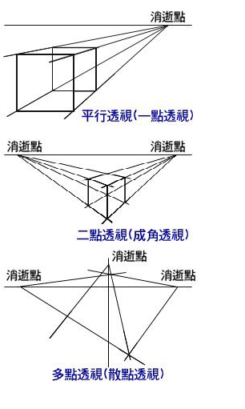

# 3D 变换

CSS3 中提供了对元素进行 3D 变换的属性，首先来认识一下 CSS3 中的空间坐标：


在浏览器中，X 轴是从左到右，Y 轴是从上到下，Z 轴是从里到外

## 景深（perspective）

景深（英语：Depth of field, DOF）景深是指相机对焦点前后相对清晰的成像范围。在光学中，尤其是录影或是摄影，是一个描述在空间中，可以清楚成像的距离范围。虽然透镜只能够将光聚到某一固定的距离，远离此点则会逐渐模糊，但是在某一段特定的距离内，影像模糊的程度是肉眼无法察觉的，这段距离称之为景深。当焦点设在超焦距处时，景深会从超焦距的一半延伸到无限远，对一个固定的光圈值来说，这是最大的景深。

简单的理解，**景深就是我们的肉眼距离显示器的距离，景深越大，元素离我们越远，效果就不好**，在CSS3 中，perspective 用于激活一个 3D 空间，属性值就是景深大小（默认none无景深），应用景深的元素称为**舞台元素**，舞台元素的所有后代元素都会受影响，（如果后代元素中也添加了 perspective 属性，效果会叠加而不是覆盖，应当尽量避免景深的叠加）。
 
- `transform: perspective(depth);` depth 的默认值是 none，可以设置为一个长度值，这个长度是沿着 Z 轴距离坐标原点的距离。1000px 被认为是个正常值，若使用 `perspective()` 函数，那么它必须被放置在 transform 属性的首位，如果放在其他函数之后，则会被忽略。
- `perspective: depth;` 同 perspective() 函数一样，depth 的默认值是 none，可以设置为一个长度值，这个长度是沿着 Z 轴距离坐标原点的距离。他们唯一的区别是，perspective 属性是被用于元素的后代元素，而不是元素本身；就是说，为某个元素设置 perspective 属性后，是对这个元素的子元素起作用，而不是这个元素本身。
- perspective-origin：同 perspective 属性，也是设置在父元素上，对后代元素起作用。 这个属性用来设置你在 X, Y 轴坐标确定的那个点来看这个元素，Z轴是被 perspective 属性设置的 

## 灭点

指的是立体图形各条边的延伸线所产生的相交点。透视点的消失点



## transform-style

这个属性指定了子元素如何在空间中展示，只有两个属性值：flat（默认）和 preserve-3d

- flat(默认值) 表示所有子元素在 2D 平面呈现，即子元素将不保留其 3D 位置。
- preserve-3d 表示所有子元素在 3D 平面呈现，子元素将保留其 3D 位置。
 
如果被扁平化，则子元素不会独立的存在于三维空间。因为该属性不会被（自动）继承，所以必须为元素所有非叶后代节点设置该属性。

具体参考[【CSS3进阶】酷炫的3D旋转透视](https://www.cnblogs.com/coco1s/p/5414153.html)

## backface-visibility

一个元素分两面，但并不意味元素有厚度。在一个状态下，元素只能展现自己的一面。`backface-visibility: keyword;`属性用来设置是否显示元素的背面，默认是显示的，keyword 有两个值，hidden 和 visible，默认值是 visible。

## 3D 缩放

```css
transform: scaleZ(number)
transform: scale3d(scaleX,scaleY,scaleZ);
```

如果只设置 scaleZ(number)，你会发现元素并没有被扩大或压缩，`scaleZ(number)` 需要和 `translateZ(length)` 配合使用，number 乘以 length 得到的值，是元素沿 Z 轴移动的距离，从而使得感觉被扩大或压缩。

## 3D 平移

```css
transform: translateZ(length)
transform: translate3d(translateX,translateY,translateZ);
```

translateZ 是 3D Transformaton 特有的，其他两个 2D 中就有，`translateZ` 不能是百分比值; 那样的移动是没有意义的。

## 3D 旋转

CSS3 中的 3D 旋转主要包括四个功能函数

- `rotateX(angle)`
- `rotateY(angle)`
- `rotateZ(angle)` 等价于 `rotate(angle)`
- `rotate3d(x,y,z,angle)`， x, y, z 分别接受一个数值(number),用来计算矢量方向(direction vector)，矢量方向是三维空间中的一条线, 从坐标系原点到 x, y, z 值确定的那个点，元素围绕这条线旋转 angle 指定的值。

