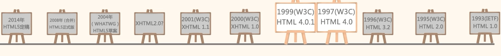

# HTML简介

**HTML是负责描述文档语义的语言**，HTML是英语 `Hyper Text Markup Language` 的缩写，超文本标记语言。`.html`就是网页的格式。

HTML是最基础的网络语言，HTML是通过标签来定义的语言，不区分大小写。**其操作思想是**：为了操作数据，都需要对数据进行不同标签的封装，通过标签中的属性对封装的数据进行操作。标签就相当于一个容器。对容器中的数据进行操作，就是在不断地改变容器的属性值。

现在的业界的标准，网页技术严格的三层分离：

- **html** 就是负责描述页面的语义；
- **css** 负责描述页面的样式；
- **js** 负责描述页面的动态效果的。

所以，html 不能让文字居中，不能更改文字字号、字体、颜色。因为这些都是属于样式范畴，都是 css 干的事；html 不能让盒子运动起来，因为这些属性行为范畴，都是 js 干的事。html 只能干一件事，就是通过标签对，给文本增加语义。这是 html 唯一能做的.**html中，除了语义，其他什么都没有**，一个设计优良的网页要求结构、表现、行为三者分离。

**标签语义化**：HTML 语义化是指仅仅从 HTML 元素上就能看出页面的大致结构，比如需要强调的内容可以放在 <strong> 标签中，而不是通过样式设置 <span> 标签去做。

---
## 1 HTML骨架

### 完整的骨架

```html
<!DOCTYPE html PUBLIC "-//W3C//DTD XHTML 1.0 Transitional//EN" "http://www.w3.org/TR/xhtml1/DTD/xhtml1-transitional.dtd">
<html xmlns="http://www.w3.org/1999/xhtml" xml:lang="en">

    <head>
        <meta http-equiv="Content-Type" content="text/html;charset=UTF-8">
        <title>哈哈哈</title>
    </head>

    <body>
        <h1>我是一个主标题</h1>
        <p>我是一个小段落</p>
    </body>

</html>
```

- html 是根标签。
- head 中的所有内容都不会展示在网页上，用于定义一些元数据。
- body 网页的主题部分。

### 文档声明头

第1行是网页的 **声明头**，网页声明头可以告诉浏览器，这是一个什么标准的页面。术语叫做 **DocType Defintion** ，文档类型定义，简称 DTD。**W3C** 就是出 web 规范的组织机构。html、css、js 的规范都是 W3C 定义发布的。W3C 即 `world wide web coalition` 国际万维网联盟。任何一个标准的 HTML 页面，第一行一定是一个以`<!DOCTYPE ……`开头的语句。此标签可告知浏览器文档使用哪种 HTML 或 XHTML 规范。那么到底有哪些规范呢？

---
## 2 Html 版本与规范

 Html 历史参考下图：



### HTML4.0.1

**HTML4.01** 是在 IE6 开始兼容的。HTML4.01 里面有两大种规范，每大种规范里面又各有 3 种小规范。所以一共 6 种规范，`HTML4.01` 里面规定了 **普通、XHTML** 两大种规范。

>HTML 标准制定者觉得 HTML 有一些规定不严谨，比如，标签是否可以用大写字母呢？`<H1></H1>` 所以XHTML 的出现用于严格规范 HTML，在 XHTML 中的字母 X 表示 **严格的**。

在 HTML 4.01 中，文档类型声明需要引用 DTD（Document Type Definition，文档类型定义），这是因为 HTML 4.01 基于 SGML（Standard Generalized Markup Language，通用标记语言）。

总结一下，一共有 6种 DTD：

大规范|小规范
---|---
HTML 4.01| Strict 严格的，体现在一些标签不能使用，比如 `u` 
HTML 4.01| Transitional   普通的
HTML 4.01| Frameset     带有框架的页面
XHTML1.0 严格体现在小写标签、闭合、引号|Strict 严格的，体现在一些标签不能使用，比如`u`
XHTML1.0 严格体现在小写标签、闭合、引号|Transitional   普通的
XHTML1.0 严格体现在小写标签、闭合、引号|Frameset     带有框架的页面

- **strict** 表示 **严格的**，这种模式里面的要求更为严格,这种严格体现在哪里？有一些标签不能使用，比如`u`标签，就是可以让一个本文加上下划线，但是这和HTML的本质有冲突，因为HTML只能负责语义，不能负责样式，而u这个下划线是样式。所以，在strict中是不能使用u标签的。`<u>嘻嘻嘻嘻嘻</u>`怎么给文本增加下划线呢？使用css属性来解决。
- **Transitional** 表示“普通的”，这种模式就是没有一些别的规范
- **Frameset** 表示“框架”，在框架的页面使用

### HTML5

IE9 开始兼容 HTML5，HTML5 不基于 SGML，所以不需要引入 DTD，其的文档声明很简单 ：

```html
<!DOCTYPE html>
<html>
    <head>
        ...
    </head>
    <body>
        ....
    </body>
</html>
```

