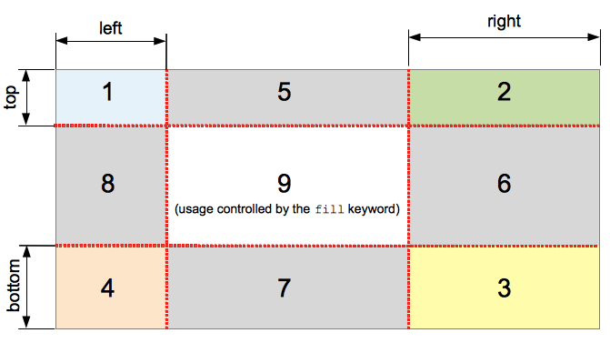

# 新的 UI 样式

## 1 文本新增样式

### opacity

opacity 属性指定了一个元素的透明度，默认值：`1.0`，不可继承。

### 新增颜色模式 rgba

支持了带透明度的颜色

### 文字阴影

text-shadow 用来为文字添加阴影，而且可以添加多层，阴影值之间用逗号隔开。（多个阴影时，第一个阴影在最上边），默认值：none，该属性不可继承。

相关效果：

- 浮雕文字
- 文字模糊

### 文字描边

只有 webkit 内核才支持：`-webkit-text-stroke`（准确的来说不能算是css3的东西，但需要知道）。

### 文字排版

`direction:`控制文字的方向，一定要配合 `unicode-bidi:bidi-override;` 来使用。

确定如何向用户发出未显示的溢出内容信号：

- 它可以被剪切，
- 显示一个省略号（'...'）
- 包裹区域必须不能让子元素撑开

```css
white-space=no-wrap
overflow=hidden
text-overflow=ellipsis
```

## 2 盒模型新增样式

### 盒模型阴影

box-shadow：以逗号分割列表来描述一个或多个阴影效果，可以用到几乎任何元素上。如果元素同时设置了 `border-radius` ，阴影也会有圆角效果。多个阴影时和多个 `text shadows` 规则相同(第一个阴影在最上面)。默认值: `none` 不可继承。

具体参考：

- [W3C：CSS3 box-shadow 属性](http://www.w3school.com.cn/cssref/pr_box-shadow.asp)
- [MDN：CSS3 box-shadow 属性](https://developer.mozilla.org/zh-CN/docs/Web/CSS/box-shadow)
- [CSS3 box-shadow](https://www.w3cplus.com/content/css3-box-shadow)

### 倒影

`-webkit-box-reflect` 设置元素的倒影，默认值`:none`，不可继承。

值必须是 123 的顺序：

- 倒影的方向：第一个值，above, below, right, left
- 倒影的距离：第二个值，长度单位
- 渐变：第三个值

>准确的来说不能算是 css3 的东西，但需要知道

### resize

resize CSS 属性允许你控制一个元素的可调整大小性。**（一定要配合overflow：auto使用）**，默认值：none，不可继承。

可选择值：

- none：元素不能被用户缩放。 
- both：允许用户在水平和垂直方向上调整元素的大小。
- horizontal：允许用户在水平方向上调整元素的大小。
- vertical：允许用户在垂直方向上调整元素的大小。

### box-sizing

`box-sizing` 属性用于更改用于计算元素宽度和高度的默认的 CSS 盒子模型。可以使用此属性来模拟不正确支持 CSS 盒子模型规范的浏览器的行/列为。默认值：`content-box`，不可继承。

可选值：

- content-box
    - 默认值，标准盒子模型。 width 与 height 只包括内容的宽和高， 不包括边框（border），内边距（padding），外边距（margin）。注意: 内边距, 边框 & 外边距 都在这个盒子的外部。 比如：如果 `.box {width: 350px};` 而且 `{border: 10px solid black;}` 那么在浏览器中的渲染的实际宽度将是 370px;
    - 尺寸计算公式：`width = 内容的宽度`，`height = 内容的高度`。宽度和高度都不包含内容的边框（border）和内边距（padding）。
- border-box
    - width 和 height 属性包括内容，内边距和边框，但不包括外边距。这是当文档处于 Quirks 模式时 Internet Explorer 使用的盒模型。
    - 这里的维度计算为：`width = border + padding + 内容的 width`，`height = border + padding + 内容的 height`。

## 3 新增 UI 样式

### 圆角

传统的圆角生成方案，必须使用多张图片作为背景图案，CSS3 圆角的出现，使得我们再也不必浪费时间去制作这些图片了，而且还有其他多个优点：

* 减少维护的工作量。图片文件的生成、更新、编写网页代码，这些工作都不再需要了。
* 提高网页性能。由于不必再发出多余的HTTP请求，网页的载入速度将变快。
* 增加视觉可靠性。某些情况下（网络拥堵、服务器出错、网速过慢等等），背景图片会下载失败，导致视觉效果不佳。CSS3就不会发生这种情况

`border-radius`用来设置边框圆角。当使用一个半径时确定一个圆形；当使用两个半径时确定一个椭圆，这个(椭)圆与边框的交集形成圆角效果。默认值:0，不可继承。
               
- 固定的 px 值定义圆形半径或椭圆的半长轴，半短轴。不能用负值
- 使用百分数定义圆形半径或椭圆的半长轴/半短轴。水平半轴相对于盒模型的宽度；垂直半轴相对于盒模型的高度。不能用负值    

可选值：
```css      
        这是一个简写属性 

           border-top-left-radius,
           border-top-right-radius,
           border-bottom-right-radius，
           border-bottom-left-radius

       半径的第一个语法取值可取 1~4 个值:
           border-radius: radius             
           border-radius: top-left-and-bottom-right top-right-and-bottom-left 
           border-radius: top-left top-right-and-bottom-left bottom-right 
           border-radius: top-left top-right bottom-right bottom-left 
 
       半径的第二个语法取值也可取 1~4 个值
           border-radius: (first radius values) / radius             
           border-radius: (first radius values) / top-left-and-bottom-right top-right-and-bottom-left 
           border-radius: (first radius values) / top-left top-right-and-bottom-left bottom-right 
           border-radius: (first radius values) / top-left top-right bottom-right bottom-left 
```

注意百分比值：

- 在旧版本的 Chrome 和 Safari 中不支持。(fixed in Sepember 2010)
- 在 11.50 版本以前的 Opera 中实现有问题。
- Gecko 2.0 (Firefox 4) 版本前实现不标准：水平半轴和垂直半轴都相对于盒子模型的宽度。
- 在旧版本的 iOS (iOS 5 之前) 和 Android 中 (WebKit 532 之前) 不支持。

### 边框图片

`border-image` 属性允许在元素的边框上绘制图像。这使得绘制复杂的外观组件更加简单，使用 `border-image` 时，其将会替换掉 `border-style` 属性所设置的边框样式。

默认值（不可继承）：

```css
   border-image-source: none
   border-image-slice: 100%
   border-image-width: 1
   border-image-outset: none
   border-image-repeat: stretch
```

- border-image-source: 定义使用一张图片来代替边框样式；如果只为none，则仍然使用border-style 定义的样式。
- border-image-slice: 该属性会通过规范将 `border-image-source` 的图片明确的分割为 9 个区域：四个角，四边以及中心区域，并可指定偏移量。**值的百分比参照于image本身**。
    - 
- border-image-width: 定义图像边框宽度。 
- border-image-outset: 定义边框图像可超出边框盒的大小，正值：可超出边框盒的大小。
- border-image-repeat: 定义图片如何填充边框。或为单个值，设置所有的边框；或为两个值，分别设置水平与垂直的边框。
    - 值 `stretch`（拉伸）
    - 值 `repeat，round`（平铺）

### 背景

#### CSS2 背景

- background-color：会设置元素的背景色，默认值：`transparent`，不可继承。
- background-image：用于为一个元素设置一个或多个背景图像，图像在绘制时，以z轴方向堆叠的方式进行。先指定的图像会在之后指定的图像上面进行绘制。注意：background-color 会在 image 之下进行绘制，边框和内容会在 image 之上进行绘制。默认值：`none`，不可继承。
- background-repeat：定义背景图像的重复方式。背景图像可以沿着水平轴，垂直轴，两个轴重复，或者根本不重复。默认值：`repeat`，不可继承。
- background-position：指定背景位置的初始位置。
- background-attachment：决定背景是在视口中固定的还是随包含它的区块滚动的。
    - fixed 此关键字表示背景相对于视口固定。即使一个元素拥有滚动机制，背景也不会随着元素的内容滚动。
    - scroll 此关键字表示背景相对于元素本身固定， 而不是随着它的内容滚动。

#### CSS3 背景

- background-origin：设置背景的渲染的起始位置。
- background-clip：设置背景裁剪位置。
- background-size：设置背景图片大小。
    - 默认值：auto auto  不可继承。
    - 值使用百分比时：指定背景图片相对背景区（background positioning area）的百分比。背景区由background-origin设置，默认为盒模型的内容区与内边距。
    - 值使用auto 时：以背景图片的比例缩放背景图片。
    - 注意：单值时，这个值指定图片的宽度，图片的高度隐式的为 auto，两个值时: 第一个值指定图片的宽度，第二个值指定图片的高度。   
- background：是CSS简写属性，用来集中设置各种背景属性。background 可以用来设置一个或多个属性：`background-color, background-image, background-position, background-repeat, background-size, background-attachment`。 

默认值：

```css
background-image: none
background-position: 0% 0%
background-size: auto auto
background-repeat: repeat
background-origin: padding-box
background-clip: border-box
background-attachment: scroll
background-color: transparent
```

### 渐变

- linear-gradient：线性渐变
- radial-gradient：径向渐变

参考

- [mdn linear-gradient](https://developer.mozilla.org/zh-CN/docs/Web/CSS/linear-gradient)
- [mdn radial-gradient](https://developer.mozilla.org/zh-CN/docs/Web/CSS/radial-gradient)