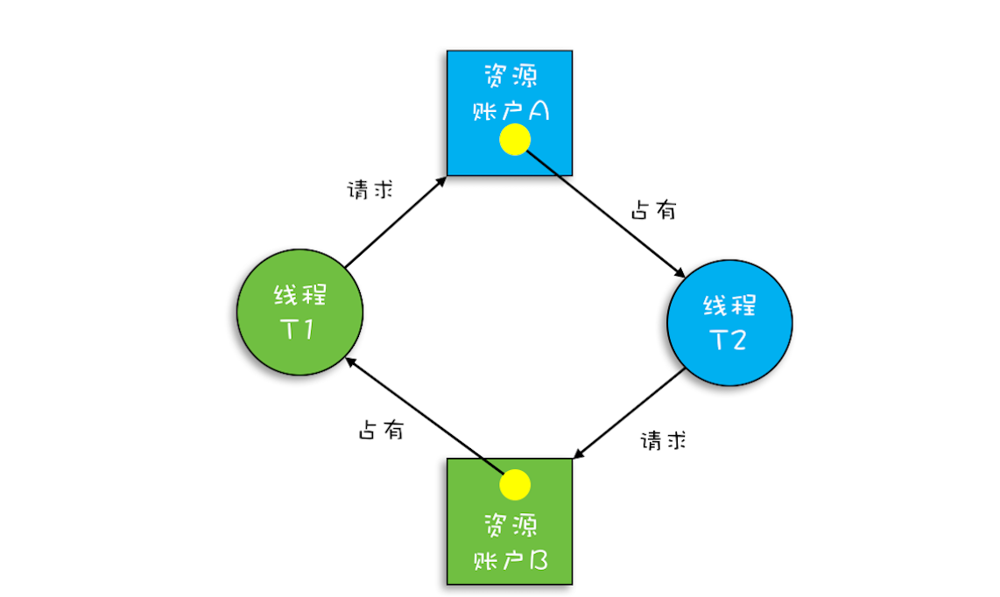

# 死锁问题

## 1 转账问题优化

在[03-互斥锁](03-互斥锁.md)中有讲到转账问题，保证安全转账最简单的方式就是只使用一把粗粒度锁，保护所有的账户：

```java
class Account {
  private int balance;

  // 转账
  void transfer(Account target, int amt){
    synchronized(Account.class) {
      if (this.balance > amt) {
        this.balance -= amt;
        target.balance += amt;
      }
    }
  }
}
```

但是这样有严重的性能问题，所有的转账都变成串行了，这是不可接受的，于是我们需要对加锁进行优化。

## 2 初步优化引发的死锁问题

对上述问题的优化思路是，仅针对转账操作涉及到用户进行加锁，具体代码如下：

```java
/**
 * 每个用户对应一个 Account 对象。
 */
class Account {

    private int balance;

    /**
     * 转账
     *
     * @param target 转入账户
     * @param amt    转入金额
     */
    void transfer(Account target, int amt) {
        // 锁定转出账户
        synchronized (this) {
            // 锁定转入账户
            synchronized (target) {
                if (this.balance > amt) {
                    this.balance -= amt;
                    target.balance += amt;
                }
            }
        }
    }

}
```

使用细粒度锁可以提高并行度，是性能优化的一个重要手段。但是使用细粒度锁是有代价的，这个代价就是可能会导致**死锁**。死锁的一个比较专业的定义是：**一组互相竞争资源的线程因互相等待，导致“永久”阻塞的现象**。这里的优化就可以引发死锁。

这里是如何发生死锁的呢？

1. 假设线程 T1 执行账户 A 转账户 B 的操作，账户 `A.transfer(账户 B)`；
2. 同时线程 T2 执行账户 B 转账户 A 的操作，账户 `B.transfer(账户 A)`。

可能产生的情况是 T1 获取了账户 A 的锁，试图获取账户 B 的锁，T2 获取了账户 B 的锁，试图获取账户 A 的锁，这样这两个线程将永远等待下去，死锁就产生了。

### 借助资源分配图来可视化锁的占用情况

资源分配图是个有向图，它可以描述资源和线程的状态

- 资源用方形节点表示，线程用圆形节点表示。
- 资源中的点指向线程的边表示线程已经获得该资源。
- 线程指向资源的边则表示线程请求资源，但尚未得到。

转账发生死锁时的资源分配图就如下图所示：



## 3 如何预防死锁

**并发程序一旦死锁，一般没有特别好的方法，很多时候我们只能重启应用。因此，解决死锁问题最好的办法还是规避死锁**。

要避免死锁就需要分析死锁发生的条件，有个叫 Coffman 的牛人总结过了，只有以下这四个条件都发生时才会出现死锁：

1. **互斥**，共享资源 X 和 Y 只能被一个线程占用；
2. **占有且等待**，线程 T1 已经取得共享资源 X，在等待共享资源 Y 的时候，不释放共享资源 X；
3. **不可抢占**，其他线程不能强行抢占线程 T1 占有的资源；
4. **循环等待**，线程 T1 等待线程 T2 占有的资源，线程 T2 等待线程 T1 占有的资源，就是循环等待。

因此，**只要我们破坏其中一个，就可以成功避免死锁的发生**。对应以上四个条件，在解决死锁时，有如下对应操作：

1. 对于互斥：这个条件我们没有办法破坏，因为我们用锁为的就是互斥。
2. 对于“占用且等待”这个条件，我们可以一次性申请所有的资源，这样就不存在等待了。
3. 对于“不可抢占”这个条件，占用部分资源的线程进一步申请其他资源时，如果申请不到，可以主动释放它占有的资源，这样不可抢占这个条件就破坏掉了。
4. 对于“循环等待”这个条件，可以靠按序申请资源来预防。所谓按序申请，是指资源是有线性顺序的，申请的时候可以先申请资源序号小的，再申请资源序号大的，这样线性化后自然就不存在循环了。

### 破坏“占用且等待条件”

对于“占用且等待”这个条件，我们可以一次性申请所有的资源，这样就不存在等待了。对应上面的转账实例，一个线程想要执行 A 给 B 转账的操作，必须同时获取 A 和 B 两个资源，代码示例如下：

- Allocator 采用单例模式，用于一次性申请和释放多个资源。
- 某个线程想要执行转账操作，必须先向 Allocator 一次性申请转账操作涉及到的账户。
- 本质上这里的破坏“占用且等待条件”，其实还是只使用一把锁去保护多个要申请的资源。

```java

/**
 * 破坏占用且等待条件
 *
 * @author Ztiany
 * Email ztiany3@gmail.com
 * Date 2019/8/11 11:55
 */
public class BreakDeathLock01 {

    public static void main(String... args) {
        Account accountA = new Account(300);
        Account accountB = new Account(400);
        accountA.transfer(accountB, 100);
        System.out.println("accountA " + accountA.getBalance());
        System.out.println("accountB " + accountB.getBalance());
    }

    /**
     * Allocator 管理临界区，它有两个重要功能，分别是：同时申请资源 apply() 和同时释放资源 free()。
     */
    static class Allocator {

        private static Allocator instance = new Allocator();

        static Allocator getInstance() {
            return instance;
        }

        private Allocator() {
        }

        private List<Object> als = new ArrayList<>();

        // 一次性申请所有资源
        synchronized boolean apply(Object from, Object to) {
            if (als.contains(from) || als.contains(to)) {
                return false;
            } else {
                als.add(from);
                als.add(to);
            }
            return true;
        }

        // 一次性归还资源
        synchronized void free(Object from, Object to) {
            als.remove(from);
            als.remove(to);
        }
    }

    static class Account {

        private Allocator allocator = Allocator.getInstance();
        private int balance;

        Account(int balance) {
            this.balance = balance;
        }

        int getBalance() {
            return balance;
        }

        // 转账
        void transfer(Account target, int amt) {
            // 一次性申请转出账户和转入账户，直到成功
            while (!allocator.apply(this, target)) ;

            try {
                // 锁定转出账户
                synchronized (this) {
                    // 锁定转入账户
                    synchronized (target) {
                        if (this.balance > amt) {
                            this.balance -= amt;
                            target.balance += amt;
                        }
                    }
                }
            } finally {
                allocator.free(this, target);
            }
        }

    }

}
```

这里有一个疑问：使用 while 循环获取锁，后面的 `synchronized(this)` 与 `synchronized(target)` 是不是就可以去掉了呢？这个例子里可以，因为除此之外没有其他路径能够访问到 this，但是如果还有别的方法，例如取款操作，那就不可以了。

### 破坏“不可抢占条件”

- 破坏不可抢占条件的核心是要**能够主动释放它占有的资源**，这一点 synchronized 是做不到的。原因是 synchronized 申请资源的时候，如果申请不到，线程直接进入阻塞状态了，而线程进入阻塞状态，无法执行任何指令，也释放不了线程已经占有的资源。
- 在 JDK1.5 `java.util.concurrent` 这个包下面提供的 Lock 是可以轻松解决这个问题的。

### 破坏“循环等待条件”

上面示例之所以会发生死锁的一个重要因素是，两个线程要获取的资源是整体上是相同的（A、B两个账户），但是线程获取顺序不一致（一个先获取A，一个先获取B），这就导致了循环等待条件的成立，所以破坏循环等待条件的做法是，让两个线程申请资源的顺序一致：

- 实际开发中，每个用户必然有一个 id 属性。
- 在申请资源的时候，可以根据 id 对账户先进行排序，让线程按循序获取账户资源，这样任何一个线程所申请资源的顺序都是一致的了， 就破坏了“循环等待条件”。

```java
/**
 * 破坏循环等待条件
 *
 * @author Ztiany
 * Email ztiany3@gmail.com
 * Date 2019/8/11 12:09
 */
public class BreakDeathLock02 {

    public static void main(String... args) {

    }

    static class Account {

        private int id;
        private int balance;

        public Account(int id, int balance) {
            this.id = id;
            this.balance = balance;
        }

        // 转账
        void transfer(Account target, int amt) {

            Account left = this;
            Account right = target;
            if (this.id > target.id) {
                left = target;
                right = this;
            }

            // 锁定序号小的账户
            synchronized (left) {
                // 锁定序号大的账户
                synchronized (right) {
                    if (this.balance > amt) {
                        this.balance -= amt;
                        target.balance += amt;
                    }
                }
            }
        }
    }

}
```

## 4 总结

- 用细粒度锁来锁定多个资源时，要注意死锁的问题。
- 针对多种解决方案，需要评估一下操作成本，从中选择一个成本最低的方案。

## 5 思考

在**破坏占用且等待条件**的例子中使用了死循环 `while(!actr.apply(this, target));` 这个方法，那它比 `synchronized(Account.class)` 有没有性能优势呢？

- `synchronized(Account.class)` 方式使所有的转账操作都变成了串行操作，但是自始至终只有一把锁。
- `while(!actr.apply(this, target));` 方式其实也是让所有的线程串行地去申请资源，在获取到资源后又要进入两次锁，看上去比 `synchronized(Account.class)` 性能更差，但是考虑到以下场景，`while(!actr.apply(this, target));` 可获得更好的性能：
  - 如果 Account 对象中还有其它业务，比如查看余额、取款等功能，这些功能也是需要加锁的。
  - 如果转账操作很慢，而 apply 很快，这个时候允许 `a->b, c->d` 并行就有优势了。

**所以不能抛开具体的场景去谈性能**。
