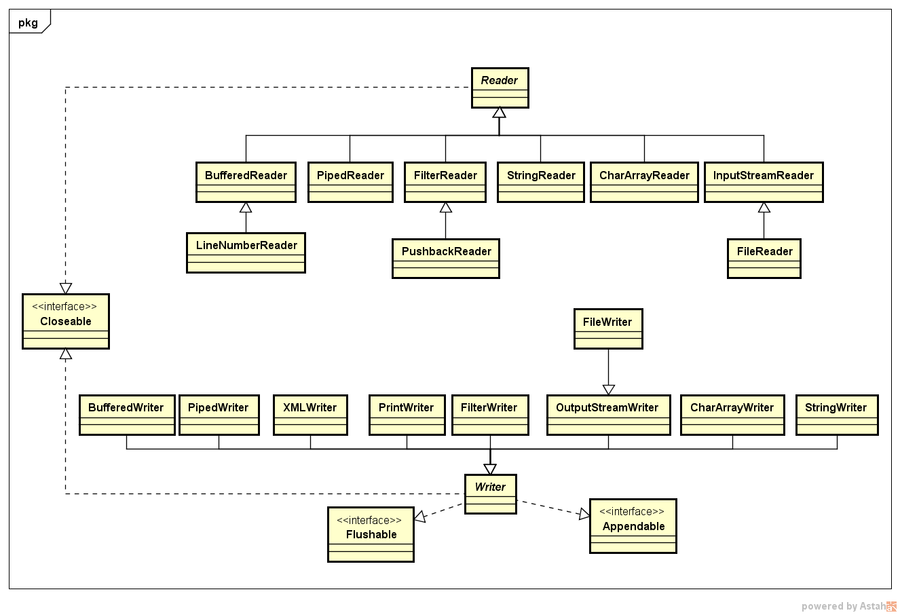

# Java IO学习

---
## 1 流

**流概念:表示可以从其中读入一个字节序列的对象称做输入流，可以向其中写入一个字节序列的对象称做输出流**。这些字节序列的来源地和目的地通常都是文件，但也有可能是网络连接、甚至是内存块。

Java中抽象的`InputStream`和`OutputStream`构成了输入/输出(IO)类层次结构的基础。

### InputStream 和 OutputStream

- read和write都是阻塞的，直到字节确实可以被读入或者写出。read方法在碰到流的结尾时返回-1。
- available检查当前可以读入的字节数量(返回的是在不阻塞情况下可获得的字节数，阻塞意味着当前线程将失去它对资源的占用)。
- flush方法用于冲刷输出流的缓冲区。
- close方法用于关闭流，关闭一个输出流将在关闭流之前冲刷这个流的缓冲区。

### Reader 和 Writer

Reader 和 Writer 用于字符流的读写。

### InputStreamReader 和 OutputStreamWriter

InputStreamReader 和 OutputStreamWriter 是字节流和字符流之间的桥梁。

---
## 2 完整的流家族

### 字节流


### 字符流



### AutoCloseable

AutoCloseable用于java1.7中在try语句中自动关闭资源。

```java
      try (RandomAccessFile file = new RandomAccessFile(new File("RandomAccessFileDemo.txt"), "rw")) {
            System.out.println(file.readBoolean());
            file.writeBoolean(true);
            file.write(3);
            file.write(3);
            file.write(3);
            file.writeUTF("ztiany");
        } catch (IOException e) {
            e.printStackTrace();
        }
```

由于RandomAccessFile是AutoCloseable的，所以在java1.7以上，可以使用这种语法，在代码允许结束后，RandomAccessFile将会自动关闭。

### 组合流过滤器

Java在IO类库中大量的使用装设设计模式，以基于基础的读写功能实现更加强大的字节和字符的读写。

---
## 3 文件的输入和输出

在保存数据时，可以选择二进制格式（`00 00 04 D`）或者文本格式。例如在存储整数 `1234` 时，两种存储方式为：

- 二进制格式:00 00 04 D2
- 文本格式：1234

在存储文本字符串时需要考虑字符编码(character encoding)，以二进制格式写出数据，需要使用`DataOutputStream`，以文本格式写出数据，可以使用`PrintWriter`。

---
## 4 字符集

### Charset

JDK1.4 引入 Charset **统一了对字符集的转换**，字符集建立了两字节Uncode码元序列与使用本地字符编码方式的字节序列之间的映射。Charset类使用的是由IANA字符集注册中心标准化的字符集名字。某些名字可能与之前版本的字符集名称略有差异，比如ISO-8859-1的官方名称现在是`ISO-8859-1`而不再是`ISO8859-1`。为了兼容名称的使用习惯，每个字符集都可能由多种别名，可使用aliases方法返回由别名构成的set对象。

```
            Charset gbk = Charset.forName("UTF-8");//使用静态方法获取一个Charset
            gbk.aliases().forEach(System.out::println);
            Charset.availableCharsets();//用于获取可用的字符集。
```


本地的编码方式不能表示所有的Unicode字符，如果某个字符不能表示，那么将用`？`表示，一旦有了字符集，就可以使用它在包含**Unicode码元的Java字符串**和**编码而成的字节序列**之间进行转换：

```
            //编码
            Charset charset = Charset.forName("UTF-8");
            ByteBuffer byteBuffer = charset.encode("Ztiany");
            byte[] array = byteBuffer.array();
            System.out.println(Arrays.toString(array));
            //解码
            ByteBuffer wrap = ByteBuffer.wrap(array);
            CharBuffer decode = charset.decode(wrap);//编码给定的字节序列，无法识别的将使用Unicode的替换字符('\uFFFD')替换
            System.out.println(decode.toString());
```

关于Unicode的可以参考[字符编码笔记：ASCII，Unicode和UTF-8](http://www.ruanyifeng.com/blog/2007/10/ascii_unicode_and_utf-8.html)

---
## 5 读写二进制数据

DataOutput接口定义了用于以二进制格式写数组、字符、boolean值和字符串的方法。
DataInput接口定义了用于以二进制格式读数组、字符、boolean值和字符串的方法。

字节排序方式：

- MSB(高位在前)
- LSB(地位在前)

**在Java中所有的值都是按照高位在前的模式写出的**

---
## 6 随机访问流

RandomAccessFile类可以在文件中的任何位置查找或写入数据。其同时实现了DataInput和DataOutput接口。RandomAccessFile的构造方法需要传入一个表示读写的模式：

- r表示制度模式
- rw表示读写模式
- rws表示每次更新时，都对数据和元数据的写磁盘操作进行同步的读和写:
- rwd表示每次更新时，只对数据的写磁盘操作进行同步的读和写

rws与rwd的区别：

- rws flushes the contents of the file and the modification date of the file.
- rwd flushs the contents of the file, but the modification date might not change until the file is closed.

具体模式的区别可以参考：[Java: RandomAccessFile Mode “rws” vs “rwd”?](http://stackoverflow.com/questions/14232539/java-randomaccessfile-mode-rws-vs-rwd)

---
## 7 zip文档

zip文档通常以压缩格式存储一个或多个文件，每个zip文档都有一个头，包含诸如每个文件的名字和所使用的压缩方法等信息。

常用类：

- ZipOutputStream
- ZipInputStream
- ZipFile
- ZipEntry

jar文件只是带有一个特殊项的zip文件，这个项称做清单，可以使用JarInputStream和JarOutputStream类来读写清单项。

具体参考[java压缩和解压缩Zip、Jar、Gzip文件](http://elim.iteye.com/blog/1235360)

---
## 8 对象序列化

相关类：

- Serializable
- ObjectOutputStream
- ObjectInputStream

### 注意点

- 1 定义了下面方法，数据将不会在继续自动序列化，而是调用下面方法

```java
     public static class A implements Serializable {
            private void readObject(ObjectInputStream inputStream) {
            }
            private void writeObject(ObjectOutputStream objectOutputStream) {
            }
    }
```

- 2 readObject和writeObject方法只需要保存和加载它们的数据域，而不需要关心超类数据和任何其他类信息， 可以实现Externalizable接口，来自定义类自己的机制，writeExternal和readExternal方法对包含超类数据在内的整个对象的存储和恢复负全责。

```java
    public interface Externalizable extends java.io.Serializable {
        void writeExternal(ObjectOutput out) throws IOException;
        void readExternal(ObjectInput in) throws IOException, ClassNotFoundException;
    }
```

- 3 记得给类定义serialVersionUID

- 4 **序列化与类型安全的枚举**
 - 即是构造器是私有的，序列化机制也可以创建新的对象！，因为他们不需要构造器来创建对象。具体参考《EffectiveJava》
 - 使用readResolve干涉反序列化过程
 - 如果readResolve被定义，那么对象在序列化之后将会调用次方法，其必须返回一个对象，作为readObject方法的返回值，也就是最终的反序列化结果。

下面就保证了即使Orientation被反序列化，Orientation的实例对象也只有两个：

```java
     public static class Orientation implements Serializable{

            static final long serialVersionUID = 41L;

            protected Object readResolve() throws ObjectStreamException {
                if (flag == 1) {
                    return HORIZONTAL;
                } else (flag == 2){
                    return VERTICAL;
                }
                return null;
            }
            public static final Orientation HORIZONTAL = new Orientation(1);
            public static final Orientation VERTICAL = new Orientation(2);
    
            private int flag;
    
            Orientation(int flag) {
                this.flag = flag;
            }
        }
```
