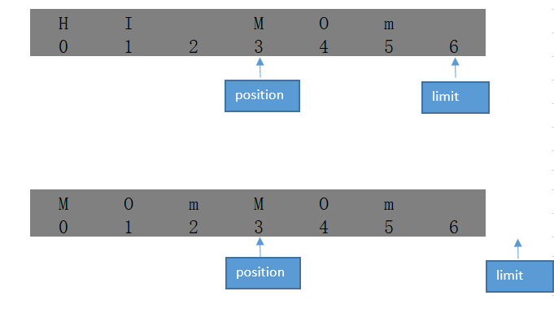
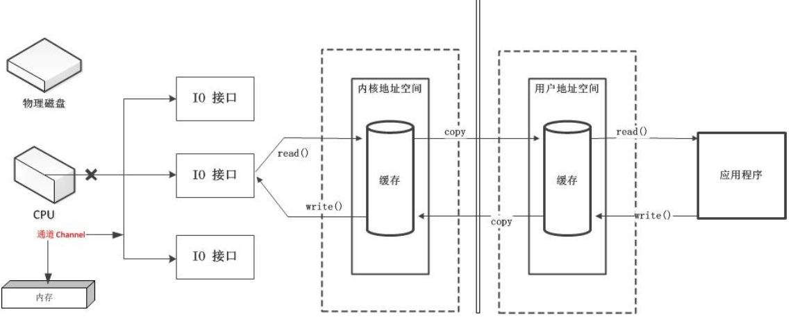
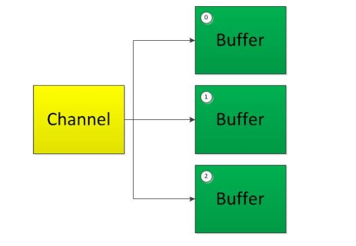

# NIO

---
## 1 什么是 IO

>I/O（英语：Input/Output），即输入/输出，通常指数据在内部存储器和外部存储器或其他周边设备之间的输入和输出。I/O 是信息处理系统（例如计算机）与外部世界（可能是人类或另一信息处理系统）之间的通信。输入是系统接收的信号或数据，输出则是从其发送的信号或数据。——《维基百科》

>总线（Bus）是指计算机组件间规范化的交换数据（data）的方式，即以一种通用的方式为各组件提供数据传送和控制逻辑。从另一个角度来看，如果说主板（Mother Board）是一座城市，那么总线就像是城市里的公共汽车（bus），能按照固定行车路线，传输来回不停运作的比特（bit）。这些线路在同一时间内都仅能负责传输一个比特。因此，必须同时采用多条线路才能发送更多数据，而总线可同时传输的数据数就称为宽度（width），以比特为单位，总线宽度愈大，传输性能就愈佳。总线的带宽（即单位时间内可以传输的总数据数）为：总线带宽 = 频率×宽度（Bytes/sec）。——《维基百科》

IO是由系统调度的，应用程序只能通过编程接口向系统提交IO操作，在然后系统会进行相关的IO操作，数据传输需要经过IO总线，IO总线的传输能力是有限的，IO操作是一种阻塞的操作，在完成系统完成IO操作前，调用程序的线程将会一直阻塞。

---
## 2 NIO 简介

Java NIO（New IO）是从Java 1.4版本开始引入的一个新的IO API，可以替代标准的Java IO API。NIO与原来的IO有同样的作用和目的，但是使用的方式完全不同，NIO支持**面向缓冲区的、基于通道**的IO操作。NIO将以更加高效的方式进行文件的读写操作。

Java NIO 与IO 的主要区别：

- 传统IO：面向流(Stream Oriented)、阻塞式IO(Blocking IO)
- NIO：面向缓冲区(Buffer Oriented)、非阻塞式IO(NonBlocking IO)、提供了选择器(Selectors)

NIO 相关内容：

1. Java NIO 简介
2. Java NIO 与IO 的主要区别
3. 缓冲区(Buffer)和通道(Channel)
4. 文件通道(FileChannel)
5. NIO 的非阻塞式网络通信
    - 选择器(Selector)
    - SocketChannel、ServerSocketChannel、DatagramChannel6.管道(Pipe)
7. Java NIO2 (Path、Paths 与Files )

---
## 3 缓冲区（Buffer）

Java NIO系统的核心在于：**通道(Channel)和缓冲区(Buffer)**。

- 通道表示打开到IO 设备(例如：文件、套接字)的连接。若需要使用NIO 系统，需要获取用于连接IO 设备的通道以及用于容纳数据的缓冲区。然后操作缓冲区，对数据进行处理。简而言之，Channel 负责传输，Buffer 负责存储。通道可以理解为铁路，而缓冲区可以理解为火车。
- 缓冲区（Buffer）是一个用于特定基本数据类型的容器。由java.nio 包定义的，所有缓冲区都是Buffer 抽象类的子类。Java NIO中的Buffer 主要用于与NIO 通道进行交互，数据是从通道读入缓冲区，从缓冲区写入通道中的。

Buffer 就像一个数组，可以保存多个相同类型的数据。根据数据类型不同(boolean 除外) ，有以下Buffer 常用子类：

- ByteBuffer
    - MappedByteBuffer
- CharBuffer
- ShortBuffer
- IntBuffer
- LongBuffer
- FloatBuffer
- DoubleBuffer

这些 Buffer 类都采用相似的方法进行管理数据，只是各自管理的数据类型不同而已。其中 MappedByteBuffer 比较特殊，用于实现内存映射文件，通过下面方法可以获取一个Buffer 对象：

```java
static xxBuffer allocate(int capacity)：创建一个容量为capacity 的XxxBuffer 对象
static ByteBuffer wrap(byte[] array)：从已有的内存区域创建 ByteBuffer对象
```

### 3.1 缓冲区的基本属性

Buffer 中的重要概念：

- **容量(capacity)** ：表示Buffer 最大数据容量，缓冲区容量不能为负，并且创建后不能更改。
- **限制(limit)**：第一个不应该读取或写入的数据的索引，即位于limit 后的数据不可读写。缓冲区的限制不能为负，并且不能大于其容量。
- **位置(position)**：下一个要读取或写入的数据的索引。缓冲区的位置不能为负，并且不能大于其限制，position 最大可以到 capacity-1.
- **标记(mark)与重置(reset)**：标记是一个索引，通过Buffer 中的mark() 方法指定Buffer 中一个特定的position，之后可以通过调用reset() 方法恢复到这个position.

标记、位置、限制、容量遵守以下不变式：`0 <= mark <= position <= limit <= capacity`


Buffer 的常用方法:

方法 | 描述
---|---
`Bufferclear()` | 清空缓冲区并返回对缓冲区的引用
`Buffer flip()` | 将缓冲区的界限设置为当前位置，并将当前位置充值为0
`int capacity()` | 返回Buffer 的capacity大小
`boolean hasRemaining()` | 判断缓冲区中是否还有元素
`int limit()` | 返回Buffer 的界限(limit) 的位置
`Bufferlimit(int n)` | 将设置缓冲区界限为n, 并返回一个具有新limit 的缓冲区对象
`Buffer mark()` | 对缓冲区设置标记
`int position()` | 返回缓冲区的当前位置position
`Buffer position(int n)` | 将设置缓冲区的当前位置为n , 并返回修改后的Buffer 对象
`int remaining()` | 返回position 和limit 之间的元素个数
`Buffer reset()` | 将位置position 转到以前设置的mark 所在的位置
`Buffer rewind()` | 将位置设为为0，取消设置的mark

### 3.2 缓冲区的数据操作

#### put 和 get

Buffer 所有子类提供了两个用于数据操作的方法：`get(`) 与 `put()` 方法

获取Buffer 中的数据：

- `get()` ：读取单个字节
- `get(byte[] dst)`：批量读取多个字节到dst 中
- `get(int index)`：读取指定索引位置的字节(不会移动position)

放入数据到Buffer 中：

- `put(byte b)`：将给定单个字节写入缓冲区的当前位置
- `put(byte[] src)`：将src 中的字节写入缓冲区的当前位置
- `put(int index, byte b)`：将指定字节写入缓冲区的索引位置(不会移动position)

一般使用 Buffer 的步骤为：

1. 把数据写入buffer
2. 调用buffer.flip()
3. 从Buffer中读取数据
4. 调用buffer.clear()

#### Buffer 的 `clear、file、rewind`方法总结

方法 | 调用后 Buffer 用于 | position | limit | mark
---|---|---|---|---|---
`Buffer clear()`| 将数据`read()/put()`进缓存区 | 0 | capacity | 未定义 |
`Buffer file()`| 从缓存区`write()/get()` | 0 | position | 未定义 |
`Buffer rewind()`| 从缓存区`rewrite()/get()` | 0 | 没有改变 | 未定义 |

- rewind 操作会将 position 设置为 0，并使 mark值无效，这适用于一种场景：在读取完数据后，希望将所有的数据都写入 logger 中。

#### 压缩 Buffer 中的数据

`compact()` 方法会将 position 与 limit 之间的数据复制到缓冲区的开始位置，从而为后续的 `put()` 调用让出空间，position 的值将设置为要复制的数据长度，limit 的值将设置为 capacity，mark将置为无效。



当调用 `compact()`，可 `put()` 的剩余空间变大了，这是一种空间优化手段。

#### Buffer透视

`duplicate()` 用于创建一个与原始缓冲区共享内容的新缓冲区，新缓冲区的position、limit、mark 和 capacity 都初始化为原始缓存取的索引值，它们的这些值都是相互独立的。同类的方法还有`slice、asReadOnlyBuffer、asCharBuffer`等等。

#### ByteOrder

ByteOrder 用于设置缓冲区的字节顺序，可以设置的字节顺序为：

- ByteOrder.BIT_ENDIAN （java 默认）
- ByteOrder.LITTLE_ENDIAN

通讯的双方必须采用一直的字节顺序。


### 3.3 直接与非直接缓冲区

**什么是非直接缓冲区**：非直接缓冲区即缓冲区分配在 JVM 中，IO操作需要经历：`用户地址空间（JVM内存）-> 内核空间地址 -> 物理磁盘`。参考下图：


**什么是直接缓冲区**：直接缓冲区是内核地址空间和用户地址空间之间形成了一个物理内存映射文件，可以减少了IO的copy过程。


- 字节缓冲区要么是直接的，要么是非直接的。如果为直接字节缓冲区，则Java 虚拟机会尽最大努力直接在此缓冲区上执行本机I/O 操作。也就是说，在每次调用基础操作系统的一个本机I/O 操作之前（或之后），虚拟机都会尽量避免将缓冲区的内容复制到中间缓冲区中（或从中间缓冲区中复制内容）。
- 直接字节缓冲区可以通过调用 `allocateDirect()` 工厂方法来创建。此方法返回的**缓冲区进行分配和取消分配所需成本通常高于非直接缓冲区**。直接缓冲区的内容可以驻留在常规的垃圾回收堆之外，因此，它们对应用程序的内存需求量造成的影响可能并不明显。所以，**建议将直接缓冲区主要分配给那些易受基础系统的本机I/O 操作影响的大型、持久的缓冲区**。一般情况下，最好仅在直接缓冲区能在程序性能方面带来明显好处时分配它们。
- 直接字节缓冲区还可以通过 `FileChannel.map()` 方法将文件区域直接映射到内存中来创建。该方法返回MappedByteBuffer。Java 平台的实现有助于通过JNI 从本机代码创建直接字节缓冲区。如果以上这些缓冲区中的某个缓冲区实例指的是不可访问的内存区域，则试图访问该区域不会更改该缓冲区的内容，并且将会在访问期间或稍后的某个时间导致抛出不确定的异常。
- 字节缓冲区是直接缓冲区还是非直接缓冲区可通过调用其 `isDirect()` 方法来确定。提供此方法是为了能够在性能关键型代码中执行显式缓冲区管理。

---
## 4 通道

通道（Channel）由 `java.nio.channels` 包定义。Channel 表示IO 源与目标打开的连接。Channel 类似于传统的“流”。只不过Channel 本身不能直接访问数据，Channel 只能与Buffer 进行交互。借助通道，可以用最小的总开销来访问操作系统本身的 I/O 服务。

### 4.1 I/O 调度衍进

早期 I/O 直接由 CPU 负责调度


DMA（直接存储器）：内存与 I/O 接口直接交互，这就是传统 I/O 的方式，但是大量 IO操作容易造成 DMA 总线冲突


通道：完全独立的处理器，附属于CPU，专门用于IO操作



### 4.2  通道（Channel）

```
public interface Channel extends Closeable {
    public boolean isOpen();
    public void close() throws IOException;
}
```

从接口看来，所有的通道都有这两种操作：检查通道的开启状态和关闭通道。Java 为Channel 接口提供的最主要实现类如下：

- FileChannel：用于读取、写入、映射和操作文件的通道。
- DatagramChannel：通过UDP 读写网络中的数据通道。
- SocketChannel：通过TCP 读写网络中的数据。
- ServerSocketChannel：可以监听新进来的TCP 连接，对每一个新进来的连接都会创建一个SocketChannel。

获取通道的一种方式是对支持通道的对象调用 `getChannel()` 方法。支持通道的类如下：

- FileInputStream
- FileOutputStream
- RandomAccessFile
- DatagramSocket
- Socket
- ServerSocket

获取通道的其他方式是使用 Files 类的静态方法 `newByteChannel()` 获取字节通道。或者通过通道实现类的静态方法 `open()` 打开并返回指定通道。广义上来说通道可以被分为两类：File I/O 和 Stream I/O。

通道的双向数据传输：

- 将 Buffer 中数据写入 Channel
- 从 Channel 读取数据到 Buffer
- 通道既可以是单向的也可以是双向的：只实现 ReadableByteChannel 接口中的 read() 方法或者只实现 WriteableByteChannel 接口中的 write() 方法的通道皆为单向通道，同时实现 ReadableByteChannel 和 WriteableByteChannel 为双向通道


### 4.3 分散（Scatter）和聚集（Gather）

分散读取（Scattering Reads）是指从Channel 中读取的数据“分散”到多个Buffer 中。按照缓冲区的顺序，从Channel 中读取的数据依次将Buffer 填满。



聚集写入（Gathering Writes）是指将多个Buffer 中的数据“聚集”到Channel。按照缓冲区的顺序，写入position 和limit 之间的数据到Channel 。


如果我们需要在 channel 读取的过程中，将不同片段写入到相应的 Buffer 里面（类似二进制消息分拆成消息头、消息体等），可以采用 NIO 分散-scatter机制来写入不同buffer

### 4.4 transferFrom 与 transferTo

`transferFrom()` 与 `transferTo()` 将数据从源通道传输到其他Channel 中，使用它们传输数据非常方便，采用的也是直接缓冲区的方式。


### 4.5 FileChannel 的常用方法

方法 | 描述
---|---
`int read(ByteBuffer dst)` | 从Channel 中读取数据到ByteBuffer
`long read(ByteBuffer[] dsts)` | 将Channel 中的数据“分散”到ByteBuffer[]
`int write(ByteBuffer src)` | 将ByteBuffer 中的数据写入到Channel
`long write(ByteBuffer[] srcs)` | 将ByteBuffer[] 中的数据“聚集”到Channel
`long position()` | 返回此通道的文件位置
`FileChannel position(long p)` | 设置此通道的文件位置
`long size()` | 返回此通道的文件的当前大小
`FileChannel truncate(long s)` | 将此通道的文件截取为给定大小
`void force(boolean metaData)` | 强制将所有对此通道的文件更新写入到存储设备中

### 4.6 Channels 工具类

Channels定义了几种静态工厂方法以便更容易的和流打交道：

方法 | 描述
---|---
`ReadableByteChannel newChannel(InputStream in)` | 返回一个将从给定的输入流读取数据的通道。
`WritableByteChannel newChannel(OutputStream out)` | 返回一个将向给定的输出流写入数据的通道。
`InputStream newInputStream(ReadableByteChannel ch)` | 返回一个将从给定的通道读取字节的流。
`OutputStream newOutputStream(WritableByteChannel ch)` | 返回一个将向给定的通道写入字节的流。
`Reader newReader(ReadableByteChannel ch, CharsetDecoder dec, int minBufferCap)` | 返回一个reader，它将从给定的通道读取字节并依据提供的字符集名称对读取到的字节进行解码。
`Reader newReader(ReadableByteChannel ch, String csName)` | 返回一个reader，它将从给定的通道读取字节并依据提供的字符集名称将读取到的字节解码成字符。
`Writer newWriter(WritableByteChannel ch, CharsetEncoder dec, int minBufferCap)` | 返回一个writer，它将使用提供的字符集名称对字符编码并写到给定的通道中。
`Writer newWriter(WritableByteChannel ch, String csName)` | 返回一个writer，它将依据提供的字符集名称对字符编码并写到给定的通道中。


---
## 5 NIO 的非阻塞式网络通信

### 5.1 阻塞与非阻塞

- 传统的IO 流都是阻塞式的。也就是说，当一个线程调用 `read()` 或 `write()` 时，该线程被阻塞，直到有一些数据被读取或写入，该线程在此期间不能执行其他任务。因此，在完成网络通信进行IO 操作时，由于线程会阻塞，所以服务器端必须为每个客户端都提供一个独立的线程进行处理，当服务器端需要处理大量客户端时，性能急剧下降。
- Java NIO 支持非阻塞模式 IO 操作。当线程从某通道进行读写数据时，若没有数据可用时，该线程可以进行其他任务。线程通常将非阻塞IO 的空闲时间用于在其他通道上执行IO 操作，所以单独的线程可以管理多个输入和输出通道。因此，NIO 可以让服务器端使用一个或有限几个线程来同时处理连接到服务器端的所有客户端。

关于阻塞与非阻塞、同步与异步IO可以参考[IO - 同步，异步，阻塞，非阻塞](https://blog.csdn.net/historyasamirror/article/details/5778378)。

### 5.2 通道的非阻塞工作模式

通道的工作模式有两种：阻塞或非阻塞：

- 在阻塞模式下，调用的线程会挂起。
- 在非阻塞模式下，调用的线程不会挂起，请求的操作会立刻返回结果，除FileChannel不能运行在非阻塞模式下，其余的通道都可阻塞运行也可以以非阻塞的方式运行。

实现非阻塞网络 IO 的三要素

1. 通道
2. 缓冲区
3. Selector：SelectableChannel的多路复用器

### 5.3 选择器（Selector）

选择器（Selector）是 SelectableChannle 对象的多路复用器，Selector 可以同时监控多个SelectableChannel 的 I/O 状况，也就是说，利用 Selector 可使一个单独的线程管理多个 Channel。从而大量的减少线程之间上下文切换的开销，**Selector 是非阻塞 I/O 的核心**。从 SelectableChannel 扩展出的类可以和 Selector 结合使用，进而充分利用多路复用的 I/O（multiplexed I/O）来提高性能。

需要注意的是 Channle 不能被重复使用，一个打开的 Channle 代表着与一个特定 I/O 服务进行连接并封装了该连接的状态，通道一旦关闭，该连接便会断开。通道的 `close()` 比较特殊，无论在通道时在阻塞模式下还是非阻塞模式下，由于 `close()` 方法的调用而导致底层 I/O 的关闭都可能会造成线程的**暂时阻塞**。

SelectableChannle 的继承结构如下：

```
    SelectableChannel
    |——AbstractSelectableChannel
            |——SocketChannel(TCP Client)
            |——ServerSocketChannel(TCP Server)
            |——DatagramChannel(UDP)
            |——SinkChannel(管道)
            |——SourceChannel(管道)
```

Selector 会监听注册到它上面的 Channel的状态，当客户端数据完全准备就绪后，Selector 才会把任务交给服务端的一个或多个线程上，Selector 的 `select()` 方法会阻塞等待，直到有一个或更多的  Channel 数量。 准备好了 IO 操作或者超时，select 方法返回的是可进行 I/O 操作的 Channel 数量。

Selector 非阻塞 I/O 编程步骤：

```
1 创建 Selector ：通过调用 `Selector.open()` 方法创建一个Selector。
2 向选择器注册通道：`SelectableChannel.register(Selector sel, int ops)`
3 当调用 `register(Selector sel, int ops)` 将通道注册选择器时，选择器对通道的监听事件，需要通过第二个参数 ops 指定。 SelectionKey的四个常量表示可以监听的事件类型，若注册时不止监听一个事件，则可以使用“位或”操作符连接
    - 读: SelectionKey.OP_READ
    - 写: SelectionKey.OP_WRITE
    - 连接: SelectionKey.OP_CONNECT
    - 接收: SelectionKey.OP_ACCEPT
4 循环调用 Selector 的 select() 方法获取准备就绪的 Channel，Channel封装在 SelectionKey 中
5 一个 SelectionKey 被处理完后，需要进行 remove，否则其仍然保留在集合中，从而造成下一次迭代时有无用的操作来调用它
```

#### SelectionKey

SelectionKey 表示 SelectableChannel 和 Selector 之间的注册关系。每次向选择器注册通道时就会选择一个事件(选择键)。选择键包含两个表示为整数值的操作集。操作集的每一位都表示该键的通道所支持的一类可选择操作。

方法 | 描述
---|---
`int   interestOps()` |  获取感兴趣事件集合
`int   readyOps()` |  获取通道已经准备就绪的操作的集合
`SelectableChannel  channel()` |  获取注册通道
`Selector  selector()` |  返回选择器
`boolean isReadable()` | 检测Channal 中读事件是否就绪
`boolean isWritable()` | 检测Channal 中写事件是否就绪
`booleanis Connectable()` | 检测Channel 中连接是否就绪
`booleanis Acceptable()` | 检测Channel 中接收是否就绪

#### Channel 附件

在调用重载的 `SelectionKey register(Selector sel, int ops, Object att)` 方法时，第三个参数用于设置一个与 SelectionKey 关联的附件，然后在之后的操作中，通过 SelectionKey 的 `attachment()` 方法获取该附件。另外使用 SelectionKey 的 `attach(Object obj)`也可以设置一个与之关联的附件，Channel 附件可以让每个 Channel 维护自身独立的状态。


#### Selector 的常用方法

方法 | 描述
---|---
`Set<SelectionKey> keys()` | 所有的 SelectionKey 集合。代表注册在该 Selector 上的
`Channel selectedKeys()` | 被选择的 SelectionKey 集合。返回此 Selector的已选择键集
`int select()` | 监控所有注册的 Channel，当它们中间有需要处理的IO 操作时，该方法返回，并将对应得的SelectionKey 加入被选择的 SelectionKey 集合中，该方法返回这些 Channel 的数量。
`int select(long timeout)` | 可以设置超时时长的 `select()` 操作
`int selectNow()` | 执行一个立即返回的 `select()` 操作，该方法不会阻塞线程
`Selector wakeup()` | 使一个还未返回的 `select()` 方法立即返回，由另一个线程调用
`void close()` | 关闭该选择器

### 5.4 FileChannel

Java NIO中的 FileChannel 是一个连接到文件的通道。可以通过文件通道读写文件。文件通道总是阻塞式的

### 5.5 SocketChannel

- Java NIO中的 SocketChannel 是一个连接到TCP网络套接字的通道。
- Java NIO中的 ServerSocketChannel 是一个可以监听新进来的TCP连接的通道，就像标准IO中的 ServerSocket一样。

ServerSocketChannel 是一个可以监听新进来的 TCP 连接的通道, 类似 ServerSocket 一样。要注意的是和DatagramChannel 和 SocketChannel不同，ServerSocketChannel 本身不具备传输数据的能力，而只是负责监听传入的连接和创建新的 SocketChannel。

- 在 JDK 1.7 之前，ServerSocketChannel没有 `bind()` 方法，因此需要通过它关联的的socket对象的 `socket()` 来绑定。从 JDK 1.7 及以后，可以直接通过 ServerSocketChannel 的 `socket()` 方法来绑定端口号。
- 通过 `ServerSocketChannel.accept()` 方法监听新进来的连接。在阻塞模式下当 `accept()` 方法返回的时候,它返回一个包含新进来的连接的 SocketChannel，否则 `accept()` 方法会一直阻塞到有新连接到达。在非阻塞模式下，在没有新连接的情况下，`accept()` 会立即返回 null，该模式下通常不会仅仅只监听一个连接,因此需在 while 循环中调用 `accept()`方法.

SocketChannel 是一个连接到TCP网络套接字的通道，它是 Socket 类的对等类，通常 SocketChannel 用在客户端以向服务器发起连接请求。每个 SocketChannel 对象创建时都关联一个对等的 Socket 对象。同样SocketChannel 可以运行在非阻塞模式下。SocketChannel对象 会在下面两种情况下被创建：

- 调用 `SocketChannel.open()` 方法并连接到互联网上的某台服务器
- 一个新连接到达 ServerSocketChannel 时，会创建一个 SocketChannel

关于 SocketChannel 需要注意：

- 通过 SocketChannel 的静态方法 `open()`创建 SocketChannel 对象.此时通道虽打开，但并未连接，此时如果进行 I/O 操作会抛出NotYetConnectedException异常。
- 通过 SocketChannel 对象的 `connect()`连接指定地址。该通道一旦连接它将保持连接状态直到被关闭。可通过 `isConnected()`来确定某个 SocketChannel 当前是否已连接。
- 如果 SocketChannel 在非阻塞模式下，调用 `connect()` 方法可能在连接建立之前就会返回了。为了确定连接是否建立，可以通过 `while(! socketChannel.finishConnect() )`的方式。
- 非阻塞模式下，`write()` 方法在尚未写出任何内容时可能就返回了。因为`write()`只会写出其能够发送的的数据，而不阻塞会等待所有数据发送完， 对于这种情况不应该在循环中调用 `write()`，而是通过 Buffer 的 `boolean hasRemaining()` 方法判断是否写完了，如果没有写完，则可以继续向 Selector 注册 `OP_WRITE` 事件
- 非阻塞模式下，`read()` 方法在尚未读取到任何数据时可能就返回了。所以需要判断它的返回值。


### 5.6 DatagramChannel

Java NIO中的 DatagramChannel是一个能收发 UDP 包的通道。

### 5.7 管道(Pipe)

Java NIO 管道是 2个线程之间的单向数据连接。Pipe 有一个source通道和一个sink通道。数据会被写到sink通道，从source通道读取。

---
## 6 NIO 2

随着JDK 7 的发布，Java对NIO进行了极大的扩展，增强了对文件处理和文件系统特性的支持，以至于我们称他们为NIO.2。因为NIO 提供的一些功能，NIO已经成为文件处理中越来越重要的部分。

### 5.1 Path 与 Paths

`java.nio.file.Path` 接口代表一个平台无关的平台路径，描述了目录结构中文件的位置。

Path常用方法：

- `Path get(String first, String ... more)`：用于将多个字符串串连成路径。
- `boolean endsWith(String path)`：判断是否以path 路径结束
- `boolean startsWith(String path)`：判断是否以path 路径开始
- `boolean isAbsolute()`：判断是否是绝对路径
- `Path getFileName()`：返回与调用Path 对象关联的文件名
- `Path getName(int idx)`：返回的指定索引位置idx 的路径名称
- `int getNameCount()`：返回Path 根目录后面元素的数量
- `Path getParent()` ：返回Path对象包含整个路径，不包含Path 对象指定的文件路径
- `Path getRoot()` ：返回调用Path 对象的根路径
- `Path resolve(Path p)` :将相对路径解析为绝对路径
- `Path toAbsolutePath()`：作为绝对路径返回调用Path 对象
- `String toString()` ：返回调用Path 对象的字符串表示形式

### 5.2 Files 

`java.nio.file.Files`是用于操作文件或目录的工具类。

Files常用方法：

- `Path copy(Path src, Path dest, CopyOption ... how)`：文件的复制
- `Pathcreate Directory(Path path, FileAttribute<?> ... attr)`：创建一个目录
- `Path createFile(Path path, FileAttribute<?> ... arr)`：创建一个文件
- `void delete(Path path)`：删除一个文件
- `Path move(Path src, Path dest, CopyOption...how)`：将src 移动到dest 位置
- `long size(Path path)`：返回path 指定文件的大小

Files用于判断的常用方法：

`boolean exists(Path path, LinkOption ... opts)`：判断文件是否存在
`boolean isDirectory(Path path, LinkOption ... opts)`：判断是否是目录
`boolean isExecutable(Path path)`：判断是否是可执行文件
`boolean isHidden(Path path)`：判断是否是隐藏文件
`boolean isReadable(Path path)`：判断文件是否可读
`boolean isWritable(Path path)`：判断文件是否可写
`boolean notExists(Path path, LinkOption ... opts)`：判断文件是否不存在
`public static <A extends BasicFileAttributes> A readAttributes(Path path,Class<A> type,LinkOption... options)`：获取与path 指定的文件相关联的属性。

Files用于操作内容的常用方法：

`SeekableByteChannel newByteChannel(Path path, OpenOption...how)`：获取与指定文件的连接，how 指定打开方式。
`DirectoryStream newDirectoryStream(Path path)`：打开path 指定的目录
`InputStream newInputStream(Path path, OpenOption...how)`：获取InputStream 对象
`OutputStream newOutputStream(Path path, OpenOption...how)`：获取OutputStream 对象

### 5.3 自动资源管理

Java 7 增加了一个新特性，该特性提供了另外一种管理资源的方式，这种方式能自动关闭文件。这个特性有时被称为自动资源管理(Automatic Resource Management, ARM)，该特性以try 语句的扩展版为基础。自动资源管理主要用于，当不再需要文件（或其他资源）时，可以防止无意中忘记释放它们。

自动资源管理基于try 语句的扩展形式：

```
try(需要关闭的资源声明){
    //可能发生异常的语句
} catch(异常类型变量名){
    //异常的处理语句
}......
 finally{
    //一定执行的语句
}
```

当try 代码块结束时，自动释放资源。因此不需要显示的调用 `close()` 方法。该形式也称为“带资源的try 语句”。注意：

- try 语句中声明的资源被隐式声明为final ，资源的作用局限于带资源的try 语句
- 可以在一条try 语句中管理多个资源，每个资源以“;” 隔开即可。
- 需要关闭的资源，必须实现了AutoCloseable 接口或其自接口Closeable

---
## 7 内存映射文件

- 内存映射文件在处理大文件时是比较理想的提高效率的手段
- 内存映射文件只支持 ByteBuffer
- 内存映射文件不需要通道，因为读写就是直接针对物理内存
- 内存映射文件写到文件系统不受程序控制，相对不稳定
- 内存映射文件属于 JVM 中的直接缓冲区，相比基础的 IO 操作来说就是少了中间缓冲区的数据拷贝开销。同时直接内存属于JVM堆外内存，不受JVM堆内存大小的限制。

### 7.1 传统的文件IO操作

传统的文件IO操作中需要赋值两次：

1. 调用操作系统提供的底层标准IO系统调用函数  read()、write()
2. 用户态切换到内核态，然后OS的内核代码负责将相应的文件数据读取到内核的IO缓冲区
3. 把数据从内核IO缓冲区拷贝到进程的私有地址空间

为什么需要多拷贝一次？

- 为了减少磁盘的IO操作
- 局部性原理：程序访问一般都带有局部性
- OS根据局部性原理会在一次 `read()` 系统调用过程中预读更多的文件数据缓存在内核IO缓冲区中，以便可以在内存中直接处理接下来的应用程序读取操作

扩展：

- Java IO 中的 BufferedInputStream 也是使用类似预读更多数据的方式来提高IO效率

### 7.2 内存映射文件

内存映射文件和标准IO操作最大的不同之处就在于它虽然最终也是要从磁盘读取数据，但是它并不需要将数据读取到OS内核缓冲区，而是直接将进程的用户私有地址空间中的一部分区域与文件对象建立起映射关系，就好像直接从内存中读、写文件一样，速度当然快

---
## 8 NIO 主要类图


---
## 引用

- 尚硅谷 NIO 教程
- [Jenkov Java NIO Tutorials](http://tutorials.jenkov.com/java-nio/index.html)
- [JAVA NIO之浅谈内存映射文件原理与DirectMemory](https://blog.csdn.net/szwangdf/article/details/10588489)
- [通俗编程——白话 NIO 之 Channel](https://gold.xitu.io/entry/57a4aac3a633bd00603e83e5)
- [通俗编程——白话 NIO 之 Selector](https://blog.csdn.net/dd864140130/article/details/50299687)
