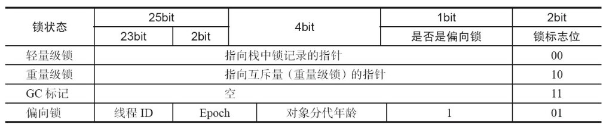

# Java并发机制的底层实现原理

---
## 1 volatile 的应用

volatile 是轻量级的 synchronized，它在多处理器开发中保证了共享变量的**可见性**。

- 可见性的意思是当一个线程修改一个共享变量时，另外一个线程能读到这个修改的值。
- volatile 变量修饰符使用恰当的话，它比 synchronized 的使用和执行成本更低，因为它不会引起线程上下文的切换和调度

Java语言规范第3版中对volatile的定义：`Java编程语言允许线程访问共享变量，为了确保共享变量能被准确和一致地更新，线程应该确保通过排他锁单独获得这个变量`

volatile如何来保证可见性？两个规则：

- 将当前处理器缓存行的数据写回到系统内存。
- 这个写回内存的操作会使在其他CPU里缓存了该内存地址的数据无效。

---
## 2 synchronized 的实现原理和应用

- synchronized 是 Java 同步锁的元老级角色，在 JDK 1.6 之前，synchronized 是重量级锁
- 随着Java SE 1.6对synchronized进行了各种优化之后，synchronized 的性能得到了大幅度提升

synchronized 实现同步的基础：Java中的每一个对象都可以作为锁。

- synchronized 修饰的成员方法，锁是当前实例对象
- synchronized 修饰的静态方法，锁是静态方法所属 Class 对象
- synchronized 修饰的代码块，锁是在代码中配置的对象

当一个线程试图访问同步代码块时，它首先必须得到锁，退出或抛出异常时必须释放锁。

- JVM 基于进入和退出 Monitor 对象来实现方法同步和代码块同步，但两者的实现细节不一样。代码块同步是使用 monitorenter 和 monitorexit 指令实现的，使用 javap 反编译一个有 synchronized 代码块的 class 文件即可看到 monitorenter 指令
- monitorenter 指令是在编译后插入到同步代码块的开始位置，而 monitorexit 是插入到方法结束处和异常处，JVM 要保证每个 monitorenter 必须有对应的 monitorexit 与之配对。
- 任何对象都有一个 monitor 与之关联，当且一个 monitor 被持有后，它将处于锁定状态。线程执行到 monitorenter 指令时，将会尝试获取对象所对应的 monitor 的所有权，即尝试获得对象的锁。

### Java 对象头

Java 对象由三个部分组成：`对象头、内容实体、字节填充`。synchronized 用的锁是存在 Java 对象头里的。如果对象是数组类型，则虚拟机用 3 个字宽（Word）存储对象头，如果对象是非数组类型，则用 2 字宽存储对象头。在 32 位虚拟机中，1 字宽等于 4 字节，即32bit。

Java 对象头组成：`MarkWork、ClassMetadate Address、ArrayLength`，它们分别占用一个字宽。

32 位虚拟机 MarkWork：



64 位虚拟机 MarkWork：


在运行期间，Mark Word里存储的数据会随着锁标志位的变化而变化。

### synchronized 的三种锁和四种锁状态

Java SE 1.6为了减少获得锁和释放锁带来的性能消耗，引入了 `偏向锁` 和 `轻量级锁`，在Java SE 1.6中，锁一共有4种状态，级别从低到高依次是：`无锁状态`、`偏向锁状态`、`轻量级锁状态`和`重量级锁`状态，这几个状态会随着竞争情况逐渐升级。锁可以升级也可以降级(一般认为锁不能降级，但是事实上可以降级)。其中`重量级锁`才会涉及到用户态和内核态的切换。

锁的优缺点的对比：


---
## 3 原子操作的实现原理

---
### 3.1 什么是原子操作

**原子**的本意是不能被进一步被分隔的最小粒子（质子中子未被发现之前），而**原子操作(atomic operation)**可以认为是不可中断的一个或一系列操作。在多处理器上实现原子操作相对复杂。

---
## 3.2 相关术语

- **缓存行**：缓存的最小单位
- **比较并交换(CAS)**：CAS(compare and swap)，是原子操作的一种，可用于在多线程编程中实现不被打断的数据交换操作，从而避免多线程同时改写某一数据时由于执行顺序不确定性以及中断的不可预知性产生的数据不一致问题。 该操作通过将内存中的值与指定数据进行比较，当数值一样时将内存中的数据替换为新的值。
- **CPU流水线**：亦称[管线](https://zh.wikipedia.org/wiki/%E7%AE%A1%E7%B7%9A "管线")，是现代计算机[处理器](https://zh.wikipedia.org/wiki/%E5%A4%84%E7%90%86%E5%99%A8 "处理器")中必不可少的部分，是指将计算机[指令](https://zh.wikipedia.org/wiki/%E6%8C%87%E4%BB%A4 "指令")处理过程拆分为多个步骤，并通过多个硬件处理单元并行执行来加快指令执行速度。其具体执行过程类似工厂中的流水线，并因此得名。
- **内存顺序冲突**：内存顺序冲突一般是由假共享引起，假共享是指多个 CPU 同时修改同一个缓存行的不同部分而引起其中一个 CPU 的操作无效，当出现这个内存顺序冲突时，CPU 必须清空流水线。

---
### 3.3 处理器如何实现原子操作

具体参考下面链接

- 处理器保证从系统内存中读取或者写入一个字节是原子的，意思是当一个处理器读取一个字节时，其他处理器不能访问这个字节的内存地址。
- 复杂的内存操作处理器是不能自动保证其原子性的，比如跨总线宽度、跨多个缓存行和跨页表的访问。
- 处理器提供**总线锁定**和**缓存锁定**两个机制来保证复杂内存操作的原子性。

#### 使用总线锁定

典型的 `i = 1 , i ++` 操作，分别由两个 CPU 进行，我们期望的结果是 3，而实际结果可能为 2：


因为两个 CPU 同时读取到了 1，也就是说没有保证读取顺序。想要保证读改写共享变量的操作是原子的，就必须保证 CPU1 读改写共享变量的时候，CPU2 不能操作缓存了该共享变量内存地址的缓存。处理器使用总线锁就是来解决这个问题的。

#### 使用缓存锁保证原子性

- 在同一时刻，我们只需保证对某个内存地址的操作是原子性即可，但总线锁定把CPU和内存之间的通信锁住了，这使得锁定期间，其他处理器不能操作其他内存地址的数据，所以总线锁定的开销比较大，目前处理器在某些场合下使用缓存锁定代替总线锁定来进行优化。
- 频繁使用的内存会缓存在处理器的 `L1、L2和L3` 高速缓存里，那么原子操作就可以直接在处理器内部缓存中进行，并不需要声明总线锁
- 所谓 `缓存锁定`是指内存区域如果被缓存在处理器的缓存行中，并且在 Lock 操作期间被锁定，那么当它执行锁操作回写到内存时，处理器不在总线上声言 `LOCK＃` 信号，而是修改内部的内存地址，并允许它的缓存一致性机制来保证操作的原子性，因为缓存一致性机制会阻止同时修改由两个以上处理器缓存的内存区域数据，当其他处理器回写已被锁定的缓存行的数据时，会使缓存行无效。

---
### 3.4 Java中的原子操作

在Java中，对**除了long和double之外**的基本类型的简单操作都具有原子性。简单操作就是**赋值**或者`return`。比如`a = 1;`和 `return a;`这样的操作都具有原子性。

但是类似`a += b` 或者 `a++`这样的操作**不具有原子性**，所以如果 add 方法不是同步的就会出现难以预料的结果。在某些JVM中`a += b`可能要经过这样三个步骤：

1. 取出 a 和 b 到工作内存
2. 计算 a+b
3. 将计算结果写入内存

如果有两个线程 t1、t2 在进行这样的操作。t1 在第二步做完之后还没来得及把数据写回内存就被线程调度器中断了，于是t2 开始执行，t2 执行完毕后 t1 又把没有完成的第三步做完。这个时候就出现了错误，相当于 t2 的计算结果被无视掉了。那么Java中如何保证原子操作？

#### 通过锁实现原子操作

比如使用`synchronized`

#### 通过循环 CAS 的方式显示原子操作

JDK1.5开始提供了一些类来支持原子操作，比如 `AtomicBoolean、AtomicInteger` 等，具体可以参考 `java.util.concrueent.atomic` 包中的类，使用 Atomic 类操作实现安全的计数器：

```java
    public class AtomicOperation {

        private int count;
        private AtomicInteger mAtomicInteger = new AtomicInteger(0);

        public static void main(String... args) {
            final AtomicOperation atomicOperation = new AtomicOperation();
            List<Thread> threads = new ArrayList<>(600);
            long start = System.currentTimeMillis();
            for (int j = 0; j < 100; j++) {
                Thread thread = new Thread() {
                    @Override
                    public void run() {
                        for (int i = 0; i < 10000; i++) {
                            atomicOperation.unsafeCount();
                            atomicOperation.safeCount();
                        }
                    }
                };
                threads.add(thread);
            }
            threads.forEach(Thread::start);
            threads.forEach(thread -> {
                try {
                    thread.join();
                } catch (InterruptedException e) {
                    e.printStackTrace();
                }
            });
            System.out.println("非安全自加：" + atomicOperation.count);
            System.out.println("安全自加：" + atomicOperation.mAtomicInteger.get());
            System.out.println("耗时：" + (System.currentTimeMillis() - start));

        }

        private void unsafeCount() {
            count++;
        }

        //使用cas实现线程安全计数器
        private void safeCount() {
            for (; ; ) {
                int i = mAtomicInteger.get();
                boolean success = mAtomicInteger.compareAndSet(i, ++i);
                if (success) {
                    break;
                }
            }
        }
    }
```

结果为：

    非安全自加：991798
    安全自加：1000000
    耗时：127

可见，使用原子类达到了期望的安全计数。

#### CAS 锁实现原子操作的三大问题

- ABA问题，解决办法为为每次操作设置版本号，从Java 1.5开始，JDK的Atomic包里提供了一个类 AtomicStampedReference 来解决 ABA 问题。

- 空自旋循环时间长，造成开销大，自旋CAS如果长时间不成功，会给CPU带来非常大的执行开销。如果JVM能支持处理器提供的pause指令，那么效率会有一定的提升，同时竞争非常激烈的情况下，并不适合使用 CAS 锁。

- 只能保证一个共享变量的原子操作，不过 JDK1.5 提供了 AtomicReference  类来保证引用对象之间的原子操作。

---
### 3.5 CAS 非阻塞算法

- 阻塞算法，java中的 synchronized，获取对象锁失败时会导致线程进入阻塞状态
- 非阻塞算法是相对于锁机制而言的，是指：**一个线程的失败或挂起不应该引起另一个线程的失败或挂起的一种算法**。一般是利用硬件层面支持的原子化操作指令来取代锁的，比如 CAS（compare and swap)，从而保证共享数据在并发访问下的数据一致性。

#### AtomicInteger实现分析

AtomicInteger 采用 CAS 算法实现变量的原子更新，其内部使用的是 Unsafe 类。而 Unsafe 内部的方法基本都是native的，可见 Unsafe 是依靠底层 c/c++ 实现的。

```java
public class AtomicInteger extends Number implements java.io.Serializable {

    private static final Unsafe unsafe = Unsafe.getUnsafe();
    //......
    public final int getAndSet(int newValue) {
        return unsafe.getAndSetInt(this, valueOffset, newValue);
    }
    }
    //......
}

//Unsafe
    public final int getAndSetInt(Object var1, long var2, int var4) {
        int var5;
        do {
            var5 = this.getIntVolatile(var1, var2);
        } while(!this.compareAndSwapInt(var1, var2, var5, var4));

        return var5;
    }

    public final native boolean compareAndSwapInt(Object var1, long var2, int var4, int var5);
```

具体而言，compareAndSwapInt方法内部是借助C来调用CPU的底层指令来保证在硬件层面上实现原子操作的。在intel处理器中，CAS是通过调用cmpxchg指令完成的。这就是我们常说的CAS操作（compare and swap）。CAS操作很容易理解，一般来说有三个值：**内存值V，期望值A，更新值B**，如果内存值V和期望值A相等，那么就用更新值B替换内存值，否则什么都不做。想象一下，假设AtomicInteger当前的value值为1，某个线程A正在执行上述的getAndSet方法，当执行到compareAndSet方法的时候，被另一个线程B抢占了，线程B成功将内存值更新为2，然后轮到线程A来继续执行上述还没有执行完的比较并更新操作，由于线程A上次获得到的current值是1，然后开始执行compareAndSet方法（最后交由CPU的原子执行来执行的），comareAndSet方法发现当前内存值V=2，而期望值A=1（current变量值），所以就不会产生值交换，然后继续下一次重试，在没有别的线程抢占的情况下，下一个循环（在并发很高的情况下可能经过更多次的循环）线程A就能够设置成功，如果线程A是在还没有运行`int current = get()`这一行操作时被抢占了，那么线程B运行完毕后，线程A获得的将是线程B修改后的值然后进行CAS操作可能就一次成功（在没有其他线程抢占的情况下）。因此，`CAS Try-Loop`操作能够很好的提供线程同步机制，我们又将此实现过程称之为线程同步的**无阻塞算法**，或**CAS循环**、**lock-free**、**wait-free**算法。

#### 非阻塞算法优点

在java5.0版本时，我们只能通过synchronized来实现线程的同步，synchronized是一种**独占锁**，独占锁是一种悲观锁，当一个线程访问共享资源的时候，其他线程必须处在阻塞状态，只有在拥有锁的线程释放锁以后才能被其他线程锁竞争，JVM 实现阻塞的方式通常是挂起阻塞的线程，过一会儿再重新调度它。由此造成的上下文切换相对于锁保护的少数几条指令来说，会造成相当大的延迟，这将引起性能问题，所以我们称这种锁为重量级锁。**所谓乐观锁就是指：对竞争资源不用加锁，而是假设没有冲突去完成某项操作，如果因为冲突失败就不断重试，直到成功为止**。上面所说的循环CAS操作就是上述所说的乐观锁。

- 利用硬件的原生支持代替JVM对代码路径的锁定，从而提供更细粒度的同步。
- 失败的线程可以立即重试而不用被挂起，降低了争用成本，即使有少量失败的CAS操作，也依然比锁争用造成的重新调度快的多。
- 争用CAS提供更短的延迟（因为争用CAS比争用锁会更快），提供更好的吞吐率。
- 对生存问题（死锁和线程优先级反转）提供更好的防御

#### 阻塞锁与非阻塞锁对比

- 在轻度到中度的争用情况下，非阻塞算法的性能会超越阻塞算法，因为这样的情况下CAS的多数时间都在第一次尝试时就成功，而发生争用时的开销也不涉及线程挂起和上下文切换，只多了几次空旋。
- 在高度争用的情况下(即有多个线程不断争用一个内存位置的时候)，基于锁的算法提供了比非阻塞算法更好的吞吐率，因为当线程阻塞时，它就会停止争用，耐心地等候轮到自己，从而避免了进一步争用。

---
## 引用

- [基于CAS操作的非阻塞算法](http://www.cnblogs.com/ktgu/p/3529145.html)
- [Java 理论与实践: 非阻塞算法简介](http://www.ibm.com/developerworks/cn/java/j-jtp04186/)
- [Java 理论与实践: 流行的原子](http://www.ibm.com/developerworks/cn/java/j-jtp11234/)
- [方腾飞——聊聊并发](http://www.infoq.com/cn/author/%E6%96%B9%E8%85%BE%E9%A3%9E)