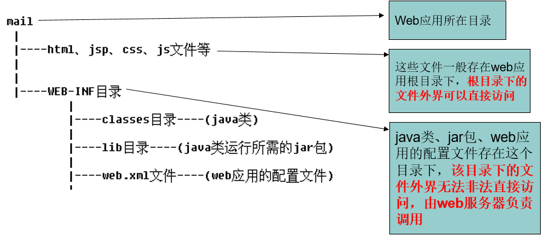

# Tomcat

本笔记基于 tomcat 6.0 版本。

---
## 1 Tomcat 简介

Tomcat是在SUN公司(当时还没被收购)推出的小型Servlet/JSP调试工具的基础上发展起来的一个优秀的Servlet容器，Tomcat本身完全用Java语言编写。目前是Apache开源软件组织的一个软件项目，它的官方网址为`http://tomcat.apache.org`。得到了广大开源代码志愿者的大力支持，且可以和目前大部分的主流Web服务器(IIS、Apache服务器)一起工作，它运行稳定、可靠且高效。已成为目前开发企业JavaWeb应用的最佳Servlet容器选择之一。

### 版本

Tomcat的版本随着不断推出的Servlet/JSP规范不同而不同，基本上是Servlet每推出一个版本，Tomcat也会发行新的版本以适应新的规范。

- tomcat6本身是基于JDK1.5的应用程序，因此在安装和使用之前必须先行安装1.5及以上版本的JDK(JRE)，其支持Servlet2.5规范

具体Tomcat版本与Servlet版本对应可以参考[whichversion](http://tomcat.apache.org/whichversion.html)。

### 环境配置

- JAVA_HOME
- CATALINA_HOME，如果要想在任意目录下都能启动Tomcat，就需要设置CATALINA_HOME环境变量，具体参考[这里](https://www.cnblogs.com/heshan664754022/archive/2013/03/27/2984357.html)
- tomcat默认端口为8080，使用`netstat -ano`查看端口占用情况


### Tomcat 目录结构

```
bin：脚本目录
    启动脚本：startup.bat
    停止脚本：shutdown.bat
conf：配置文件目录 (config /configuration)
    核心配置文件：server.xml
    用户权限配置文件：tomcat-users.xml
    所有web项目默认配置文件：web.xml
lib：依赖库，tomcat和web项目中需要使用的jar包
logs：日志文件.
    localhost_access_log.*.txt tomcat记录用户访问信息，星*表示时间。
    例如：localhost_access_log.2016-02-28.txt
temp：临时文件目录，文件夹内内容可以任意删除。
webapps：默认情况下发布WEB项目所存放的目录。
work：tomcat处理JSP的工作目录。
```


---
## 2 JavaWEB 应用程序

WEB应用程序指供浏览器访问的程序，通常也简称为web应用。

一个web应用由多个静态web资源和动态web资源组成，如:html、css、js文件、Jsp文件、java程序、支持jar包、配置文件等等。

Web应用开发好后，若想供外界访问，需要把web应用所在目录交给web服务器管理，这个过程称之为虚似目录的映射。


SUN公司的Servlet规范对JavaWeb应用作了这样的定义：**JavaWeb应用由一组Servlet/JSP、HTML文件、相关Java类以及其他可以绑定的资源构成，它可以在由各种供应商提供的符合Servlet规范的Servlet容器中运行**。

在JavaWeb应用中可以包含以下内容：
- Servlet组件：标准Servlet接口的实现类，运行在服务器端，包含了被Servlet容器动态调用的程序代码。
- JSP组件：包含Java程序代码的HTML文档，运行在服务器端。当客户端请求访问JSP文件时，Servlet容器先把它编译成Servlet类，然后动态调用它的程序代码。
- 相关的Java类：开发人员自定义的与Web应用相关的Java类。
- 静态文档：存放在服务器端的文件系统中，如HTML文件、图片文件和声音文件等。当客户端请求访问这些文件时，Servlet容器会先先从服务器上的本地文件系统中读取这些文件，再把它们发送给客户端。
- 客户端类：由客户端来运行的类。Applet是典型的客户端类。当客户请求访问Applet时，Servlet容器先从服务器上的本地文件系统中读取Applet的class类文件的数据，再把它发送到客户端，由客户端来运行Applet。
- web.xml文件：JavaWeb应用的配置文件，采用XML格式。

### JavaWEB应用的组成结构

开发web应用时，不同类型的文件有严格的存放规则，否则不仅可能会使web应用无法访问，还会导致web服务器启动报错。



- web应用中，**`web.xml`**文件是其中最重要的一个文件，它用于对web应用中的web资源进行配置。
- 在WEB-INF目录的classes及lib子目录下，都可以存放java类文件。在运行时，Servlet容器的类加载器先加载classes目录下的类，再加载lib目录下的JAR文件中的类。因此，如果两个目录下存在同名的类，classes目录下的类具有优先权。
- tomcat的安装目录下也有一个lib目录，这个与Web应用中的lib目录的区别在于：tomcat的lib子目录：存放的JAR文件不仅能被tomcat访问，还能被所有在tomcat中发布的JavaWeb应用访问。JavaWeb应用的lib子目录：存放的JAR文件只能被当前JavaWeb应用访问。

假如Tomcat类加载器要加载一个MyClass的类，它会按照以下先后顺序到各个目录中去查找MyClass的class文件，直到找到为止，如果所有目录中都不存在MyClass.class的文件，则会抛出异常：

1. 在JavaWeb应用的`WEB-INF/classes`中查找MyClass.class文件。
2. 在JavaWeb应用的 `WEB-INF/lib`目录下的JAR文件中查找MyClass.class文件。
3. 在tomcat的lib子目录下直接查找MyClass.class文件。
4. 在tomcat的lib子目录下JAR的文件中查找MyClass.class文件。

Tomcat6.x与Tomcat5.x的目录结构有所区别。在Tomcat5.x版本中，Tomcat允许在`server/lib`目录、`common/lib`和`shared/lib`目录下存放JAR文件，这3个目录的区别在于：
- 在`server/lib`目录下的JAR文件只可被Tomcat访问。
- 在`shared/lib`目录下的JAR文件可以被所有的JavaWeb应用访问，但不能被Tomcat访问。
- 在`common/lib`目录下的JAR文件可以被Tomcat和所有JavaWeb应用访问。

### Web组件的URL

无论是开放式目录结构还是打包文件方式发布web应用，web应用的默认URL入口都是Web应用的根目录名。例如要访问MyApp应用，它的URL入口为/MyApp，如访问本地服务为`http://localhost:8080/MyApp`或`http://127.0.0.1:8080/MyApp`。

### 部署应用到服务器上

- 方式一（推荐）：把自己的应用拷贝到Tomcat\webapps目录下即可
- 方式二（war包）：把war拷贝到Tomcat\webapps目录下即可。Tomcat会自解压。


---
## 3 Tomcat 的组成结构与配置

Tomcat本身由一系列可配置的组件构成，其中核心组件是Servelt容器组件，它是所有其他Tomcat组件的顶层容器。每个组件都可以在Tomcat安装目录`/conf/server.xml`文件中进行配置，每个Tomcat组件在server.xml文件中对应一种配置元素。

tomcat默认的server.xml很简单(下面为6.0的精简版)：
```xml
<?xml version='1.0' encoding='utf-8'?>
<Server port="8005" shutdown="SHUTDOWN">

  <!-- 指定服务名称 -->
  <Service name="Catalina">
    <!-- 指定端口、采用协议 -->
    <Connector port="8080" protocol="HTTP/1.1" connectionTimeout="20000" redirectPort="8443" />
    <Connector port="8009" protocol="AJP/1.3" redirectPort="8443" />
    <!-- 指定默认主机-->
    <Engine name="Catalina" defaultHost="localhost">
      <!-- 指定主机名、应用名(名称即目录)、是否自动解包、自动部署、xml验证 -->
      <Host name="localhost"  appBase="webapps" unpackWARs="true" autoDeploy="true" xmlValidation="false" xmlNamespaceAware="false"></Host>
    </Engine>
  </Service>
</Server>
```

每个标签的含义为：

- **Server**：代表整个Servlt容器，是最顶级的容器，可以包含多个Service
- **Service**：包含一个Engine和多个Connector元素，多个Connector共享一个Engine
- **Connector**：代表和客户端程序实际交互的组件，负责接收客户端请求和向客户端响应
- **Engine**：每个Service只包含一个Engine，它负责同一个Service中所有Connector接收到的客户端请求
- **Host**：在一个Engin中可以包含多个Host，它代表一个虚拟的主机(网址)，它可以包含多个Web应用
- **Context**：使用最频繁的元素，代表了运行在虚拟主机上的单个web应用

### Catalina

Tomcat 4.x时，Servlet容器被重新设计，并被命名为Catalina。Tomcat的核心分为3个部分:

- Web容器：处理静态页面；
- Catalina：Servlet容器，处理Servlet;
- JSP解析器：把jsp页面翻译成一般的Servlet。

### Tomcat体系架构


### 配置虚拟目录

配置虚拟目录一般是指配置应用的实际目录与访问路径的映射。

#### 方式一

修改server.xml，在`<Host>`中添加如下内容(不建议的，需要重新启动Tomcat)：

```
  <Host name="localhost"  appBase="webapps" unpackWARs="true" autoDeploy="true" xmlValidation="false" xmlNamespaceAware="false">
        <Context path="/myapp" docBase="E:\MyAPP"/>
</Host>
```

- path：虚拟路径，用于客户端访问，必须以`/`开始
- docBase：应用所在的真实目录

#### 方式二

在`Tomcat\conf\[enginname]\[hostname]`目录下建立一个xml文件，该**文件名就是虚拟目录名称**。内容如下（建议，不需要重新启动）：
```
<?xml version="1.0"?>
<Context docBase="e:\MyApp"/>
```

#### 方式三

不配置，tomcat服务器会自动管理webapps目录下的所有web应用，并把它映射成虚似目录。换句话说，tomcat服务器webapps目录中的web应用，外界可以直接访问。

#### Context元素

Tomcat6.x 提供了多种配置`<Context>`元素的途径。当其加载一个web应用时，会依次按照以下五种方式尝试查找Web应用的`<Context>`元素，直到找到为止：

1. 到Tomcat安装目录`/conf/context.xml`文件中查找`<Context>`元素。
2. 到Tomcat安装目录`/conf/[enginename]/[hostname]/context.xml.default`文件中查找`<Context>`元素。
  - `[enginename]`：表示`<Engine>`的name属性
  - `[hostname]`：表示`<Host>`的name属性。
3. 到Tomcat安装目录`/conf/[enginename]/[hostname]/[contextpath].xml`文件中查找`<Context>`元素。
4. 到Web应用的`META-INF/context.xml`文件中查找`<Context>`元素。
5. 到Tomcat安装目录`/conf/server.xml`文件中查找`<Context>`元素。只适用于单个Web应用

如果仅仅为单个Web应用配置`<Context>`元素，可以优先采用第三种配置方式。

Context属性详解：

- path：指定访问该Web应用的URL入口，即虚拟文件目录。
- docBase：指定web应用的文件路径，可配置一个绝对路径也可以配置相对于Host的appBase属性的相对路径。如果Web应用采用开放目录结构，则指定Web应用的根目录，如果Web应用是一个war文件，则指定war文件的路径(tomcat会自动解压到webapps目录下)
- className：指定Context组件的Java类的名字，这个类必须实现`org.apache.catalina.Context`接口，该属性的默认值为：`org.apache.catalina.core.StardandContext`
- reloadable：如果这个值为true，tomcat会在运行阶段监视在`WEB-INF/classes`和`WEB-INF/lib`目录下的class文件改动，已经监视`WEB-INF/web.xml`文件改动，如果检测到更新，tomcat会重新加载webapp，默认值为false，在开发阶段可以设置为true以方便调试，在正式发布阶段应当改为false以降低tomcat的运行负荷。
- cachingAllowed：是否允许启用静态资源(HTML、图片、声音等)的缓存。默认值为true。
- cacheMaxSize：设置静态资源缓存的最大值，单位为Kb。
- workDir：指定Web应用的工作目录。
- uppackWAR：如果为true，会把war文件展开为开放目录后再运行。为false，直接运行war文件。默认值为true。

#### 示例

在 tomcat 下的`conf/server.xml`中添加：

```
<Context docBase="D:\develop\upload\temp" path="/pic" reloadable="false"/>
```

当访问 `http://localhost:8080/pic`时， 即可访问 `D:\develop\upload\temp` 目录

### web.xml文件

通过web.xml文件，可以将web应用中的：

- 某个web资源配置为网站首页
- 将servlet程序映射到某个url地址上

但凡涉及到对web资源进行配置，都需要通过web.xml文件，**web.xml文件必须放在web应用\WEB-INF目录下。**

配置默认首页：

```xml
<?xml version="1.0"?>
<web-app xmlns="http://java.sun.com/xml/ns/javaee"
    xmlns:xsi="http://www.w3.org/2001/XMLSchema-instance"
    xsi:schemaLocation="http://java.sun.com/xml/ns/javaee http://java.sun.com/xml/ns/javaee/web-app_2_5.xsd"
    version="2.5">

    <welcome-file-list>
        <welcome-file>1.html</welcome-file>
        <welcome-file>index.html</welcome-file>
        <welcome-file>index.jsp</welcome-file>
    </welcome-file-list>

</web-app>
```

配置默认应用把应用的名称名字改为ROOT即可。

### 配置虚似主机：Host

- 假如两家公司Web应用都发布在同一个Tomcat服务器上，可以为每家公司分别创建一个虚拟主机
- 尽管以上两个虚拟主机位于同一个主机，但是当客户通过两个不同虚拟主机名访问 Web 应用时，会感觉到这两个应用分别拥有独立的主机
- 配置的主机(网站)要想被外部访问，必须在 DNS 服务器或 windows 系统中注册（修改 Windows 系统中的`C:\WINDOWS\system32\drivers\etc\hosts`）


修改server.xml，在engine标签下添加host

```xml
<Host name="www.abc123.com"  appBase="abc123Apps" unpackWARs="true" autoDeploy="true" xmlValidation="false" xmlNamespaceAware="false"/>
<Host name="www.abc456.com"  appBase="abc456Apps" unpackWARs="true" autoDeploy="true" xmlValidation="false" xmlNamespaceAware="false"/>
```

### 配置SSL连接器

在网络上，信息在由源主机到目标主机的传输过程会经过其他计算机，网络上的信息有可能被非法分子监听，从而导致个人隐私泄露。随着电子商务的发展，对信息安全的要求越来越高，于是 Netscape 公司提出了 SSL(Server Socket Layer) 协议，旨在达到在开放网络( Internet )上安全、保密地传输信息的目的。

SSL是一种保证网络上的两个节点进行安全通信的协议，建立在SSL协议上的HTTP被称为HTTPS协议。HTTPS使用的默认端口是443。SSL采用加密技术来实现安全通信，保证通信数据的保密性和完整性，并且保证通信双方可以验证对方的身份。

加密技术的基本原理是：数据从一端发送到另一端，发送者先对数据加密，然后再把它发送给接受者。这样，在网络上传输的是经过加密的数据，如果有人非法截获了这批数据，由于没有解密的密钥，就无法获得真正的原始数据。接收者收到加密的数据后，先对数据解密，然后再处理。

- SSL通过安全证书来证明客户或服务器的身份。当客户通过安全的连接和服务器通信时，服务器会先向客户出示它的安全证书，而每一个证书在世界范围内都是唯一的。
- 为了扩大用户群，一些服务器向客户出示证书后，并不要求客户出示安全证书，但在某些情况下，服务器也会要求客户出示安全证书，以便核实该客户的身份。

安全证书的获得有两种方式：

- 从权威机构获得证书Certificate Authority,CA和VeriSign和Thawte，它们保证了证书的可信性。申请证书时，需要付费，且一个证书只针对一个IP有效。
- 创建自我签名的证书：如果只关心数据在网络上的安全传输，而不需要对方身份验证，可以创建自我签名的证书。与权威机构颁发的证书采用的加密技术是一样的。

可以根据安全需要，为Tomcat配置SSL，它包含以下两个步骤：

1. 准备安全证书
2. 配置Tomcat的SSL连接器(Connector)

#### 使用 keytool 生成证书

Java提供了制作证书的工具keytool。在JDK1.4以上版本中都包含了这一工具。通过这个工具生成证书的命令为:
```
keytool -genkey -alias tomcat -keyalg RSA -keystore d:\.keystore
```
以上命令将生成名为`.keystore`的文件。即包含一对非对称密钥和自我签名的证书，
- `-genkey`：生成一对非对称密钥。
- `-alias`：指定密钥对的别名，该别名是公开的。
- `-keyalg`：指定加密算法，此处采用通用的RSA算法。
- `-keystore`：指定生成证书的目录，如果不指定则生成的证书包含保存在操作系统的用户目录

#### 配置SSL连接器

在Tomcat的servlet.xml文件中，已经提供了现成的配置SSL连接器的代码，只要把注释去掉即可

```xml
<Connector port="8443" protocol="HTTP/1.1" SSLEnabled="true"
               maxThreads="150" scheme="https" secure="true"
               clientAuth="false" sslProtocol="TLS" />
```

- keystoreFile：指定keystore文件的存放位置，可以指定绝对路经。如果此项没有设定，在默认情况下，Tomcat将从当前操作系统用户的用户名目录下读取名为`.keystore`的文件。
- keystorePass：指定keystore的密码，如果此项没有设定，在默认情况下，Tomcat将使用**changeit**密码。

在配置tomcat的SSL双向握手中，由于6.0.33版本中默认启用了APR（APR是通过JNI访问的可移植库，可以提高Tomcat的性能和伸缩性），所以采用传统的配置方式（如下）会报异常。解决办法：

```xml
<Connector     port="8443" protocol="org.apache.coyote.http11.Http11Protocol"
               SSLEnabled="true"
               maxThreads="150" 
               scheme="https" 
               secure="true"
               clientAuth="false" 
               sslProtocol="TLS"
               keystoreFile="conf/keystore/.keystore"
               keystorePass="123456" />  
```

Tomcat 的 Connector 支持两种协议，HTTP 和 AJP。通过配置不同的 protocol 属性，可以使用不同的 ProtocalHandler. 配置HTTP/1.1时，默认会使用`org.apache.coyote.http11.Http11NioProtocol`，也可以通过指定类名的方式来配置，比如`protocol=”org.apache.coyote.http11.Http11Nio2Protocol”`，针对 HTTP 和 AJP 两种协议，都有 BIO/NIO/NIO2/APR 四种处理方式。

HTTP：
- org.apache.coyote.http11.Http11Protocol
- org.apache.coyote.http11.Http11NioProtocol
- org.apache.coyote.http11.Http11Nio2Protocol
- org.apache.coyote.http11.Http11AprProtocol
AJP：
- org.apache.coyote.http11.Ajp11Protocol
- org.apache.coyote.http11.Ajp11NioProtocol
- org.apache.coyote.http11.Ajp11Nio2Protocol
- org.apache.coyote.http11.Ajp11AprProtocol


配置好 HTTPS 后，可以通过访问 `https://localhost:8443` 来测试配置是否正确。


### Web应用的生命周期

用Tomcat的管理平台管理Web应用的生命周期：

Tomcat的管理平台是Tomcat本身的一个Web应用，管理平台对应manager应用，它位于Tomcat安装目录`/webapps/manager`目录下。manager应用会对用户进行安全验证。它要求用户具有manager角色。因此，应该先在Tomcat中添加具有manager角色的用户信息，方法为打开Tomcat安装目录`/conf/tomcat-users.xml`文件，在其中增加以下内容：

```xml
<tomcat-users>
    <role rolename=”manager”/>
    <user username=”tomcat” password=”tomcat” roles=”manager”/>
</tomcat-users>
```

---
## 4 Tomcat的默认编码

- IOS8859-1：Tomcat6、Tomcat7
- UTF-8：Tomcat8及以后

