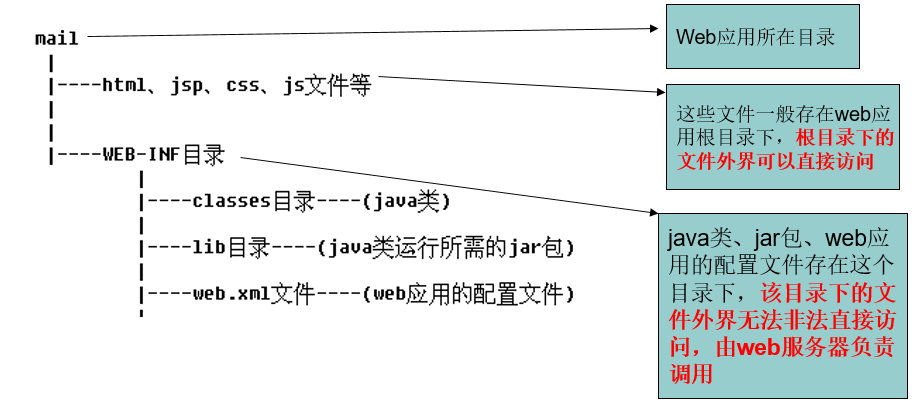
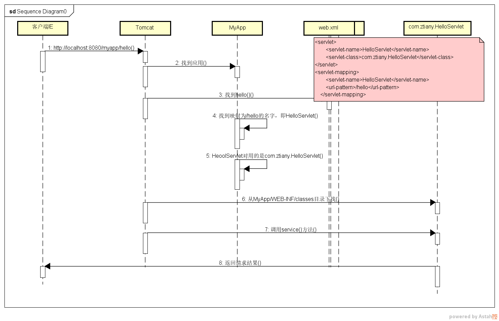
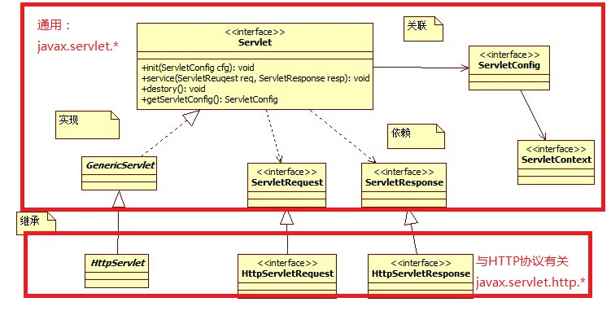

# Servlet

---
## 1 Servlet简介

Servlet是用于开发动态web资源的技术。JavaEE中提供了一个Servlet接口，用户若想开发一个动态web资源(即开发一个Java程序向浏览器输出数据)，需要完成以下2个步骤：

1. 编写一个Java类，实现servlet接口。
2. 把开发好的Java类部署到web服务器中。

Servlet的含义：
1. Servlet是一套规范，Java中开发动态web资源的技术
2. Servlet是运行在服务器端的一段小程序，由服务器调用
```
void service(ServletRequest req,ServletResponse resp);
void init(ServletConfig scfg)
```

---
## 2 Servlet的入门案例(手动编写)


Servlet在web应用中的位置，下图中mail表示一个web应用的根目录，JavaWeb应用都要遵守这个目录布局：



按照上面工程目录布局，编码步骤：

- 1、编写一个类，直接或间接地实现 `javax.servlet.Servlet`接口；一般继承`javax.servlet.GenericServlet`实现`void service(ServletRequest req,ServletResponse resp)`

- 2、编译java源代码

在命令行编译需要设置classpath：`set classpath=%classpath%;H:\dev_tools\tomcat\apache-tomcat-6.0.41\lib\servlet-api.jar`，然后`javac DemoServlet.java`

- 3、Servlet映射。给Servlet类一个URI地址（访问地址）

```xml
<?xml version="1.0" encoding="UTF-8"?>
<web-app xmlns="http://java.sun.com/xml/ns/javaee"
    xmlns:xsi="http://www.w3.org/2001/XMLSchema-instance"
    xsi:schemaLocation="http://java.sun.com/xml/ns/javaee http://java.sun.com/xml/ns/javaee/web-app_2_5.xsd"
    version="2.5">
    <!--Servlet定义-->
    <servlet>
        <!--给Servlet取一个名字-->
        <servlet-name>HelloServlet</servlet-name>
        <!--Servlet类的全名-->
        <servlet-class>com.ztiany.HelloServlet</servlet-class>
    </servlet>
    <!--对Servlet进行映射-->
    <servlet-mapping>
        <servlet-name>HelloServlet</servlet-name>
        <!--访问路径-->
        <url-pattern>/hello</url-pattern>
    </servlet-mapping>
</web-app>
```

- 4、部署应用到服务器，访问地址：http://localhost:8080/myapp/hello

这样我们就在不借助任何IDE的情况下，徒手编写了一个JavaWeb应用。

---
## 3 Servlet的运行过程



- 客户端发出请求`http://localhost:8080/myapp/hello`
- 根据`web.xml`文件的配置，找到`<url-pattern>`子元素的值“/hello”的`<servlet-mapping>`元素
- 读取`<servlet-mapping>`元素的`<servlet-name>`子元素的值，由此确定Servlet的名字为”HelloServlet”
- 找到`<servlet-name>`值为HelloServlet的`<servlet>`元素
读取`<servlet>`元素的`<servlet-class>`子元素的值，由此确定Servlet的类名为`com.ztiany.HelloServlet`。
- 到Tomcat安装目录`/webapps/MyApp/WEB-INF/classes/com/ztiany`目录下查找到HelloServlet.class文件

---
## 4 Servlet的生命周期

Servlet是一个供其他Java程序（Servlet引擎）调用的Java类，它不能独立运行，它的运行完全由Servlet引擎来控制和调度。针对客户端的多次Servlet请求，通常情况下，服务器只会创建一个Servlet实例对象，也就是说Servlet实例对象一旦创建，它就会驻留在内存中，为后续的其它请求服务，直至web容器退出，servlet实例对象才会销毁。在Servlet的整个生命周期内，Servlet的init方法只被调用一次。而对一个Servlet的每次访问请求都导致Servlet引擎调用一次servlet的service方法(service的调度线程是不确定的)。对于每次访问请求，Servlet引擎都会创建一个新的HttpServletRequest请求对象和一个新的HttpServletResponse响应对象，然后将这两个对象作为参数传递给它调用的Servlet的service()方法，service方法再根据请求方式分别调用doXXX方法。


1. 用户第一次访问该Servlet时，就会由容器进行实例化，并且调用`init(ServletConfig cfg)`方法,只有一次。该Servlet实例就驻留内存
2. 针对用户的每次请求(单独的线程)，容器都会调用`service(ServletRequest req, ServletResponse resp)`为客户端服务
3. 当应用被卸载，或者Tomcat停止了，会调用`destory()`方法

如果希望在服务器启动时就完成Servlet的实例化和初始化工作，可以在web.xml中配置值为自然整数的`load-on-startup`标签，其值越小优先级越高，一般不要设置为1，因为Tomcat容器的DefaultServlet已经使用了。
```
    <servlet>
        <servlet-name>invoker</servlet-name>
        <servlet-class>
            org.apache.catalina.servlets.InvokerServlet
        </servlet-class>
        <load-on-startup>2</load-on-startup>
    </servlet>
```
从提高Servlet容器运行性能的角度出发，Servlet规范为Servlet规定了不同的初始化情形。如果有些Servlet专门负责在web应用启动阶段为web应用完成一些初始化操作，则可以让它们在web应用启动时就被初始化。对于大多数Servlet，只需当客户端首次请求访问时才被初始化。假设所有的Servlet都在web应用启动时被初始化，那么会大大增加Servlet容器启动web应用的负担，而且Servlet容器有可能加载一些永远不会被客户访问的Servlet，白白浪费容器的资源。


----
## 5 Servlet接口实现类

- Servlet接口SUN公司定义了两个默认实现类，分别为：GenericServlet、HttpServlet。
- GenericServlet是针对Servlet接口的一个通用实现
- HttpServlet指能够处理HTTP请求的servlet，它在原有Servlet接口上添加了一些与HTTP协议处理方法，它比Servlet接口的功能更为强大。因此开发人员在编写Servlet时，通常应继承这个类，而避免直接去实现Servlet接口。
- HttpServlet在实现Servlet接口时，覆写了service方法，该方法体内的代码会自动判断用户的请求方式，如为GET请求，则调用HttpServlet的doGet方法，如为Post请求，则调用doPost方法。因此，开发人员在编写Servlet时，通常只需要覆写doGet或doPost方法，而不要去覆写service方法。

---
## 6 Servlet的配置细节(2.5)

### 路径映射

- 由于客户端是通过URL地址访问web服务器中的资源，所以Servlet程序若想被外界访问，必须把servlet程序映射到一个URL地址上，这个工作在web.xml文件中使用`<servlet>`元素和`<servlet-mapping>`元素完成。
- `<servlet>`元素用于注册Servlet，它包含有两个主要的子元素：`<servlet-name>`和`<servlet-class>`，分别用于设置Servlet的注册名称和Servlet的完整类名。 
- 一个`<servlet-mapping>`元素用于映射一个已注册的Servlet的一个对外访问路径，它包含有两个子元素：`<servlet-name>`和`<url-pattern>`，分别用于指定Servlet的注册名称和Servlet的对外访问路径。例如：
```xml
<web-app>
    <servlet>
        <servlet-name>AnyName</servlet-name>
        <servlet-class>HelloServlet</servlet-class>
    </servlet>
    <servlet-mapping>
        <servlet-name>AnyName</servlet-name>
        <url-pattern>/demo/hello.html</url-pattern>
    </servlet-mapping>
</web-app>
```

同一个Servlet可以被映射到多个URL上，即多个`<servlet-mapping>`元素的`<servlet-name>`子元素的设置值可以是同一个Servlet的注册名。

### 路径匹配

在Servlet映射到的URL中也可以使用`*`通配符，但是只能有两种固定的格式：一种格式是`“*.扩展名”`，另一种格式是以正斜杠（`/`）开头并以`“/*”`结尾。

```xml
<servlet-mapping>
    <servlet-name>
        AnyName
    </servlet-name>
    <url-pattern>
        *.do
    </url-pattern>
</servlet-mapping>

<servlet-mapping>
    <servlet-name>
        AnyName
    </servlet-name>
    <url-pattern>
        /action/*
    </url-pattern>
</servlet-mapping>    
```

### 路径匹配优先级

对于如下的映射关系：

- Servlet1 映射到 `/abc/*`
- Servlet2 映射到 `/*`
- Servlet3 映射到 `/abc`
- Servlet4 映射到 `*.do`

匹配结果如下：

- 当请求URL为`“/abc/a.html”`，`“/abc/*”`和`“/*”`都匹配， Servlet引擎将调用Servlet1。
- 当请求URL为`“/abc”`时，`“/abc/*”`和`“/abc”`都匹配，Servlet引擎将调用Servlet3。
- 当请求URL为`“/abc/a.do”`时，`“/abc/*”`和`“*.do”`都匹配，Servlet引擎将调用Servlet1。
- 当请求URL为`“/a.do”`时，`“/*”`和`“*.do”`都匹配，Servlet引擎将调用Servlet2。
- 当请求URL为`“/xxx/yyy/a.do”`时，`“/*”`和`“*.do”`都匹配，Servlet引擎将调用Servlet2。

规则为：**绝对匹配最高；`”/”`优先级其次；`”*”`最低**


### 默认Servlet

- 如果某个Servlet的映射路径仅仅为一个正斜杠（/），那么这个Servlet就成为当前Web应用程序的缺省Servlet。
- 凡是在web.xml文件中找不到匹配的`<servlet-mapping>`元素的URL，它们的访问请求都将交给缺省Servlet处理，也就是说，缺省Servlet用于处理所有其他Servlet都不处理的访问请求。
- 在tomcat的安装目录 `\conf\web.xml` 文件中，注册了一个名称为`org.apache.catalina.servlets.DefaultServlet`的Servlet，并将这个Servlet设置为了缺省Servlet。
- 当访问Tomcat服务器中的某个静态HTML文件和图片时，实际上是在访问这个缺省Servlet。

---
## 7 线程安全问题

- 当多个客户端并发访问同一个Servlet时，web服务器会为每一个客户端的访问请求创建一个线程，并在这个线程上调用Servlet的service方法，因此service方法内如果访问了同一个资源的话，就有可能引发线程安全问题。
- 如果某个Servlet实现了SingleThreadModel接口，那么Servlet引擎将以单线程模式来调用其service方法。
- SingleThreadModel接口中没有定义任何方法，只要在Servlet类的定义中增加实现SingleThreadModel接口的声明即可。该接口为一个标记接口
- 对于实现了SingleThreadModel接口的Servlet，Servlet引擎仍然支持对该Servlet的多线程并发访问，其采用的方式是产生多个Servlet实例对象，并发的每个线程分别调用一个独立的Servlet实例对象。
- 实现SingleThreadModel接口并不能真正解决Servlet的线程安全问题，因为Servlet引擎会创建多个Servlet实例对象，而真正意义上解决多线程安全问题是指一个Servlet实例对象被多个线程同时调用的问题。事实上，在Servlet API 2.4中，已经将SingleThreadModel标记为Deprecated（过时的）。

解决并发问题：

- 使用Java同步机制对多线程同步:运行效率低
- 使用SingleThreadModel接口
- 合理决定在Servlet中定义的变量的作用域

---
## 8 ServletConfig对象

在Servlet的配置文件中，可以使用一个或多个`<init-param>`标签为servlet配置一些初始化参数。

当servlet配置了初始化参数后，web容器在创建servlet实例对象时，会自动将这些初始化参数封装到ServletConfig对象中，并在调用servlet的init方法时，将ServletConfig对象传递给servlet。进而，程序员通过ServletConfig对象就可以得到当前servlet的初始化参数信息。

```xml
  <servlet>
    <servlet-name>ServletDemo5</servlet-name>
    <servlet-class>com.ztiany.ServletDemo5</servlet-class>
    <init-param>
        <param-name>AAA</param-name>
        <param-value>BBB</param-value>
    </init-param>
    <init-param>
        <param-name>XXX</param-name>
        <param-value>YYY</param-value>
    </init-param>
  </servlet>
```

----
## 9 ServletContext

WEB容器在启动时，它会为每个WEB应用程序都创建一个对应的ServletContext对象，它代表当前web应用。ServletConfig对象中维护了ServletContext对象的引用，开发人员在编写servlet时，可以通过ServletConfig.getServletContext方法获得ServletContext对象。由于一个WEB应用中的所有Servlet共享同一个ServletContext对象，因此Servlet对象之间可以通过ServletContext对象来实现通讯。ServletContext对象通常也被称之为context域对象。

ServletContext应用：

- 多个Servlet通过ServletContext对象实现数据共享。
- 获取WEB应用的初始化参数。
- 实现Servlet的转发。
- 利用ServletContext对象读取资源文件。

### 读取配置文件方式

- ServletContext的getRealPath()可以用在Web应用中，可以读取任意目录中的任何文件
- ResourceBundle专门读取类路径中的properties文件。可以用在非web环境
- 类加载器专门读取类路径中的任何文件（文件不宜太大）。可以用在非web环境


---
## 10 Servlet核心类库


