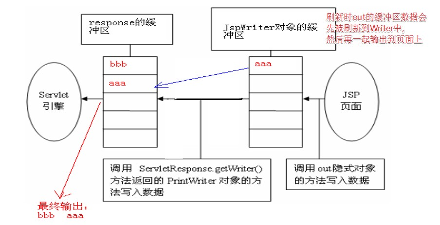

# JSP

JSP全称是Java Server Pages，它和servle技术一样，都是一种用于开发动态web资源的技术。JSP/Servlet规范。JSP实际上就是Servlet。

JSP这门技术的最大的特点在于，写jsp就像在写html，但它相比html而言，html只能为用户提供静态数据，而Jsp技术允许在页面中嵌套java代码，为用户提供动态数据。

---
## 1 JSP原理

问题：
- 浏览器访问JSP页面时，Web服务器是如何调用并执行一个jsp页面的？（Servlet）
 - Web服务器会把JSP翻译成一个Java类(这个类也是一个HttpServlet)，然后对其进行编译和运行。
- Web服务器在执行jsp页面时，是如何把Jsp页面中的html排版标签发送到客户端的？
 - jsp被编译成java类时，还为其提供了内置对象，其中有一个输出流，利用这个输出流，可以以字符流形式输出html类容。
- Jsp页面中的java代码服务器是如何执行的？
 - 由Web服务器编译执行，与执行Servlet一致。
- Web服务器在调用jsp时，会给jsp提供一些什么java对象？
 - 九大内置对象

JSP最佳实践：

- 不管是JSP还是Servlet，虽然都可以用于开发动态web资源。但由于这2门技术各自的特点，在长期的软件实践中，人们逐渐把servlet作为web应用中的控制器组件来使用，而把JSP技术作为数据显示模板来使用。其原因为，程序的数据通常要美化后再输出。
- 让JSP既用java代码产生动态数据，又做美化会导致页面难以维护。
- 让servlet既产生数据，又在里面嵌套html代码美化数据，同样也会导致程序可读性差，难以维护。
- 因此最好的办法就是根据这两门技术的特点，让它们各自负责各得，servlet只负责响应请求产生数据，并把数据通过转发技术带给jsp，数据的显示jsp来做。


---
## 2 JSP语法

### 2.1 JSP模版元素

JSP页面中的HTML内容称之为JSP模版元素。 JSP模版元素定义了网页的基本骨架，即定义了页面的结构和外观。

### 2.2 JSP表达式

#### JSP脚本表达式

JSP脚本表达式用于将程序数据输出到客户端
```
    语法：<%= 变量或表达式 %>

    举例：当前时间:<%= new java.util.Date() %>
    等价于：<% out.write(now.toLocaleString()); %>
```
JSP引擎在翻译脚本表达式时，会将程序数据转成字符串，然后在相应位置用`out.print(…)` 将数据输给客户端。JSP脚本表达式中的变量或表达式后面不能有分号`;`


#### JSP脚本片断

JSP脚本片断（scriptlet）用于在JSP页面中编写多行Java代码。语法：
```
<% 
        多行java代码 
%> 
```

注意：JSP脚本片断中只能出现java代码，不能出现其它模板元素， JSP引擎在翻译JSP页面中，会将JSP脚本片断中的Java代码将被原封不动地放到Servlet的`_jspService`方法中。JSP脚本片断中的Java代码必须严格遵循Java语法，例如，每执行语句后面必须用分号`;`结束。

在一个JSP页面中可以有多个脚本片断，在两个或多个脚本片断之间可以嵌入文本、HTML标记和其他JSP元素。多个脚本片断中的代码可以相互访问，犹如将所有的代码放在一对<%%>之中的情况。单个脚本片断中的Java语句可以是不完整的，但是，多个脚本片断组合后的结果必须是完整的Java语句，**正规开发中的JSP中不应出现java脚本**：标签封装


### 2.3 JSP声明

JSP页面中编写的所有代码，默认会翻译到servlet的service方法中， 而Jsp声明中的java代码被翻译到`_jspService`方法的外面(成员位置)。语法：

```
<%！ 
    java代码 
%>
```
所以，JSP声明可用于定义JSP页面转换成的Servlet程序的静态代码块、成员变量和方法 。多个静态代码块、变量和函数可以定义在一个JSP声明中，也可以分别单独定义在多个JSP声明中。JSP隐式对象的作用范围仅限于Servlet的_jspService方法，所以在JSP声明中不能使用这些隐式对象。

示例：

```jsp
<%!
static { 
    System.out.println("loading Servlet!"); 
}

private int globalVar = 0;

public void jspInit(){
    System.out.println("initializing jsp!");
}
%>
```

### 2.4 JSP注释

JSP注释的格式：
```
        <%-- 注释信息 --%>
```
JSP引擎在将JSP页面翻译成Servlet程序时，忽略JSP页面中被注释的内容。HTML中的注释不会被忽略。

### 2.5 JSP指令

JSP指令（directive）是为JSP引擎而设计的，它们并不直接产生任何可见输出，而只是告诉引擎如何处理JSP页面中的其余部分。在JSP 2.0规范中共定义了三个指令：

- page指令
- include指令
- taglib指令

JSP指令的基本语法格式：
```
<%@ 指令 属性名="值" %>
    举例：<%@ page contentType="text/html;charset=gb2312"%>
```
如果一个指令有多个属性，这多个属性可以写在一个指令中，也可以分开写。比如：
```
<%@ page contentType="text/html;charset=gb2312"%>
<%@ page import="java.util.Date"%>
等价于
<%@ page contentType="text/html;charset=gb2312" import="java.util.Date"%>
```

#### page指令

page指令用于定义JSP页面的各种属性，无论page指令出现在JSP页面中的什么地方，它作用的都是整个JSP页面，为了保持程序的可读性和遵循良好的编程习惯，page指令最好是放在整个JSP页面的起始位置。 

JSP 2.0规范中定义的page指令的完整语法：
```
<%@ page 
    [ language="java" ] 
    [ extends="package.class" ] 
    [ import="{package.class | package.*}, ..." ] 
    [ session=“true | false” ]//true创建session对象 
    [ buffer="none | 8kb | sizekb" ] 
    [ autoFlush="true | false" ] 
    [ isThreadSafe=“true | false” ] false才继承SingleThreadModel接口
    [ info="text" ] 
    [ errorPage="relative_url" ] 
    [ isErrorPage="true | false" ] 
    [ contentType="mimeType [ ;charset=characterSet ]" | "text/html ; charset=ISO-8859-1" ] 
    [ pageEncoding="characterSet | ISO-8859-1" ] 
    [ isELIgnored="true | false" ] 
%>
```

##### language

告知JSP引擎，JSP中的脚本使用的语言。默认是java

##### import

告知JSP引擎，导入哪些包。JSP 引擎自动导入下面的包：
```
java.lang.*
javax.servlet.*
javax.servlet.jsp.*
javax.servlet.http.*
```

##### session

告知JSP引擎，是否产生HttpSession对象。默认是true

##### buffer

告知JSP引擎，JspWriter字符流的缓存大小。默认8Kb

errorPage

告知JSP引擎，JSP出现异常转发的页面地址。地址如果以”/”开头，就表示当前应用。

- errorPage属性的设置值为一路径（相对或绝对），如果以“/”开头，表示相对于当前WEB应用程序的根目录（注意不是站点根目录），否则，表示相对于当前页面。
- 可以在web.xml文件中使用<error-page>元素为整个WEB应用程序设置错误处理页面，其中的`<exception-type>`子元素指定异常类的完全限定名，`<location>`元素指定以“/”开头的错误处理页面的路径。 
- 如果设置了某个JSP页面的errorPage属性，那么在web.xml文件中设置的错误处理将不对该页面起作用。

```
 <error-page>
      <exception-type>java.lang.Exception</exception-type>
      <location>/msg.jsp</location>
  </error-page>

  <error-page>
      <error-code>404</error-code>
      <location>/404.jsp</location>
  </error-page>
```

##### isErrorPage

告知JSP引擎，是否产生exception内置对象。默认是false

##### contentType

告知JSP引擎，设置响应的类型和编码，比如`content-type:text/html;charset=UTF-8`

- JSP引擎会根据page指令的contentType属性生成相应的调用ServletResponse.setContentType方法的语句。
- page指令的contentType属性还具有说明JSP源文件的字符编码的作用。

##### pageEncoding

告知JSP引擎，使用什么编码读取JSP文件。**同时有着contentType的功能**

##### isELIgnored

告知JSP引擎，是否忽略EL表达式。默认false

#### include

作用：包含某个页面，属于**静态包含**，所谓静态包含为：include指令用于引入其它JSP页面，如果使用include指令引入了其它JSP页面，那么JSP引擎将把这两个JSP翻译成一个servlet。所以include指令引入通常也称之为静态引入。

```
<%@ include file=“被包含组件的绝对URL或相对URL"%>
```

其中的file属性用于指定被引入文件的路径。路径以“/”开头，表示代表当前web应用。

- 被引入的文件必须遵循JSP语法。
- 被引入的文件可以使用任意的扩展名，即使其扩展名是html，JSP引擎也会按照处理jsp页面的方式处理它里面的内容，为了见明知意，JSP规范建议使用.jspf（JSP fragments）作为静态引入文件的扩展名。
- 由于使用include指令将会涉及到2个JSP页面，并会把2个JSP翻译成一个servlet，所以这2个JSP页面的指令不能冲突（除了pageEncoding和导包除外）。


#### taglib

作用：引入外部的标签，比如：

```
<%@ taglib uri="http://java.sun.com/jsp/jstl/core" prefix="c"%>
uri：标签库的名称空间
prefix：名称空间的短名称
```

### 2.6 JSP标签

JSP标签也称之为Jsp Action(JSP动作)元素，它用于在Jsp页面中提供业务逻辑功能，避免在JSP页面中直接编写java代码，造成jsp页面难以维护。


- `jsp:include`：实现动态包含，多个jsp将被编译为多个Servlet。注意与静态包含的区别
- `jsp:forward`:实现请求转发，**这里应该使用相对路径**
- `jsp:param`:嵌套在forward中，用于传递请求参数


#### jsp:include

`<jsp:include>`标签用于把另外一个资源的输出内容插入进当前JSP页面的输出内容之中，这种在JSP页面执行时的引入方式称之为动态引入。

语法：

```
<jsp:include page="relativeURL | <%=expression%>" flush="true|false" />
```

- page属性用于指定被引入资源的相对路径，它也可以通过执行一个表达式来获得。
- flush属性指定在插入其他资源的输出内容时，是否先将当前JSP页面的已输出的内容刷新到客户端。


**`<jsp:include>`与include指令的比较 **：`<jsp:include>`标签是动态引入， `<jsp:include>`标签涉及到的2个JSP页面会被翻译成2个servlet，这2个servlet的内容在执行时进行合并。而include指令是静态引入，涉及到的2个JSP页面会被翻译成一个servlet，其内容是在源文件级别进行合并。不管是`<jsp:include>`标签，还是include指令，它们都会把两个JSP页面内容合并输出，所以这两个页面不要出现重复的HTML全局架构标签，否则输出给客户端的内容将会是一个格式混乱的HTML文档。


#### jsp:forward

`<jsp:forward>`标签用于把请求转发给另外一个资源。

语法：
```
<jsp:forward page="relativeURL | <%=expression%>" />
```

page属性用于指定请求转发到的资源的相对路径，它也可以通过执行一个表达式来获得。

#### jsp:param

当使用`<jsp:include>`和`<jsp:forward>`标签引入或将请求转发给其它资源时，可以使用`<jsp:param>`标签向这个资源传递参数。

```
语法1：
    <jsp:include page="relativeURL | <%=expression%>">
        <jsp:param name="parameterName" value="parameterValue|<%= expression %>" />
    </jsp:include>
语法2：
    <jsp:forward page="relativeURL | <%=expression%>">
        <jsp:param name="parameterName" value="parameterValue|<%= expression %>" />
    </jsp:include>
```

`<jsp:param>`标签的name属性用于指定参数名，value属性用于指定参数值。在`<jsp:include>`和`<jsp:forward>`标签中可以使用多个`<jsp:param>`标签来传递多个参数。


### 2.7 JSP内置对象

每个JSP 页面在第一次被访问时，WEB容器都会把请求交给JSP引擎（即一个Java程序）去处理。JSP引擎先将JSP翻译成一个_jspServlet(实质上也是一个servlet) ，然后按照servlet的调用方式进行调用。由于JSP第一次访问时会翻译成servlet，所以第一次访问通常会比较慢，但第二次访问，JSP引擎如果发现JSP没有变化，就不再翻译，而是直接调用，所以程序的执行效率不会受到影响。JSP引擎在调用JSP对应的_jspServlet时，会传递或创建9个与web开发相关的对象供_jspServlet使用。JSP技术的设计者为便于开发人员在编写JSP页面时获得这些web对象的引用，特意定义了9个相应的变量，开发人员在JSP页面中通过这些变量就可以快速获得这9大对象的引用。


隐式对象的引用名称 | 类型 | 备注
---|---|---
request    |javax.servlet.http.HttpServletRequest |
response |    javax.servlet.http.HttpServletResponose |    
session |    javax.servlet.http.HttpSession |page指令的session=true
application |    javax.servlet.ServletContext |
config |    javax.servlet.ServletConfig |
page |    javax.servlet.Servlet | 当前Servlet对象的引用
exception |    java.lang.Throwable | page指令的isErrorPage=true
out |    javax.servlet.jsp.JspWriter    | 与response.getWriter():PrintWriter功能一样
pageContext    |javax.servlet.jsp.PageContext | 重点


#### out隐式对象的工作原理图

```
out.write("aaa")
response.getWriter().write("bbb")
```



如何要输出`aaa bbb`？

- 设置页面的buffer为0kb
- 写完后调用flush方法

#### pageContext

pageContext对象是JSP技术中最重要的一个对象，它代表JSP页面的运行环境，这个对象不仅封装了对其它8大隐式对象的引用，**它自身还是一个域对象**，可以用来保存数据。并且，这个对象还封装了web开发中经常涉及到的一些常用操作，例如引入和跳转其它资源、检索其它域对象中的属性等。


##### 作为域对象

与ServletContext、HttpSession、ServletRequest组成四大域对象。

pageContext操作域属性的方法：

```
public void setAttribute(java.lang.String name,java.lang.Object value)
public java.lang.Object getAttribute(java.lang.String name)
public void removeAttribute(java.lang.String name)

//pageContext对象中还封装了访问其它域的方法
public java.lang.Object getAttribute(java.lang.String name,int scope)
public void setAttribute(java.lang.String name, java.lang.Object value,int scope)
public void removeAttribute(java.lang.String name,int scope)

//代表各个域的常量
PageContext.APPLICATION_SCOPE
PageContext.SESSION_SCOPE
PageContext.REQUEST_SCOPE
PageContext.PAGE_SCOPE
findAttribute() //该方法用于查找各个域中的属性，依次从页面、请求、会话、应用范围中找。
```

##### 获取其他隐式对象

```
getException方法返回exception隐式对象 
getPage方法返回page隐式对象
getRequest方法返回request隐式对象 
getResponse方法返回response隐式对象 
getServletConfig方法返回config隐式对象
getServletContext方法返回application隐式对象
getSession方法返回session隐式对象 
getOut方法返回out隐式对象
```

##### 转发和包含

PageContext类中定义了一个forward方法和两个include方法来分别简化和替代RequestDispatcher.forward方法和include方法。

- pageContext.forward("url");
- pageContext.include("url");

```
ServletContext.getRequestDispatcher(String uri);
ServletRequest.getRequestDispatcher(String uri);

区别在于参数uri的写法上面：

   ServletContext.getRequestDispatcher(String uri);URI地址必须以"/"开头，表示当前应用“/ServletBase”（绝对路径）

   ServletRequest.getRequestDispatcher(String uri);    URI如果以"/"开头，表示当前应用“/ServletBase”（绝对路径），URI如果不以“/”开头，表示相于自身对路径
```

---
## 3 四大域对象

使用情况：

- PageContext:代表当前页面，几乎不放数据
- ServletRequest：只有转发。使用频率较高
- HttpSession：一次会话。使用频率较高
- ServletContext：整个应用。使用较少。用时要注意线程安全问题。


---
## 4 JSP映射

jsp的访问路径可以在web.xml中配置：

```xml
  <servlet>
      <servlet-name>jsp1</servlet-name>
      <jsp-file>/1.jsp</jsp-file>
  </servlet>
  <servlet-mapping>
      <servlet-name>jsp1</servlet-name>
      <url-pattern>/1.html</url-pattern>
  </servlet-mapping>
```


---
## 5 如何查找JSP页面中的错误

- JSP页面中的JSP语法格式有问题，导致其不能被翻译成Servlet源文件，JSP引擎将提示这类错误发生在JSP页面中的位置（行和列）以及相关信息。
- JSP页面中的JSP语法格式没有问题，但被翻译成的Servlet源文件中出现了Java语法问题，导致JSP页面翻译成的Servlet源文件不能通过编译，JSP引擎也将提示这类错误发生在JSP页面中的位置（行和列）以及相关信息。
- JSP页面翻译成的Servlet程序在运行时出现异常，这与普通Java程序的运行时错误完全一样，Java虚拟机将提示错误发生在Servlet源文件中的位置（行和列）以及相关信息。

---
## 6 JavaBean

### 6.1 JavaBean概念

概念：符合一定的书写规范的Java类，setter和getter属性。

- 必须是public的
- 必须提供无参数的构造方法
- 字段一般都是私有的
- 提供public的getter或setter方法,称之为属性
- 一般需要实现java.io.Serializable接口

在JavaEE开发中（企业开发中）一般用JavaBean来封装数据

### 6.2 JSP中操作JavaBean的内置标签

#### `jsp:useBean`

作用：按照指定的名称从指定的域范围中查找JavaBean对象；找到了则取出来继续使用；没有找到则创建JavaBean的实例，并按照指定的名称放入到指定的域范围中。创建或找到的javaBean可以在jsp片段中使用。

```
  <jsp:useBean id="p1" class="com.itheima.domain.Person" scope="page"></jsp:useBean>
```
属性：

- id：javabean的名称
- class：javabean的类型
- scope:javabean的查找或放置的范围。默认是page，可选值：page、request、session、application.

上面`jsp:userBean`代码的作用等同于下面代码：
```
//按照指定的名称从指定的域范围中查找JavaBean对象；
com.ztiany.domain.Person p1 = null;
p1 = (com.ztiany.domain.Person)pageContext.getAttribute("p1",PageContext.PAGE_SCOPE);
//没有找到，创建JavaBean的实例，并按照指定的名称放入到指定的域范围中。
if(p1==null){
   p1 = new com.ztiany.domain.Person();
   pageContext.setAttribute("p1", p1, PageContext.PAGE_SCOPE);
}
```

#### `jsp:getProperty`

作用：调用getter方法

属性：
- property:访问的javabean的属性名称
- name：javabean的名称，对应的userBean的id的值。

注意：如果某个属性的取值没有的，打印null到界面上

示例：
```
 姓名：<jsp:getProperty property="name" name="p1"/><br/>
 性别：<jsp:getProperty property="gender" name="p1"/><br/>
```

#### `jsp:setProperty`

作用：调用setter方法
属性：
- property:访问的javabean的属性名称
- name：javabean的名称，对应的userBean的id的值。
- value：将要设置的值

示例：
```jsp
 <jsp:setProperty property="name" name="p1" value="何铭名"/>
 <jsp:setProperty property="gender" name="p1" value="女性"/>
```

可以使用请求参数给JavaBean的属性赋值，param为参数名

```jsp
  <jsp:setProperty property="name" name="p1" param="name"/>
  <jsp:setProperty property="gender" name="p1" ，param="gender"/>
  
  请求参数名和JavaBean的属性名一致，可以使用通配符，参数可属性自动匹配
  ，然后匹配的全部赋值
  <jsp:setProperty property="*" name="p1"/>
  
  可以实现类型转换，仅限基本类型于字符串
  如果是Date类型，就需要使用jsp片段了
  <jsp:setProperty property="birthday" name="p1" value="<%=new Date()%>"/>
```