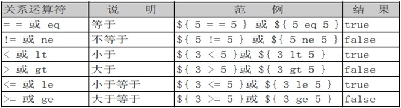
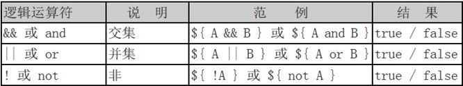
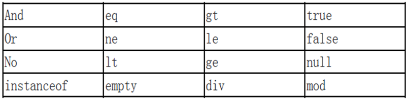

# EL表达式

---
## 1 EL简介

JSP EL(JSP表达式语言)使得访问存储在JavaBean中的数据变得非常简单。JSP EL既可以用来创建算术表达式也可以用来创建逻辑表达式。在JSP EL表达式内可以使用整型数，浮点数，字符串，常量true、false，还有null。EL 全名为**Expression Language**。EL主要作用：

- **获取数据**：EL表达式主要用于替换JSP页面中的脚本表达式，以从各种类型的web域 中检索java对象、获取数据。(某个web域 中的对象，访问javabean的属性、访问list集合、访问map集合、访问数组)
- **执行运算**：利用EL表达式可以在JSP页面中执行一些基本的关系运算、逻辑运算和算术运算，以在JSP页面中完成一些简单的逻辑运算。${user==null}
- **获取web开发常用对象**：EL表达式定义了一些隐式对象，利用这些隐式对象，web开发人员可以很轻松获得对web常用对象的引用，从而获得这些对象中的数据。
- **调用Java方法**：EL表达式允许用户开发自定义EL函数，以在JSP页面中通过EL表达式调用Java类的方法。


---
## 2 EL表达式语法

### 2.1 使用EL获取数据

使用EL表达式获取数据语法：`${标识符}`，作用为把表达式的结果输出到页面上。**EL只能获取域对象中的数据**

EL表达式语句在执行时，会调用`pageContext.findAttribute`方法，用标识符为关键字，分别从page、request、session、application四个域中查找相应的对象，找到则返回相应对象，找不到则返回”” （注意，不是null，而是空字符串）。

EL表达式也可以很轻松获取JavaBean的属性，或获取数组、Collection、Map类型集合的数据，例如：

```
${user.address.city} 访问JavaBean的属性
${user.list[0]} 访问有序集合某个位置的元素
${map.key} 获得map集合中指定key的值
${map.["key"]} 如果map的key不符合java命名，则用[]方式
```

- `.`运算符：`${p.name}===p.getName()`
- `[]`运算符：`${p.name}=${p[‘name’]}=${p[“name”]}`


### 2.2 运算符

语法：`${运算表达式}`，EL表达式支持如下运算符：

关系运算符：


逻辑运算符：


内置关键字：


- empty运算符：检查对象是否为null或“空”
- 三元表达式：`${user!=null?user.name : “”}`
- `[]` 和 `.` 号运算符
- 内置关键字用于逻辑判断和标识特定的值
- 指变量在命名时，应该避开内置关键字，以免程序编译时发生错误

### 2.3 获得web开发常用对象

EL表达式语言中定义了11个隐含对象，使用这些隐含对象可以很方便地获取web开发中的一些常见对象，并读取这些对象的数据，语法：`${隐式对象名称}`：获得对象的引用。


11个隐式对象（**注意一定要和JSP的隐式对象分开**）

EL隐式对象的名称 | 表示的类型 | JSP的隐式对象 | 备注
---|---|---|---
pageContext | javax.servlet.jsp.PageContext | <%pageContext%> | 一样的，对应于JSP页面中的pageContext对象（注意：取的是pageContext对象。）
pageScope | java.util.Map | 没有 | 代表page域中用于保存属性的Map对象
requestScope | java.util.Map | 没有 | 代表request域中用于保存属性的Map对象
sessionScope | java.util.Map | 没有 | 代表session域中用于保存属性的Map对象
applicationScope | java.util.Map | 没有 | 代表application域中用于保存属性的Map对象
header | java.util.Map | 没有 | 表示一个保存了所有http请求头字段的Map对象，key:请求消息头，value：消息头值
headerValues | java.util.Map | 没有 | key:请求消息头，value：消息头值数组（String[]）
param | java.util.Map | 没有 | 表示一个保存了所有请求参数的Map对象，key:请求参数名，value：请求参数值
paramValues | java.util.Map | 没有 | key:请求参数名，value：请求参数值数组（String[]）
cookie | java.util.Map | 没有 | key:Cookie对象的name；value是Cookie对象本身
initParam | java.util.Map | 没有 | key:全局参数的name，value就是全局参数的值

示例，EL获取普通类的属性：

```
        向域中放入对象
        <%
        Person p1 = new Person();
        pageContext.setAttribute("p", p1);
        %>

        //获取域中的对象，并输出
        ${p}<br/>
        <%--模拟原理
        Object obj = pageContext.findAttribute("p1");//从page、request、session、application范围中找名称为p1的那个对象
        out.write(obj);
        --%>

        //获取域中对象的属性
        ${p.name}=${p['name']}=${p["name"]}<br/>
        ${p.class}<br/>
        ${p.birthday}<br/><!-- EL表达式如果打印的值是null，则什么都不显示 -->
        ${p.birthday.time}<br/><!-- EL表达式中没有空指针异常 -->

        //访问不存在的属性会报错
        <%--
        ${p.province}<br/><!-- 如果属性不存在，会报错 -->
        --%>
```

**注意事项**：

- 操作headerValues时，如果头里面有`-`，例`Accept-Encoding`，则要`headerValues[“Accept-Encoding”]`
- 操作cookie时，例`${cookie.key}`取的是cookie对象，如访问cookie的名称和值，须`${cookie.key.name}`或`${cookie.key.value}`


### 2.4 使用EL调用Java方法(自定义EL函数)

EL表达式语法允许开发人员开发自定义函数，以调用Java类的方法。示例：`${prefix：method(params)}`

在EL表达式中调用的只能是Java类的静态方法。这个Java类的静态方法需要在TLD(Tagliary Definition)文件中描述，才可以被EL表达式调用。EL自定义函数用于扩展EL表达式的功能，可以让EL表达式完成普通Java程序代码所能完成的功能。

一般来说， EL自定义函数开发与应用包括以下三个步骤：

1. 编写一个Java类的静态方法
1. 编写标签库描述符（tld）文件，在tld文件中描述自定义函数。
1. 在JSP页面中导入和使用自定义函数

示例：小写转大写：
```java
//step 1 定义静态方法
package com.test;

public class MyFunctions {
    public static String toUppercase(String s){
        return s.toUpperCase();
    }
}


//step 2，WEB-INF/mfn.tld下，模块可以参照tomcat/webapp/example应用

<?xml version="1.0" encoding="UTF-8"?>
<taglib xmlns="http://java.sun.com/xml/ns/j2ee" xmlns:xsi="http://www.w3.org/2001/XMLSchema-instance"
    xsi:schemaLocation="http://java.sun.com/xml/ns/j2ee http://java.sun.com/xml/ns/j2ee/web-jsptaglibrary_2_0.xsd"
    version="2.0">
    <tlib-version>1.0</tlib-version>

    <short-name>mfn</short-name> 这是函数库名称
    <uri>http://www.test.com/functions</uri> 这是命名空间

    //定义一个函数
    <function>
        <name>toUppercase</name>
        <function-class>com.test.MyFunctions</function-class>
        <function-signature>java.lang.String toUppercase( java.lang.String )</function-signature>
    </function>

</taglib>


//step 3 jsp中引入使用
<%@ taglib uri="http://www.test.com/functions" prefix="mfn"%>
${mfn:toUppercase(s)}
```

开发EL Function注意事项：
- 编写完标签库描述文件后，需要将它放置到`<web应用>\WEB-INF`目录中或WEB-INF目录下的除了classes和lib目录之外的任意子目录中。
- TLD文件中的`<uri>` 元素用指定该TLD文件的URI，在JSP文件中需要通过这个URI来引入该标签库描述文件。
`<function>`元素用于描述一个EL自定义函数，其中：
 `<name>`子元素用于指定EL自定义函数的名称。
 `<function-class>`子元素用于指定完整的Java类名，
 `<function-signature>`子元素用于指定Java类中的静态方法的签名，方法签名必须指明方法的返回值类型及各个参数的类型，各个参数之间用逗号分隔。
- EL表达式是`JSP 2.0`规范中的一门技术 。因此，若想正确解析EL表达式，需使用支持Servlet2.4/JSP2.0技术的WEB服务器。


### 2.5 总结

EL中可以操作的数据类型：

- 符合JavaBean规范的对象，比如PageContext等
- Map

---
## 3 JSTL EL函数库

由于在JSP页面中显示数据时，经常需要对显示的字符串进行处理，SUN公司针对于一些常见处理定义了一套EL函数库供开发者使用。**这些EL函数在JSTL开发包中进行描述，因此在JSP页面中使用SUN公司的EL函数库，需要导入JSTL开发包，并在页面中导入EL函数库**，如下所示在页面中使用JSTL定义的EL函数：

```jsp
//导入
<%@taglib uri="http://java.sun.com/jsp/jstl/functions" prefix="fn"%>

//使用
${fn:contains('abcdefg','a')}

//配合jstl核心标签库
<c:if test="${fn:contains(<原始字符串>, <要查找的子字符串>)}">
...
</c:if>
```
