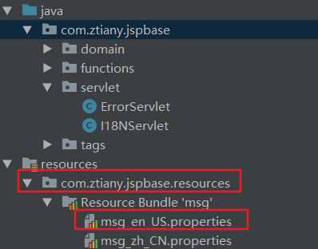

# JSTL

---
## 1 简介

JSTL即 **JSP Standard Tag Lirbary**，由Apache来实现。JSTL是JSP2.0规范的一部分，因此可以在任何支持Servlet2.4且JSP2.0以上的容器中运行，1.1版本也支持EL（Expression Language）。

JSP标准标签库封装了JSP应用的通用核心功能。JSTL支持通用的、结构化的任务，比如迭代，条件判断，XML文档操作，国际化标签，SQL标签。 除了这些，它还提供了一个框架来使用集成JSTL的自定义标签。

根据JSTL标签所提供的功能，主要包含以下主要五大类。

- core：核心标签库
- fmt：格式化（国际化）
- jst函数(EL函数)
- SQL：数据库操作（一般不用，无法开发需求）
- XML：操作xml（一般不用，无法开发需求）

JSTL | 前缀名称 | URI
---|---|---
核心标签库 | c | `http://java.sun.com/jsp/jstl/core`
I18N格式标签库 | fmt | `http://java.sun.com/jsp/jstl/fmt`
SQL标签库 | sql | `http://java.sun.com/jsp/jstl/sql`
XML标签库 | xml | `http://java.sun.com/jsp/jstl/xml`
函数标签库 | fn | `http://java.sun.com/jsp/jstl/functions`


---
## 2 自定义标签

自定义标签的作用：为了在JSP中替换`<%%>`脚本，实现一定的逻辑运算。
自定义标签属于JSP中的技术。

### 2.1 自定义标签的开发步骤

#### 1、编写标签类

直接或间接实现javax.servlet.jsp.tagext.SimpleTag接口。一般继承javax.servlet.jsp.tagext.SimpleTagSupport 。

```
package com.sample.taglib.ShowRemoteIpSimpleTag;

public class ShowRemoteIpSimpleTag extends SimpleTagSupport {

    //被容器调用，遇到标签时执行该方法中的代码
    public void doTag() throws JspException, IOException {
        PageContext pc = (PageContext)getJspContext();
        String remoteIp = pc.getRequest().getRemoteAddr();
        pc.getOut().write(remoteIp);
    }
}
```
容器框架会自动调用SimpleTagSupport的一些方法，为其设置一些需要用到的对象：

- setJspContext：设置PageContext对象
- setParent：设置父标签，用于自定义嵌套标签时使用

#### 2、添加配置文件

在WEB-INF目录下定义一个扩展名为tld（Tag Libary Definition）的xml文件

```
<?xml version="1.0" encoding="UTF-8"?>
<taglib xmlns="http://java.sun.com/xml/ns/j2ee"
    xmlns:xsi="http://www.w3.org/2001/XMLSchema-instance"
    xsi:schemaLocation="http://java.sun.com/xml/ns/j2ee http://java.sun.com/xml/ns/j2ee/web-jsptaglibrary_2_0.xsd"
    version="2.0">

    <tlib-version>1.0</tlib-version>
    <short-name>sample</short-name>
    <uri>http://www.sample.com/jsp/taglib</uri>
    <tag>
        <name>showRemoteIp</name>
        <tag-class>com.sample.taglib.ShowRemoteIpSimpleTag</tag-class>
        <body-content>empty</body-content>
    </tag>

</taglib>
```

3、在JSP中使用
`<%@ taglib uri="http://www.sample.com/jsp/taglib" prefix="itheima"%>`

```
<%@ taglib uri="http://www.itheima.com/jsp/taglib" prefix="sample"%>

 您的地址是：
    <sample:showRemoteIp/>
```


### 2.2 自定义标签细节

#### 嵌套标签

如果两个标签需要交互，则应该为它们设置一个父标签，通过父标签来交互。

#### 传递参数

可以通过标签像SupportTab类传递参数，参数类型支持自动从String转变为基本类型

```xml
 <tag>
        <name>if</name>
        <tag-class>com.sample.taglib.example.IfSimpleTag</tag-class>
        <body-content>scriptless</body-content>
        <!-- 声明一个属性 -->
        <attribute>
            <name>test</name>
            <required>true</required>
            <rtexprvalue>true</rtexprvalue><!-- rt:RunTime  expr:Expression value如果为true，支持表达式（jsp或EL） -->
        </attribute>
    </tag>
```

然后对于的标签类中要有对应字段的setter方法：

```
public class IfSimpleTag extends SimpleTagSupport {
    private boolean test;

    public void setTest(boolean test) {
        this.test = test;
    }

    public void doTag() throws JspException, IOException {
        if(test){
        //传入默认的Writer对象输出内容
            getJspBody().invoke(null);
        }
    }
}
```


#### 标签内容

通过body-content来限制内容，body-content支持以下四个取值：

- JSP：可使用传统标签。简单标签不能用，**一般不适用，jsp中不应该出现java脚本**
- scriptless:有主体内容，但主体内容不应该有脚本
- empty:没有主体内容
- tagdependent：把主体内容当做普通文本


#### 不输出任何内容的标签

```
public class Demo2SimpleTag extends SimpleTagSupport {
    
    public void doTag() throws JspException, IOException {
        throw new SkipPageException();
    }
    
}
```

---
## 3 Core标签库

参附附件文档

---
## 4 国际化

### 4.1 文本的国际化



配置属性

```
hello=hello good morning
jsp.login.title=User Login
jsp.login.username=Username
jsp.login.password=Password
jsp.login.submit=Submit

hello=\u60A8\u5403\u4E86\u5417
jsp.login.title=\u7528\u6237\u767B\u5F55
jsp.login.username=\u7528\u6237\u540D
jsp.login.password=\u5BC6\u7801
jsp.login.submit=\u63D0\u4EA4
```

读取
```
        //读默认的资源消息包：根据地区
        ResourceBundle rb = ResourceBundle.getBundle("com.ztiany.jspbase.resources.msg");
        String hello = rb.getString("hello");
        response.getWriter().write(hello);

        //读取指定区域的资源包
        ResourceBundle usRB = ResourceBundle.getBundle("com.ztiany.jspbase.resources.msg", Locale.US);
        String usHello = usRB.getString("hello");
        response.getWriter().write(usHello);

```

### 4.2 日期和时间的国际化（格式化）

DateFormat

```
显示：Date->String
String format(Date d);
存储：String---------->Date
Date parse(String s);
```


### 4.3 数字（通用阿拉伯数字）：货币符号

NumberFormat

```
显示：Number------>String
String format(Number n);
存储：String---------->Number
Number parse(String s)
```

### 4.4 批量国际化

MessageFormat

### 4.5 JSTL中的国际化标签

fmt的使用