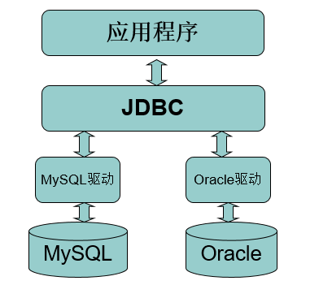
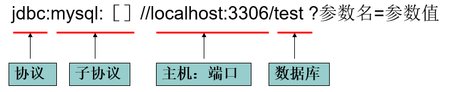
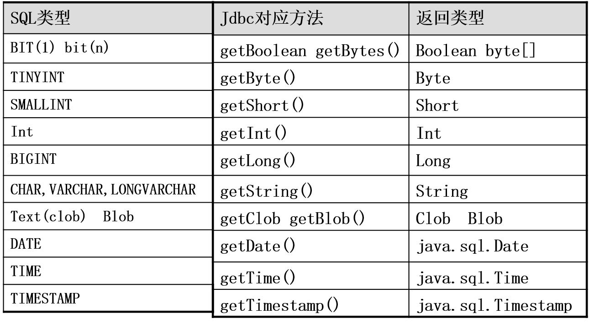

# JDBC

----
## 1 简介

Sun公司为简化数据库开发，定义了一套jdbc接口，这套接口由数据库厂商去实现，这样，开发人员只需要学习jdbc接口，并通过jdbc加载具体的驱动，就可以操作数据库。简单点就是用Java语言来操作数据库。

JDBC全称为：Java Data Base Connectivity（java数据库连接），它主要由接口组成。组成JDBC的２个包：`java.sql、javax.sql`，开发JDBC应用需要以上2个包的支持外，还需要导入相应JDBC的数据库实现(即数据库驱动)。

早期SUN公司的开发人员想编写一套可以连接所有数据库的API，但是当他们刚刚开始时就发现这是不可完成的任务，因为各个厂商的数据库服务器差异太大了。后来SUN开始与数据库厂商们讨论，最终得出的结论是，由SUN提供一套访问数据库的规范（就是一组接口），并提供连接数据库的协议标准，然后各个数据库厂商会遵循SUN的规范提供一套访问自己公司的数据库服务器的API出现。SUN提供的规范命名为JDBC，而各个厂商提供的，遵循了JDBC规范的，可以访问自己数据库的API被称之为驱动！

JDBC是接口，而JDBC驱动才是接口的实现，没有驱动无法完成数据库连接！每个数据库厂商都有自己的驱动，用来连接自己公司的数据库。




JDBC使用流程：

- １、注册驱动，SUM公司定义了JDBC只是一些接口，用户要想操作数据库，需要先把数据库的驱动，也就是JDBC的实现类拿到程序里来，这个操作称之为注册驱动。Sun公司定义了DriveManager类用于完成驱动程序的注册，示例：
```
DriverManager.registerDrive(new com.jdbc.mysql.Driver());
```

- 2、驱动注册后，就可以创建与数据库的连接了。
```
Connection connection = DriverManager.getConnection();
```

- 3、获得连接后，就可以在此连接上创建一条ＳＱＬ语句，并发送给数据库
```
Statement st = connection.createStatement();
ResultSet set = St.excute(“select * from user”);
```

----
## 2 JDBC详解

### 第一个JDBC程序

程序开发流程：
```
一、搭建实验环境 ：
    1、在mysql中创建一个库，并创建user表和插入表的数据。
    2、新建一个Java工程，并导入数据驱动。
    
二、编写程序，在程序中加载数据库驱动
    DriverManager. registerDriver(Driver driver) 
    
三、建立连接(Connection)
    Connection conn = DriverManager.getConnection(url,user,pass); 
    
四、创建用于向数据库发送SQL的Statement对象，并发送sql
    Statement st = conn.createStatement();
    ResultSet rs = st.excuteQuery(sql);
    
五、从代表结果集的ResultSet中取出数据，打印到命令行窗口

六、断开与数据库的连接，并释放相关资源
```

### 程序详解—DriverManager

Jdbc程序中的DriverManager用于加载驱动，并创建与数据库的链接，这个API的常用方法：

- `DriverManager.registerDriver(new Driver())`
- `DriverManager.getConnection(url, user, password)`

注意：在实际开发中并不推荐采用registerDriver方法注册驱动。原因有二：

1. 查看Driver的源代码可以看到，如果采用此种方式，会导致驱动程序注册两次，也就是在内存中会有两个Driver对象。
2. 程序依赖mysql的api，脱离mysql的jar包，程序将无法编译，将来程序切换底层数据库将会非常麻烦。


推荐方式：`Class.forName(“com.mysql.jdbc.Driver”);`，采用此种方式不会导致驱动对象在内存中重复出现，并且采用此种方式，程序仅仅只需要一个字符串，不需要依赖具体的驱动，使程序的灵活性更高。

同样，在开发中也不建议采用具体的驱动类型指向getConnection方法返回的connection对象。


### 数据库URL

URL用于标识数据库的位置，程序员通过URL地址告诉JDBC程序连接哪个数据库，URL的写法为：

```
   jdbc:mysql:［］//localhost:3306/test ?参数名=参数值
```



常用数据库URL地址的写法：

```
Oracle写法：jdbc:oracle:thin:@localhost:1521:sid

SqlServer—jdbc:microsoft:sqlserver://localhost:1433; DatabaseName=sid

MySql—jdbc:mysql://localhost:3306/sid

Mysql的url地址的简写形式： jdbc:mysql:///sid

```

常用属性：`useUnicode=true&characterEncoding=UTF-8`

- useUnicode指定连接这个数据库的过程中使用的字节是Unicode
- characterEncoding指定Java程序连接数据库的过程中，使用的字节编码为UTF-8，注意，MySQL中指定UTF-8编码是给出的UTF8，而不是UTF-8


### 程序详解—Connection

Jdbc程序中的Connection，它用于代表数据库的链接，Collection是数据库编程中最重要的一个对象，客户端与数据库所有交互都是通过connection对象完成的，这个对象的常用方法：

- `createStatement()`：创建向数据库发送sql的statement对象。
- `prepareStatement(sql)` ：创建向数据库发送预编译sql的PrepareSatement对象。
- `prepareCall(sql)`：创建执行存储过程的callableStatement对象。 
- `setAutoCommit(boolean autoCommit)`：设置事务是否自动提交。 
- `commit()` ：在链接上提交事务。
- `rollback()` ：在此链接上回滚事务。

### 程序详解—Statement

Jdbc程序中的Statement对象用于向数据库发送SQL语句， Statement对象常用方法：

- `executeQuery(String sql)` ：用于向数据发送查询语句。
- `executeUpdate(String sql)`：用于向数据库发送insert、update或delete语句
- `execute(String sql)`：用于向数据库发送任意sql语句
 - 执行select语句返回true，执行其他语句返回false
 - 返回true需要使用getResultSet()获取结果
 - 返回false需要使用getUpdateCount()获取影响行数
- `addBatch(String sql)` ：把多条sql语句放到一个批处理中。
- `executeBatch()`：向数据库发送一批sql语句执行。
- `clearBatch()`

### 程序详解—ResultSet

Jdbc程序中的ResultSet用于代表Sql语句的执行结果。Resultset封装执行结果时，采用的类似于表格的方式。ResultSet 对象维护了一个指向表格数据行的游标，初始的时候，游标在第一行之前，调用ResultSet.next() 方法，可以使游标指向具体的数据行，进行调用方法获取该行的数据。

#### ResultSet之滚动结果集

ResultSet内部维护一个行光标（游标），ResultSet提供了一系列的方法来移动游标：

- `void beforeFirst()`：把光标放到第一行的前面，这也是光标默认的位置；
- `void afterLast()`：把光标放到最后一行的后面；
- `boolean first()`：把光标放到第一行的位置上，返回值表示调控光标是否成功；
- `boolean last()`：把光标放到最后一行的位置上；
- `boolean isBeforeFirst()`：当前光标位置是否在第一行前面；
- `boolean isAfterLast()`：当前光标位置是否在最后一行的后面；
- `boolean isFirst()`：当前光标位置是否在第一行上；
- `boolean isLast()`：当前光标位置是否在最后一行上；
- `boolean previous()`：把光标向上挪一行；
- `boolean next()`：把光标向下挪一行；
- `boolean relative(int row)`：相对位移，当row为正数时，表示向下移动row行，为负数时表示向上移动row行；
- `boolean absolute(int row)`：绝对位移，把光标移动到指定的行上；
- `int getRow()`：返回当前光标所有行。

上面方法分为两类，一类用来判断游标位置的，另一类是用来移动游标的。如果结果集是不可滚动的，那么只能使用next()方法来移动游标，而`beforeFirst()、afterLast()、first()、last()、previous()、relative()`方法都不能使用。结果集是否支持滚动，要从Connection类的createStatement()方法说起。也就是说创建的Statement决定了使用Statement创建的ResultSet是否支持滚动。创建方法为`Statement createStatement(int resultSetType, int resultSetConcurrency)`

resultSetType的可选值：

- ResultSet.TYPE_FORWARD_ONLY：不滚动结果集；
- ResultSet.TYPE_SCROLL_INSENSITIVE：滚动结果集，但结果集数据不会再跟随数据库而变化；
- ResultSet.TYPE_SCROLL_SENSITIVE：滚动结果集，但结果集数据不会再跟随数据库而变化；

可以看出，如果想使用滚动的结果集，我们应该选择TYPE_SCROLL_INSENSITIVE！其实很少有数据库驱动会支持TYPE_SCROLL_SENSITIVE的特性！通常我们也不需要查询到的结果集再受到数据库变化的影响。

resultSetConcurrency的可选值：

- CONCUR_READ_ONLY：结果集是只读的，不能通过修改结果集而反向影响数据库；
- CONCUR_UPDATABLE：结果集是可更新的，对结果集的更新可以反向影响数据库。

获取滚动结果集的代码如下
```
Connection con = …
Statement stmt = con.createStatement(ResultSet.TYPE_SCROLL_INSENSITIVE, CONCUR_READ_ONLY);
String sql = …//查询语句
ResultSet rs = stmt.executeQuery(sql);//这个结果集是可滚动的
```

####  ResultSet之获取列数据

可以通过next()方法使ResultSet的游标向下移动，当游标移动到你需要的行时，就需要来获取该行的数据了，ResultSet提供了一系列的获取列数据的方法：

- `getObject(int columnIndex)`：根据列索引获取任意类型的数据
- `getObject(string columnName)`：根据列名获取任意类型的数据
- `getString(int columnIndex)`：获取指定类型的数据，(封装数据时方便)
- `getString(String columnName)`：获取指定类型的数据，(封装数据时方便)
- `int getInt(int columnIndex)`：获取指定列的int类型数据；
- `double getDouble(int columnIndex)`：获取指定列的double类型数据；
- `boolean getBoolean(int columnIndex)`：获取指定列的boolean类型数据；

上面方法中，参数columnIndex表示列的索引，列索引从1开始，而不是0，这第一点与数组不同。如果你清楚当前列的数据类型，那么可以使用getInt()之类的方法来获取，如果你不清楚列的类型，那么你应该使用getObject()方法来获取。


### 程序详解—释放资源

- Jdbc程序运行完后，切记要释放程序在运行过程中，创建的那些与数据库进行交互的对象，这些对象通常是ResultSet, Statement和Connection对象。
- 特别是Connection对象，它是非常稀有的资源，用完后必须马上释放，如果Connection不能及时、正确的关闭，极易导致系统宕机。Connection的使用原则是尽量晚创建，尽量早的释放。
- 为确保资源释放代码能运行，资源释放代码也一定要放在finally语句中。


### 常用数据类型转换表




----
## 3 使用JDBC对数据库进行CRUD

Jdbc中的statement对象用于向数据库发送SQL语句，想完成对数据库的增删改查，只需要通过这个对象向数据库发送增删改查语句即可。

- Statement对象的executeUpdate方法，用于向数据库发送增、删、改的sql语句，executeUpdate执行完后，将会返回一个整数(即增删改语句导致了数据库几行数据发生了变化)。
```
    //插入
    Statement st = conn.createStatement();
    String sql = "insert into user(….) values(…..) ";
    int num = st.executeUpdate(sql);
    if(num>0){
        System.out.println("插入成功！！！");
    }
    //删除
    Statement st = conn.createStatement();
    String sql = “delete from user where id=1; 
    int num = st.executeUpdate(sql);
    if(num>0){
        System.out.println(“删除成功！！！");
    }
```
- Statement.executeQuery方法用于向数据库发送查询语句，executeQuery方法返回代表查询结果的ResultSet对象。
```
    Statement st = conn.createStatement();

    String sql = “select * from user where id=1; 

    ResultSet rs = st.executeUpdate(sql);

    while(rs.next()){
        //根据获取列的数据类型，分别调用rs的相应方法
        //映射到java对象中
    }
```

### SQL注入

在需要用户输入的地方，用户输入的是SQL语句的片段，最终用户输入的SQL片段与我们DAO中写的SQL语句合成一个完整的SQL语句！例如用户在登录时输入的用户名和密码都是为SQL语句的片段！可以理解SQL注入是用户利用某些系统没有对输入数据进行充分的检查，从而进行恶意破坏的行为。

statement就存在sql注入攻击问题，例如登陆用户名采用`' or 1=1 or name=‘`，

对于防范SQL 注入：

- 过滤用户输入的数据中是否包含非法字符；
- 分步校验！先使用用户名来查询用户，如果查找到了，再比较密码；
- 使用PreparedStatement。


### PreparedStatement

PreparedStatement叫预编译声明，PreperedStatement是Statement的子类，它的实例对象可以通过调`Connection.preparedStatement()`方法获得，相对于Statement对象而言：

- PreperedStatement可以避免SQL注入的问题。
- Statement会使数据库频繁编译SQL，可能造成数据库缓冲区溢出。PreparedStatement 可对SQL进行预编译，从而提高数据库的执行效率。
- 并且PreperedStatement对于sql中的参数，允许使用占位符的形式进行替换，简化sql语句的编写。


注意PreparedStatement对象独有的executeQuery()方法是没有参数的，而Statement的executeQuery()是需要参数（SQL语句）的。因为在创建PreparedStatement对象时已经让它与一条SQL模板绑定在一起了，所以在调用它的executeQuery()和executeUpdate()方法时就不再需要参数了。
PreparedStatement最大的好处就是在于重复使用同一模板，给予其不同的参数来重复的使用它。这才是真正提高效率的原因。所以在开发中，一般都去使用PreparedStatement，而不是使用Statement。


---
## 4 大存储数据处理

### 使用JDBC处理大数据

在实际开发中，**程序一般不需要把大文本或二进制数据保存到数据库**。基本概念：**大数据也称之为LOB(Large Objects)**，LOB又分为clob和blob：

- clob(Character Large Object)用于存储大文本。
- blob(Binary Large Object)用于存储二进制数据，例如图像、声音、二进制文等。

对MySQL而言只有blob，而没有clob，mysql存储大文本采用的是Text，Text和blob分别又分为：

- TINYTEXT、TEXT、MEDIUMTEXT和LONGTEXT
- TINYBLOB、BLOB、MEDIUMBLOB和LONGBLOB

### 使用JDBC处理大文本

对于MySQL中的Text类型，可调用如下方法设置：
```
PreparedStatement stmt = conn.prepareStatement("insert into t2 values(?,?)");
stmt.setInt(1, 1);
File file = new File("src/jpm.txt");
Reader reader = new FileReader(file);
stmt.setCharacterStream(2, reader, (int)file.length());//以流的方式传递参数值
stmt.executeUpdate();

//注意length长度须设置，并且设置为int型，利用File获取
```

对MySQL中的Text类型，可调用如下方法获取：
```
reader = resultSet. getCharacterStream(i);
Reader reader = resultSet.getClob(i).getCharacterStream();
```

### 使用JDBC处理二进制数据

对于MySQL中的BLOB类型，可调用如下方法设置
```
PreparedStatement stmt = conn.prepareStatement("insert into t3 values(?,?)");
stmt.setInt(1, 1);
InputStream in = new FileInputStream("src/26.jpg");
stmt.setBinaryStream(2, in, in.available());
stmt.executeUpdate();
```

对MySQL中的BLOB类型，可调用如下方法获取：
```
InputStream in  = resultSet.getBinaryStream(i);
InputStream in  = resultSet.getBlob(i).getBinaryStream();
```

>对于从ResultSet获取到达流，需要手动关闭

---
## 5 使用JDBC进行批处理


业务场景：当需要向数据库发送一批SQL语句执行时，应避免向数据库一条条的发送执行，而应采用JDBC的批处理机制，以提升执行效率。实现批处理有两种方式

###  批处理的第一种方式：`Statement.addBatch(sql)`

```
Connection conn = null;
Statement st = null;
ResultSet rs = null;
try {
    conn = JdbcUtil.getConnection();
    String sql1 = "insert into user(name,password,email,birthday) 
    values('kkk','123','abc@sina.com','1978-08-08')";
    String sql2 = "update user set password='123456' where id=3";
    st = conn.createStatement();
    st.addBatch(sql1);  //把SQL语句加入到批命令中
    st.addBatch(sql2);  //把SQL语句加入到批命令中
    st.executeBatch();  //执行批处理
} finally{
    JdbcUtil.free(conn, st, rs);
}
```

- executeBatch()方法：执行批处理命令
- clearBatch()方法：清除批处理命令

总结
- 优点：可以向数据库发送多条不同的ＳＱＬ语句。
- 缺点：
 - SQL语句没有预编译。
 - 当向数据库发送多条语句相同，但仅参数不同的SQL语句时，需重复写上很多条SQL语句。

### 批处理的第二种方式：`PreparedStatement.addBatch()`

```
conn = JdbcUtil.getConnection();
String sql = "insert into user(name,password,email,birthday) values(?,?,?,?)";
st = conn.prepareStatement(sql);

for(int i=0;i<50000;i++){

      st.setString(1, "aaa" + i);
      st.setString(2, "123" + i);
      st.setString(3, "aaa" + i + "@sina.com");
      st.setDate(4,new Date(1980, 10, 10));
      st.addBatch();

   //每满100条执行一次，然后重新添加
   if(i%1000==0){
      st.executeBatch();
      st.clearBatch();
   }
}
st.executeBatch();
```

总结：
- 优点：发送的是预编译后的SQL语句，执行效率高。
- 缺点：只能应用在SQL语句相同，但参数不同的批处理中。因此此种形式的批处理经常用于在同一个表中批量插入数据，或批量更新表的数据。
- 注意内存溢出问题


---
##  6 获得数据库自动生成的主键

```
Connection conn = JdbcUtil.getConnection();

String sql = "insert into user(name,password,email,birthday)  values('abc','123','abc@sina.com','1978-08-08')";

PreparedStatement st = conn.prepareStatement(sql,Statement.RETURN_GENERATED_KEYS );
st.executeUpdate();

ResultSet rs = st.getGeneratedKeys();  //得到插入行的主键
if(rs.next()){
      System.out.println(rs.getObject(1));
}
```

此参数仅对insert操作有效。

---
## 7 JDBC调用存储过程

存储程序和函数是用`CREATE PROCEDURE`和`CREATE FUNCTION`语句创建的子程序。一个子程序要么是一个程序要么是一个函数。使用CALL语句来调用程序，程序只能用输出变量传回值。就像别其它函数调用一样，函数可以被从语句外调用（即通过引用函数名），函数能返回标量值。存储子程序也可以调用其它存储子程序。


```
delimiter $$//把sql的语句结束符从;改为$$，这个设置使临时的

//demoSp为程序名称，IN表示输入变量，INOUT表示输入输出变量。
CREATE PROCEDURE demoSp(IN inputParam VARCHAR(255), INOUT inOutParam varchar(255))
BEGIN
    SELECT CONCAT('zyxw---', inputParam) into inOutParam;
END $$

delimiter ;//改回来
```

编写存储过程（参看mysql文档）得到CallableStatement，并调用存储过程：
```
CallableStatement cStmt = conn.prepareCall("{call demoSp(?, ?)}");
```
设置参数，注册返回值，得到输出
```
cStmt.setString(1, "abcdefg");
cStmt.registerOutParameter(2, Types.VARCHAR);
cStmt.execute();
System.out.println(cStmt.getString(2));
```

---
## 8 事务

事务的概念，事务指逻辑上的一组操作，组成这组操作的各个单元，要么全部成功，要么全部不成功。

例如：A——B转帐，对应于如下两条sql语句：
```
update account set money=money-100 where name=‘a’;
update account set money=money+100 where name=‘b’;
```

数据库开启事务命令
```
start transaction  开启事务
rollback  回滚事务
commit   提交事务
```

### 使用事务

当Jdbc程序向数据库获得一个Connection对象时，默认情况下这个Connection对象会自动向数据库提交在它上面发送的SQL语句。若想关闭这种默认提交方式，让多条SQL在一个事务中执行，可使用下列语句：

JDBC控制事务语句
```
Connection.setAutoCommit(false); //start transaction
Connection.rollback();  rollback
Connection.commit();  commit
```
设置事务回滚点
```
Savepoint sp = conn.setSavepoint();
conn.rollback(sp);
conn.commit();   //回滚后必须要提交
```

示例
```
        Connection conn = null;
        PreparedStatement stmt = null;
        try{
            conn = JdbcUtil.getConnection();
            conn.setAutoCommit(false);// start transaction
            stmt = conn.prepareStatement("update account set money=money-100 where name='bbb'");
            stmt.executeUpdate();
            stmt = conn.prepareStatement("update account set money=money+100 where name='aaa'");
            stmt.executeUpdate();
            conn.commit();//提交事务
        }catch(Exception e){
            if(conn!=null){
                try {
                    conn.rollback();//回滚
                } catch (SQLException e1) {
                    e1.printStackTrace();
                }
            }
            e.printStackTrace();
        }finally{
            JdbcUtil.release(null, stmt, conn);
        }
```


### 事务的特性(ACID)

- 原子性（Atomicity）：原子性是指事务是一个不可分割的工作单位，事务中的操作要么都发生，要么都不发生。
- 一致性（Consistency）：事务必须使数据库从一个一致性状态变换到另外一个一致性状态。
- 隔离性（Isolation）：事务的隔离性是多个用户并发访问数据库时，数据库为每一个用户开启的事务，不能被其他事务的操作数据所干扰，多个并发事务之间要相互隔离。
- 持久性（Durability）：持久性是指一个事务一旦被提交，它对数据库中数据的改变就是永久性的，接下来即使数据库发生故障也不应该对其有任何影响


### 事务隔离性的

多个线程开启各自事务操作数据库中数据时，数据库系统要负责隔离操作，以保证各个线程在获取数据时的准确性。如果不考虑隔离性，可能会引发如下问题：

- **脏读**（dirty reads）：一个事务读取了另一个未提交的并行事务写的数据。
- **不可重复读**（non-repeatable reads）：一个事务重新读取前面读取过的数据， 发现该数据已经被另一个已提交的事务修改过。一个线程中的事务读到了另外一个线程事务中提交的update数据。
- **幻读**（phantom read）：一个事务重新执行一个查询，返回一套符合查询条件的行， 发现这些行因为其他最近提交的事务而发生了改变。一个线程中的事务读到了另外一个线程事务中提交的insert数据。

#### 脏读

**指一个事务读取了另外一个事务未提交的数据**。这是非常危险的，假设Ａ向Ｂ转帐100元，对应sql语句如下所示：
```
1.update account set money=money-100 while name=‘a’;
2.update account set money=money+100 while name=‘b’;
```

当第1条l执行完，第2条还没执行(A未提交时)，如果此时Ｂ查询自己的帐户，就会发现自己多了100元钱。如果A等B走后再回滚，B就会损失100元。

#### 不可重复读

针对一条记录的，同一条记录前后不一样，**即在一个事务内读取表中的某一行数据，多次读取结果不同。**

例如银行想查询A帐户余额，第一次查询A帐户为200元，此时A向帐户内存了100元并提交了，银行接着又进行了一次查询，此时A帐户为300元了。银行两次查询不一致，可能就会很困惑，不知道哪次查询是准的。和脏读的区别是，脏读是读取前一事务未提交的脏数据，不可重复读是重新读取了前一事务已提交的数据。

很多人认为这种情况就对了，无须困惑，当然是后面的为准。我们可以考虑这样一种情况，比如银行程序需要将查询结果分别输出到电脑屏幕和写到文件中，结果在一个事务中针对输出的目的地，进行的两次查询不一致，导致文件和屏幕中的结果不一致，银行工作人员就不知道以哪个为准了。

#### 虚读(幻读)

同一张表前后不一样记录数，**是指在一个事务内读取到了别的事务插入的数据**，导致前后读取不一致。如丙存款100元未提交，这时银行做报表统计account表中所有用户的总额为500元，然后丙提交了，这时银行再统计发现帐户为600元了，造成虚读同样会使银行不知所措，到底以哪个为准。


#### 设置事务隔离级别

数据库共定义了四种隔离级别：

- **serializable**：可避免脏读、不可重复读、虚读情况的发生。（串行化）
- **repeatable read**：可避免脏读、不可重复读情况的发生。虚读有可能发生（MySQL默认的级别）
- **read committed**：可避免脏读情况发生。而不可重复读、虚读有可能发生(Oracle默认的)
- **read uncommitted**：最低级别，以上情况均无法保证。(读未提交)

```
SELECT @@TX_ISOLATION; //查看当前事务的隔离级别
SET TRANSATION ISOLATION LEVEL xxx事务级别 （一定要在开启事务之前）
```

示例：

时间轴 | 线程1 | 线程2 | 备注
----|----|----|----
t1 | set transaction isolation level read uncommitted;  |  | 线程1自己的线程，调至最低级别
t2 | start transaction; |  |
t3 |  | start transaction; |
t4 | select * from account where name=’aaa’; 发现账户1000块 |  |
t5 |  | update account set money=money+100 where name=’aaa’   |  |
t6 | select * from account where name=’aaa’;  发现账户1100块|  | 此时脏读发生了
t7 |  | commit;   |  |
t8 | select * from account where name=’aaa’;发现账户1100块  |  |    此时发生不可重复读
t9 |  | insert into account values(4,’ddd’,1000);   |
t10 | select * from account;发现4条，原来是3条 |  | 此时发生虚读
t11 | commit；|  |


### 丢失更新

指一个事务中提交的数据覆盖了另外一个事务提交的数据。解决办法：**利用数据库的锁机制**(读取数据时加上独占锁)

时间轴 |服务器| 客户端A | 客户端B | 备注
----|----|----|----|----
t1 |`id=1,name=aaa,money=1000`| | |
t2 |`id=1,name=aaa,money=1000`| `id=1,name=aaa,money=1000` | `id=1,name=aaa,money=1000` |A和B读取到相同数据
t3 |`id=1,name=aaa,money=1000`|修改`name=aaaa` |   |
t4 |`id=1,name=aaaa,money=1000`|提交 |   |
t5 |`id=1,name=aaaa,money=1000`|  |   | 修改`money=2000`,但是name还是之前读到的aaa|
t6 |`id=1,name=aaa,money=2000`|  |   | 提交，此时服务器|

最终，客户端A的更新将会丢失。

#### 共享锁

共享锁：可以有多把。查询时可以用。`SELECT * FROM T4 lock in share mode;`一般不要使用共享锁，因为容易造成死锁

#### 排它锁

- 修改数据：INSERT DELETE UPDATE，自动加排他锁
- 查询：`SELECT * FROM T4 FOR UPDATE；`加上 FOR UPDATE表示在查询的时候使用排它锁


---
## 9 使用数据库连接池优化程序性能

应用程序直接获取链接的缺点，用户每次请求都需要向数据库获得链接，而数据库创建连接通常需要消耗相对较大的资源，创建时间也较长。假设网站一天10万访问量，数据库服务器就需要创建10万次连接，极大的浪费数据库的资源，并且极易造成数据库服务器内存溢出、拓机。


### 实现自己的连接池

编写连接池需实现`javax.sql.DataSource`接口。DataSource接口中定义了两个重载的getConnection方法：

- `Connection getConnection()`
- `Connection getConnection(String username, String password)`

实现DataSource接口，并实现连接池功能的步骤：

- 在DataSource构造函数中批量创建与数据库的连接，并把创建的连接加入LinkedList对象中。
- 实现getConnection方法，让getConnection方法每次调用时，从List中取一个Connection返回给用户。
- 当用户使用完Connection，调用Connection.close()方法时，Collection对象应保证将自己返回List中，而不要把conn还给数据库。
- Collection保证将自己返回到List中是此处编程的难点。

实现方式：

- 包装设计模式：装饰原来的Connection
- 动态代理：Proxy或CGLIB
  - Proxy为Java原生提供的动态代理工具，但是只能为接口提供动态代理
  - CGLIB是开源库，可以为非final类提供动态代理功能

拓展，包装设计模式的步骤：

```
包装设计模式：
1、定义一个类，实现与被增强对象所实现的接口
2、定义一个变量，引用被增强对象
3、构造方法接收被增强对象
4、覆盖要被增强的方法
5、对于不想增强的方法，调用被增强对象的对应方法
```

### 开源数据库连接池

#### DBCP

DBCP 是 Apache 软件基金组织下的开源连接池实现，Tomcat的连接池正是采用该连接池来实现的。该数据库连接池既可以与应用服务器整合使用，也可由应用程序独立使用。


#### C3P0

c3p0使用xml配置

---
## 10 JNDI技术简介

JNDI(Java Naming and Directory Interface)，Java命名和目录接口，它对应于J2SE中的javax.naming包，这套API的主要作用在于：它可以把Java对象放在一个容器中（JNDI容器），并为容器中的java对象取一个名称，以后程序想获得Java对象，只需通过名称检索即可。其核心API为Context，它代表JNDI容器，其lookup方法为检索容器中对应名称的对象。


#### Tomcat中如何利用JNDI管理数据源

- 1 配置Tomcat管理的数据源

a、把数据库驱动拷贝到`Tomcat\lib`目录下
b、在Web应用的META-INF目录下建立一个名字为`context.xml`的配置文件，内容如下：

```
<?xml version="1.0" encoding="UTF-8"?>
<Context>
    <Resource name="jdbc/sqlbase" auth="Container" type="javax.sql.DataSource"
               maxActive="100" maxIdle="30" maxWait="10000"
               username="root" password="201314" driverClassName="com.mysql.jdbc.Driver"
               url="jdbc:mysql://localhost:3306/sqlbase"/>
</Context>
```

- 2 启动Tomcat，数据源便建立成功

服务器会根据context.xml的配置，创建数据源DataSource对象，用名称jdbc/sqlbase绑定该对象到JNDI（Java Naming and Directory Interface）容器中。JNDI是一个Map<String,Object>。

- 3 利用JNDI的API获取绑定的对象

```
//JNDI的API存在JDK：javax.naming.*

import java.sql.Connection;

import javax.naming.Context;
import javax.naming.InitialContext;
import javax.sql.DataSource;

public class DataSourceUtil {
    public static Connection getConnection() throws Exception{
        Context initContext = new InitialContext();
        Context envContext  = (Context)initContext.lookup("java:/comp/env");
        DataSource ds = (DataSource)envContext.lookup("jdbc/sqlbase");
        Connection conn = ds.getConnection();
        return conn;
    }
}
```

---
## 11 编写自己的JDBC框架

元数据包括：

- 数据库元信息：数据库、表、结果等的定义信息
- 数据库本身的原信息

JDBC中的元数据类

- DataBaseMetaData
- ParameterMetaData
- ResultSetMetaData


### DataBaseMetaData
```
Connection.getMetaData()用于获取DataBaseMetaData对象

DataBaseMetaData方法：
getURL()：返回一个String类对象，代表数据库的URL。
getUserName()：返回连接当前数据库管理系统的用户名。
getDatabaseProductName()：返回数据库的产品名称。
getDatabaseProductVersion()：返回数据库的版本号。
getDriverName()：返回驱动驱动程序的名称。
getDriverVersion()：返回驱动程序的版本号。
isReadOnly()：返回一个boolean值，指示数据库是否只允许读操作。
```
### getParameterMetaData
```
PreparedStatement.getParameterMetaData()用于获得代表PreparedStatement元数据的ParameterMetaData对象。

ParameterMetaData对象方法：
getParameterCount()获得指定参数的个数
getParameterType(int param)获得指定参数的sql类型（驱动可能不支持）
```
### ResultSetMetaData
```
ResultSet. getMetaData()用于获得代表ResultSet对象元数据的ResultSetMetaData对象。

ResultSetMetaData对象方法：
getColumnCount()返回resultset对象的列数
getColumnName(int column)获得指定列的名称
getColumnTypeName(int column)获得指定列的类型 java.sql.Types
```
### 使用元数据简化JDBC代码

系统中所有实体对象都涉及到基本的CRUD操作：

- 所有实体的CUD操作代码基本相同，仅仅发送给数据库的SQL语句不同而已，因此可以把CUD操作的所有相同代码抽取到工具类的一个update方法中，并定义参数接收变化的SQL语句。
- 实体的R操作，除SQL语句不同之外，根据操作的实体不同，对ResultSet的映射也各不相同，因此可义一个query方法，除以参数形式接收变化的SQL语句外，可以使用策略模式由qurey方法的调用者决定如何把ResultSet中的数据映射到实体对象中。


---
## 12 O-R Mapping简介

ORM框架：Object Relation Mapping

- Hibernate  JPA（Java Persistent API标准）
- MyBatis（iBatis）

2、JDBC框架：只是对JDBC的代码做了封装

- DBUtil（apache）
- Spring JDBCTemplate（spring）

### Apache—DBUtils框架

DbUtils ：提供如关闭连接、装载JDBC驱动程序等常规工作的工具类，里面的所有方法都是静态的。主要方法如下：

```
public static void close(…) throws java.sql.SQLException：　DbUtils类提供了三个重载的关闭方法。这些方法检查所提供的参数是不是NULL，如果不是的话，它们就关闭Connection、Statement和ResultSet。

public static void closeQuietly(…): 这一类方法不仅能在Connection、Statement和ResultSet为NULL情况下避免关闭，还能隐藏一些在程序中抛出的SQLEeception。

public static void commitAndCloseQuietly(Connection conn)： 用来提交连接，然后关闭连接，并且在关闭连接时不抛出SQL异常。

public static boolean loadDriver(java.lang.String driverClassName)：这一方装载并注册JDBC驱动程序，如果成功就返回true。使用该方法，你不需要捕捉这个异常ClassNotFoundException。
```

QueryRunner类，该类简单化了SQL查询，它与ResultSetHandler组合在一起使用可以完成大部分的数据库操作，能够大大减少编码量。

```
public Object query(Connection conn, String sql, Object[] params, ResultSetHandler rsh) throws SQLException：执行一个查询操作，在这个查询中，对象数组中的每个元素值被用来作为查询语句的置换参数。该方法会自行处理 PreparedStatement 和 ResultSet 的创建和关闭。

public Object query(String sql, Object[] params, ResultSetHandler rsh) throws SQLException:　几乎与第一种方法一样；唯一的不同在于它不将数据库连接提供给方法，并且它是从提供给构造方法的数据源(DataSource) 或使用的setDataSource 方法中重新获得 Connection。

public Object query(Connection conn, String sql, ResultSetHandler rsh) throws SQLException : 执行一个不需要置换参数的查询操作。

public int update(Connection conn, String sql, Object[] params) throws SQLException:用来执行一个更新（插入、更新或删除）操作。

public int update(Connection conn, String sql) throws SQLException：用来执行一个不需要置换参数的更新操作。
```

ResultSetHandler接口，该接口用于处理 java.sql.ResultSet，将数据按要求转换为另一种形式。

```
ArrayHandler：把结果集中的第一行数据转成对象数组。
ArrayListHandler：把结果集中的每一行数据都转成一个数组，再存放到List中。
BeanHandler：将结果集中的第一行数据封装到一个对应的JavaBean实例中。
BeanListHandler：将结果集中的每一行数据都封装到一个对应的JavaBean实例中，存放到List里。
ColumnListHandler：将结果集中某一列的数据存放到List中。
KeyedHandler(name)：将结果集中的每一行数据都封装到一个Map<列名,列值>里，再把这些map再存到一个map里，其key为指定的key。
MapHandler：将结果集中的第一行数据封装到一个Map里，key是列名，value就是对应的值。
MapListHandler：将结果集中的每一行数据都封装到一个Map里，然后再存放到List
```


---
## 13 JDBC开发实践

- 使用ThreadLocal实现线程访问域内的数据共享。
- DAO中应该只有纯粹的数据库SQL操作，而不关心是否有事务，而Service中就是纯粹的业务逻辑，不应该出现SQL相关的操作，那么如何编码呢？使用工厂方法和配置文件创建DAO，使用动态代理代理原有的DAO对象，为其添加事务功能，那就是AOP的思想，主线为纯粹的业务流，利用AOP横切业务，提供功能增强。
