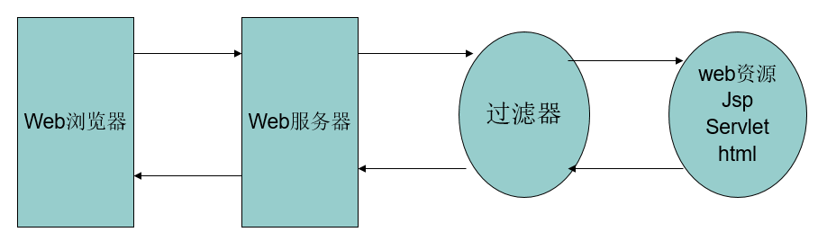

# Filter(过滤器)

Filter也称之为过滤器，WEB开发人员可以通过Filter技术，对web服务器管理的所有web资源：例如Jsp, Servlet, 静态图片文件或静态 html 文件等进行拦截，从而实现一些特殊的功能。例如实现URL级别的权限访问控制、过滤敏感词汇、压缩响应信息等一些高级功能。


---
## 1 Filter简介

Servlet API中提供了一个Filter接口，开发web应用时，如果编写的Java类实现了这个接口，则把这个java类称之为过滤器Filter。通过Filter技术，开发人员可以实现用户在访问某个目标资源之前，对访问的请求和响应进行拦截：



### Filter开发的步骤

- 编写java类实现Filter接口，并实现其doFilter方法。
- 在 web.xml 文件中使用`<filter>`和`<filter-mapping>`元素对编写的filter类进行注册，并设置它所能拦截的资源。

### 如何使用Filter进行资源访问拦截

Filter接口中有一个doFilter方法，当开发人员编写好Filter，并配置对哪个web资源进行拦截后，WEB服务器每次在调用web资源的service方法之前，都会先调用一下filter的doFilter方法，因此，在该方法内编写代码可达到如下目的：

- 调用目标资源之前，让一段代码执行
- 是否调用目标资源（即是否让用户访问web资源），web服务器在调用doFilter方法时，会传递一个filterChain对象进来，同时filterChain也提供了一个doFilter方法，开发人员可以根据需求决定是否调用此方法，调用该方法，则web服务器就会调用web资源的service方法，即web资源就会被访问，否则web资源不会被访问。
- 调用目标资源之后，让一段代码执行


### Filter链

在一个web应用中，可以开发编写多个Filter，这些Filter组合起来称之为一个**Filter链**。web服务器根据Filter在web.xml文件中的注册顺序，决定先调用哪个Filter，当第一个Filter的doFilter方法被调用时，web服务器会创建一个代表Filter链的FilterChain对象传递给该方法。在doFilter方法中，开发人员如果调用了FilterChain对象的doFilter方法，则web服务器会检查FilterChain对象中是否还有filter，如果有，则调用第2个filter，如果没有，则调用目标资源。注意虽然Filter的doFilter方法会被调用多次，但是该方法的参数FilterChain对象是不变的，即每个Filter的每一次doFilter方法的调用，FilterChain都是同一个。


### Filter的生命周期

初始化：
```
init(FilterConfig filterConfig)throws ServletException：

Filter的创建和销毁由WEB服务器负责。 web 应用程序启动时，web 服务器将创建Filter 的实例对象，
并调用其init方法，完成对象的初始化功能，从而为后续的用户请求作好拦截的准备工作（注：filter对象只会创建一次，init方法也只会执行一次。）
发人员通过init方法的参数，可获得代表当前filter配置信息的FilterConfig对象。
```

销毁：

```
destroy()

在Web容器卸载 Filter 对象之前被调用。该方法在Filter的生命周期中仅执行一次。在这个方法中，可以释放过滤器使用的资源。
```

### FilterConfig接口

用户在配置filter时，可以使用`<init-param>`为filter配置一些初始化参数，当web容器实例化Filter对象，调用其init方法时，会把封装了filter初始化参数的filterConfig对象传递进来。因此开发人员在编写filter时，通过filterConfig对象的方法，就可获得：

```
String getFilterName()：得到filter的名称。

String getInitParameter(String name)： 返回在部署描述中指定名称的初始化参数的值。如果不存在返回null.

Enumeration getInitParameterNames()：返回过滤器的所有初始化参数的名字的枚举集合。

public ServletContext getServletContext()：返回Servlet上下文对象的引用。
```

---
## 2 Filter的部署

```xml
 <filter>
      <filter-name>FilterDemo1</filter-name>
      <filter-class>com.itheima.filter.FilterDemo1</filter-class>
  </filter>

  <filter-mapping>
      <filter-name>FilterDemo1</filter-name>
      <url-pattern>/*</url-pattern>
      <dispatcher>REQUEST</dispatcher>
      <dispatcher>FORWARD</dispatcher>
      <dispatcher>INCLUDE</dispatcher>
      <dispatcher>ERROR</dispatcher>
  </filter-mapping>
```

- `<filter-name>`用于为过滤器指定一个名字，该元素的内容不能为空。
- `<filter-class>`元素用于指定过滤器的完整的限定类名。
- `<init-param>`元素用于为过滤器指定初始化参数，它的子元素`<param-name>`指定参数的名字，`<param-value>`指定参数的值。在过滤器中，可以使用FilterConfig接口对象来访问初始化参数
- `<filter-mapping>`元素用于设置一个 Filter 所负责拦截的资源。一个Filter拦截的资源可通过两种方式来指定：Servlet名称和资源访问的请求路径
 - <filter-name>子元素用于设置filter的注册名称。该值必须是在`<filter>`元素中声明过的过滤器的名字
 - `<url-pattern>`设置 filter 所拦截的请求路径(过滤器关联的URL样式)
 - `<servlet-name>`指定过滤器所拦截的Servlet名称
 - `<dispatcher>`指定过滤器所拦截的资源被 Servlet 容器调用的方式，可以是REQUEST,INCLUDE,FORWARD和ERROR之一，默认REQUEST。用户可以设置多个`<dispatcher>` 子元素用来指定 Filter 对资源的多种调用方式进行拦截

关于dispatcher的四个值：
- REQUEST：默认行为，拦截请求
- INCLUDE：拦截动态包含
- FORWARD：拦截转发
- ERROR：拦截在web.xml中配置的errorPage

---
## 3 Filter常见应用

- 统一全站字符编码
- 禁止浏览器缓存所有动态页面
- 控制浏览器缓存页面中的静态资源的
- 使用Filter实现URL级别的权限认证
- 实现用户自动登陆
- 全站GZIP压缩