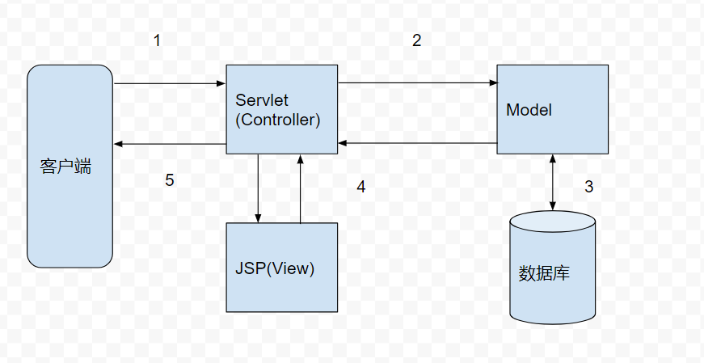
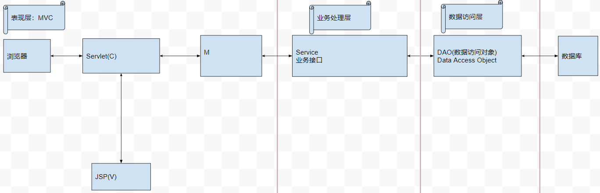
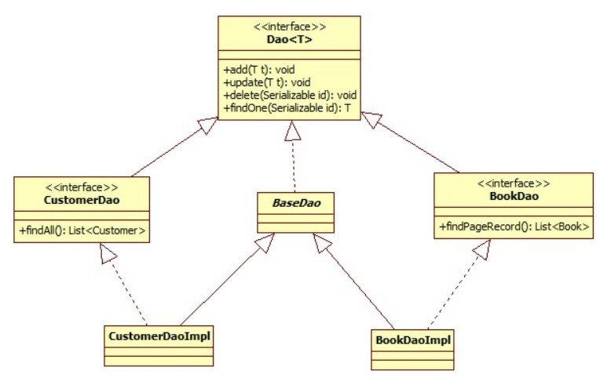

---
##  开发环境(IDEA + Gradle)

工具与环境配置
- 安装gradle，要求版本为 4.1 以上，配置 GRADLE_HOME
- 下载tomcat，配置TOMCAT_HOME
- 下载idea2017.3(老版本有bug)
- gradle war [插件文档](https://docs.gradle.org/current/userguide/war_plugin.html)
- idea spring [帮助文档](https://www.jetbrains.com/help/idea/spring-support.html)

IDEA `war`还是`war exploded`模式？

- war 模式：将 WEB 工程以包的形式上传到服务器，可以称之为发布模式。
- war exploded 模式：将 WEB 工程以当前文件夹的位置关系上传到服务器。
- war exploded 模式是直接把文件夹、jsp 页面 、classes 等等移到 Tomcat 部署文件夹里面，进行加载部署。因此这种方式**支持热部署**，一般在开发的时候也是用这种方式。
- 两种模式下 `request.getSession().getServletContext().getRealPath("/");`获取到的路径不一致，war 模式能获取到 `webapps/appname` 的全路径，而 war exploded模式获取不到。

---
## 明确项目开发流程

1. 确定项目需求-----拿下一个项目
2. 编写《需求说明书》----不涉及技术，只涉及业务需求
3. 编写《概要设计说明书》----- 涉及技术的的宏观的内容，数据库设计，页面原型
4. 编写《详细设计说明书》----- 相当于伪代码
5. 编码阶段coding----根据《详细设计说明书》--- 单元测试
6. 联测-----项目组内部的行为
7. 测试组进行全面的专业测试----《测试报告》
8. 上线（测试阶段）
9. 维护和二次开发

---
## 项目类型

- **BOS**：`business operating system`
- **OA**：
 - 办公自动化（Office Automation,简称OA）是将现代化办公和计算机网络功能结合起来的一种新型的办公方式
 - OA的核心即为 ezOFFICE（easy office），强调的就是办公的便捷方便，提高效率
- **CRM**：CRM（`Customer Relationship Management`）即客户关系管理。是指企业用CRM技术来管理与客户之间的关系
- **ERP**
  - ERP 是 `Enterprise Resource Planning`（企业资源计划）的简称 。
  - ERP 是针对物资资源管理（物流）、人力资源管理（人流）、财务资源管理（财流）、信息资源管理（信息流）集成一体化的企业管理软件
- **CMS**：内容管理系统
- **BBS**：论坛系统

---
## Model 1

JSP + JavaBean（不适合开发大型的应用），jsp也是一种Servlet，因为它干的就是Servlet的事，在开发中就两个地方需要去开发，一个是逻辑类，一个是jsp。

---
## Model 2(MVC)

- **M**：模型 Model 用于封装与业务逻辑相关的数据和数据处理方法
- **V**：视图 View 是数据的 HTML 展现
- **C**：控制器 Controller 负责响应请求，协调 Model 和 View

1. Web浏览器发送HTTP请求到服务端，被Controller获取并进行处理（例如参数解析、请求转发）
1. Controller调用核心业务逻辑，即Model部分
1. Model进行数据库存取操作，获取操作结果
1. Controller获取业务逻辑处理结果，将业务逻辑处理结果交给View（JSP），动态输出HTML内容
1. 动态生成的HTML内容返回到浏览器显示

MVC展示层的开发模型，并没有对程序的不同层级进行区分，当然这也不是MVC应该做的，如果单纯使用MVC来开发Web应用，那么Model将会变得是否臃肿。**MVC还有多种形式**，主要体现在V和M的交互上，具体参考[维基百科 MVC](https://zh.wikipedia.org/wiki/MVC)

---
## MVC 与三层架构

三层是指（在client-server的语境下）：

- Presentation Tier，表现层。
- Business Tier，服务层。
- Data Tier，数据访问层。

**三层**是从整个应用程序架构的角度来分的三层（如果程序需要，还可以分多层）。三层是为了解决整个应用程序中**各个业务操作过程中不同阶段的代码封装**的问题，**为了使程序员更加专注的处理某阶段的业务逻辑**。比如将数据库操作代码封装到一层中，提供一些方法根据参数直接返回用户需要的相应数据，这样在处理具体的业务逻辑的时候，就不用关心数据的存储问题了。

**MVC**是在应用程序（BS结构）的**视图层**划分出来的不同功能的几个模块。为什么会有MVC模式，首先从WEB开发的任务来讲，都有哪些任务呢？要把数据展示到客户端，用户可以操作视图，所以需要处理逻辑，然后具体的逻辑又有不同的业务调用，比如数据库等，对于任何一门开发语言来讲，如果那这些东西都用一个单独的模块来实现，那么这个模块将会是非常复杂的，而且非常不利于维护，所有要拆分任务，各个模块各司其职，把展示数据的 HTML 页面尽可能的和业务代码分离。MVC把纯净的界面展示逻辑（用户界面）独立到一些文件中（Views），把一些和用户交互的程序逻辑（Controller）单独放在一些文件中，在 Views 和 Controller 中传递数据使用一些专门封装数据的实体对象，这些对象，统称为Models。

MVC和三层架构毫无关系，因为它们二者使用范围不同：三层可以应用于任何语言、任何技术的应用程序；而MVC只是为了解决BS应用程序视图层各部分的耦合关系。它们互不冲突，可以同时存在，也可根据情况使用其中一种。

---
## JavaBean

*   通过统一的规范可以设置对象的值(get，set方法)，这是最初的 java bean。
*   在实际企业开发中，需要实现事务、安全、分布式、javabean 就不好用了，sun 公司就开始往上面堆功能，这里 javabean 就复杂为 EJB。
*   EJB 功能强大，但是太重了，此时出现 DI(依赖注入)、AOP(面向切面)技术，通过简单的 javabean 也能完成EJB的事情，这里的 javabean 简化为 POJO(普通 Java 对象)。

**JavaBean**：狭义上的 JavaBean 需要满足以下条件：

- Bean 有一个默认的无参构造器。
- 属性修饰符为：private 。
- 实现接口 java.io.Serializable 。
- 所有访问器方法都以get开头，所有的修改器方法都以 set 开头，布尔类型的属性最好使用 is/set 命名模式。
- JavaBean 持久化，适合于长期存储。用 JavaBean 的属性来将 bean 存储到流中，并在之后的某个时刻，或者在另一个虚拟机中再将它们读回来。

>JavaBean最初是为 Java GUI 的可视化编程实现的，你拖动IDE构建工具创建一个GUI 组件（如多选框）,其实是工具给你创建java类，并提供将类的属性暴露出来给你修改调整，将事件监听器暴露出来——《Java 编程思想（第四版）》

**EJB**：在企业开发中，需要可伸缩的性能和事务、安全机制，这样能保证企业系统平滑发展，而不是发展到一种规模重新更换一套软件系统。 然后又提高了协议要求，就出现了 **Enterprise Bean。** EJB在javabean基础上又提了一些要求，更复杂了。

**POJO**：有个叫 `Josh MacKenzie` 的人觉得，EJB太复杂了，完全没必要每次都用，所以发明了个`POJO`，POJO是普通的javabean，什么是普通，就是和EJB对应的。

**Spring**：Spring 容器中的 bean 并不是狭义上的 javabean，容器中的对象都被认为是 bean。

总之，区别就是，先判断是否满足 javabean 的条件，然后如果再实现一些要求，满足 EJB 条件就是 EJB，否则就是 POJO。狭义上来讲，javabean 是满足一定规范的 Java 类，广义上讲，Java 类 都算是 javabean 。

---
## PO, BO, VO, DTO, POJO, DAO, DO 概念

- **PO 是** Persistant Object 的缩写，用于表示数据库中的一条记录映射成的 java 对象。PO 仅仅用于表示数据，没有任何数据操作。通常遵守 Java Bean 的规范，拥有 getter/setter 方法。
- **DAO 是** Data Access Object 的缩写，用于表示一个数据访问对象。使用 DAO 访问数据库，包括插入、更新、删除、查询等操作，与 PO 一起使用。DAO 一般在持久层，完全封装数据库操作，对外暴露的方法使得上层应用不需要关注数据库相关的任何信息。
- **VO 是** Value Object 的缩写，用于表示一个与前端进行交互的 java 对象。有的朋友也许有疑问，这里可不可以使用 PO 传递数据？实际上，这里的 VO 只包含前端需要展示的数据即可，对于前端不需要的数据，比如数据创建和修改的时间等字段，出于减少传输数据量大小和保护数据库结构不外泄的目的，不应该在 VO 中体现出来。通常遵守 Java Bean 的规范，拥有 getter/setter 方法。
- **DTO 是** Data Transfer Object 的缩写，用于表示一个数据传输对象。DTO 通常用于不同服务或服务不同分层之间的数据传输。DTO 与 VO 概念相似，并且通常情况下字段也基本一致。但 DTO 与 VO 又有一些不同，这个不同主要是设计理念上的，比如 API 服务需要使用的 DTO 就可能与 VO 存在差异。通常遵守 Java Bean 的规范，拥有 getter/setter 方法。
- **BO 是** Business Object 的缩写，用于表示一个业务对象。BO 包括了业务逻辑，常常封装了对 DAO、RPC 等的调用，可以进行 PO 与 VO/DTO 之间的转换。BO 通常位于业务层，要区别于直接对外提供服务的服务层：BO 提供了基本业务单元的基本业务操作，在设计上属于被服务层业务流程调用的对象，一个业务流程可能需要调用多个 BO 来完成。
- **POJO 是** Plain Old Java Object的缩写，是软件开发大师 Martin Fowler 提出的一个概念，指的是一个普通 Java 类。也就说，你随便编写一个 Java 类，就可以称之为 POJO。之所以要提出这样一个专门的术语，是为了与基于重量级开发框架的代码相区分，比如 EJB，我们编写的类一般都要求符合特定编码规范，实现特定接口、继承特定基类，而 POJO 则可以说是百无禁忌，灵活方便。

---
## DAO 设计模型

一般一个DAO针对一个数据模型，其增删改查的代码的流程都是差不多的，如果能对其做一个封装和后续，那么就能省去很多重复代码，具体设计如下：

- 接口 `interface Dao<T>` 定义通用的增删改查方法
- 基础实现 `abstract class BaseDao<T> implements Dao<T>` 针对所有方法，添加了事务
- 具体业务接口 `interface BookDao extends Dao<Book>` 定义了具体业务操作
- 具体业务实现 `class BookDaoImpl extends BaseDao<Book> implements BookDao`

---
## 引用

- [JavaBean是个什么概念](https://www.zhihu.com/question/19773379)
- [MVC和三层架构有何区别和联系](https://blog.csdn.net/csh624366188/article/details/7183872)
- [mvc与三层结构终极区别](https://www.zhihu.com/question/21851341)
- [PO BO VO DTO POJO DAO DO这些Java中的概念分别指一些什么？](https://www.zhihu.com/question/39651928/answer/87536000)

