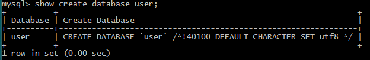
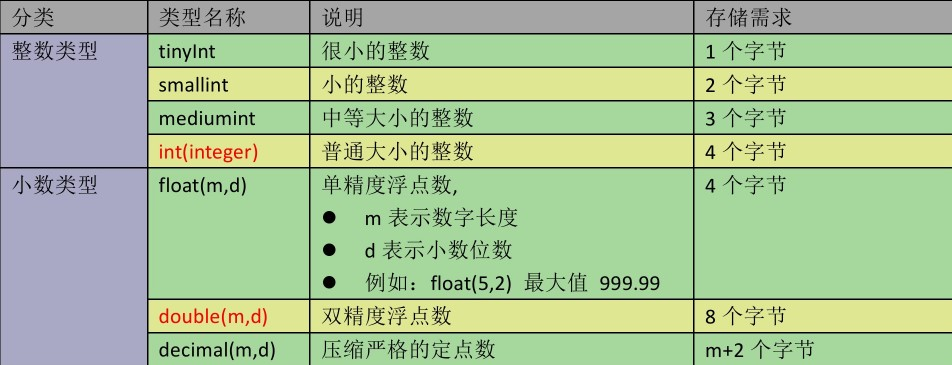
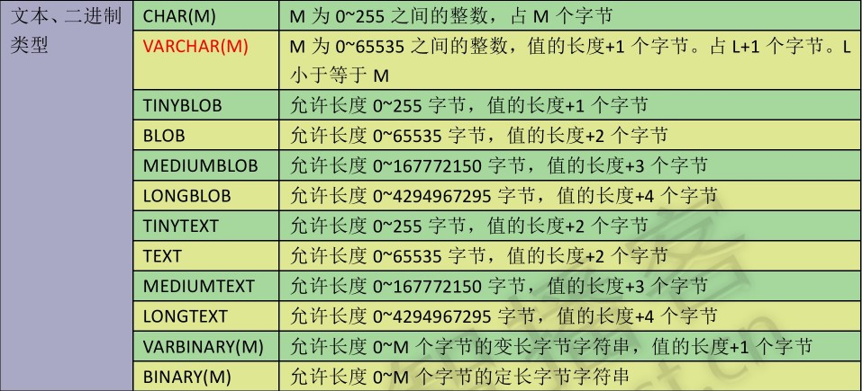
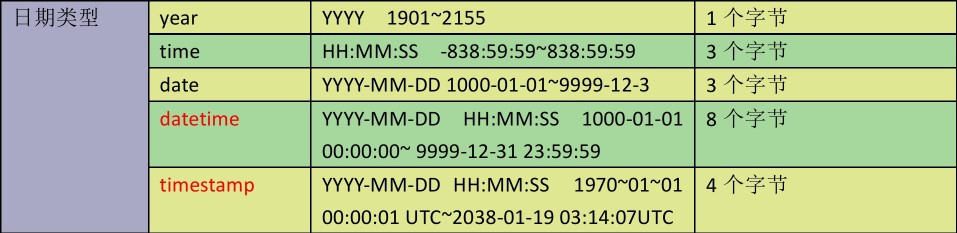

# DDL数据定义语言

常用关键字：`CREATE ,ALTER ,DROP, TRUNCATE`

---
## 1 创建数据库

### 语法

```
    CREATE {DATABASE | SCHEMA} [IF NOT EXISTS] db_name
        [create_specification [, create_specification] ...]

`create_specification`选项用于指定数据库的特性。

    create_specification:
        [DEFAULT] CHARACTER SET charset_name //指定字符集
      | [DEFAULT] COLLATE collation_name  //指定数据库字符集的比较方式
```

- CHARACTER SET子句用于指定默认的数据库字符集
- COLLATE子句用于指定默认的数据库整序

>collate 整理

### 常用语句

- 查看所有的数据库: `show databases`
- 创建数据库：`create database database_name；`
- 选择数据库：`use database_name；`
- 查看正在使用的数据块：`select database();`
- 查看数据库创建细节：`show create database database_name；`
- 创建一个字符集为gbk的数据库：`create database  database_name character set gbk；`
- 创建一个使用 utf8字符集，并带校对规则的 mydb3 数据库：`create database database_name character set utf-8 collate utf8_general_ci；`utf8_general_ci时默认规则。
- 删除前面创建的数据库：`drop database [IF EXISTS] database_name；`
- 查看服务器的数据库并修改数据库的字符集：`show databass; alter database database_name character set 字符集名;`
- 查看字符集：`show variables like 'character%';`
- 修改表的字符串：`alter table 表名 character set 编码`

实例：
```
    1 创建一个user数据库
    create database IF NOT EXISTS user;//如果user表已经存在，不加IF NOT EXISTS则会报错

    2 切换到user数据库
    use user；
```

关于校对规则，校对规则是在字符集内用于比较字符的一套规则，可以控制select 查询时where 条件大小写是否敏感的规则，如字段 col 在表中的值为 (abc，ABC，AbC) 在不同的校对规则下，where col='ABC'会有不同的结果。ci是case insensitive的缩写，意思是大小写不敏感；相对的是cs，即case sensitive，大小写敏感；还有一种是utf8_bin，是将字符串中的每一个字符用二进制数据存储，区分大小写。如果建表的时候选择的是区别大小写的规则而查询的时候又暂时不想区别， 可以用类似 WHERE column_name COLLATE utf8_general_ci = 'xxx' 的写法改变查询使用的校对规则，新建数据 库时一般选用utf8_general_ci就可以了。

---
## 2 创建表

表在数据库中是一个独立的单元，代笔某些实体类型，表有行类列组成，每一行代表一项数据，每一列代表一个数据。表与表之间可以进行关联，形成一定的关系网，这样可以将数据拆分到不同的数据表中，减少单表提交并提升操作速度。

### 语法

```
    CREATE [TEMPORARY] TABLE [IF NOT EXISTS] tbl_name (字段1 数据类型约束，... ，字段n 数据类型约束);
```

- 如果表已存在，则使用关键词`IF NOT EXISTS`可以防止发生错误。
- TEMPORARY 表示创建的表是一个临时表，会在会话结束后自动删除。
- field：指定列名
- datatype：指定列类型

原有表的结构与CREATE TABLE语句中表示的表的结构是否相同，这一点没有验证。

> 关于表的创建细节其实还有很多，这里只是最基本的建表语法。

### 常用语句

- `show tables;` 显示数据库中的表
- `show create table user;`显示一个表的创建语句
- `desc database_name;`查看表的结构




### 数据类型

在创建表时，我们可以指定每列数据的数据类型，不同的数据类型在磁盘上会有不同的差异，MySql支持的数据类型非常多

#### 数值类型



数据类型|说明
---|---
BIT(M)  | 位类型。M指定位数，默认值1，范围1-64
INYINT [UNSIGNED] [ZEROFILL]  | 带符号的范围是-128到127。无符号0到255。ZEROFILL表示从0开始
BOOL，BOOLEAN  | 使用0或1表示真或假
SMALLINT [UNSIGNED] [ZEROFILL]  | 2的16次方
INT [UNSIGNED] [ZEROFILL]                             | 2的32次方
BIGINT [UNSIGNED] [ZEROFILL]  | 2的64次方
FLOAT[(M,D)] [UNSIGNED] [ZEROFILL]  | M指定显示长度，d指定小数位数
DOUBLE[(M,D)] [UNSIGNED] [ZEROFILL]  | 表示比float精度更大的小数

#### 文本、二进制类型



数据类型|说明
---|---
CHAR(size) char(20)  | 固定长度字符串，size为0-255之间的整数，占size个字节
VARCHAR(size)  varchar(20)  | 可变长度字符串，size为0-65535之间整数，占值的长度+1个字节，占L+1个字节，`L<=size`
BLOB   LONGBLOB  | 二进制数据
TEXT(clob) , LONGTEXT(longclob)  | 大文本，MySQL中为TEXT，标准SQL为clob

VARCHAR、BLOB和TEXT类是变长类型。每个类型的存储需求取决于列值的实际长度。

#### 时间和日期



数据类型|说明
---|---
DATE/DATETIME/TimeStamp|日期类型`(YYYY-MM-DD) ，(YYYY-MM-DD HH：MM:SS)`，TimeStamp表示时间戳，它可用于自动记录insert、update操作的时间

- select date(now());
- select now();
- select current_timestamp();

#### 类型长度限制

在定义整数字段时，常常想当然通过，如 `int(3)`，来限制整数的有效长度，然而这样仅仅只是指定了**显示宽度**。选择有效长度不同的整数，需要使用 `tinyint（1个字节）、smallint（2个字节）、mediumint（3个字节）、int（4个字节）或bigint（8个字节）`


### 数据类型约束

约束是对每一个数据条件的限制，常用的约束条件如下：

约束条件|作用
---|---
NOT NULL|非空
UNIQUE|唯一
PRIMARY KEY|主键
FOREIGN KEY|外键
CHECK|条件检查
DFAULT|字段默认值

#### 主键约束

主键，又称主码（英语：primary key或unique key）。 数据库表中对储存数据对象予以唯一和完整标识的数据列或属性的组合。

使用`PRIMARY KEY`可以把一个字段设置为一个主键，如果主键是整数型，那么还可以加上`AUTO_INCREMENT`属性使之自增长。**不推荐使用AUTO_INCREMENT，不通用**

#### 外键约束

外键能够确保表中的关键值必须从另一个表中引用，且该数据必须在另一个表中存在，否则操作会失败或引起其他连锁反应，这些连锁反应用户可以定制，其中外键引用的表称为父表，含有外键字段的表称之为子表。

定义外键的格式如下：

```
[CONSTRAINT symbol] FOREIGN KEY [id] (index_col_name, ...)
        REFERENCES tbl_name (index_col_name, ...)
        [ON DELETE {RESTRICT | CASCADE | SET NULL | NO ACTION}]
        [ON UPDATE {RESTRICT | CASCADE | SET NULL | NO ACTION}]
```

- `ON DELETE`和`ON UPDATE `表示父表中记录被删除或者更新子表中对于的操作，在后面会展开学习。

> constraint 约束， foreign key 外键，references 引用，symbol 符号


示例：

```
    1 创建一个员工表：
    create table employee (

    id int(10) AUTO_INCREMENT,    //int id 自增长
    name varchar(10) NOT NULL ,   //name 不能为null
    salary float(8,2),
    birthday date ,
    UNIQUE(name),                  //name要唯一，可以自定多个字段唯一，即联合唯一
    PRIMARY KEY(id)                //指定主键，可以指定多个主键，即联合主键，如果只指定一个主键，可以直接写在字段后面
    );

    2， 创建一个book表
    create table id_card(
         id int primary key,
         num varchar(100),
         varidate_date date(有效日期),
         person_id int unique,
         constraint person_id_fk foreign key(子表中的列名) references 父表 (父表中的字段)
    );
```

- `person_id_fk`表示约束名称，保证在整个数据库中唯一。

>关于主键和外键在后面的数据完整性还会介绍


---
## 3 修改表

表被创建之后是可以被修改或删除的，使用` ALTER TABLE `语句追加, 修改, 或删除列的语法.

#### 添加字段

    ALTER TABLE table_name
    ADD           (column datatype [DEFAULT expr]
               [, column datatype]...);
#### 修改字段

    ALTER TABLE table_name
    MODIFY column datatype [DEFAULT expr] [, column datatype]...;

#### 删除字段

    ALTER TABLE table_name DROP (column);

#### 修改表的名称

    rename table 表名 to 新表名

#### 修改表的字符集

    alter table student character set utf8;

#### 常用语句

- 修改一个属性的数据类型：`alter table 表格名 modify 属性名 new数据类型；`
- 删除一列：`alter table 表格名 drop 字段名；`
- 修改表格的字符集：`alter table 表格名 character set 字符集名；`
- 修改列名：`alter table 表格名 change oldName newName 数据类型；`
- 修改表名：`rename table oldName to newName；`
- 添加一列：`alter table 表格名 add 字段名 类型；`

---
## 4 DDL语句示例

###     数据库相关

```
    创建一个名称为mydb1的数据库。
    mysql>CREATE DATABASE mydb1;(编码用的是数据库程序的编码，校对规则用的是编码默认的校对规则)

    查看有哪些数据库
    mysql>SHOW DATABASES;

    查看数据库的创建细节
    mysql>SHOW CREATE DATABASE mydb1;

    创建一个使用gbk字符集的mydb2数据库。
    mysql>CREATE DATABASE mydb2 CHARACTER SET gbk;

    创建一个使用utf8字符集，并带校对规则的mydb3数据库。
    mysql>CREATE DATABASE mydb3 CHARACTER SET utf8 COLLATE utf8_general_ci;

    删除前面创建的mydb2数据库
    mysql>DROP DATABASE mydb2;

    查看服务器中的数据库，并把mydb3的字符集修改为gbk;
    mysql>ALTER DATABASE mydb3 CHARACTER SET gbk;
```

###  表结构相关

```
    创建一个员工表
    mysql>USE mydb1;
    mysql>CREATE TABLE employee(
        id int,
        name varchar(100),
        gender varchar(100),
        birthday date,
        entry_date date,
        job varchar(100),
        salary float(8,2),
        resume text
    );

    查看当前库中有哪些表
    mysql>SHOW TABLES;
    
    查看表的结构
    mysql>DESC employee;
    
    查看表的创建细节
    mysql>SHOW CREATE TABLE employee;
    
    在上面员工表的基本上增加一个image列。
    mysql>ALTER TABLE employee ADD image blob;
    
    修改job列，使其长度为60。
    mysql>ALTER TABLE employee MODIFY job varchar(60);
    
    删除image列。
    mysql>ALTER TABLE employee DROP image;
    
    表名改为user。
    mysql>RENAME TABLE employee TO user;
    
    修改表的字符集为gbk
    mysql>ALTER TABLE user CHARACTER SET gbk;
    
    列名name修改为username
    mysql>ALTER TABLE user CHANGE name username varchar(100);
```


