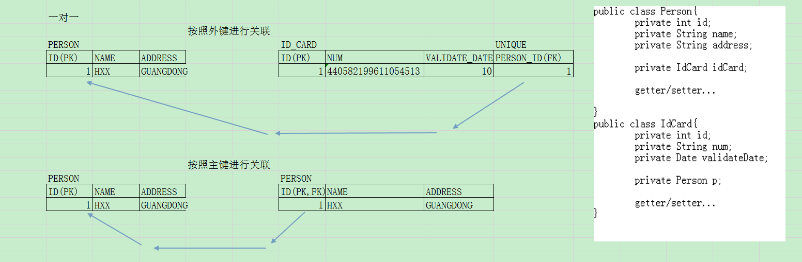
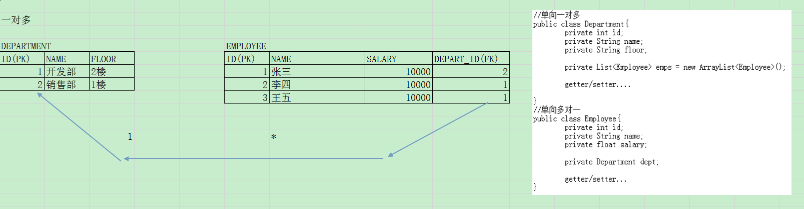
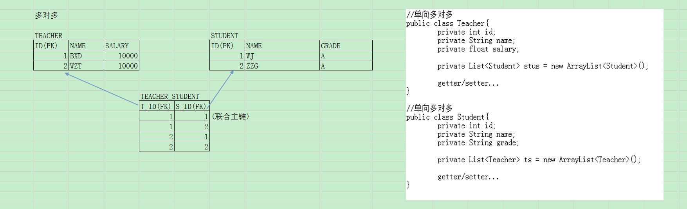

# 多表关系

---
## 1 数据完整性

**数据完整性是为了保证插入到数据中的数据是正确的，它防止了用户可能的输入错误。**

数据完整性主要分为以下三类：

 - 实体完整性：规定表的一行（即每一条记录）在表中是唯一的实体。实体完整性通过表的主键来实现
 - 域完整性：指数据库表的列（即字段）必须符合某种特定的数据类型或约束。比如NOT NULL。
 - 参照完整性：保证一个表的外键和另一个表的主键对应。主表中不能删除从表中已引用的数据。

定义表的约束：

- 定义主键约束：`primary key`不允许为空，不允许重复
- 删除主键：`alter table tablename drop primary key ;`
- 定义主键自动增长：`auto_increment`
- 定义唯一约束：`unique`
- 定义非空约束：`not null`
- 定义外键约束(外键无名称)
- 定义外键约束(命名方式)
- 撤销外键：`alter table tablename foreign key fk_name;`

定义外键：
```
//Persons表
CREATE TABLE Persons(
   Id_P int NOT NULL,
   LastName varchar(255) NOT NULL,
   FirstName varchar(255),
   Address varchar(255),
   City varchar(255),
   PRIMARY KEY (Id_P)
)

//添加外键
CREATE TABLE Orders(
   Id_O int NOT NULL,
   OrderNo int NOT NULL,
   Id_P int,
   PRIMARY KEY (Id_O),
   FOREIGN KEY (Id_P) REFERENCES Persons(Id_P)
)

//添加外键：如果需要命名 FOREIGN KEY 约束，以及为多个列定义 FOREIGN KEY 约束
CREATE TABLE Orders(
   Id_O int NOT NULL,
   OrderNo int NOT NULL,
   Id_P int,
   PRIMARY KEY (Id_O),
   CONSTRAINT fk_PerOrders FOREIGN KEY (Id_P) REFERENCES Persons(Id_P)
)

//已建表的情况下添加外键
ALTER TABLE Orders ADD FOREIGN KEY (Id_P) REFERENCES Persons(Id_P)

//已建表的情况下添加命名外键
ALTER TABLE Orders ADD CONSTRAINT fk_PerOrders FOREIGN KEY (Id_P) REFERENCES Persons(Id_P)
```

###  实体完整性

使用关键字：primary key 主键唯一且不能为空；

- 逻辑主键：与具体业务无关（推荐）
- 业务主键：与业务有关。比如身份证号码。


###  域的完整性

指定数据库中一列(字段)必须符合某种特定的数据类型或约束。比如not null 或 unique

```
    非空约束：notnull
    CREATE TABLE t4(
           id int,
           name varchar(100) NOT NULL,
           PRIMARY KEY(id)
    );

     唯一约束unique
    CREATE TABLE t5(
           id int,
           name varchar(100) UNIQUE,
           PRIMARY KEY(id)
    );
```

### 参照完整性（多表）

保证一个表格外键(与另一个表的主键有关联)和另外一个表的主键对应。

- 外键是为了保证从表与主表之间的数据一致性和完整性
- 外键的数据是对主键数据的引用
- 外键要么引用主键 要么可以取null

#### 一对一的关系

比如一个人对应一个身份证

方式一：按照外键关联：

```
    create table person(
         id int primary key,
         name varchar(100),
         address varchar(100)
    );
    
    create table id_card(
         id int primary key,
         num varchar(100),
         varidate_date date(有效日期),
         person_id int unique,
         constraint person_id_fk foreign key(person_id) references person(id)
    );
```

方式二：按照主键关联：
```
    CREATE TABLE person(
           id int PRIMARY KEY,
           name varchar(100),
           address varchar(255)
    );
    CREATE TABLE id_card(
           id int PRIMARY KEY,
           num varchar(100),
           validate_date date,
           CONSTRAINT person_id_fk FOREIGN KEY(id) REFERENCES person(id)
    );
```

图示：



#### 一对多的关系

比如员工和部门，一个部门可能有很多员工，即一个部门对应多个员工。

图示：



一对多的关系包括单向一对多、单向多对一。

```
CREATE TABLE department(
    id int PRIMARY KEY,
    name varchar(100),
    floor varchar(100)
);

CREATE TABLE employee(
    id int PRIMARY KEY,
    name varchar(100),
    salary float(8,2),
    depart_id int,
    CONSTRAINT depart_id_fk FOREIGN KEY(depart_id) REFERENCES department(id)
);

```

#### 多对多的关系

比如 一个老师对应着多个学生，而一个学生也有很多个老师。

需要创建一张表来存储 学生表 和 老师表的 对应关系 即联合主键
```
    //教师表：
    CREATE TABLE teacher(
           id int PRIMARY KEY,
           name varchar(100),
           salary float(8,2)
    );
    //学生表：
    CREATE TABLE student(
           id int PRIMARY KEY,
           name varchar(100),
           grade varchar(100)
    );

//关系表：方式1 一次性建好
    create table teacter_student(
         t_id int,
         s_id int,
         primary key(t_id,s_id),
         constraint t_id_fk foreign key(t_id) references teacher(id),
         constraint s_id_fk foreign key(s_id) references teacher(id)
    );

//关系表：方式2 先建表后加主键
    create table teacter_student(
         t_id int,
         s_id int
    );
    
    alter table teacter_student add primary key (t_id, s_id);
    alter table teacter_student add constraint teacter_student_t_fk foreign key (t_id) references teacher(id);
    alter table teacter_student add constraint teacter_student_s_fk foreign key (s_id) references student(id);
```
图示：




### 主从表数据更新问题

当两张表没有建立任何关系的时候，那么可以随意删除其中任何一张表中的任何记录，但是一旦把两张表建立了关系(主外键约束)之后，那么不能删除主表中的数据(这些数据内容在从表中有关联关系的数据)，另外，从表也不能添加主表中不存在的数据。

要想删除主表中与从表有关联关系的数据，可以这么做：
1. 解除主从表的约束关系
2. 先删除从表中与主表有关系的数据，再删除主表中的数据。


