#  DQL数据查询语言

DQL:Data Query Language，作用：查询数据。常用关键字： `SELECT`

---
## 1 Select语句基础

###  select语句1--基础查询

    SELECT [DISTINCT] *|{column1, column2, column3..}
            FROM    table;

- Select 指定查询哪些列的数据。
- column指定列名。
- `*`号代表查询所有列。
- From指定查询哪张表。
- DISTINCT可选，指显示结果时，是否剔除重复数据

###  select语句2--数学表达式与别名

在select语句中可使用表达式对查询的列进行运算

    SELECT *|{column1｜expression, column2｜expression，..} FROM    table;

在select语句中可使用as语句

     SELECT column as 别名 from 表名;

示例

```
    1 数学数据：比如求学生总分：
    select Chinese+English+Math  from table_name；

    2 使用别名：
    select Chinese+English+Math as 别名 from table_name； (as可以省略，别名在后面的过滤条件中可以使用)
```

### select语句3--where

在where子句中经常使用的运算符：

#### 比较运算符


| 查询条件 | 谓词 |
|---|---|
| 比较运算符 | 比较运算符  =, >, >=, <, <=, <>（或!=） |
| 确定范围 | BETWEEN AND, NOT BETWEEN AND |
| 确定集合 | IN, NOT IN |
| 字符匹配 | LIKE, NOT LIKE  |
| 空值 | IS NULL, IS NOT NULL |
| 多重条件 | AND, OR |

运算符|作用
---|---
>、 < 、<=、>=、 =、<>   |  大于、小于、大于(小于)等于、不等于
BETWEEN  ...AND...        | 显示在某一区间的值(含头含尾)
IN(set)                | 显示在in列表中的值，例：in(100,200)
LIKE ‘张pattern’        | 模糊查询
AND 和 OR 运算符       | 基于一个以上的条件对记录进行过滤。

- `%`：匹配0个或多个字符。
- `_` 代表一个字符，例`first_name like ‘_a%’;`
- `[]`：匹配方括号中的任何一个字符。
- `[^]`：不匹配方括号中的任何一个字符。

示例：

```
    1 模糊查询：
    select 字段名 from table_name where  字段名 like '_李%';

    2 区间查询：
    数字数段 between 数值 and 数值

    3 And Or
    SELECT * FROM Persons WHERE FirstName='Thomas' AND LastName='Carter'
    SELECT * FROM Persons WHERE (FirstName='Thomas' OR FirstName='William') AND LastName='Carter'

    4 in
    select 字段名 from table_name where 字段名 in (x1,x2,x3)
```

### Select语句4--使用order by 子句排序查询结果

```
SELECT column1, column2. column3.. FROM table  order by column asc|desc
```

- Order by 指定排序的列，排序的列即可是表中的列名，也可以是select 语句后指定的列名。
- Asc 升序、Desc 降序
- ORDER BY 子句应位于SELECT语句的结尾。


---
## 2 数据库的复杂查询

准备数据：

```
    1 创建一个用户表
    CREATE TABLE `customer` (
      `id` int(11) NOT NULL auto_increment,
      `name` varchar(100) default NULL,
      `city` varchar(20) default NULL,
      PRIMARY KEY  (`id`)
    ) ENGINE=InnoDB DEFAULT CHARSET=utf8;


    2 插入数据
    INSERT INTO `customer` VALUES (1,'陈冠希','香港'),(2,'李宗瑞','台北'),(3,'苍井空','东京'),(4,'钟欣桐','香港'),(5,'芙蓉姐姐',NULL);


    3 创建一个订单表，并关联用户表的主键
    CREATE TABLE `orders` (
      `id` int(11) NOT NULL auto_increment,
      `order_number` varchar(100) default NULL,
      `price` float(8,2) default NULL,
      `customer_id` int(11) default NULL,
      PRIMARY KEY  (`id`),
      KEY `customer_id_fk` (`customer_id`),
      CONSTRAINT `customer_id_fk` FOREIGN KEY (`customer_id`) REFERENCES `customer` (`id`)
    ) ENGINE=InnoDB DEFAULT CHARSET=utf8;


    4 插入订单数据
    INSERT INTO `orders` VALUES (1,'0001',100.00,1),(2,'0002',200.00,1),(3,'0003',300.00,1),(4,'0004',100.00,2),(5,'0005',200.00,3),(6,'0006',100.00,4),(7,'0007',1000.00,NULL);
```

### 连接查询

连接查询的 from子 句的连接语法格式为：

```
from TABLE1 join_type TABLE2  [on (join_condition)] [where (query_condition)]
```
其中，TABLE1 和TABLE2 表示参与连接操作的表，TABLE1 为左表，TABLE2 为右表。on 子句设定连接条件，where 子句设定查询条件，join_type 表示连接类型


#### 交叉连接查询

交叉连接（cross join）:不带on子句，返回连接表中所有数据行的[笛卡儿积](https://zh.wikipedia.org/wiki/%E7%AC%9B%E5%8D%A1%E5%84%BF%E7%A7%AF)。


- 交叉连接查询CUSTOMER表和ORDERS表
- SELECT * FROM customer CROSS JOIN orders;
- SELECT * FROM customer,orders;

使用交叉查询来查询上面示例数据：

```
select * from customer,order;
```

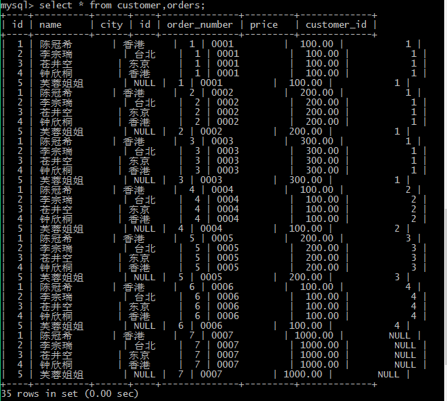


#### 内连接查询

内连接（inner join）：返回连接表中符合连接条件及查询条件的数据项。

- 隐式内连接：不使用inner join关键字，在where子句中设定连接条件
- 显示内连接：使用inner join关键字，在on子句中设定连接条件

```
隐式：
select * from table_name1 t1,table_name2 t2 where t1.id=t2.id;
select t1.* from table_name1 t1,table_name2 t2 where t1.id=t2.id;

显式：
select * from table_name1 t1 inner join table_name2 t2 on t1.id=t2.id;
```

>t1.*表示只选择t1表的所有信息

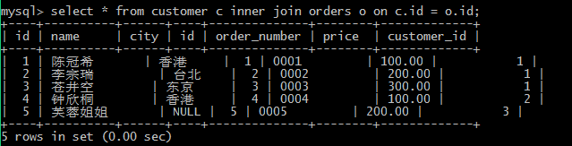

带条件的内链接查询：
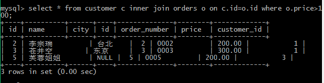


#### 外连接查询

外连接：分为左外连接（`left out join`）、右外连接（`right outer join`）、完整外部联接(`full outer join`)。与内连接不同的是，外连接不仅返回连接表中符合连接条件及查询条件的数据行，也返回左表（左外连接时）或右表（右外连接时）中仅符合查询条件但不符合连接条件的数据行。写 sql 时 `outer` 可以省略语句

##### 左外连接： 使用`left outer join`关键字，在on子句中设定连接条件

```
`SELECT * FROM customer c LEFT OUTER JOIN orders o ON c.id=o.customer_id;`不仅包含符合c.id=o.customer_id连接条件的数据行，还包含customer左表中的其他数据行
```

带查询条件的左外连接查询，在where子句中设定查询条件：

```
SELECT * FROM customer c LEFT OUTER JOIN orders o ON c.id=o.customer_id WHERE o.price>250;
```
where是在外连接查询的结果之上再次筛选复合条件的结果


##### 右外连接：使用`right outer join`关键字，在on子句中设定连接条件

`SELECT * FROM customer c RIGHT OUTER JOIN orders o ON c.id=o.customer_id;`l不仅包含符合c.id=o.customer_id连接条件的数据行，还包含orders右表中的其他数据行

带查询条件的右外连接查询，在where子句中设定查询条件
`SELECT * FROM customer c RIGHT OUTER JOIN orders o ON c.id=o.customer_id WHERE o.price>250;`

##### 完整外部联接：使用 `full join` 或 `full outer join`

完整外部联接返回左表和右表中的所有行。当某行在另一个表中没有匹配行时，则另一个表的选择列表列包含空值。如果表之间有匹配行，则整个结果集行包含基表的数据值。

```
select * from table1 full join table2 on table1.id=table2.id
```


左外连接：
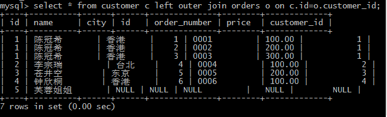

带条件的左外连接查询
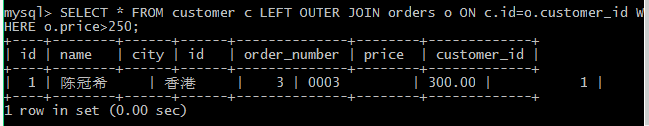

右外连接
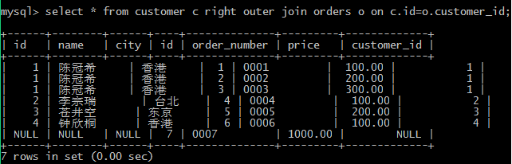

带条件的右外连接
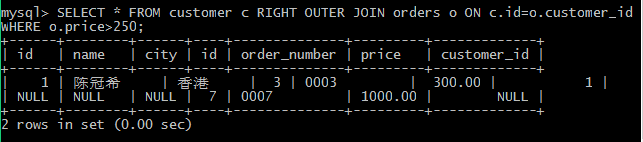


### 子查询


子查询：是指在select子句或者where子句中又嵌入select查询语句，查询的条件是另外一个查询语句的结果。一般子查询会存在于两张关联的表中，那么我们可以先把带有条件的那张表与另外一张表的关联关系字段查出来，并作为另外一张表查询的条件值，然后再次进行查询。

比如：查询“化妆品”分类上架商品详情
```
//1 先查主表的主键(根据指定的条件<化妆品，cname>)
   select cid  from category where panme=’化妆品’

//2 查询所有商品的详细信息(根据分类id查询)：
   select * from product where category_id=cid

//3 组合
   select * from product where category_id=( select cid  from category where cname=’化妆品’);
```

- 查询条件是单行单列，使用`=`:`SELECT * FROM orders WHERE customer_id=(SELECT id FROM customer WHERE name LIKE '%陈冠希%');`
- 查询条件是多行单列，使用`in` :`SELECT * FROM orders WHERE customer_id in(SELECT id FROM customer WHERE name LIKE '%陈冠希%');`
- 查询结果是多行多列，可以使用内链接查询

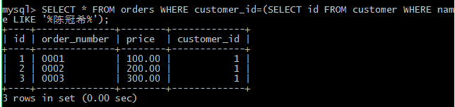

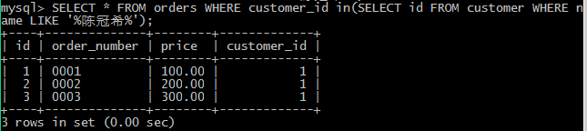


#### 使用exists

exists即外层sql查询所查到的行代入内层sql查询，要使内层查询能够成立
查询可以与in型子查询互换，但效率要高。典型语法:

```
select * from tablename
where exists(select * from tableName where ...)
```


### 联合查询

联合查询能够合并两条查询语句的查询结果，去掉其中的重复数据行，然后返回没有重复数据行的查询结果。联合查询使用union关键字

`SELECT * FROM orders WHERE price>200 UNION SELECT * FROM orders WHERE customer_id=1;`

实例：
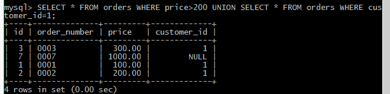


### 报表查询

报表查询对数据行进行分组统计，其语法格式为：

    [select …] from … [where…] [ group by … [having… ]] [ order by … ]

- group by 子句指定按照哪些字段分组
- having子句设定分组查询条件
- 在报表查询中可以使用SQL函数


### 合计函数

####  count

count(列名)返回某一列，行的总数

```
    Select count(*)|count(列名) from tablename [WHERE where_definition]
```

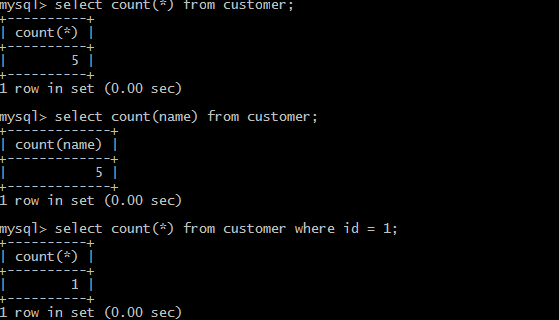

#### SUM

Sum函数返回满足where条件的行的和

```
    Select sum(列名)｛,sum(列名)…｝ from tablename [WHERE where_definition]
```

- 注意：sum仅对数值起作用，否则会报错。
- 注意：对多列求和，“，”号不能少。

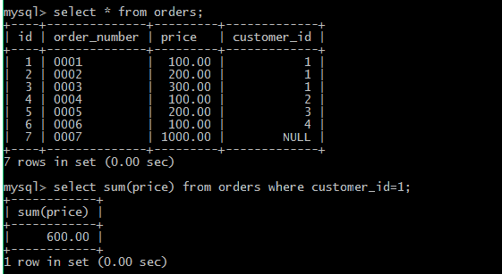

#### AVG

AVG函数返回满足where条件的一列的平均值

```
    Select sum(列名)｛,sum(列名)…｝ from tablename [WHERE where_definition]
```

准备数据：

```
    create table student(
        id int,
        name varchar(20),
        chinese float,
        english float,
        math float
    );

    insert into student(id,name,chinese,english,math) values(1,'张小明',89,78,90);
    insert into student(id,name,chinese,english,math) values(2,'李进',67,98,56);
    insert into student(id,name,chinese,english,math) values(3,'王五',87,78,77);
    insert into student(id,name,chinese,english,math) values(4,'李一',88,98,90);
    insert into student(id,name,chinese,english,math) values(5,'李来财',82,84,67);
    insert into student(id,name,chinese,english,math) values(6,'张进宝',55,85,45);
    insert into student(id,name,chinese,english,math) values(7,'黄蓉',75,65,30);
```

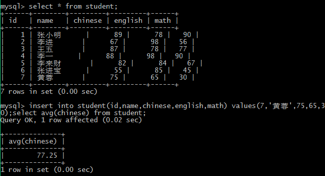

#### MAX/MIN

Max/min函数返回满足where条件的一列的最大/最小值

```
    Select max(列名)　from tablename [WHERE where_definition]
```

---
## 3 `group by`和`having`示例

使用`group by `子句对列进行分组，使用`having`子句过滤

```
    SELECT column1, column2. column3.. FROM    table;
            group by column

    SELECT column1, column2. column3..
            FROM    table;
            group by column having ...
```

>having和where均可实现过滤，但在having可以使用合计函数,having通常跟在group by后，它作用于组。

准备数据：

```
    create table order1( id int ,product varchar(20),price float);

    insert into orde1(id,product,price) values(1,'电视',900);
    insert into order1(id,product,price) values(2,'洗衣机',100);
    insert into order1(id,product,price) values(3,'洗衣粉',90);
    insert into order1(id,product,price) values(4,'桔子',9);
    insert into order1(id,product,price) values(5,'洗衣粉',90);
```

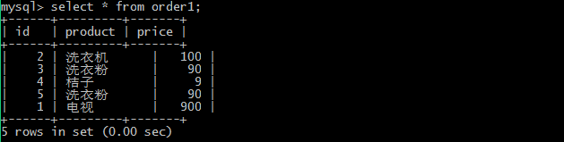
group by:

group by+having:
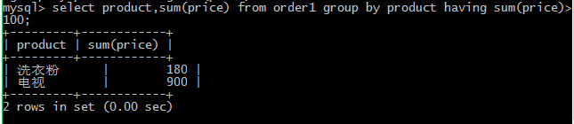

---
## 4 带有ANY或ALL谓词的子查询

子查询返回单值时可以用比较运算符，而使用ANY或ALL谓词时则必须同时使用比较
运算符，其语义为：

```
>ANY   大于子查询结果的某个值
>ALL   大于子查询结果中的所有值
<ANY   小于子查询结果中的某个值
<ALL   小于子查询结果中的所有值
>=ANY   大于等于子查询结果中的某个值
>=ALL   大于等于子查询结果中的所有值
<=ANY   小于等于子查询结果中的某个值
<=ALL   小于等于子查询结果中的所有值
=ANY   等于子查询结果中的某个值
=ALL   等于子查询结果中的所有值(通常没有实际意义)
!=(或<>)ANY  不等于子查询结果中的某个值
!=(或<>)ALL  不等于子查询结果中的任何一个值
```

例：查询其他系中比信息系某一学生年龄小的学生姓名和年龄
```
SELECT Sname,Sage FROM Student WHERE Sage<ANY(
SELECT Sage FROM Student WHERE Sdept='IS') AND Sdept<>'IS'

结果如下：
Sname  Sage
-------------------------------------
王敏  18
```

DBMS执行此查询时，首先处理子查询，找出IS系中所有学生的年龄，构成一个集合
`（19，18）`。然后处理父查询，找所有不是IS系且年龄小于19或18的学生。

本查询可以用集函数来实现，首先用子查询找出IS系中最大年龄（19），然后在父查询中查所有非IS系且年龄小于19岁的学生姓名及年龄，SQL语句如下：
```
SELECT Sname,Sage FROM Student WHERE Sage<
 (SELECT MAX(Sage) FROM Student WHERE Sdept='IS') AND Sdept<>'IS'
```

例二：查询其他系中比信息系所有学生年龄都小的学生姓名及年龄。
```
SELECT Sname,Sage FROM Student WHERE Sage<ALL(
SELECT Sage FROM Student WHERE Sdept='IS') AND Sdept<>'IS'

//查询结果为空表，本查询同样也可以用集函数来实现，SQL语句如下：
SELECT Sname,Sage FROM Student WHERE Sage<(
SELECT MIN(Sage) FROM Student WHERE Sdept='IS') AND Sdept<>'IS'
```

事实上，用集函数来实现子查询通常比直接用ANY或ALL查询效率要高，ANY与ALL与
集函数的对应关系如下所示

-|-|-|-|-|-|-
-|---|---|---|---|---|---
none|=|<>或!=|<|<=|>|>=
ANY|IN|-|<MAX|<=MAX|>MIN|>=MIN
ALL|--|NOT IN|<MIN|<=MIN|>MAX|>=MAX


---
## 5 DQL语言示例

```
    查询表中所有学生的信息。
    mysql>SELECT * FROM student;
    
    查询表中所有学生的姓名和对应的英语成绩。
    mysql>SELECT name,english FROM student;
    
    过滤表中重复数据。
    mysql>SELECT DISTINCT english FROM student;
    
    在所有学生数学分数上加10分特长分。
    mysql>SELECT name,math+10 FROM student;
    
    统计每个学生的总分。
    mysql>SELECT name,chinese+english+math FROM student;
    
    使用别名表示学生分数。
    mysql>SELECT name AS 姓名,chinese+english+math 总分 FROM student;
    
    查询姓名为王五的学生成绩
    mysql>SELECT * FROM student WHERE name=’王五’;
    
    查询英语成绩大于90分的同学
    mysql>SELECT * FROM student WHERE english>90;
    
    查询总分大于200分的所有同学
    mysql>SELECT * FROM student WHERE (chinese+english+math)>200;
    
    查询英语分数在 80－90之间的同学。
    mysql>SELECT * FROM student WHERE english BETWEEN 80 AND 90;
    
    查询数学分数为89,90,91的同学。
    mysql>SELECT * FROM student WHERE math IN (89,90,91);
    
    查询所有姓李的学生成绩。
    mysql>SELECT * FROM student WHERE name LIKE ‘李%’;
    
    查询数学分>80，语文分>80的同学。
    mysql>SELECT * FROM student WHERE math>80 AND chinese>80;
    
    对数学成绩排序后输出。
    mysql>SELECT name,math FROM student ORDER BY math;
    
    对总分排序后输出，然后再按从高到低的顺序输出
    mysql>SELECT name AS 姓名,chinese+english+math 总分 FROM student ORDER BY 总分 DESC;
    
    对姓李的学生语文成绩排序输出
    mysql>SELECT name,chinese FROM student WHERE name LIKE ‘李%’ ORDER BY chinese;
    
    根据cid字段分组，分组后统计商品的个数。根据cid字段分组，分组后统计商品的个数。
    select cid, count(*) from product group by cid;
    
    根据cid分组，分组统计每组商品的平均价格，并且平均价格大于20000元。
    select cid, avg(prive) from product group by cid having avg(prive) >= 200000
```

---
## 6  相关函数列表

### 时间日期相关函数

函数|说明
---|---
ADDTIME (date2 ,time_interval ) | 将time_interval加到date2
CURRENT_DATE (  ) | 当前日期
CURRENT_TIME (  ) | 当前时间
CURRENT_TIMESTAMP (  ) | 当前时间戳
DATE (datetime ) | 返回datetime的日期部分
DATE_ADD (date2 , INTERVAL d_value d_type ) | 在date2中加上日期或时间
DATE_SUB (date2 , INTERVAL d_value d_type ) | 在date2上减去一个时间
DATEDIFF (date1 ,date2 ) | 两个日期差
NOW (  ) | 当前时间
YEAR/Month/DATE (datetime ) | 年月日

```
select addtime(‘02:30:30’,‘01:01:01’); //注意：字符串、时间日期的引号问题
select date_add(entry_date,INTERVAL 2 year) from student;／／增加两年
select addtime(time,‘1 1-1 10:09:09’) from student;　／／时间戳上增加，注意年后没有-
```

### 字符串相关函数

函数|说明
---|---
CHARSET(str)   |   返回字串字符集
CONCAT (string2  [,... ])   |   连接字串
INSTR (string ,substring )   |   返回substring在string中出现的位置,没有返回0
UCASE (string2 )   |   转换成大写
LCASE (string2 )   |   转换成小写
LEFT (string2 ,length )   |   从string2中的左边起取length个字符
LENGTH (string )   |   string长度
REPLACE (str ,search_str ,replace_str )   |   在str中用replace_str替换search_str
STRCMP (string1 ,string2 )   |   逐字符比较两字串大小,
SUBSTRING (str , position  [,length ])   |   从str的position开始,取length个字符
LTRIM (string2 ) RTRIM (string2 )  trim   |   去除前端空格或后端空格

### 数学相关函数

函数|说明
---|---
ABS (number2 )   |   绝对值
BIN (decimal_number )   |   十进制转二进制
CEILING (number2 )   |   向上取整
CONV(number2,from_base,to_base)   |   进制转换
FLOOR (number2 )   |   向下取整
FORMAT (number,decimal_places )   |   保留小数位数
HEX (DecimalNumber )   |   转十六进制
LEAST (number , number2  [,..])   |   求最小值
MOD (numerator ,denominator )   |   求余
RAND([seed])   |   RAND([seed])
