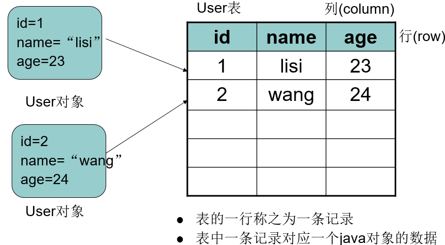

# 数据库基础知识

---
## 1 数据库
数据库简单来说可视为电子化的文件柜——存储电子文件的处所，用户可以对文件中的数据运行新增、截取、更新、删除等操作。
数据库指的是以一定方式储存在一起、能为多个用户共享、具有尽可能小的冗余度、与应用程序彼此独立的数据集合。

### 数据库管理系统

数据库管理系统（英语：Database Management System，简称DBMS）是为管理数据库而设计的电脑软件系统，一般具有**存储、截取、安全保障、备份**等基础功能。数据库管理系统可以依据它**所支持的数据库模型**来作分类，例如`关系式、XML`；或依据**所支持的电脑类型**来作分类，例如`服务器群集、移动电话`；或依据**所用查询语言**来作分类，例如`SQL、XQuery`；或**依据性能冲量重点**来作分类，例如`最大规模、最高运行速度`；亦或其他的分类方式。不论使用哪种分类方式，一些DBMS能够跨类别，例如，同时支持多种查询语言。

### 数据库分类

#### 关系数据库

- MySQL
    - MariaDB
    - Percona Server
- Microsoft Access
- SQL Server
- Oracle

>几乎所有的数据库管理系统都配备了一个开放式数据库连接（ODBC）驱动程序，令各个数据库之间得以互相集成。

#### 非关系型数据库（NoSQL）

- BigTable（Google）
- MongoDB

####  键值（key-value）数据库

- Apache Cassandra
- Dynamo
- LevelDB（Google）

---
## 2 关系型数据库与 SQL

### 2.1 关系数据库

（英语：Relational database），是创建在**关系模型**基础上的数据库，借助于**集合代数等数学概念和方法**来处理数据库中的数据。现实世界中的各种实体以及实体之间的各种联系均用关系模型来表示。关系模型是由埃德加·科德于1970年首先提出的，并配合“科德十二定律”。现如今虽然对此模型有一些批评意见，但它还是数据存储的传统标准。**标准数据查询语言SQL就是一种基于关系数据库的语言，这种语言执行对关系数据库中数据的检索和操作。**

关系模型由`关系数据结构、关系操作集合、关系完整性约束`三部分组成。

### 2.2 SQL

SQL即结构化查询语言（英语：Structural Query Language，缩写：SQL），是一种特殊目的之编程语言，用于数据库中的标准数据查询语言，IBM公司最早使用在其开发的数据库系统中。**`1986年10月，美国国家标准学会对SQL进行规范后，以此作为关系式数据库管理系统的标准语言（ANSI X3. 135-1986）`**，1987年得到国际标准组织的支持下成为**国际标准**。不过各种通行的数据库系统在其实践过程中都对SQL规范作了某些**编改和扩充**。所以，实际上不同数据库系统之间的SQL不能完全相互通用。

sql作用是：一种定义，操作，管理关系数据库的句法。大多数关系数据库都支持。

#### SQL 是一种声明式语言

首先要把这个概念记在脑中：“声明”。 SQL 语言是为计算机声明了一个你想从原始数据中获得什么样的结果的一个范例，而不是告诉计算机如何能够得到结果。
>SQL 语言声明的是结果集的属性，计算机会根据 SQL 所声明的内容来从数据库中挑选出符合声明的数据，而不是像传统编程思维去指示计算机如何操作

比如：`SELECT first_name, last_name FROM employees WHERE salary > 100000`表示我们不关心这些雇员记录从哪里来，我们所需要的只是那些高薪者的数据。

### 2.3 数据库服务器、数据库和表的关系

- 所谓安装数据库服务器，只是在机器上装了一个数据库管理程序，这个管理程序可以管理多个数据库，一般开发人员会针对每一个应用创建一个数据库。
- 为保存应用中实体的数据，一般会在数据库创建多个表，以保存程序中实体的数据。

数据库服务器、数据库和表的关系如图所示：

### 2.4 数据在数据库中的存储方式

>MySQL在window系统中：不区分大小写，其他操作系统中：严格区分大小写

接下来使用mySql来学习Sql语言的继承知识。mysql的安装还是比较简单的，这里假设我们都已经安装好了mySql数据库。

在学习之前需要掌握以下MySql命令行的基本语法：

- 连接MySql：mysql命令格式： `mysql -h 主机地址 -u 用户名 －p用户密码`
 - 比如在本地主机的命令行输入：`mysql -h localhost -u root -p`
- 退出数据库
 - exit
- 修改密码
 - mysqladmin -u root -p oldpassword password newpassword

### 2.5 SQL语言分类

- DDL：数据定义语言 Data definition language
    - 用于描述数据库中要存储的现实世界实体的语言。即创建数据库和表的结构。
- DML：数据操作语言 Date manipulation language
    - 用于向数据库表中插入、删除、修改数据。
- DQL: 数据查询语言 Data query language
    - 用于查询数据
- DCL：数据控制语言
- TPL：事物处理语言
- CCL：指针控制语言
